# C#

## 七.类和集成

### 使用基类的引用

派生类的实例由基类的实例加上派生类新增的成员组成。可以通过**类型转换符**和**派生类对象的引用**获得基类部分的引用：

```cs
    class MyBaseClass
    {
        public void Print()
        {
            Console.WriteLine("This is the base class");
        }
    }
    class MyDerivedClass: MyBaseClass
    {
        new public void Print() // 使用 new 修饰符 告诉编译器需要屏蔽基类的同名方法
        {
            Console.WriteLine("This is the dervied class");
        }
    }
        class Program
    {
        static void Main(string[] args)
        {
             MyDerivedClass dervied = new MyDerivedClass();
             MyBaseClass mybc = (MyBaseClass)dervied;
             dervied.Print(); // This is the base class
             mybc.Print(); // This is the dervied class
        }
    }
```

**虚方法**：使用基类的引用可以访问到派生类的成员
  - 方法具有相同的签名和返回类型，可访问性也需要一致
  - 基类方法用 `virtual` 标注
  - 派生类方法用 `override` 标注
  - 不能复写 `static` 方法或非虚方法
  - 方法、属性和索引器都可以被声明为`virtual`和`override`

```cs
    class MyBaseClass
    {
        virtual public void Print()
        {
            Console.WriteLine("This is the base class");
        }
    }
    class MyDerivedClass: MyBaseClass
    {
        override public void Print()
        {
            Console.WriteLine("This is the dervied class");
        }
    }
    class Program
    {
        static void Main(string[] args)
        {
             MyDerivedClass dervied = new MyDerivedClass();
             MyBaseClass mybc = (MyBaseClass)dervied;
             dervied.Print(); // This is the dervied class
             mybc.Print(); // This is the dervied class
        }
    }
```

注意：无论继承的层次有多少，如果使用基类部分的引用去调用一个覆写方法时，会根据派生层往上寻找，直到找到最高派生层对应被标记的`override`方法

```cs
    class MyBaseClass
    {
        virtual public void Print()
        {
            Console.WriteLine("This is the base class");
        }
    }
    class MyDerivedClass: MyBaseClass
    {
        override public void Print()
        {
            Console.WriteLine("This is the dervied class");
        }
    }
    class SecondDerived: MyDerivedClass
    {
        override public void Print()
        // new public void Print() // 如果此处用的是 new，则下面 Main 中第二个应打印 This is the dervied class
        {
            Console.WriteLine("This is the second deroved class");
        }
    }
    class Program
    {
        static void Main(string[] args)
        {
             SecondDerived dervied = new SecondDerived();
             MyBaseClass mybc = (MyBaseClass)dervied;
             dervied.Print(); // This is the second deroved class
             mybc.Print(); // This is the second deroved class
        }
    }
```

### 构造函数的执行

创造一个派生类的实例过程：初始化对象的所有实例成员——>调用基类无参数构造函数——>执行自己的构造函数体

因为构造函数可以重载，如果希望派生类使用一个指定的构造函数而不是无参数的构造函数，需要在*构造函数初始化语句*中指定：（两种形式）
  - 第一种：使用关键字`base`指明希望使用的基类构造函数（即指定执行继承类的哪一个构造函数）
  - 第二种：使用关键字`this`指明应该使用当前类的哪一个构造函数（即指定先执行当前类的哪一个构造函数）

  ```cs
        // 类 MyBaseClass 的构造函数
        public MyBaseClass(string s, int x)
        {
            // 执行代码
        }
        // 类 MyDerivedClass 的构造函数
        public MyDerivedClass(int x, string s): base(s, x)
        {
            // 执行代码
        }
        // 第二种方式
    class MyBaseClass
    {
        public MyBaseClass()
        {
            Console.WriteLine("this is MyBaseClass constructor");
        }
    }
    class MyDerivedClass: MyBaseClass
    {
        readonly int firstVar;
        readonly double secondVar;
        public string UserName;
        private MyDerivedClass()
        {
            firstVar = 20;
            secondVar = 30.5;
            Console.WriteLine("this is first constructor");
        }
        public MyDerivedClass(string firstName): this()
        {
            UserName = firstName;
            UserIdNumber = -1;
            Console.WriteLine("this is second constructor");
        }
    }
    // Main
    MyDerivedClass dervied = new MyDerivedClass("test");
    // 打印
    // this is MyBaseClass constructor
    // this is first constructor
    // this is second constructor
  ```

**类的可访问级别**：
- public：可以被系统内任何程序集中的代码访问
- internal：只能被自己所在的程序集内的类访问（默认的访问级别）

### 程序集间的继承

C# 允许在不同的程序集内定义的基类来派生类：也就是只要 A程序集的一个基类显示声明 `public`,当在VS添加对包含基类的程序集的引用时，就能够在 B程序集内继承 A程序集的类

如果要引用其他程序集中的类和类型，可以在文件顶部放置一个`using`指令，并带上将要访问的类或类型所在的命名空间

**注意**，添加引用和增加`using`指令是两回事，添加引用时告诉编译器所需的类型在哪里定义；增加`using`指令时允许引用其他的类而不必使用它们的完全限定名称

```cs
// ClassDemo 程序集（项目）
namespace ClassDemo.BaseClassNS
{
    public class BaseClass
    {
        public void PrintMe()
        {
            Console.WriteLine("I am BaseClass");
        }
    }
}
// HelloWorld 程序集（项目）
using ClassDemo.BaseClassNS;

namespace HelloWorld
{
    class DerivedClass: BaseClass
    {
    }
    class Program
    {
        static void Main(string[] args)
        {
            DerivedClass mdc = new DerivedClass();
            mdc.PrintMe(); // I am BaseClass
        }
    }
}
```

### 成员访问修饰符

通用内容:
- 所有在同一类中显示声明的成员，在同一类中都是可见的，无论访问性如何
- 继承的成员不在类的声明中显式声明，所以继承的成员对派生类的成员既可以是可见的，也可以是不可见的
- 五种访问级别：public、private、protected、internal、protected internal
- 必须对每个成员指定访问级别，不指定默认为private
- 成员不能比所在类有更高的访问性，如果类仅限于所在的程序集访问，则它成员也不能从程序集外部访问


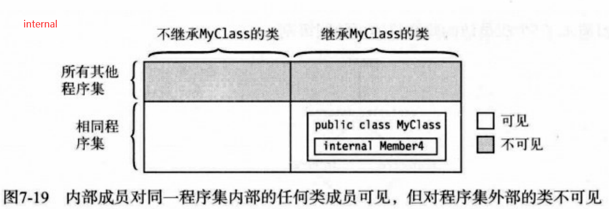
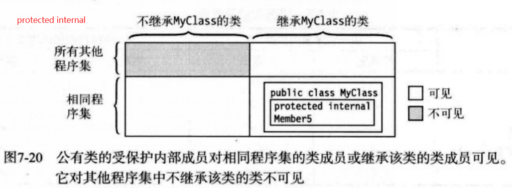

**总结**：
- private：只在类的内部可访问
- internal：对该程序集内的所有类可访问
- protected：对所有继承该类的类可访问
- protected internal：对所有继承该类或在该程序集内声明的类可访问
- public：对任何类可访问


### 抽象成员

**抽象成员**是指设计为被覆写的函数成员：
- 必须是函数成员，即方法、属性、事件、索引（字段和常量不能是抽象成员）
- 必须用 `abstract`修饰符标记
- 不能有实现代码
- 只能在抽象类中声明
- 抽象成员在派生类中必须被覆写，但`virtual`修饰符不能附加到`abstract`上
- 类似虚成员，派生类中的抽象成员实现必须指定`override`修饰符

```cs
    abstract class Example2
    {
        abstract public void PrintStuff(string s);
        abstract public int MyProperty
        {
            get;
            set;
        }
    }
```

**抽象类**是指设计为被继承的类：
- 抽象类只能用作其他类的基类，不能创建实例
- 使用`abstract`修饰符声明
- 抽象类的成员可以包含普通成员和抽象成员
- 抽象类可以派生自另外一个抽象类
- 任何派生自抽象类的类必须使用`override`关键字实现该类的所有抽象成员，除非派生类自己也是抽象类
```cs
    abstract class AbClass
    {
        abstract public void PrintStuff(string s);
        public void IdentifyBase() 
        {
            Console.WriteLine("I am AbClass");
        }
    }
    class MyAbClass: AbClass
    {
        override public void PrintStuff(string s)
        {
            Console.WriteLine("{0}", s);
        }
    }
    class Program
    {
        static void Main(string[] args)
        {
            MyAbClass mab = new MyAbClass();
            mab.PrintStuff("test"); // test 调用抽象方法
            mab.IdentifyBase(); // I am AbClass 调用继承的方法
        }
    }
```

### 密封类

**密封类**刚好与抽象类相反
- 只能被用作独立的类，不能用作基类
- 使用`sealed`修饰符标注
```cs
    sealed class MyClass 
    {
        // 
    }
```

### 静态类

**静态类**中的所有成员都是静态的，用于存放不受实例数据影响的数据和函数，常见的用途是创建一个包含一组数学方法和值的数学库
- 使用`static`修饰符标注
- 所有成员都是静态的
- 类可以有一个静态构造函数，但不能有实例构造函数，不能创建该类的实例
- 静态类是隐式密封的，所以不能继承静态类
- 使用类名和成员名访问

```cs
    static class MyMath
    {
        public static float PI = 3.14f;
        public static bool IsOdd(int x)
        {
            return x % 2 == 1;
        }
        public static  int Times2(int x)
        {
            return 2 * x;
        }
    }
    class Program
    {
        static void Main(string[] args)
        {
            int val = 3;
            Console.WriteLine("{0} is Odd is {1}", val, MyMath.IsOdd(val));
            Console.WriteLine("{0} * 2 = {1}", val, MyMath.Times2(val));
        }
    }
```

### 扩展方法

**扩展方法**允许编写的方法和声明它的类之外的类关联
- 声明扩展方法的类必须声明为`static`
- 扩展方法本身必须声明为`static`
- 扩展方法必须包含关键字`this`作为它的第一个参数类型，并在后面跟着它所扩展的类的名称


```cs
sealed class MyData
    {
        private double D1;
        private double D2;
        private double D3;
        public MyData(double d1, double d2, double d3)
        {
            D1 = d1;
            D2 = d2;
            D3 = d3;
        }
        public double Sum()
        {
            return D1 + D2 + D3;
        }
    }
    static class ExtendMyData
    {
        public static double Average(this MyData md)
        {
            return md.Sum()/3;
        }
    }
    class Program
    {
        static void Main(string[] args)
        {
 
            MyData md = new MyData(3, 4, 5);
            Console.WriteLine("Average: {0}", ExtendMyData.Average(md)); // 静态调用形式
            Console.WriteLine("Average: {0}", md.Average()); // 当作类的实例成员调用 等价于上一行
        }
    }
```

## 八.表达式和运算符

### 表达式

**运算符**是一个符号，表示返回单个结果的操作

**操作数**是指作为运算符输入的数据元素，有：
- 字面量
- 常量
- 变量
- 方法调用
- 元素访问器
- 其他表达式

**表达式**是运算符和操作数的字符串

### 字面量

**字面量**是源代码中键入的数字或字符串，表示一个指定类型的明确的、固定的值

eg:
```cs
    static void Main() {
        Console.WriteLine("{0}", 1024); // 整数字面量
        Console.WriteLine("{0}", 3.1416); // 双精度字面量
        Console.WriteLine("{0}", 3.1416F); // 浮点型字面量
        Console.WriteLine("{0}", true); // 布尔型字面量
        Console.WriteLine("{0}", 'x'); // 字符型字面量
        Console.WriteLine("{0}", 'Hi there'); // 字符串型字面量
    }
```

**整数字面量**最常用的字面量，没有小数点，带可选的后缀，指明整数类型


**实数字面量**组成：
- 十进制数字
- 一个可选的小数点
- 一个可选的指数部分
- 一个可选的后缀

eg:
```cs
    float f1 = 236F;
    dpuble d1 = 236.714;
    double d2 = .35192;
    double d3 = 6.338e-26;
```

**字符字面量**由两个单引号内的字符组成，类型为`char`，可以是
- 单个字符
- 一个简单转义序列
- 一个十六进制转义序列
- 一个`Unicode`转义序列

eg:
```cs
    char c1 = 'd'; // 单个字符
    char c2 = '\n'; // 简单转移序列
    char c3 = '\x0061'; // 十六进制转义序列
    char c4 = '\u005a'; // Unicode转义序列
```


**字符串字面量**由双引号标记，分为两种：
- 常规字符串字面量
- 逐字字符串字面量：以`@`字符为前缀，双引号内的转义字符串不会被求值

eg：
```cs
    string rst1 = "Hi there!"; // Hi there!
    string vst1 = @"Hi there!"; // Hi there!

    string rst2 = "Value 1 \t 5, Val2 \t 10"; // Value 1     5, Val2     10 解释制表符转义字符串
    string vst2 = @"Value 1 \t 5, Val2 \t 10"; // Value 1 \t 5, Val2 \t 10 不解释制表符
```

### 求值顺序

**运算符优先级**


**运算符结合性**：当两个连续的运算符有相同的优先级时，根据操作结合性判断优先级：
- 左结合运算符从左至右求值
- 右结合运算符从右至左求值
- 除赋值运算符以外，其他*二元运算符都是左结合*
- *赋值运算符和条件运算符都是右结合*

此外可以用**圆括号**显式设定子表达式的求值顺序，从嵌套的最内层到最外层顺序


### 简单算术运算符

**简单算术运算符**执行基本的四则运算（加减乘除），都是二元*左结合*运算符

### 求余运算符

**求余运算符**(%)是用第二个操作数除第一个操作数，忽略商，返回余数，是二元*左结合*运算符

eg：
```cs
    0 % 3 = 0; // 0除以3得0余0
    1 % 3 = 1; // 1除以3得0余1
    2 % 3 = 2; // 2除以3得0余2
    3 % 3 = 0; // 3除以3得1余0
    4 % 3 = 1; // 4除以3得1余1 
```

### 关系比较运算符和相等比较运算符

**关系比较运算符**和**相等比较运算符**都是二元*左结合*运算符：
- 小于：<
- 大于：>
- 小于等于：<=
- 大于等于：>=
- 等于：=
- 不等于：!=

**引用类型比较**，只比较它们的*引用*:
- 引用相等，也就是说指向内存相同对象，则相等性比较为`true`,否则为`false`
- 是一种浅比较

注意，`string`类型对象也是引用类型，但它的比较方式不同于上述，它们比较的是长度和内容（区分大小写），是一种深比较；*委托*也是引用类型，使用的是深比较

### 递增运算符和递减运算符

**递增运算符**和**递减运算符**都是二元*左结合*运算符，分别对操作数加1、减1：
- 前置形式：++x或--y
- 后置形式：x++或y--

|   表达式：x=10    |   返回表达式的值  |   计算后变量的值   |
|   ------------    |   -------------   |   -------------   |
|       ++x         |       11          |       11          |
|       x++         |       10          |       11          |
|       --x         |        9          |        9          |
|       x--         |       10          |        9          |
 
### 条件逻辑运算符

**逻辑运算符**用于比较或否定它们的操作数的逻辑值：
- 逻辑与(&&)和逻辑或(||)是二元*左结合*运算符，逻辑非(!)是一元运算符
- 逻辑与(&&)和逻辑或(||)使用*短路*模式，如果前一个表达式为`false`则不会执行后一个表达式

### 逻辑运算符

**按位逻辑运算符**用于设置位组的方法参数，除了*按非*是一元运算符外，其他都是二元*左结合*运算符

### 移位运算符

**按位移位运算符**是指向左或向右把位组移动指定数量个位置，空出的位用0或1填充，都是二元*左结合*运算符

### 赋值运算符

**赋值运算符**是二元*右结合*运算符

### 条件运算符

**条件运算符**是基于条件的结果，返回两个值之一的三元运算符

### 一元算术运算符

**一元算术运算符**设置数字值的符号

### 用户定义运算符

**用户定义的类型转换**可以为自己的类或结构定义隐式转换和显式转换，即可将用户定义类型的对象转换成某个其他类型：
- 隐式转换：当决定载特定的上下文中使用特定类型时，如有必要，编译器会自动执行转换，使用`implicit`关键字
- 显式转换：编译器只在使用显式转换运算符时才执行转换，使用`explicit`关键字

**显式转换**，需要在转换时用上*强制转化运算符*，由一对圆括号加上目标类型组成

```cs
    class LimitedInt
    {
        const int MaxValue = 100;
        public int MinValue = 0;
        public static implicit operator int(LimitedInt li)
        {
            Console.WriteLine("1");
            return li.TheValue;
        }
        public static explicit operator LimitedInt(int x)
        {
            Console.WriteLine("2");
            LimitedInt li = new LimitedInt();
            li.TheValue = x;
            return li;
        }
        private int _theValue = 0;
        public int TheValue
        {
            get {
                Console.WriteLine("get");
                return _theValue;
            }
            set
            {
                if (value < MinValue)
                {
                    _theValue = 0;
                } else
                {
                    Console.WriteLine("set");
                    _theValue = value > MaxValue ? MaxValue : value;
                }
            }
        }
        class Program {
            static void Main() {
                Limited li = 500; // 隐式转换
                int value = (int) li; // 显式转换
            }
        }
        // 执行顺序为
        // 2 set 1 get get li: 100, value: 100
    }
```

### 运算符重载

**运算符重载**允许用户定义C#运算符如何操作自定义类型的操作数：
- 运算符重载只能用于类和结构
- 为类或结构重载一个运算符x，可以声明一个名称为`operator x`的方法并实现它的行为
- 一元运算符的重载方法带一个单独的`class`或`struct`类型的参数
- 二元运算符的重载方法带两个参数，至少有一个必须是`class`或`struct`类型
- 声明时必须同时使用`public`和`static`修饰符
- 运算符必须是操作类或结构的成员

eg:
```cs
    class LimitedIntOverLoad
    {
        const int MaxValue = 100;
        const int MinValue = 0;
        public static LimitedIntOverLoad operator -(LimitedIntOverLoad x)
        {
            Console.WriteLine("1");
            LimitedIntOverLoad li = new LimitedIntOverLoad();
            li.TheValue = 0;
            return li;
        }
        public static LimitedIntOverLoad operator -(LimitedIntOverLoad x, LimitedIntOverLoad y)
        {
            Console.WriteLine("2");
            LimitedIntOverLoad li = new LimitedIntOverLoad();
            li.TheValue = x.TheValue - y.TheValue;
            return li;
        }
        public static LimitedIntOverLoad operator +(LimitedIntOverLoad x, double y)
        {
            Console.WriteLine("3");
            LimitedIntOverLoad li = new LimitedIntOverLoad();
            li.TheValue = x.TheValue + (int)y;
            return li;
        }
        private int _theValue = 0;
        public int TheValue
        {
            get
            {
                Console.WriteLine("get");
                return _theValue;
            }
            set
            {
                if (value < MinValue)
                {
                    _theValue = 0;
                }
                else
                {
                    Console.WriteLine("set");
                    _theValue = value > MaxValue ? MaxValue : value;
                }
            }
        }
    }
    class Program () {
        static void Main() {
            LimitedIntOverLoad li1 = new LimitedIntOverLoad();
            LimitedIntOverLoad li2 = new LimitedIntOverLoad();
            LimitedIntOverLoad li3 = new LimitedIntOverLoad();
            li1.TheValue = 10;
            li2.TheValue = 26;
            Console.WriteLine("li1:{0}, li2: {1}", li1.TheValue, li2.TheValue); // 10 , 26
            li3 = -li1;
            Console.WriteLine("-{0} = {1}", li1.TheValue, li3.TheValue); // -10 = 0
            li3 = li2 - li1;
            Console.WriteLine("{0} - {1} = {2}", li2.TheValue, li1.TheValue, li3.TheValue); // 26 - 10 = 16
            li3 = li1 - li2;
            Console.WriteLine("{0} - {1} = {2}", li1.TheValue, li2.TheValue, li3.TheValue); // 10 - 26 = 0
        }
    }
```

注意。并不是所有运算符都能够重载，只有以下几种才可以：
- 一元运算符：+、-、!、~、++、--、true、false
- 二元运算符：+、-、*、/、%、&、|、^、<<、>>、== 、!==、<、>、<=、>=
- 递增和递减运算符也能重载，但无后置前置之分

**重载运算符不能做的事情**：
- 创建新得运算符
- 改变运算符的语法
- 重新定义运算符如何处理预定义类型
- 改变运算符的优先级或结合性

### typeof 运算符

**typeof运算符**返回作为其参数的任何类型的`System.Type`对象，不能重载的一元运算符

eg:
```cs
    class SomeClass
    {
        public int Field1;
        public int Field2;
        public void Method1() { }
        public int Method2()
        {
            return 1;
        }
    }

    // Program.cs
    using System.Reflection;
    class Program {
        Type t = typeof(SomeClass);
        FieldInfo[] fi = t.GetFields();
        MethodInfo[] mi = t.GetMethods();
        foreach (FieldInfo f in fi)
            Console.WriteLine("Field: {0}", f.Name);
        foreach (MethodInfo m in mi)
            Console.WriteLine("Method: {0}", m.Name);
        //Field: Field1
        //Field: Field2
        //Method: Method1
        //Method: Method2
        //Method: GetType
        //Method: ToString
        //Method: Equals
        //Method: GetHashCode
    }
```

## 九.语句

### 什么是语句

**语句**是描述某个类型或让程序执行某某个动作的源代码指令：
- 声明语句 声明类型或变量
- 嵌入语句 执行动作或管理控制流
- 标签语句 控制跳转

*空语句*由一个分号组成


### 表达式语句

`x=10;`这个表达式把运算符右边的值赋给变量x引用的内存位置，虽然这可能是这条语句的主要动机，但却被视为*副作用*

### 控制流语句

**条件执行语句**是指依据一个条件执行或跳过 一个代码片段：
- if
- if...else
- switch

**循环语句**是指重复执行一个代码片段：
- while
- do
- for
- foreach

**跳转语句**是指把控制流从一个代码片段改变到另一个代码片段中的指定语句：
- break
- continue
- return
- goto
- throw

*注意*，条件执行和循环结构必须有一个**测试表达式**或**条件**决定程序在哪里继续执行，这个测试表达式必须返回`bool`型值


### if语句
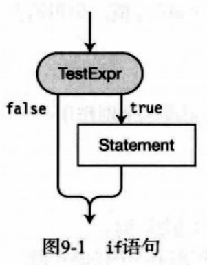

### if...else语句


### while语句


### do循环


### for循环


**for循环**表达式：
```cs
    for( Initializer ; TestExpr; IterationExpr )
        statement
```
- for循环开始，**只执行一次** Initializer
- 对 TestExpr 求值，为 true 则执行 statement，接着执行 IterationExpr
- 再重复执行一步，如果为 false 就执行 statement 以外的语句

eg:
```cs
    for(int i = 0; i < 3; i++) // 注意变量 i 值在 for 语句的内部可见
    {
        Console.WriteLine("i: {0}", i);
    }
    // 0 1 2
```
**注意**：
- 任何声明在 initializer中的变量只在 for语句中可见
- 初始化和迭代表达式都可以包含多个表达式，用逗号隔开

### switch语句

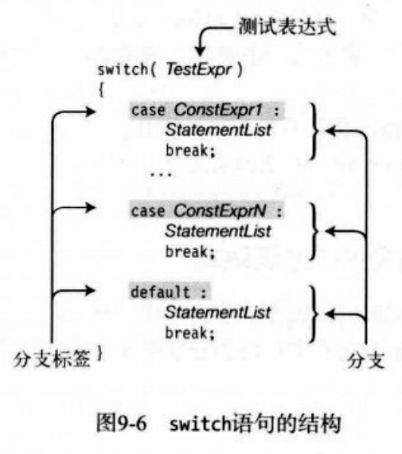

**注意**：
- 一个`switch`语句可以有任意数目的分支，包括没有分支，`default`段不是必须的，但有`default`段可以捕获潜在错误，是个好习惯
- `case`关键字后的分支标签必须是一个常量表达式，也就是说必须在*编译时*就完全获取运算结果，且类型应与测试表达式的一致
- 每一个`switch`段，包括可选的`default`段，都必须以一个跳转语句结尾
- C#中不可执行一个`switch`段中的代码就直接执行下一个段的代码

eg:
```cs
    for( int x = 1; x < 6; x++ )
    {
        switch(x)
        {
            case 2:
                Console.WriteLine("x is {0} -- In Case 2", x);
                break;
            case 3:
                Console.WriteLine("x is {0} -- In Case 3", x);
                break;
            case 4:
                Console.WriteLine("x is {0} -- In Case 4", x);
                break;
            default:
                Console.WriteLine("x is {0} -- In Default case", x);
                break;
        }
        //x is 1-- In Default case
        //x is 2-- In Case 2
        //x is 3-- In Case 3
        //x is 4-- In Case 4
        //x is 5-- In Default case
    }
```

### 跳转语句

**跳转语句**包括：break; continue; return; goto; throw;

### break语句

**break语句**可用于 switch、for、foreach、while、do等语句中，`break`导致执行跳出*最内层封装语句*

### continue语句

**continue语句**可用于 while、do、for、foreach等语句中，`continue`导致执行跳出最内层封装语句的*顶端*

```cs
    for(int x = 0; x < 5; x++)
    {
        if (x < 3)
            continue;
        Console.WriteLine("Value of x is {0}", x);
        // Value of x is 3
        // Value of x is 4
    }
```

### 标签语句

**标签语句**：由一个*标识符*后面跟着一个*冒号*再跟着*一条语句*组成：
- Indentifier: Statement;
- 标签语句只执行`Statement`部分，这个标签是用于允许控制流从代码的其他部分转移到该语句
- 标签语句只能用于*块内部*，作用域范围在它声明的块内（和任何嵌套在该块内部的块）

**标签**标签语句中的表示符可以是任何有效的标识符，包括在重叠作用域内声明的标识符如本地变量或参数名：
- 不能是关键字
- 不能在重叠的范围内与另外一个标签标识符相同

### goto语句

**goto语句**：无条件转移控制到一个*标签语句*，结构是：
- goto Indentifier;
- goto语句必须在标签语句的*作用域之内*
- goto语句可以*跳到*它本身所在块内的任何标签语句，或*跳出*到任何它*被嵌套*的块内的标签语句
- goto语句不能*跳入*任何嵌套在该语句本身所在块内部的任何块
- 还可用于`switch`语句，即：goto case ConstantExpr; 和 goto default;

### using语句

**using语句**能帮助减少意外的运行时错误带来的潜在问题，它整洁地包装了资源地使用，有两种形式：
- using( ResourceType Identifier = Expression ) Statement  
-                  ↑分配资源                     ↑使用资源
- using( Expression ) EmbeddedStatement
-         ↑资源          ↑使用资源

注意：
- using语句不同于using指令

### 其他语句


## 十.结构

### 什么是结构

**结构**是程序员定义的数据类型：
- 与类相似，有数据成员和函数成员
- 结构是值类型，类是引用类型
- 结构是隐式密封的，不能被派生
- 用关键字`struct`声明

eg：
```cs
    struct Point
    {
        public int x;
        public int y;
    }
```

### 结构是值类型

结构变量含有自己的数据：
- 结构类型的变量不能为`null`
- 两个结构变量不能引用同一个对象

```cs
    struct Simple
    {
        public int x;
        public int y;
    }
    class CSimple
    {
        public int x;
        public int y
    }
    class Program {
        static void Main() {
            CSimple cs = new CSimple();
            Simple ss = new Simple();
        }
    }
```


### 对结构赋值

```cs
    struct Simple
    {
        public int x;
        public int y;
    }
    class CSimple
    {
        public int x;
        public int y
    }
    class Program
    {
        static void Main(string[] args)
        {
        CSimple cs1 = new CSimple(), cs2 = null;
        Simple ss1 = new Simple(), ss2 = new Simple();
        cs1.x = ss1.x = 5;
        cs1.y = ss1.y = 10;
        cs2 = cs1;
        ss2 = ss1;
        }
    }
```


### 构造函数和析构函数

注意：结构可以有实例构造函数和静态构造函数，*不能*有析构函数

**结构的实例构造函数**：语言隐式为每个结构提供一个无参构造函数
- 预定义的无参构造函数不允许删除或重定义
- 只能自定义含参的实例构造函数
- 也可以不通过`new`运算符创建结构实例，但会有一些限制：
    - 在显式设置数据之后，才能使用它们的值，否者编译器会报错
    - 在对所有数据成员赋值之后，才能*调用任何*函数成员

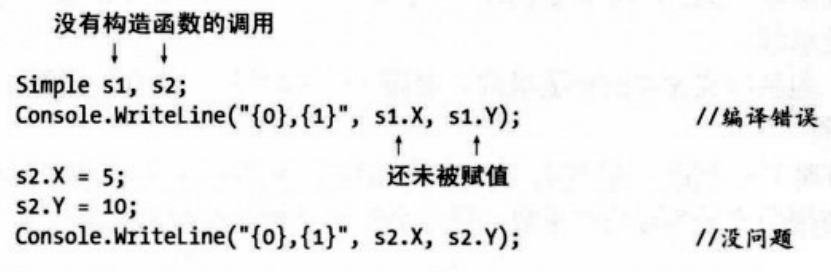

**静态构造函数**：创建并初始化静态数据成员，不能引用实例成员：
- 调用显式声明的构造函数
- 引用结构的静态成员

### 字段初始化时是不允许的

```cs
    struct Simple {
        public int x = 10; // 不允许，编译错误
    }
```

### 结构是密封的

**结构总是隐式密封**。不能继承，所以不能用于结构的修饰符：protected、internal、abstract、virtual

结构本身派生自`System.ValueType`,而`System.ValueType`派生自`Object`

### 装箱和拆箱

目的：将一个结构实例作为引用类型对象，创建*装箱*的副本

装箱：是指制作值类型变量的引用类型副本

### 结构作为返回值和参数

**结构**可以用作*返回值*和*参数*：
- 返回值时，将创建它的副本并从函数成员返回
- 参数时，将创建实参结构的副本，该副本用于方法的执行中
- ref和out参数，传入方法的是该结构的一个引用，这样就能修改其数据成员


## 十一.枚举

### 枚举

**枚举**是自定义的类型，与类和结构一样：
- 枚举是*值类型*，直接存储数据
- 枚举只有一种类型成员: 命名的整数值常量
- 用关键字`enum`声明
- 成员声明列表用*逗号*分隔，在枚举声明中没有分号
- 每个枚举成员都被赋予一个底层类型(默认是整型)的常量值
- 默认情况下，编译器会把第一个值赋值0，并对每一个后续成员赋值比前一个成员多1

eg：
```cs
    enum TrafficLight {
        Green,
        Yellow,
        Red
    }
    class Program {
        static void Main() {
            TrafficLight t1 = 
        }
    }
```
**设置底层类型**：在声明时用冒号和类型加在声明后,所有成员常量都属于枚举的底层类型

eg:
```cs
    enum TrafficLight: ulong {
        //
    }
```

成员常量的值也可以是底层类型的任何值:如要显式设置一个成员的值，只需在枚举声明中的变量名后使用初始化表达式，不能有重复的变量名，但可有重复的值：

eg:
```cs
    enum TrafficLight {
        Green = 10,
        Yellow = 15,
        Red = 15
    }
```

### 位标志
    使用单个字的不同位作为表示一组开/关标志的紧凑方法

### 关于枚举的补充 

补充：
- 枚举只有单一的成员类型：声明的成员常量
- 不能对成员使用修饰符，它们都隐式地具有与枚举相同地可访问性
- 由于成员是常量，即使在没有该枚举类型地变量时它们也能被访问，使用枚举类型名跟点和成员名
- 比较不同枚举类型地成员会导致编译时错误（指的是同一个枚举中地成员比较不会出错，不同一个就会出错）

## 十二.数组

### 数组

**数组**是由一个变量名称表示的一组*同类型*的数据元素
- 元素：数组的独立数据项
- 秩/维度：数组可以有任何为正数的维度数（秩）
- 维度长度：朝一个方向的位置个数
- 数组长度：所有维度中的元素总和

注意：数组一旦创建，大小就固定，不支持动态数组

### 数组的类型

- 一维数组：单行元素或元素向量
- 多维数组：由主向量中的位置组成，每一个位置本身又是一个数组，称为子数组；
    - 矩形数组：
        - 某个维度的所有子数组有相同长度的多维数组
        - 不管有多少维度，总是使用一组方括号： `int x = myArray[4, 6, 1]
    - 交错数组：
        - 每一个子数组都是独立数组的多维数组
        - 可以有不同长度的子数组
        - 为数组的每一个维度使用一对方括号：`int y = jagArray[2][7][4]`

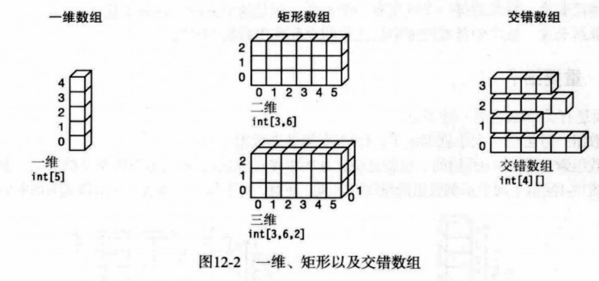

### 数组是对象

数组实例是从`System.Array`继承的对象，继承了很多有用的方法如：Rank(返回数组维度数的属性)、Length(返回数组的长度)；数组也是**引用类型**，但数组元素可以是值类型或引用类型


### 一维数组和矩形数组

**声明**一维数组或矩形数组：
- 在类型和变量名之间使用一对方括号
- 方括号内的逗号称为秩说明符，秩就是逗号数加1
- 不可再数组类型区域中放数组维度的长度，维度长度直到数组实例化才会确定

eg:
```cs
    int[,,] firstArray; // 正确
    int[,,,] array3; // 正确
    long[3,2,6] secondArray; // 错误示例，不能写维度长度，会出现编译错误
```

### 实例化一维数组或矩形数组

**数组创建表达式**：由 `new`运算符加基类名称和一对方括号组成

eg：
```cs
    int[] arr2 = new int[4]; // arr2数组是包含4个int的一维数组
    int[,,] arr3 = new int[3,6,2]; // arr3数组是三维数组
    MyClass[] mcArr = new MyClass[4]; // mcArr数组是包含4个MyClass引用的一维数组
```


### 访问数组元素

**访问数组元素**：使用整型值作为索引来访问数组元素
- 每一个维度的索引从0开始
- 方括号内的索引在数组名称之后

```cs
    class Example12
    {
        public void test ()
        {
            int[] intArr1 = new int[15];
            intArr1[2] = 10;
            int var1 = intArr1[2];

            int[,] intArr2 = new int[5, 10];
            intArr2[2, 3] = 7;
            int var2 = intArr2[2, 3];

            int[] myIntArray;
            myIntArray = new int[4];
            for( int i =0; i< 4;i++)
            {
                myIntArray[i] = i * 10;
            }
            for(int i = 0; i<4; i++)
            {
                Console.WriteLine("Value of element {0} = {1}", i, myIntArray[i]);
            }
        }
    }
    class Program
    {
        static void Main(string[] args)
        {
        Example12 eg12 = new Example12();
        eg12.test();
        }
        // Value of element 0 = 0
        // Value of element 1 = 10
        // Value of element 2 = 20
        // Value of element 3 = 30
    }
```
### 初始化数组

**数组初始化**：当数组被创建后，每一个元素被自动初始化为类型的默认值，对于预定义类型，整型默认值为0，浮点型默认值为0.0，布尔型默认值为false，引用类型默认值为null

**显式初始化一维数组**：显式初始化一维数组，可以在实例化的数组创建表达式后加上一个*初始化列表*
- 初始值必须用逗号分隔开，并封闭在一组大括号内
- 不必输入维度的长度，编译器直接根据初始化值得个数来推断
- 数组创建表达式和初始化列表之间没有分隔符

eg: `int[] intArr = new int[] {10, 20, 30, 40};`

**显式初始化矩形数组**：
- 每一个初始值向量必须封闭在大括号内
- 每一个维度必须嵌套并封闭在大括号内
- 除了初始值，每一个维度的初始化列表和组成部分也必须用逗号分隔开

eg: 

`int[,] intArray2 = new int[,] { {10, 1}, {2, 10}, {11, 9} };`
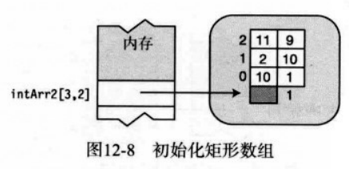

```
int[,,] intArray3 = new int[4, 3, 2] {
    { {8, 6}, {5, 2}, {12, 9} },
    { {6, 4}, {3, 9}, {18, 4} },
    { {7, 1}, {1, 3}, {29, 3} },
    { {4, 6}, {3, 2}, {23, 8} }
}
```
注意：当在一条语句中使用声明、数组创建和初始化时，可以**省略**数组的创建表达式部分，只提供初始化部分：


eg: 
```
    int[] arr1 = int[3] {10, 20, 30}; 
    等价于
    int[] arr1 =        {10, 20, 30};
```

**隐式类型数组**：
- 当初始化数组时，可以让编译器根据初始化语句推断数组类型，只要初始化语句能隐式转换为单个类型
- 和隐式类型的局部变量一样，使用`var`关键字来替代数组的类型
- 初始化语句中仍需要提供秩说明符

eg:
```
    var intArr2 = new [] {10, 20,  30, 40 };
    var intArr4 = new [,] { {10, 1}, {2, 10}, {11, 9} };
    var sArray1 = new [] { "life", "liberty", "pursuit of hanppiness" };
```

综合：
eg:
```cs
    var arr = new[,] { { 0, 1, 2 }, { 10, 11, 12 } };
                for(int i = 0; i < 2; i++)
                {
                    for(int j = 0; j<3; j++)
                   {
                       Console.WriteLine("Element [{0}, {1}] is  {2}", i, j, arr[i, j]);
                    }
                }
// Element [0, 0] is  0
// Element [0, 1] is  1
// Element [0, 2] is  2
// Element [1, 0] is  10
// Element [1, 1] is  11
// Element [1, 2] is  12
```

### 交错数组

**交错数组**：与矩形数组相比，交错数组的子数组元素个数可以不同

eg:
`int[][] jagArr = new int[3][]; // 一个二维的3个int数组的交错数组`


**声明交错数组**：
- 每一个维度都有一对独立的方括号，方括号数决定了数组的秩
- 交错数组的维度可以是大于1的任意整数
- 和矩形数组一样，维度长度不能包括在数组类型的声明部分

```cs
    int[][] someArr;
    int[][][] otherArr;
```

**实例化交错数组**：
- 首先，实例化顶层数组，不能在声明语句中初始化顶层数组之外的数组
- 其次，实例化每一个子数组，把新建数组的引用赋给它们所属数组的合适元素
```cs
    int[][] jagArr = new int[3][]; // 1. 正确
    int[][] jagArr = new int[3][4]; // 1. 编译错误

    jagArr[0] = new int[] {10, 20, 30}; //2. 
    jagArr[1] = new int[] {40, 50, 60, 70}; // 3. 
    jagArr[2] = new int[] {80, 90, 100, 110, 120}; // 4.
```
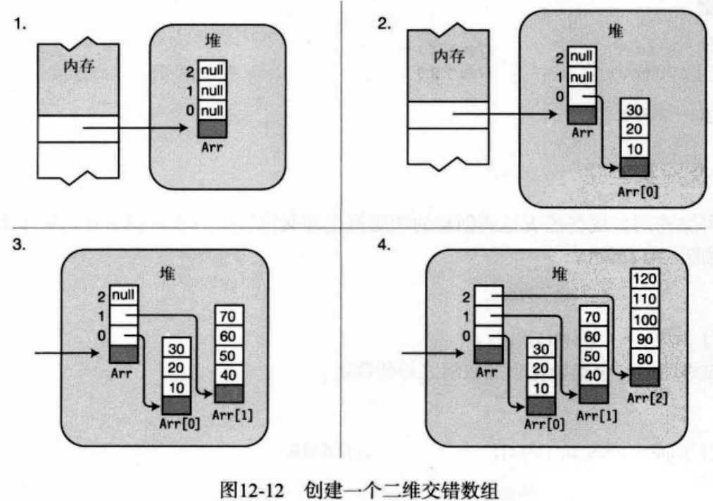

**交错数组中的子数组**：由于子数组本身就是数组，可能包含矩形数组


eg:
```cs
    int[][,] Arr;
    Arr = new int[3][,];
    Arr[0] = new int[,] { { 10, 20 }, { 100, 200 } };
    Arr[1] = new int[,] { { 30, 40, 50 }, { 300, 400, 500 } };
    Arr[2] = new int[,] { { 60, 70, 80, 90 }, { 600, 700, 800, 900 } };
    for (int i = 0; i < Arr.GetLength(0); i++) // 获取Arr维度0的长度 3 i<3
    {
        for (int j = 0; j < Arr[i].GetLength(0); j++) // 获取Arr[0]、Arr[1]、Arr[2]维度0的长度 都为2 j<2
        {
            for (int k = 0; k < Arr[i].GetLength(1); k++) // 获取Arr[0]、Arr[1]、Arr[2]维度1的长度 为2、3、4 k<2、k<3、k<4
            {
            
                Console.WriteLine("[{0},{1},{2}] = {3}", i, j, k, Arr[i][j, k]);
            }
            Console.WriteLine("");

        }
        Console.WriteLine("");

    }
// [0,0,0] = 10  // [0,1,0] = 100
// [0,0,1] = 20  // [0,1,1] = 200
 
// [1,0,0] = 30  // [1,1,0] = 300
// [1,0,1] = 40  // [1,1,1] = 400
// [1,0,2] = 50  // [1,1,2] = 500

// [2,0,0] = 60  // [2,1,0] = 600
// [2,0,1] = 70  // [2,1,1] = 700
// [2,0,2] = 80  // [2,1,2] = 800
// [2,0,3] = 90  // [2,1,3] = 900

```

### 比较矩形数组和交错数组

一个3*3的矩形数组和一个长度为3的一维数组构成的交错数组比较：
- 两个数组都保存了9个整数，但结构不同
- 矩形数组只有单个的数组对象，而交错数组有4个数组对象


### foreach语句

`foreach`语句允许我们连续访问数组中的每一个元素：
- 迭代变量时临时的，并和数组中元素的类型相同
- Type 是数组中元素的类型，可以显式提供它的类型，也可以用 `var`隐式声明，让编译器推断数组类型
- Identifier 是迭代变量的名字
- ArrayName 是数组的名字
- Statement 是要为数组中的每一个元素执行一次单条语句或语句块


```cs
    int[] arr1 = { 10, 11, 12, 13 };
    foreach(int item in arr1)
    {
        Console.WriteLine("Item value: {0}", item);
    }
```

**迭代变量是只读的**：
- 由于迭代变量是只读的，所以不能改变
- 对于值类型数组，我们不能改变迭代变量
- 对于引用型数组，我们可以通过改变迭代变量进而改变数据

```cs
    class Example12
    {
        public int MyFiled = 0;
    }
    class Program
    {
        static void Main(string[] args)
        {
            Example12[] exArray = new Example12[4]; // 创建数组
            for(int i = 0; i<4;i++)
            {
                exArray[i] = new Example12(); // 创建类对象
                exArray[i].MyFiled = i; // 设置字段
            }
            foreach(Example12 item in exArray)
            {
                item.MyFiled += 10; // 改变数据
            }
            foreach(Example12 item in exArray)
            {
                Console.WriteLine("{0}", item.MyFiled); // 10 11 12 13
            }
    }
```

**多维数组与foreach语句示例**：
eg:矩形数组
```cs
    class Program
    {
        static void Main(string[] args)
        {
            int total = 0;
            int[,] arr1 = { { 10, 11 }, { 12, 13 } };
            foreach(var element in arr1)
            {
                total += element;
                Console.WriteLine("Element: {0}, current total: {1}", element, total);
                // 10 11 12 13
            }
        }
    }
            
```
eg:交错数组（每一个维度使用独立的foreach语句）
```cs
    class Program
    {
        static void Main(string[] args)
        {
        int total = 0;
        int[][] arr1 = new int[2][];
        arr1[0] = new int[] { 10, 11 };
        arr1[1] = new int[] { 12, 13, 14 };
        foreach(int[] array in arr1)
        {
            Console.WriteLine("Starting new array");
            foreach(int item in array)
            {
                total += item;
                Console.WriteLine("Item: {0}, Current total: {1}", item, total);
            }
        }
    }
// Starting new array
// Item: 10, Current total: 10
// Item: 11, Current total: 21
// Starting new array
// Item: 12, Current total: 33
// Item: 13, Current total: 46
// Item: 14, Current total: 60
```
### 数组协变

**数组协变**：以下情况下，即使某个对象不是数组的基类型，也可以把它赋值给数组元素，这种属性就叫做数组协变
- 数组是引用类型数组
- 在赋值的对象类型和数组基类型之间有隐式或显式转换（由于派生类和基类之间总是有隐式转换，所以总是可以将一个派生类的对象赋值给为基类声明的数组）

```cs
    class A { ... }
    class B : A { ... }
    class Program {
        static void Main() {
            A[] AArray1 = new A[3];
            A[] AArray2 = new A[3];

            // 普通：将A类型的对象赋值给A类型的数组
            AArray1[0] = new A();
            AArray1[1] = new A();
            AArray1[2] = new A();

            // 协变：将B类型的对象赋值给A类型的数组
            AArray2[0] = new B();
            AArray2[1] = new B();
            AArray2[2] = new B();
        }
    }
```
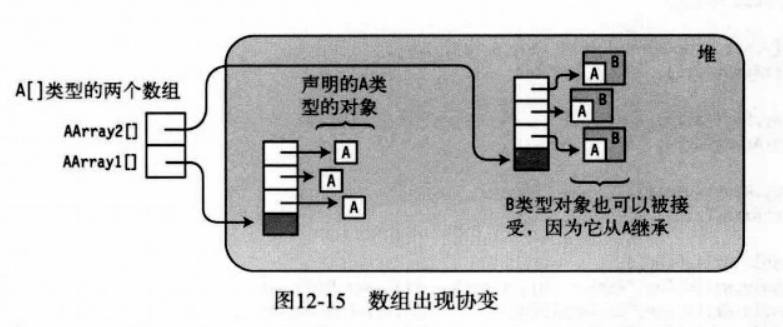

### 数组继承的有用成员
数组继承很多有用的属性和方法：


eg:
```cs
    class Program
    {
        public static void PrintArray(int[] a)
        {
            foreach( var x in a)
            {
                Console.WriteLine("{0}", x);
            }
            Console.WriteLine("");
            }
        static void Main(string[] args)
        {
            int[] arr = new int[] { 15, 20, 5, 25, 10 };
            PrintArray(arr);

            Array.Sort(arr);
            PrintArray(arr);

            Array.Reverse(arr);
            PrintArray(arr);

            Console.WriteLine();
            Console.WriteLine("Rank = {0}, length = {1}", arr.Rank, arr.Length); // Rank = 1 Length = 5
            Console.WriteLine("GetLength(0) = {0}", arr.GetLength(0)); // 5
            Console.WriteLine("GetType() = {0}", arr.GetType()); // System/Int32[] 
    }
```

**Clone方法**：为数组进行浅复制，只创建了数组本身的克隆，如果是引用类型的数组，它不会复制元素引用的对象
- 克隆值类型数组会产生两个独立数组
- 克隆引用类型数组会产生指向相同对象的两个数组
- 克隆方法返回Object类型的引用，它必须被强制转换成数组类型


```cs
    class A {
        public int Value = 5;
    }
    class Program {
        static void Main() {
            A[] AArray1 = new A[3] { new A(), new A(), new A()};
            A[] AArray2 = (A[]) AArray1.Clone();
            AArray2[0].Value = 100;
            AArray2[1].Value = 200;
            AArray2[2].Value = 300;
        }
    }
```


### 比较数组的类型

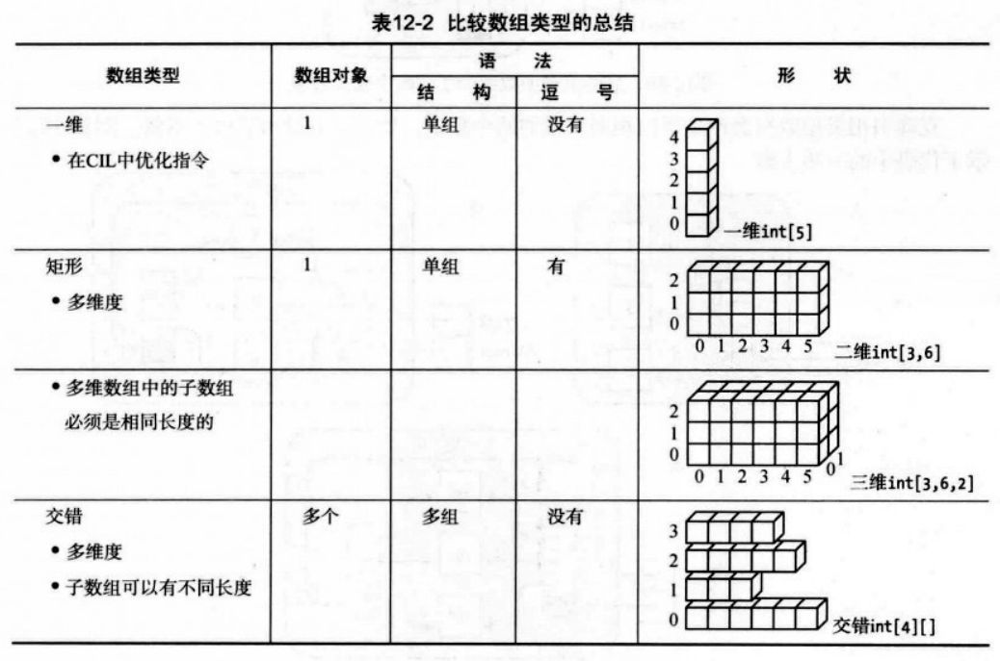

## 十三.委托

### 什么是委托

```cs
    delegate void MyDel(int value); // 声明一个委托类型
    class Program
    {
        void PrintLow(int value)
        {
            Console.WriteLine("{0} - Low Value", value);
        }
        void PrintHigh(int value)
        {
            Console.WriteLine("{0} - High Value", value);
        }
            static void Main(string[] args)
            {
                Program program = new Program();
                MyDel del; // 声明委托变量
                Random rand = new Random(); // 创建随机整数生成器对象，并得到0至99之间的一个随机数
                int randValue = rand.Next(99);
                // 创建一个包含PrintLow或PrintHigh的委托对象并将其赋值给del变量
                del = randValue < 50 ? new MyDel(program.PrintLow) : new MyDel(program.PrintHigh);
                del(randValue); // 执行委托
            }
    }
```

### 委托概述

**委托**与类一样，是一种用户自定义的类型；但类表示的是数据和方法的集合，而委托则持有一个或多个方法，以及一系列预定义操作

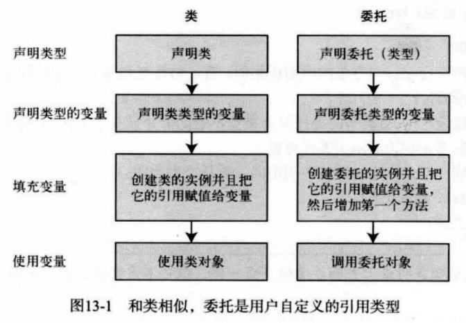

也可以将*委托*看作一个包含有序方法列表的对象，这些方法有相同的签名和返回类型：
- 方法的列表称为调用列表
- 委托保存的方法可以来自任何类或结构，只要它们符合以下两点：
    - 委托的返回类型
    - 委托的签名（包括ref和out修饰符）
- 调用列表中的方法可以是实例方法也可以是静态方法
- 在调用委托时，会执行其调用列表中的所有方法


### 声明委托类型

**声明委托类型**：委托类型的声明与方法声明很相似，有*返回类型*和*签名*，返回类型和签名指定了委托接受的方法的形式
- 以`delegate`关键字开头
- 没有方法主体
- 不需要在类型内部声明，因为委托也是一种类型

eg:
```cs
delegate void MyDel(int x); // 声明了一个只会接受不返回值并且有单个int参数的方法的MyDel类型委托
```

### 创建委托对象

委托时**引用类型**，所以也有引用和对象。在委托类型声明之后，可以声明变量并创建委托对象，有以下两种方式：
- 第一种使用带`new`运算符的对象创建表达式：`delVar = new MyDel(myInstObj.MyM1)`
    - 委托类型名
    - 一组圆括号，包含作为调用列表中第一个成员的方法名字，可以是实例方法，也可以是静态方法
- 第二种是快捷语法，仅由方法说明符构成：`delVAr = SClass.OtherM2`
    - 因为方法名称和其对应的委托类型之间存在隐式转换，所以能够使用快捷语法


### 给委托赋值

因为委托是引用类型，可以通过给它**赋值**来改变包含在委托变量中的引用，旧的委托对象会被垃圾回收器回收

```cs
    delegate void MyDel(int x);
    MyDel = myInstObj.MyM1;
    ...
    MyDel = SClass.OtherM2;
```


### 组合委托

委托可以使用**额外的运算符**来**组合**：这个运算符最终会创建一个新的委托，其调用列表连接了作为操作数的两个委托的调用列表副本

eg:
```cs
    MyDel delA = myInstObj.MyM1;
    MyDel delB = CSlass.otherM2;
    MyDel delC = delA + delB; // 组合调用列表
```

注意：委托是**恒定**的，委托对象被创建后不能再被改变，所以作为操作数的委托没有被改变

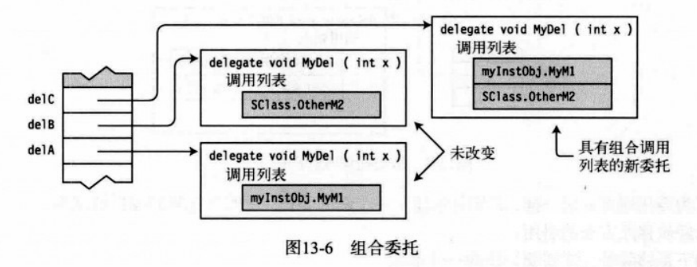

### 为委托添加方法

使用+=运算符为委托**添加**方法：实际上是创建了一个新的委托，其调用列表是左边的委托加上右边的方法的组合，然后将这个新的委托赋值给delVar

eg:
```cs
    MyDel delVar = inst.MyM1; // 创建并初始化
    delVar += SCl.m3; // 增加方法
    delVar += X.Act; // 增加方法
```


### 为委托移除方法

使用-=运算符为委托**移除**方法：实际上也是创建了一个新的委托。新的委托是旧委托的副本，只是没有了已移除方法的引用，注意的是：
- 如果在调用列表中的方法有多个实例，-=运算符会从列表最后开始搜索，并移除第一个与方法匹配的实例
- 试图删除委托中不存在的方法是没有效果
- 试图调用空委托会抛出异常，可以通过把委托和null进行比较来判断委托的调用列表是否为空，如果为空则委托是null

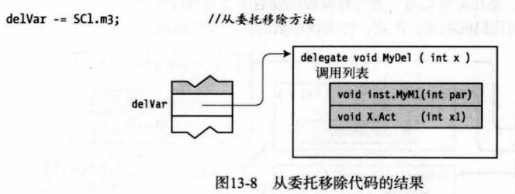

### 调用委托

可以像调用方法一样简单地调用委托：用于调用委托的参数将会调用调用列表中的每一个方法（除非有输出参数），如果一个方法在调用列表中出现多次，当委托被调用时，每次在列表中遇到这个方法时它都会被调用一次

eg:
```cs
    MyDel delVar = inst.MyM1;
    delVar += SCl.m3;
    delVar += X.Axt;
    ...
    delVar(55); // 调用委托
```
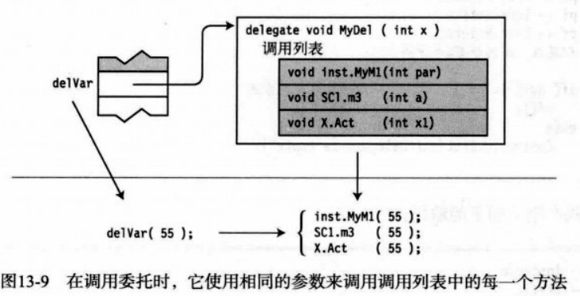

### 委托的示例

eg:
```cs
    class Test
    {
        public void Print1()
        {
            Console.WriteLine("Print1 -- instance");
        }
        public static void Print2()
        {
            Console.WriteLine("Print2 -- static");
        }
    }
    class Program {
        static void Main(string[] args)
        {
            Test t = new Test();
            PrintFunction pf;
            pf = t.Print1;
            pf += Test.Print2;
            pf += t.Print1;
            pf += Test.Print2;

            if (null != pf)
                pf();
            else
                Console.WriteLine("Delegate is empty");

                // Print1 -- instance
                // Print2 -- static
                // Print1 -- instance
                // Print2 -- static
        }
    }
```

### 调用带返回值的委托

如果委托有返回值且调用列表中的方法有一个以上，会出现：
- 调用列表中执行到最后一个方法返回的值就是委托调用返回的值
- 调用列表中所有其他方法的返回值都会被忽略

eg:
```cs
    delegate int MyDel();
    class Example13
    {
        int IntValue = 5;
        public int Add2()
        {
            IntValue += 2;
            return IntValue;
        }
        public int Add3()
        {
            IntValue += 3;
            return IntValue;
        }
    }
    class Program() {
        static void Main() {
            Example13 ex = new Example13();
            MyDel mDel = ex.Add2;
            mDel += ex.Add3;
            mDel += ex.Add2;
            Console.WriteLine("Value {0}", mDel()); // 12
        }
    }
```


### 调用带引用参数的委托

如果委托有**引用参数**,参数值会根据调用列表中的一个或多个方法的返回值而改变.即在调用委托列表中的下一个方法时,参数的新值会传给下一个方法.

eg:
```cs
    delegate void MyDel(ref int x); // 注意是 void 类型
    class CatchArg
    {
        public void Add2(ref int x)
        {
            x += 2;
        }
        public void Add3(ref int x)
        {
            x += 3;
        }
    }
    class Program {
        static void Main() {
            CatchArg cg = new CatchArg();
            MyDel mDel = cg.Add2;
            mDel += cg.Add3;
            mDel += cg.Add2;

            int x = 5;
            mDel(ref x);
            Console.WriteLine("Value {0}", x); // 12
        }
    }
```
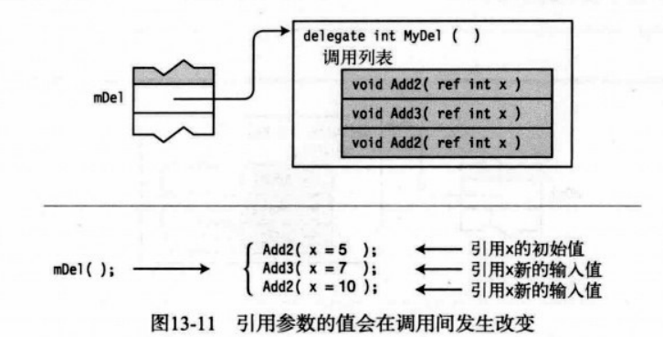


### 匿名方法

**匿名方法**是在初始化委托时内联声明的方法

eg:
```cs
    class Program {
        delegate int OtherDel(int InParam);
        static void Main() {
            OtherDel del = delegate(int x) {
                return x + 20;
            }
            Console.WriteLine("{0}", del(5)); // 25
            Console.WriteLine("{0}", del(6)); // 26
        }
    }
```

**匿名方法用于**:
- 声明委托变量时作为初始化表达式 
- 组合委托时在赋值语句右边
- 为委托增加事件时在赋值语句的右边

**基础语法**:
- 使用`delegate`关键字
- 参数列表,如果语句块没有使用任何参数且没有任何out参数则可以省略(使用空括号或省略括号),如有则需在三方面与委托匹配:
    - 参数数量
    - 参数类型及位置
    - 修饰符
- 语句块,包含了匿名方法的代码
- 不需要显式声明返回值类型
- 如果参数列表含有params参数,则委托声明时指定最后一个参数为params参数,需使用params关键字,但匿名方法的参数列表省略params关键字
eg:
```cs
    delegate void SomeDel(int x, params int[] y);
    SomeDel mDel = delegate(int x, int[] y) {
        ...
    }
```

**变量和参数的作用域**:
- 参数和声明在匿名方法内部的局部变量的作用域都在实现方法的主体之内,主体结束后局部变量就会消失
- 与委托的具名方法不同,匿名方法可以访问到它们外围作用域的局部变量(也叫*外部变量*)和环境,这种方式称为*被方法捕获*
- 只要捕获方法还是委托的一部分,即使外部变量已经离开作用域,捕获的外部变量也会一致有效

```cs
    delegate OtherDel();
    class Program {
        static void Main() {
            OtherDel oDel;
            {
                int x = 5;
                oDel = delegate ()
                {
                    Console.WriteLine("Value of x: {0}", x); //捕获x变量
                };
            };
            oDel(); // 5
        }
    }
```


### Lambda表达式

**Lambda表达式**替代匿名方法,简化语法
- 删除`delegate`关键字
- 在参数列表和匿名方法主题之间放Lambda运算符=>,读作goes to
- 因为编译器能从委托声明中知道委托参数类型,Lambda表达式还能省略类型参数
- 如果语句块只包含一个返回语句,可以将语句块替换成return关键字后的表达式
- 参数列表中的参数必须在数量,类型和位置上与委托的匹配
    - 参数不一定包含参数类型(隐式类型),但如果委托有ref或out参数时,此时必须标注参数类型
    - 如果只有一个参数,并且是隐式类型的,周围圆括号可以被省略,否者必须有括号
    - 如果没有参数,必须使用空括号

```cs
    delegate double MyDel(int par)
    class Program {
        static void Main() {
            MyDel del = delegate(int x) {
                return x + 1;
            };
            // 等价于
            MyDel del = (int x) => { return x + 1; };
            // 等价于
            MyDel del = x => x + 1;
        }
    }
```

## 十四.事件

### 发布者和订阅者

- 发布者: 发布某个事件的类或结构,其他的类可以在该事件发生时得到通知
- 订阅者: 注册并在事件发生时得到通知的类或结构
- 事件处理程序: 由订阅者注册到事件的方法,在发布者触发事件时执行
- 触发事件: 调用或触发事件的术语,当事件触发时,所有注册到它的方法都会依次被调用

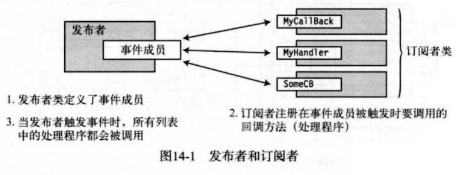

eg: 一个叫InCrementer的类,它按照某种方式进行计数
- InCrementer定义了一个CountedADozen事件,每次累积到12个项时将会触发该事件
- 订阅者类Dozens和SomeOtherClass各有一个注册到CountedADozen事件的事件处理程序
- 每当触发事件时,都会调用这些处理程序


### 源代码组件概览

**事件**中使用的代码有5部分:
- 委托类型声明: 事件和事件处理程序必须有共同的签名和返回类型,它们通过委托类型进行描述
- 事件处理程序声明: 订阅者类中会在事件触发时执行的方法声明.它们不一定是有显式命名的方法,还可以是匿名方法或Lanbda表达式
- 事件声明: 发布者类必须声明一个订阅者类可以注册的事件成员.当声明的事件为public时,称为**发布了**事件
- 事件注册: 订阅者必须订阅事件才能在它被触发时得到通知
- 触发事件的代码: 发布者类中**触发**事件并导致调用注册的所有事件处理程序的代码

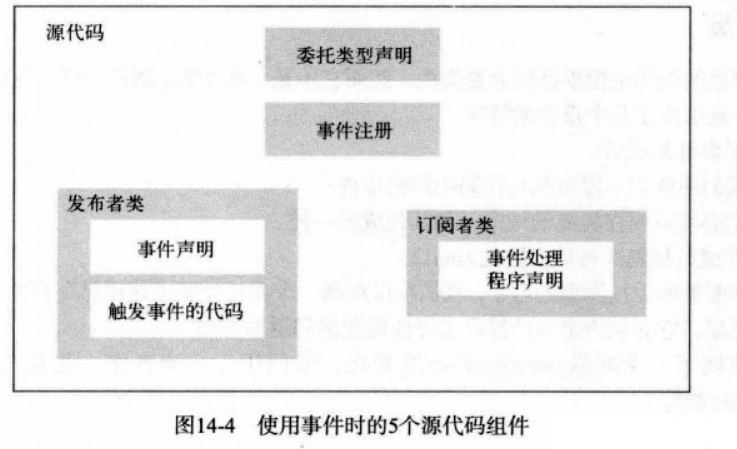

### 声明事件

是发布者(InCrementer)必须提供的事件对象(CountedADozen):
- 事件声明在一个类中,使用`event`关键字
- 需要委托类型名称,任何附加到事件(如注册)的处理程序都必须与委托类型的签名和返回类型匹配
- 使用`public`关键字声明,目的是其他类和结构可以在它上面注册事件处理程序
- 不能使用对象创建表达式(即 new表达式)来创建它的对象
- 可以使用`static`关键字使事件变成**静态**
- 可以通过逗号分隔的列表在一个声明语句中声明一个以上的事件
(声明事件不需要写参数, 但触发事件的参数列表必须与事件的委托类型相匹配)

eg:
```cs
    class InCrementer {
                        ↓委托类型   ↓事件名
        public event EventHandler CountedADozen;

        public event EventHandler MyEvent1, MyEvent2, MyEvent3;

        public static event EventHandler CountedADozen;
    }
```

**注意,事件是成员**
- 事件是类或结构的成员
- 不能在一段可执行代码中声明事件,必须声明在类或结构中
- 事件成员被隐式自动初始化为null
- 事件声明需要委托类型的名字,可以声明一个委托类型或使用已存在的,如果声明一个委托类型,必须指定事件保存的方法的签名和返回类型

### 订阅事件

是订阅者向事件添加事件处理程序:
- 必须具有与事件的委托相同的返回类型和签名
- 使用+=运算符为事件增加事件处理程序
- 事件处理程序位于+=运算符右边
    - 实例方法的名称
    - 静态方法的名称
    - 匿名方法
    - Lambda表达式

eg:
```cs
    Incrementer.CountedADozen += IncrenmenrDozensCount; // 方法形式的实例方法
    Incrementer.CountedADozen += ClassB.CounterHandlerB; // 方法形式的静态方法
    mc.CountedADozen += new EventHandler(cc.CounterHanlerC); // 委托形式的实例方法
    Incrementer.CountedADozen += () => DozensCount++; // Lambda表达式形式
    Incrementer.CountedADozen += delegate { DozensCount++; }; // 匿名方法形式
```

### 触发事件

触发事件的代码:
- 在触发事件之前需要和null比较,查看是否存在事件处理程序,如果事件是null,表示没有则不能执行
- 触发事件,即使用事件名称,后面跟的参数列表包含在圆括号内,参数列表必须与事件的委托类型相匹配

eg:
```cs
    if(CountedADozen != null) 
        CountedADozen(source, args); // 触发事件
```
**一个完整的栗子**:


### 标准事件的用法

事件使用的标准模式的**根本**是System命名空间声明的`EventHandler`委托类型:
- 第一个参数用来保存触发事件的对象的引用,由于是`object`类型,所以可以匹配任何类型的实例
- 第二个参数用来保存状态信息,指明什么类型适用于该应用程序
- 返回类型是void
- 第二个参数是`EventArgs`类的对象,它声明在`System`命名空间中.
    - 因为`EventArgs`设计为不能传递任何数据,它用于不需要传递数据的事件处理程序(通常会被忽略)
    - 如果希望传递数据,必须声明一个派生自`EventArgs`的类,使用合适的字段来保存需要传递的数据
```cs
    public delegate void EventHandler(object sender, EventArgs e);
```

eg:修改上面栗子为**使用`EventHandler`**


**通过扩展`EventArgs`来传递数据**

eg: 使用一个派生自`EventArgs`的类

```cs
    public class IncrementEventArgs: EventArgs
    {
        public int IterationCount { get;  set; }
    }
    class Incrementer
    {
        public event EventHandler<IncrementEventArgs> CountedADozen; // 创建事件并发布
        public void DoCount()
        {
            IncrementEventArgs args = new IncrementEventArgs();
            for(int i=1; i<100; i++)
            {
                if (i % 12 == 0 && CountedADozen != null)
                {
                    args.IterationCount = i; // 设置值
                    CountedADozen(this, args); // 传递参数
                }

            }
        }
    }
    class Dozens
    {
        public int DozensCount { get; private set; }
        void IncrementDozensCount(object source, IncrementEventArgs e) // 修改为自定义类
        {
            Console.WriteLine("Incremented at iteration: {0} in {1}", e.IterationCount, source.ToString()); // 获取参数值
            DozensCount++;
            
        }
        public Dozens(Incrementer incrementer)
        {
            DozensCount = 0;
            incrementer.CountedADozen += IncrementDozensCount;
        }
        

    }
    class Program {
        static void Main(string[] args)
        {
            Incrementer incrementer = new Incrementer();
            Dozens dozensCounter = new Dozens(incrementer);
            incrementer.DoCount();
            Console.WriteLine("Number of dozens = {0}", dozensCounter.DozensCount);
        }
    }
// Incremented at iteration: 12 in ClassDemo.Example.Incrementer
// Incremented at iteration: 24 in ClassDemo.Example.Incrementer
// Incremented at iteration: 36 in ClassDemo.Example.Incrementer
// Incremented at iteration: 48 in ClassDemo.Example.Incrementer
// Incremented at iteration: 60 in ClassDemo.Example.Incrementer
// Incremented at iteration: 72 in ClassDemo.Example.Incrementer
// Incremented at iteration: 84 in ClassDemo.Example.Incrementer
// Incremented at iteration: 96 in ClassDemo.Example.Incrementer
// Number of dozens = 8
```

**移除事件处理程序**: 使用`-=`运算符

如果一个处理程序向事件注册了多次,那么当执行命令移除处理程序时,只会将列表中该处理程序的最后一个实例移除

```cs
    class Publisher {
        public event Eventhandler SimpleEvent;
        public void RaiseTheEvent() {
            SimpleEvent(this, null);
        }
    }
    class Subscriber {
        public void MethodA(object o, EventAgrs e) {
            Console.WriteLine("AAA");
        }
        public void MethodB(object o, EventAgrs e) {
            Console.WriteLine("BBB");
        }
    }
    class Program {
        static void Main() {
            Publisher p = new Publisher();
            Subscriber s = new Subscriber();
            p.SimpleEvent += s.MethodA;
            p.SimpleEvent += s.MethodB;
            p.RaiseTheEvent();
            Console.WriteLine("Remove MethodB");
            p.SimpleEvent -= s.MethodB;
            p.RaiseTheEvent();
        }
    }
    // AAA
    // BBB
    // Remove MethodB
    // AAA
```

### 事件访问器

`+=`和`-=`是事件允许的唯二运算符,但这些运算符有预定义的行为,我们可以通过修改这些运算符的行为,让事件执行任何我们希望的自定义代码,要改变这两个运算符的操作,可以**为事件定义事件访问器**:
- 有两个访问器: add和remove
- 声明是将访问器看上去和声明一个属性差不多
- 两个访问器都有叫做value的隐式值参数,它接受实例或静态方法的引用
- 声明事件访问器之后,事件不包含任何内嵌委托对象,需要我们自己实现来来存储和移除事件注册的方法
- 事件访问器表现为void方法,不能包含返回值的return语句

## 十五.接口

### 什么是接口

**接口**是指定一组函数成员而不实现它们的引用类型,只能类和结构来实现接口

eg: 使用接口IInfo使PrintInfo方法用于多个类

```cs
    interface IInfo
    {
        string GetName();
        string GetAge();
    }
    class CA: IInfo
    {
        public string Name;
        public int Age;
        public string GetName()
        {
            return Name;
        }
        public string GetAge()
        {
            return Age.ToString();
        }
    }
    class CB: IInfo
    {
        public string First;
        public string Last;
        public double PersonsAge;
        public string GetName()
        {
            return First + " " + Last;
        }
        public string GetAge()
        {
            return PersonsAge.ToString();
        }
    }
    class Program {
        static void PrintInfo(IInfo item)
        {
            Console.WriteLine("Name: {0}, Age: {1}", item.GetName(), item.GetAge());
        }
        static void Main(string[] args)
            {
            CA a = new CA() { Age = 35, Name = "John Doe" };
            CB b = new CB() { First = "Jane", Last = "Doe", PersonsAge = 33 };
            PrintInfo(a); // Name: John Doe, Age: 35
            PrintInfo(b); // Name: Jane Doe, Age: 33
            }
    }
```

eg: 2

```cs
    class CC: IComparable
    {
        public int TheValue;
        public int CompareTo(object obj)
        {
            CC c = (CC)obj; // 暂时没明白这一行代表什么
            if (this.TheValue < c.TheValue) return -1;
            if (this.TheValue > c.TheValue) return 1;
            return 0;
        }
    }
    class Program {
        static void PrintOut(string s, CC[] mc)
        {
            Console.Write(s);
            foreach (var m in mc)
                Console.Write("{0} ", m.TheValue);
            Console.WriteLine("");
        }
        static void Main(string[] args)
            {
            var myInt = new[] { 20, 4, 16, 9, 2 };
            CC[] cArr = new CC[5]; // 创建一个CC类型的数组
            for(int i = 0; i< 5; i++ )
            {
                cArr[i] = new CC(); // 创建类对象 即实例化每一个元素
                cArr[i].TheValue = myInt[i];
            }
            PrintOut("Initial Order: ", cArr); // Initial Order: 20 4 16 9 2
            Array.Sort(cArr);
            PrintOut("Sorted Order: ", cArr); // Sorted Order: 2 4 9 16 20
            }
    }
```

### 声明接口

**声明接口**:
- 声明接口不能包含数据成员和静态成员
- 只能包含以下类型的非静态成员函数: 方法、属性、事件、索引器
- 以上函数成员的声明不能包含任何实现代码,必须以分号结尾
- 按照惯例,接口名称必须从大写的**I**开始
- 与类和结构一样,接口声明还可以分隔成分部接口声明
- 接口声明可以由任何的访问修饰符如: public、protected、internal或private
- 但接口的成员是**隐式public**,不允许有任何访问修饰符

```cs
    interface IMyInterface {
        int DoStuff (int nVar1, long lVar2);
        double DoOtherStuff(string s, long x);
    }
```

### 实现接口

**只有类和结构能实现接口**,且类和结构必须:
- 在基类列表中包含接口名称
- 为每一个接口的成员提供实现
- 基类列表中除了接口外的基类名称必须放在所有接口之前

```cs
    class Derived: MyBaseClass, IIfc1, IEnumerable, IComparable {
        ...
    }
```

### 接口是引用类型

**接口是引用类型**, 不能直接通过类对象的成员访问接口, 但可以通过**把类对象引用强制转换为接口类型**来获取指向接口的引用


### 接口和as运算符

### 实现多个接口

### 多个接口的引用

### 派生成员实现

### 接口可以继承接口

### 不同类实现同一个接口的示例