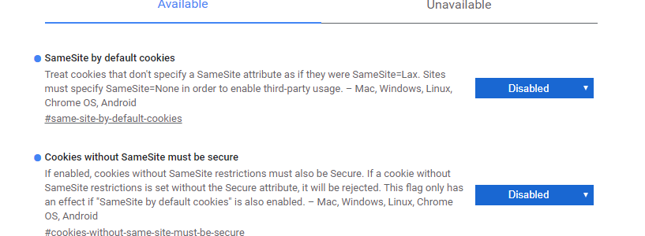

# 2020

## Jane

### 常见验证
```js
export const checkStr = (str, type) => {
    switch (type) {
        case 'phone':   //手机号码
            return /^1[3|4|5|6|7|8|9][0-9]{9}$/.test(str);
        case 'tel':     //座机
            return /^(0\d{2,3}-\d{7,8})(-\d{1,4})?$/.test(str);
        case 'card':    //身份证
            return /(^\d{15}$)|(^\d{18}$)|(^\d{17}(\d|X|x)$)/.test(str);
        case 'pwd':     //密码以字母开头，长度在6~18之间，只能包含字母、数字和下划线
            return /^[a-zA-Z]\w{5,17}$/.test(str)
        case 'postal':  //邮政编码
            return /[1-9]\d{5}(?!\d)/.test(str);
        case 'QQ':      //QQ号
            return /^[1-9][0-9]{4,9}$/.test(str);
        case 'email':   //邮箱
            return /^[\w-]+(\.[\w-]+)*@[\w-]+(\.[\w-]+)+$/.test(str);
        case 'money':   //金额(小数点2位)
            return /^\d*(?:\.\d{0,2})?$/.test(str);
        case 'URL':     //网址
            return /(http|ftp|https):\/\/[\w\-_]+(\.[\w\-_]+)+([\w\-\.,@?^=%&:/~\+#]*[\w\-\@?^=%&/~\+#])?/.test(str)
        case 'IP':      //IP
            return /((?:(?:25[0-5]|2[0-4]\\d|[01]?\\d?\\d)\\.){3}(?:25[0-5]|2[0-4]\\d|[01]?\\d?\\d))/.test(str);
        case 'date':    //日期时间
            return /^(\d{4})\-(\d{2})\-(\d{2}) (\d{2})(?:\:\d{2}|:(\d{2}):(\d{2}))$/.test(str) || /^(\d{4})\-(\d{2})\-(\d{2})$/.test(str)
        case 'number':  //数字
            return /^[0-9]$/.test(str);
        case 'english': //英文
            return /^[a-zA-Z]+$/.test(str);
        case 'chinese': //中文
            return /^[\\u4E00-\\u9FA5]+$/.test(str);
        case 'lower':   //小写
            return /^[a-z]+$/.test(str);
        case 'upper':   //大写
            return /^[A-Z]+$/.test(str);
        case 'HTML':    //HTML标记
            return /<("[^"]*"|'[^']*'|[^'">])*>/.test(str);
        default:
            return true;
    }
}
 
 // 身份证 信息验证
export const isCardID = (sId) => {
    if (!/(^\d{15}$)|(^\d{17}(\d|X|x)$)/.test(sId)) {
        console.log('你输入的身份证长度或格式错误')
        return false
    }
    //身份证城市
    var aCity = { 11: "北京", 12: "天津", 13: "河北", 14: "山西", 15: "内蒙古", 21: "辽宁", 22: "吉林", 23: "黑龙江", 31: "上海", 32: "江苏", 33: "浙江", 34: "安徽", 35: "福建", 36: "江西", 37: "山东", 41: "河南", 42: "湖北", 43: "湖南", 44: "广东", 45: "广西", 46: "海南", 50: "重庆", 51: "四川", 52: "贵州", 53: "云南", 54: "西藏", 61: "陕西", 62: "甘肃", 63: "青海", 64: "宁夏", 65: "新疆", 71: "台湾", 81: "香港", 82: "澳门", 91: "国外" };
    if (!aCity[parseInt(sId.substr(0, 2))]) {
        console.log('你的身份证地区非法')
        return false
    }
    // 出生日期验证
    var sBirthday = (sId.substr(6, 4) + "-" + Number(sId.substr(10, 2)) + "-" + Number(sId.substr(12, 2))).replace(/-/g, "/"),
        d = new Date(sBirthday)
    if (sBirthday != (d.getFullYear() + "/" + (d.getMonth() + 1) + "/" + d.getDate())) {
        console.log('身份证上的出生日期非法')
        return false
    }

    // 身份证号码校验
    var sum = 0,
        weights = [7, 9, 10, 5, 8, 4, 2, 1, 6, 3, 7, 9, 10, 5, 8, 4, 2],
        codes = "10X98765432"
    for (var i = 0; i < sId.length - 1; i++) {
        sum += sId[i] * weights[i];
    }
    var last = codes[sum % 11]; //计算出来的最后一位身份证号码
    if (sId[sId.length - 1] != last) {
        console.log('你输入的身份证号非法')
        return false
    }

    return true
}
```

## May

### 远程服务器查看tomcat是否启动
步骤：
- 打开终端
- 输入`sudo ssh -i /Users/kayliang/Documents/Dist/DME/distdata.pem root@52.83.214.66 -p 15874`
- 输入`cd /`
- 输入`ls` 查找到tomcat所在目录如 opt/tomcat-dme-web/
- 输入`cd opt/tomcat-dme-web/bin/`
- 输入`ls` 查找 startup.sh
- 输入`ps -ef|grep java` 检查tomcat是否已经启动，若没有启动
- 输入`sh startup.sh`

## April

### 图片url下载的兼容方式
```js
      axios.get(url, { responseType: 'blob' }).then(
        res => {
          this.imgLoading = false
          let fileName = null
          if (res.data.type === 'image/jpeg') {
            fileName = `${name}.jpg`
          }
          if (res.status === 200) {
            if (typeof window.chrome !== 'undefined') {
              // Chrome
              const link = document.createElement('a')
              link.href = window.URL.createObjectURL(res.data)
              link.download = fileName
              link.click()
              // 释放内存
              window.URL.revokeObjectURL(link.href)
            } else if (typeof window.navigator.msSaveBlob !== 'undefined') {
              // IE
              const blob = new Blob([res.data], { type: 'application/force-download' })
              window.navigator.msSaveBlob(blob, fileName)
            } else {
              // Firefox
              const file = new File([res.data], fileName, { type: 'application/force-download' })
              window.open(URL.createObjectURL(file))
            }
          }
        },
        error => {
          console.error('error', error)
        }
      )
```

### if...else if...else优化
项目中经常会遇到判断逻辑，常常会用到`if...else...`,如果不想层级太多，难以维护，一般情况我们会选择用 switch语句，如下例子：
用一个 `returnDay()` 方法返回‘今天是星期几’
```js
// 使用if else
returnDay() {
  let string = '今天星期'
  const date = new Date().getDay()
  if (date === 0) {
    string += '日'
  } else if (date === 1) {
    string += '一'
  } else if (date === 2) {
    string += '二'
  }
  // ...
  return string
}

// 使用 switch{} 语句
returnDay() {
 switch (date) {
    case 0:
      string += '日'
      break
    case 1:
      string += '一'
      break
    case 2:
      string += '二'
      break
    // ...
    default:
      break
      }
      return string
    }
}

// 优化
returnDay() {
  let string = '今天星期'
  const date = new Date().getDay()
  // 使用数组
  const dateArr = ['天','一','二','三','四','五','六']
  // 或使用对象
  const dateArr = {
    0: '天',
    1: '一',
    2: '二',
    3: '三',
    4: '四',
    5: '五',
    6: '六'
  }
  return string + dateArr[date]
}
```

多重条件判断还可以使用`includes`
```js
if ( code === 202 || code === 203 || code === 204) {
  //
}
// 可以改成
if ([202, 203, 204].includes(code)){
  // 
}
```


### 获取响应头中的Authorization

需要后端同时设置 `Access-Control-Expose-Headers : 'Authorization'`

这样才是设置成功了，前端才能读取：


如何在请求头中加入以上读取到的Authorization
```js
  // 拦截器
  interceptors() {
    // 请求拦截
    this.instance.interceptors.request.use(
      config => {
        // 判断vuex中是否存在Authorization
        if (store.getters.authorization) {
          // 请求头携带token
          config.headers.Authorization = store.getters.authorization
        }
        return config
      },
      error => Promise.reject(error) // 请求失败
    )
    // 响应拦截
    this.instance.interceptors.response.use(
      response => {
        const { status, data, headers } = response
        const authorization = headers.authorization ? headers.authorization : null
        store.commit('appConfig/SET_AUTHORIZATION', authorization)
        // 不直接写data.code === 1000的原因是下载类接口没有任何代码
        if (status === 200 && data.code !== 2000 && data.code !== 3000) {
          return Promise.resolve(data)
        }
        return Promise.reject(response)
      },
      error => Promise.reject(error)
    )
  }
```


### 表单验证失败（拿不到value值）或输入框无法输入数据

原因可能是：
表单绑定的对象上没有这个需要验证的属性或输入框绑定的值，如下：
```html
<template>
  <div>
    <el-form :model="formData" :rules="rules" ref="Form">
      <el-form-item label="名称" prop="name">
        <el-input v-model="formData.name">
        </el-input>
      </el-form-item>
      <el-form-item label="年龄" prop="age">
        <el-input v-model="formData.age">
        </el-input>
      </el-form-item>
      <el-form-item label="性别" prop="sex">
        <el-input v-model="formData.sex">
        </el-input>
      </el-form-item>
    </el-form>
  </div>
</template>

<script>
export default {
  name: '',
  props: {},
  data() {
    return {
      formData: {
        name: '',
        age: ''
        // sex : '' // 如果这里没有sex 会出现验证失败和输入框无法输入的问题
      }
    }
  }
}
</script>
```


### span标签内容是英文时，不会自动换行

原因：
span不是块状元素，本身自带有**左浮动**效果，连续的英文和数字是不会自动换行
解决：
设置：
```css
display: inline-block;
width: 100%;
word-wrap: break-word;
white-space: normal;
```

## March

### iview 表格宽度自适应

思路：给表格一个外容器，根据外容器的宽度自适应
```html
  <div class="table-container" ref="tableContent">
    <Table :columns="colums" :data="ysjTable">
    </Table>
  </div>
```
```ts
  mounted() {
    this.handleResize();
    window.addEventListener("resize", this.handleResize);
  }
  destroyed() {
    window.removeEventListener("resize", this.handleResize);
  }
  private handleResize() {
    if (this.$refs.tableContent) {
      this.tableHeight = (this.$refs.tableContent as Element).clientHeight;
    }
  }
```

### 表格行数据进行上下移操作
```ts
  private handleUpDown(name: string) {
    this.upDownOper = name;
    const { upDownOper, ysjTable, selection } = this;
    if (selection.length) {
      if (upDownOper === "up") {
        selection.forEach((row: any) => {
          const index = ysjTable.findIndex(item => item.name === row.name);
          if (index !== -1 && index !== 0) {
            ysjTable.splice(index, 1);
            ysjTable.splice(index - 1, 0, row);
          }
        });
      } else if (upDownOper === "down") {
        selection.reverse().forEach((row: any) => {
          const index = ysjTable.findIndex(item => item.name === row.name);
          if (index !== -1 && index !== ysjTable.length - 1) {
            ysjTable.splice(index, 1);
            ysjTable.splice(index + 1, 0, row);
          }
        });
      }
    }
  }
```

### 4.13版iview树形表格动态添加子节点报错失效问题

一般情况下会拿到行数据`row`去添加我们的子节点，但是这种情况下，iview会直接报错

原因是：这种情况下添加的子节点没有生成对应的_index, _rowKey属性而导致报错


需要直接拿到row的index值 然后从总数据上添加
```js
      const temp = {
        name: this.keyName,
        id: this.tableLength,
        _showChildren: true,
        children: []
      };
      this.tabelData[this.rowIndex].children.push(temp);
```
iview树形结构的table index序号不是按每行递增 子节点会以父节点为0递增


### 新版Chrome携带Cookie问题

即使设置了`axios.defaults.withCredentials = true` 请求还是无法正常携带Cookie。发现警告：


原来是新版Chorme的问题，只能暂时禁用这些功能：


需要后台重新设置配置，才能让请求正常携带Cookie

[SameSite Cookie 变更：您需要了解的都在这里](https://blog.csdn.net/jILRvRTrc/article/details/104404380)


## February

### blob转成file

截图生成的`blob`对象需要转成`file`后上传
```js
    // this.cropImg 就是一个blob对象
    const file = new window.File(
      [this.cropImg], this.cropImg.name, { type: this.cropImg.type })
    file.uid = this.fileInfo.uid
    const formData = new FormData()
    formData.append('file', file)
```

### Object.defineProperty 数据劫持

虽然日常开发中比较少用到这个方法，但 Vue 却是利用这个ES5的方法实现了数据响应变化(待处理)


### 使用 canvas 实现用户头像上传

**基础API**
```html
    <canvas id="drawing" width="200" height="200" ref="drawing">A drawing of something</canvas>
```
```js
    const { drawing } = this.$refs
    if (drawing.getContext) {
      // 获取 2D 上下文
      const context = drawing.getContext('2d')

      // toDataURL() 导出 canvas 元素上绘制的图像

      // 填充颜色为红色
      context.fillStyle = '#ff0000'
      context.fillRect(10, 10, 50, 50)

      // 边框颜色为蓝色
      context.strokeStyle = 'rgba(0,0,255,0.5)'
      context.strokeRect(30, 30, 50, 50)

      // 清除画布上的矩形区域
      context.clearRect(40, 40, 10, 10)

      // 开始绘制新路径，必须
      context.beginPath()

      // 绘制外圆
      context.arc(100, 100, 99, 0, 2 * Math.PI, false)

      // 绘制内圆
      context.moveTo(194, 100)
      context.arc(100, 100, 94, 0, 2 * Math.PI, false)

      // 绘制分针
      context.moveTo(100, 100)
      context.lineTo(100, 15)

      // 绘制时针
      context.moveTo(100, 100)
      context.lineTo(35, 100)

      // 描边路径，必须
      context.stroke()

      // 绘制文本
      context.font = 'bold 14px Arial' // 参数：文本样式、大小、字体
      context.textAlign = 'center'     // 文本水平对齐方式：start、center、end
      context.testBaseline = 'middle'  // 文本垂直对齐方式：top、middle、bottom、hanging、alphabetic、ideographic
      context.fillText('12', 100, 20)  // 参数：文本字符串、x坐标、y坐标、可选的最大像素高度

      // 坐标原点变换
      context.translate(100, 100)

      // 保存上下文的状态 save()
      context.save()

      // 回退上一级上下文的设置状态 restore()
      context.restore()
    }
```

**绘制图像**：利用`drawImage`将图像绘制到画布上

```js
    const { drawing, sourceImg } = this.$refs
    const imgObject = new Image()
    imgObject.src = sourceImg.src
    if (drawing.getContext) {
      const context = drawing.getContext('2d')
      // 绘制图像方法 参数：源图像对象、源图像x坐标、源图像y坐标、源图像宽度、源图像高度、目标图像x坐标、目标图像y坐标、目标图像宽度、目标图像高度
        
    }
```

一个上传用户头像的小栗子：（三部分: template、script、css)

```html
<template>
  <div class="component-container" ref="container">
    <canvas class="canvas-img-preview" ref="sourceImg"></canvas>
    <div
      class="crop-container"
      ref="cropContainer"
      @dragstart="stopDrag"
      @mousedown.stop="initMove"
    >
      <span
        class="zoom-button"
        ref="zoomButton"
        @dragstart="stopDrag"
        @mousedown.stop="initZoom"
      >口</span>
      <canvas class="crop-canvas" ref="cropCanvas" @dragstart="stopDrag"></canvas>
    </div>
  </div>
</template>
```

```js
// export default {
  name: 'xz-crop',
  props: {
    imageUrl: String, // 传入文件url
    getCropImgBlob: Function // 返回裁剪后的文件(blob)
  },
  data() {
    return {
      sourceImgWidth: null, // 被剪切照片容器宽度
      sourceImgHeight: null, // 被剪切照片容器高度
      cropCanvasWidth: null, // 裁剪框的宽度
      cropCanvasHeight: null, // 裁剪框的高度
      cropOffsetImgLeft: null, // 裁剪框距离sourceImg的left
      cropOffsetImgTop: null, // 裁剪框距离sourceImg的top
      targetImg: null, // 裁剪后的目标图片
      targetImgWidth: null, // 目标宽度
      targetImgHeigth: null, // 目标高度
      targetImgLeft: null, // 目标左位移
      targetImgTop: null, // 目标上位移
      cropContext: null, // 2D上下文对象
      imageObj: null, // 照片对象
      blankHeight: null, // 组件上下空白高度
      blankWidth: null, // 组件左右空白高度
      lock: false, // 是否锁定裁剪框大小
      crop: {}, // 移动剪切框必要数据
      zoom: {} // 缩放剪切框必要数据
    }
  },
  watch: {
    // 监听图片URL以进行更新
    imageUrl(newValue) {
      this.imageObj.src = newValue
    }
  },
  created() {
    this.init()
  },
  methods: {
    init() {
      // toBlob()方法的Polyfill
      if (!HTMLCanvasElement.prototype.toBlob) {
        Object.defineProperty(HTMLCanvasElement.prototype, 'toBlob', {
          value(callback, type, quality) {
            const binStr = atob(this.toDataURL(type, quality).split(',')[1])
            const len = binStr.length
            const arr = new Uint8Array(len)

            for (let i = 0; i < len; i++) {
              arr[i] = binStr.charCodeAt(i)
            }

            callback(new Blob([arr], { type: type || 'image/png' }))
          }
        })
      }

      this.imageObj = new Image()
      if (this.imageUrl !== null) {
        this.targetImg = document.createElement('canvas') // 创建导出图片所用canvas
        this.imageObj.src = this.imageUrl
        this.imageObj.onload = () => {
          const {
            cropCanvas, container, sourceImg, cropContainer
          } = this.$refs
          const { width, height } = this.imageObj
          const sourceWidth = width / (height / container.offsetHeight)
          const sourceHeight = height / (width / container.offsetWidth)
          this.sourceImgWidth = width > height ? container.offsetWidth : sourceWidth
          this.sourceImgHeight = height > width ? container.offsetHeight : sourceHeight

          // 设置源图像的宽高
          sourceImg.width = this.sourceImgWidth // 通过vue的响应系统太慢，不如直接写入,类似皆是相同原理
          sourceImg.height = this.sourceImgHeight

          const { sourceImgWidth, sourceImgHeight } = this

          // 计算左右、上下空白的高度(单个纯黑色区域)
          this.blankWidth = (container.offsetWidth - sourceImgWidth) / 2
          this.blankHeight = (container.offsetHeight - sourceImgHeight) / 2

          // 记录并设置裁剪框大小
          const { blankHeight, blankWidth } = this
          if (width > height) {
          // 当宽大于高时，以高为边作正方形裁剪框
            sourceImg.style.top = `${blankHeight}px`
            this.cropCanvasWidth = sourceImgHeight - 2
            this.cropCanvasHeight = sourceImgHeight - 2
          } else {
          // 当高大于宽时，以宽为边作正方形裁剪框
            sourceImg.style.left = `${blankWidth}px`
            this.cropCanvasWidth = sourceImgWidth - 2
            this.cropCanvasHeight = sourceImgWidth - 2
          }

          // 设置裁剪框的宽高
          cropCanvas.width = this.cropCanvasWidth
          cropCanvas.height = this.cropCanvasHeight

          // 获取裁剪框二维上下文对象
          this.cropContext = cropCanvas.getContext('2d')

          // canvasImg设定高度完成后
          this.$nextTick(() => {
          // 展示源image的缩放图作为底图
            sourceImg
              .getContext('2d')
              .drawImage(this.imageObj, 0, 0, sourceImgWidth, sourceImgHeight)

            const { cropCanvasHeight, cropCanvasWidth } = this

            // 计算并设置裁剪框容器的偏移位置
            this.cropOffsetImgTop = (sourceImgHeight - cropCanvasHeight) / 2
            this.cropOffsetImgLeft = (sourceImgWidth - cropCanvasWidth) / 2
            cropContainer.style.top = `${blankHeight + this.cropOffsetImgTop}px`
            cropContainer.style.left = `${blankWidth + this.cropOffsetImgLeft}px`

            // 渲染裁剪框图片
            this.renderCanvasCrop(sourceImg)
            // 渲染裁剪目标框图片(实际想要的裁剪图片)
            this.renderTargetImg()
            // 获取裁剪后的图片
            this.getCropImg()
          })
        }
      }
      window.addEventListener('mouseup', this.clearAndGet) // 松开鼠标清空部分数据以及获取裁剪后的图片
      window.addEventListener('mousemove', this.moveZoomCrop) // (在当前sourceImg内点击时)移动鼠标时移动或缩放剪切框
    },

    /**
     * @msg: 移动缩放框
     */
    moveZoomCrop(e) {
      const {
        container, sourceImg, cropContainer, cropCanvas
      } = this.$refs

      const {
        zoom, crop, blankHeight, blankWidth
      } = this

      const { sourceImgWidth, sourceImgHeight } = this
      // 移动
      if (Object.keys(crop).length !== 0) {
        // 计算鼠标按下后的移动X\Y距离
        const moveX = e.clientX - crop.mouseDownX
        const moveY = e.clientY - crop.mouseDownY

        let cropConLeft = crop.cropConOffsetLeft + moveX
        let cropConTop = crop.cropConOffsetTop + moveY

        // 不允许移出框外
        // 当宽大于高时
        if (sourceImgWidth > sourceImgHeight) {
          if (cropConLeft < 0) cropConLeft = 0 // 左边界
          if (cropConTop < sourceImg.offsetTop) {
          // 上边界
            cropConTop = sourceImg.offsetTop
          }
        } else {
          // 当高大于宽时
          if (cropConTop < 0) cropConTop = 0 // 上边界
          if (cropConLeft < sourceImg.offsetLeft) {
            // 左边界
            cropConLeft = sourceImg.offsetLeft
          }
        }
        const maxTop = container.offsetHeight - cropCanvas.offsetHeight - blankHeight
        if (cropConTop > maxTop) {
          cropConTop = maxTop
        }
        const maxLeft = container.offsetWidth - cropCanvas.offsetWidth - blankWidth
        if (cropConLeft > maxLeft) {
          cropConLeft = maxLeft
        }

        // 设置裁剪框容器的位置并记录备用
        cropContainer.style.left = `${cropConLeft}px`
        cropContainer.style.top = `${cropConTop}px`
        this.cropOffsetImgTop = cropConTop - blankHeight
        this.cropOffsetImgLeft = cropConLeft - blankWidth

        // 渲染裁剪框内图像
        this.renderCanvasCrop(sourceImg)
        // 渲染目标图像
        this.renderTargetImg()
      }

      // 缩放
      if (Object.keys(zoom).length !== 0) {
        const moveX2 = e.clientX - zoom.mouseDownX
        const moveY2 = e.clientY - zoom.mouseDownY
        const bigger = moveX2 >= moveY2 ? moveX2 : moveY2 // 取X或Y中的最大
        const resultHeight = zoom.cropCanOffsetHeight + bigger // 移动后的结果高度
        const resultWidth = zoom.cropCanOffsetWidth + bigger // 移动后的结果宽度

        // 不允许超大
        const temp1 = resultHeight + cropContainer.offsetTop // 分开写的原因: 无法通过提交时自动eslint检查
        const tempHeight = temp1 - blankHeight
        const temp2 = resultWidth + cropContainer.offsetLeft
        const tempWidth = temp2 - blankWidth
        if (
          tempHeight < this.sourceImgHeight
          && tempWidth < this.sourceImgWidth
          && resultHeight > 0
          && resultWidth > 0
        ) {
          console.log('当鼠标在源图像范围内时')
          // 直接根据鼠标偏移量获得裁剪框的实际宽高
          this.lock = false
          cropCanvas.width = resultHeight
          cropCanvas.height = resultWidth
          // 记录裁剪框的宽高备用，下同
          this.cropCanvasWidth = cropCanvas.width
          this.cropCanvasHeight = cropCanvas.height
        } else if (resultHeight < 0 || resultWidth < 0) {
          this.lock = false
          cropCanvas.width = 0
          cropCanvas.height = 0
        } else {
          console.log('当鼠标划过右边缘或下边缘时')
          console.log(cropContainer.offsetLeft + resultWidth)
          console.log(cropContainer.offsetTop + resultHeight)
          const maxWidth = cropContainer.offsetLeft + resultWidth < this.sourceImgWidth
          const maxHeight = cropContainer.offsetTop + resultHeight < this.sourceImgHeight
          if ((maxWidth || maxHeight) && !this.lock) {
            console.log('1')
            this.lock = true
            if (sourceImgWidth > sourceImgHeight) {
              console.log('1: 宽>高')
              cropCanvas.width = sourceImgHeight - (cropContainer.offsetTop - blankHeight)
              cropCanvas.height = sourceImgHeight - (cropContainer.offsetTop - blankHeight)
            } else {
              console.log('1: 宽<高')
              cropCanvas.height = sourceImgWidth - (cropContainer.offsetLeft - blankWidth)
              cropCanvas.width = sourceImgWidth - (cropContainer.offsetLeft - blankWidth)
            }
          } else if (!(maxWidth || maxHeight) && !this.lock) {
            console.log('2')
            this.lock = true
            if (sourceImgWidth > sourceImgHeight) {
              console.log('2:宽>高')
              cropCanvas.width = sourceImgWidth - cropContainer.offsetLeft
              cropCanvas.height = sourceImgWidth - cropContainer.offsetLeft
            } else {
              console.log('2: 宽<高')
              cropCanvas.width = sourceImgHeight - cropContainer.offsetTop
              cropCanvas.height = sourceImgHeight - cropContainer.offsetTop
            }
          }
          //  else
          // if (cropContainer.offsetLeft + resultWidth === this.sourceImgWidth && !this.lock) {
          //   console.log(cropContainer.offsetLeft + resultWidth)
          // }

          this.cropCanvasWidth = cropCanvas.width
          this.cropCanvasHeight = cropCanvas.height
        }

        this.renderCanvasCrop(sourceImg)
        this.renderTargetImg()
      }
    },

    /**
     * @msg: 处理鼠标事件
     */
    initMove(e) {
      this.crop.cropConOffsetLeft = this.$refs.cropContainer.offsetLeft // 记录点击时剪切框容器的左位移
      this.crop.cropConOffsetTop = this.$refs.cropContainer.offsetTop // 记录点击时剪切框容器的上位移
      this.crop.mouseDownX = e.clientX // 记录点击时鼠标X
      this.crop.mouseDownY = e.clientY // 记录点击时鼠标Y
      this.zoom = {} // 防止触发缩放
    },

    /**
     * @msg: 清除和获取blob
     */
    clearAndGet() {
      this.zoom = {}
      this.crop = {}
      this.getCropImg()
    },

    /**
     * @msg: 处理缩放事件
     */
    initZoom(e) {
      this.zoom.cropCanOffsetHeight = this.$refs.cropCanvas.offsetHeight // 记录点击时剪切框本体的高度
      this.zoom.cropCanOffsetWidth = this.$refs.cropCanvas.offsetWidth // 记录点击时剪切框本体的宽度
      this.zoom.mouseDownX = e.clientX // 记录点击时鼠标X
      this.zoom.mouseDownY = e.clientY // 记录点击时鼠标Y
      this.crop = {} // 防止触发移动
    },

    /**
     * @msg: 阻止拖拽事件
     * @return: false
     */
    stopDrag() {
      return false
    },

    /**
     * @msg: 渲染裁剪框
     */
    renderCanvasCrop(source) {
      this.cropContext.drawImage(
        source,
        this.cropOffsetImgLeft,
        this.cropOffsetImgTop,
        this.cropCanvasWidth,
        this.cropCanvasHeight,
        0,
        0,
        this.cropCanvasWidth,
        this.cropCanvasHeight
      )
    },
    /**
     * @msg: 渲染裁剪后的图像
     */
    renderTargetImg() {
      // 计算实际要裁剪的数据
      const left = (this.cropOffsetImgLeft / this.sourceImgWidth) * this.imageObj.width
      this.targetImgLeft = Math.floor(left)
      const top = (this.cropOffsetImgTop / this.sourceImgHeight) * this.imageObj.height
      this.targetImgTop = Math.floor(top)
      const height = (this.cropCanvasHeight / this.sourceImgHeight) * this.imageObj.height
      this.targetImgHeigth = Math.floor(height)
      this.targetImgWidth = this.targetImgHeigth // 1:1比例

      this.targetImg.width = this.targetImgWidth // 设置目标canvas的宽
      this.targetImg.height = this.targetImgHeigth // 设置目标canvas的高
      // 写入图像
      this.targetImg
        .getContext('2d')
        .drawImage(
          this.imageObj,
          this.targetImgLeft,
          this.targetImgTop,
          this.targetImgWidth,
          this.targetImgHeigth,
          0,
          0,
          this.targetImgWidth,
          this.targetImgHeigth
        )
    },

    /**
     * @msg: 转换image数据为blob并导出
     */
    getCropImg() {
      this.targetImg.toBlob(
        blob => {
          this.getCropImgBlob(blob)
        },
        'image/jpeg',
        0.5
      )
    }
  },

  beforeDestroy() {
    // 清楚监听器
    window.removeEventListener('mouseup', this.clearAndGet)
    window.removeEventListener('mousemove', this.moveZoomCrop)
      }
    }
// }
```

```css
<style scoped lang="scss">
.component-container {
  position: relative;
  width: 100%;
  height: 100%;
  background-color: #000000;
  .canvas-img-preview {
    position: absolute;
    opacity: 0.5;
    left: 0;
    top: 0;
  }
  .crop-container {
    position: absolute;
    top: 0;
    left: 0;
    .zoom-button {
      position: absolute;
      display: inline-block;
      right: 0;
      bottom: 3px;
      font-size: 12px;
      cursor: nw-resize;
      color: #ffffff;
    }
    .crop-canvas {
      cursor: move;
    }
  }
}
</style>
```
