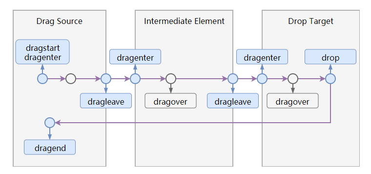
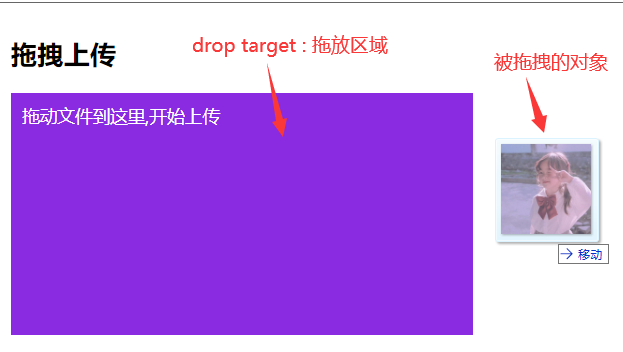
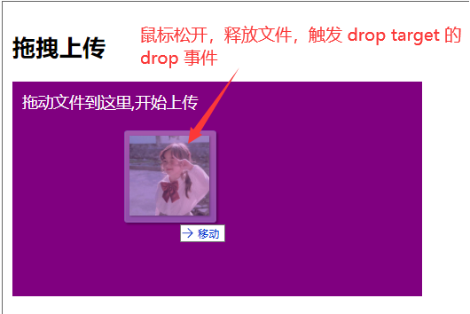
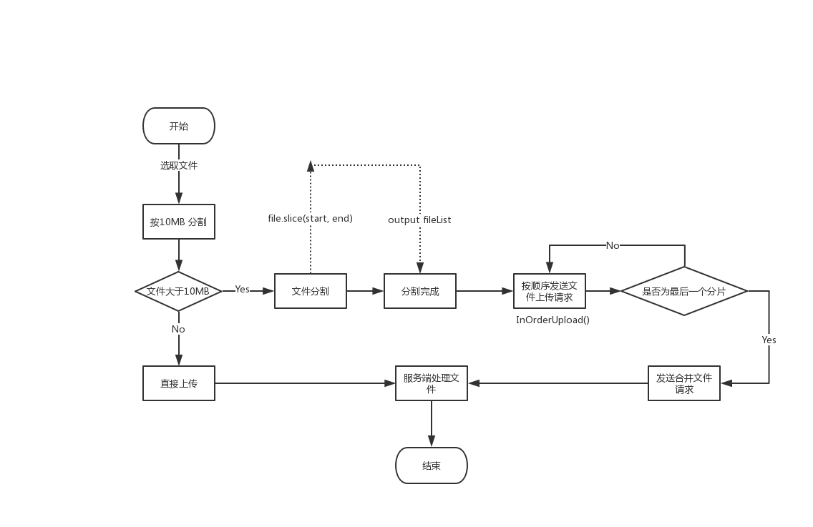

# 有关文件上传与下载

## 上传 

前端进行 **上传** 的方式有很多种，我们会根据不同的需求选择不同方式实现上传的功能，下面是我总结的几种比较常用的上传方式，当然现在的很多组件库已经封装好这些工具方法，我们只需要调用就可以了，但有时候遇上问题又无从下手，还是要从新看一遍源码才行，所以以下都是实现上传比较原生的方式，简单栗子希望大家能够接受。

- 表单上传(包括 iframe、jquery使用)
- formData 上传
- 拖拽上传
- 粘贴上传
- 大文件断点续传

### 表单上传

我们知道如果要用表单上传一个文件，有两点是必须设置的，一是需要把 `form` 标签的 `enctype` 设置为 `multipart/form-data` , 二是 `form` 标签的 `method` 必须为 `post` 方法。那么这个 `enctype` 代表的是什么？ `multipart/form-data` 又是什么意思呢？

`enctype` 属性规定了在发送到服务器之前应该如何对表单数据进行编码，默认情况下这个属性的值是： `application/x-www-form-urlencoded`,也就是对所有字符都会进行编码。而我们设置的 `mutipart/form-data` 就不会对字符编码。


如图：
实际上，请求时表单设置的 `enctype = "multipart/form-data"` 会被识别成请求头(Request Headers)中的 `Content-type: multipart/form-data`，`multipart` 是指互联网上的混合资源，资源可以由多种元素组成，`form-data` 表示可以使用 `HTML Form` 和 `POST` 方法上传文件，而 `boundary` 表示分隔符，当我们要上传多个表单项时，就要使用 `boundary` 分割。


我们来看第一个栗子：这是一个非常原始的上传文件的方式，点击 `submit` 后页面会跳转到表单 `action` 指向的页面，这种方式是需要改进的，否则页面的其他数据就会丢失。

```js
  <form id="form2" method="post" action="http://localhost:8100/upload-form" enctype="multipart/form-data">
    <div>Choose file to upload</div><br />
    如果是多文件上传，input 添加 multiple 属性即可
    单文件：<input type="file" id="f1" name="f1" /><br /><br />
    多文件：<input type="file" id="f1" name="f1" multiple /><br /><br />
    input 必须设置 name 属性，否则数据无法发送<br /><br />
    <button type="submit" id="btn-0">上 传</button>
    <button type="button" class="but2">上传2</button>
  </form>
```
要解决刷新页面的问题，可以采用以下两种方式：

```js
  // 第一种 用 ajaxSubmit 提交数据
  $(function () {
    $(".but2").click(function () {
      $('#form2').ajaxSubmit({
        success: function (responseText) {
          alert('上传成果！')
          console.log(responseText)
        }
      })
    })
  })
  // 第二种
  // 在 form 标签上添加 target 属性，值为 iframe 标签的 name值
  // target 属性规定在何处打开 action URL，默认情况就是 _blank 在新的窗口打开，这里配置的是 iframe 的 name值，会在这个指定的 iframe 框架打开
  <iframe id="temp-iframe" name="temp-iframe" src="" style="display:none;"></iframe>
  <form method="post" target="temp-iframe" action="http://localhost:8100/upload-form" enctype="multipart/form-data">
  <div>Choose file to upload</div><br />
  <input type="file" name="f1" id="f1" multiple /><br /><br />
  <button type="submit" id="btn-0">上 传</button>
  </form>
```

接着介绍一下这次上传的服务端，用的是 **node js** + **fs**  + **koa** 框架写的服务端
```js
/**
 * 服务入口
 */
  var http = require('http');
  var koaStatic = require('koa-static');
  var path = require('path');
  var koaBody = require('koa-body');
  var fs = require('fs');
  var Koa = require('koa2');

  var app = new Koa();
  var port = process.env.PORT || '8100';

  var uploadHost = `http://localhost:${port}/uploads/`;

  app.use(koaBody({
    formidable: {
        //设置文件的默认保存目录，不设置则保存在系统临时目录下  os
        uploadDir: path.resolve(__dirname, '../static/uploads')
    },
    multipart: true // 支持文件上传
  }));

  //开启静态文件访问
  app.use(koaStatic(
    path.resolve(__dirname, '../static')
  ));

  //二次处理文件，修改名称
  app.use((ctx) => {
    if (ctx.path === '/upload-form') {
        var files = ctx.request.files.f1;//得到上传文件的数组
        var result = [];
        if (!Array.isArray(files)) {
            files = [files];
        }
        files && files.forEach(item => {
            console.log(item)
            var path = item.path.replace(/\\/g, '/');
            var fname = item.name;//原文件名称
            var nextPath = path + fname;
            if (item.size > 0 && path) {
                //得到扩展名
                var extArr = fname.split('.');
                var ext = extArr[extArr.length - 1];
                var nextPath = path + '.' + ext;
                //重命名文件
                fs.renameSync(path, nextPath);

                result.push(uploadHost + nextPath.slice(nextPath.lastIndexOf('/') + 1));
            }
        });
        ctx.body = `{
            "fileUrl":${JSON.stringify(result)}
        }`;
    }
  });
  /**
  * http server
  */
  var server = http.createServer(app.callback());
  server.listen(port);
  console.log('demo1 server start ......   ');
```

#### 总结

表单上传文件是比较原始的一种方式，但也是比较基础的，在这个基础上发展了其他更方便的方式实现上传，很多组件库封装的上传组件也是根据这些原理上传文件。


### formData 异步上传

[formData](https://developer.mozilla.org/zh-CN/docs/Web/API/FormData)一开始用于实现表单数据的序列化，能够将表单元素的 `name` 和 `value` 进行组合，减少表单元素的拼接上传；后来结合 `file` 对象用于异步请求上传文件。当我们上传的文件比较大的时候，会出现服务器超时的情况，所以我们一般都会考虑采用异步上传的方式，以下是利用构造 FormData 对象模拟表单上传。

获取文件对象一般通过 `input` 标签就可以拿到，但这个样式不太美观，很多组件库封装的上传组件都有类似的功能拿到 `file` 对象

```js
  function submitUpload() {
      //获得文件列表，注意这里不是数组，而是对象
      const fileList = document.getElementById('f1').files;
      if (!fileList.length) {
        alert('请选择文件');
        return;
      }
      //构造FormData对象
      const fd = new FormData();
      //多文件上传需要遍历添加到 fromdata 对象
      Array.from(fileList).forEach((item, index) => {
        fd.append(`f${index + 1}`, item);
      })
      axios.post('http://localhost:8100/upfile', fd).then((res) => {
        if (res.status === 200) {
          alert('上传成功')
        }
      })
      // 原生使用 xhr
      // const xhr = new XMLHttpRequest();   //创建对象
      // xhr.open('POST', 'http://localhost:8100/upfile', true)
      // //发送时  Content-Type默认就是: multipart/form-data; 
      // xhr.send(fd)
      // xhr.onreadystatechange = function () {
      //     console.log('state change', xhr.readyState);
      //     if (this.readyState == 4 && this.status == 200) {
      //      var obj = JSON.parse(xhr.responseText);   //返回值
      //       console.log(obj);
      //       if (obj.fileUrl.length) {
      //        alert('上传成功');
      //       }
      //     }
      //  }
  }
```

浏览器文件下载会自带进度显示，那我们文件上传也当然有对应的进度提醒，如何获取我们文件上传的进度呢？如果细心阅读过 [axios](https://www.npmjs.com/package/axios#request-config) 官方文档的小伙伴肯定知道,请求配置里有个 `onUploadProgress` 事件，就是这里我们能够实时的监听到文件上传的进度，使用上也很简单：

```js
  const progressSpan = document.getElementById('progress').firstElementChild
  const config = {
    onUploadProgress: progressEvent => {
      const complete = (progressEvent.loaded / progressEvent.total * 100 | 0)
      progressSpan.style.width = complete + '0px'
      progressSpan.innerHTML = complete
      if (complete === 100) {//进度条变色
        progressSpan.classList.add('green');
      }
    }
  }
  axios.post('http://localhost:8100/upfile', fd, config).then((res) => {
    if (res.status === 200) {
      alert('上传成功')
    }
  })

  // 如果想要了解原生的 XMLHttpRequest2 进度条写法,可以参考下面栗子
  const xhr = new XMLHttpRequest();   //创建对象
  xhr.open('POST', 'http://localhost:8100/upfile', true);

  xhr.onreadystatechange = function () {
    if (xhr.readyState == 4) {
      const obj = JSON.parse(xhr.responseText);   //返回值
      if(obj.fileUrl.length){
      //alert('上传成功');
      }
    }
  }

  xhr.upload.onprogress = updateProgress; // 上传进度调用方法实现
  function updateProgress(event) {
    if (event.lengthComputable) {
      const completedPercent = (event.loaded / event.total * 100).toFixed(2);
      progressSpan.style.width = completedPercent + '%';
      progressSpan.innerHTML = completedPercent
      if (completedPercent === 100) {//进度条变色
        progressSpan.classList.add('green');
      }
      console.log('已上传', completedPercent);
    }
  }
  //注意 send 一定要写在最下面，否则 onprogress 只会执行最后一次 也就是100%的时候
  xhr.send(fd);//发送时  Content-Type默认就是: multipart/form-data;
```

#### 总结
如果是一次请求上传多个文件需要显示一个进度条，上面介绍的方法足以实现；如果是大文件分片上传多次请求的话，也是可以做到单进度提示，后面会详细介绍。

### 拖拽上传

拖拽上传的场景我们也会经常遇到，主要是理解原生的拖拽事件，可以简单划分为几个步骤：

- 定义一个允许拖放文件的区域 `div.drop-box` (如果是拖拽其他元素，是要设置 `draggable="true"`，这里上传文件所以不需要)
- 取消有关拖拽事件的默认行为，也就是 `e.preventDefault()`
- 为这个拖放区域添加拖拽样式
- 在 `drop` 事件获取文件信息 `e.dataTransfer.files` 

我们先从从一张图了解一下拖拽事件分别代表的是什么情况：

- drag source: 是我们拖拽的源元素
- intermediate zone: 是拖拽过程可能经过的区域
- drop target: 是最终拖放的目标元素








来看实际栗子：
```js
  // 这个是我们的拖放区域
  const box = document.getElementById('drop-box');

  //设置拖拽事件
  function openDropEvent() {

    box.addEventListener("dragover", function (e) {
      e.preventDefault();
    });

    // 设置进入拖放区域样式
    box.addEventListener("dragenter", function (e) {
      console.log('element dragenter')
      box.classList.add('hilight')
      e.preventDefault()
    })

    // 设置离开拖放区域样式
    box.addEventListener("dragleave", function (e) {
      console.log('elemenet dragleave')
      box.classList.remove('hilight')
      e.preventDefault();
    });

    // 鼠标松开释放文件到拖放区域
    box.addEventListener("drop", function (e) {
      console.log('element drop')
      box.classList.remove('hilight')
      //取消浏览器默认拖拽效果，否则浏览器会默认打开文件
      e.preventDefault();
      //获取拖拽中的文件对象
      const fileList = e.dataTransfer.files;
      //用来获取文件的长度（其实是获得文件数量）
      const len = fileList.length;
      console.log('fielist is array?', Array.isArray(fileList));

      //检测是否是拖拽文件到页面的操作
      if (!len) {
        box.classList.remove('over');
        return;
      }
      // 因为是 FileList 对象 不能直接用 forEach
      // 解决重复添加文件的处理
      let files = window.willUploadFileList || []
      Array.from(fileList).forEach(item => {
        const fileName = item.name
        if (files && !files.find(file => file.name === fileName)) {
          files.push(item)
        }
      })
      const dropBox = document.getElementById('drop-box')
      dropBox.innerHTML = ""
      files.forEach(file => {
      const fileName = file.name
      const divFileName = document.createElement('div')
      divFileName.className = 'file-name'
      divFileName.innerHTML = fileName
      dropBox.appendChild(divFileName)
      })
       window.willUploadFileList = files
  }, false);
}

```

#### 补充

这篇博客有助于我们更好的认识拖拽事件，感兴趣的可以去看看：[https://lotabout.me/2018/HTML-5-Drag-and-Drop/](https://lotabout.me/2018/HTML-5-Drag-and-Drop/)

### 粘贴上传

<!-- 什么是 `DataTransferItemList` 对象？ -->
<!--  -->

核心是监听 `paste` 事件和获取粘贴板数据
```js
  // 粘贴上传
  const editorBox = document.getElementById('editor-box');

  // 监听粘贴事件
  editorBox.addEventListener('paste', (event) => {
    // IE浏览器只支持 windown.clipboardData获取粘贴板数据
    const data = (event.clipboardData || window.clipboardData);
    const { items } = data
    const fileList = [];//存储文件数据
    if (items && items.length) {
      // 检索剪切板items
      Array.from(items).forEach(item => {
        fileList.push(item.getAsFile())
      })
    }
    window.willUploadFileList = fileList;
    event.preventDefault();
    submitPasteUpload();
  });

  function submitPasteUpload() {

    const fileList = window.willUploadFileList || [];

    if (!fileList.length) {
      alert('请选择文件');
      return;
    }

    const fd = new FormData();   //构造FormData对象
    Array.from(fileList).forEach((item, index) => {
      fd.append(`f${index}`, item);//支持多文件上传
    })

    axios.post('http://localhost:8100/upfile', fd).then((res) => {
      if (res.status === 200) {
        if (res.data.fileUrl.length) {
          const img = document.createElement('img')
          img.src = res.data.fileUrl[0]
          img.style.width = '100px'
          insertNodeToEditor(editorBox, img)
          console.log('上传成功')
          }
        }
      })
    }

  //光标处插入 dom 节点
  function insertNodeToEditor(editor, ele) {
    //插入dom 节点
    let range;//记录光标位置对象
    const node = window.getSelection().anchorNode;
    // 这里判断是做是否有光标判断，因为弹出框默认是没有的
    if (node != null) {
      range = window.getSelection().getRangeAt(0);// 获取光标起始位置
      range.insertNode(ele);// 在光标位置插入该对象
    } else {
      editor.append(ele);
    }
  }
```

#### 总结

粘贴上传的场景比较少，所以实际测试的栗子也不多，这里还存在两个问题，暂时没想到怎么解决：一是粘贴多个文件只能成功复制最后一个文件，也就是只有最后一个文件成功上传；二是 `windows` 系统不支持磁盘复制文件上传， `mac`系统是支持的


### 大文件断点续传

上传的文件太大怎么处理呢？我们可以考虑将文件分片上传。

**思路** 是这样的： 选择上传一个 60+MB 的大文件，按每 10MB 进行分片，发送到服务器时携带一个标志(这里用的是时间戳，具体可以与后端协调)，服务端生成临时文件，在最后一个分片上传完成后，客户端发送一个上传结束请求合并文件的请求，服务端将所有文件分片按照标志合并成一个文件，最后清理临时文件



```js
  let file
  function submitUpload() {
    const chunkSize = 20 * 1024 * 1000 // 分片大小，可设置为 10 20 100
    file = document.getElementById('f1').files[0] // 获取文件对象
    if (!file) {
      alert('请选择上传文件')
      return;
    }
    const chunks = Math.ceil(file.size / chunkSize) // 计算这个文件可以切成几块
    const fileChunks = [] // 文件分片后组成一个数组
    const token = (+ new Date()) // 文件唯一标识，用于最后合并文件

    // File 对象继承了 Blob 的属性方法，而 Blob 它表示原始数据,也就是二进制数据
    // 提供了对数据截取的方法 slice，所以可以直接使用此方法对文件进行分段
    if (file.size > chunkSize) { // 判断文件大小是否大于 约定分片的大小
      const start = 0            // 开始分片
      const end = 0
      while (true) {
        end += chunkSize
        const blob = file.slice(start, end)
        start += chunkSize
        if (!blob.size) {
            break //拆分结束
        }
        fileChunks.push(blob)
      }
    } else {
        fileChunks.push(file.slice(0))
      }
```
文件对象：


文件分片结果：


 
接着我们来看如何处理上传的逻辑：

```js
    const progressSpan = document.getElementById('progress').firstElementChild // 简单配一下进度条
    progressSpan.style.width = '0'
    progressSpan.classList.remove('green')

    let i = 0
    // 按顺序上传
    const upLoadInOrder = async () => {
        const fd = new FormData()   //构造FormData对象
        fd.append('token', token) // 与后端协调分片需要传送过去的参数，一般是文件的标识id，分片长度，分片的序号、所占长度等等
        fd.append('f1', fileChunks[i])
        fd.append('index', i)
        if (i === fileChunks.length) {
          console.log('上传完成，发送合并请求')
          const formD = new FormData()
          formD.append('type', 'merge')
          formD.append('token', token)
          formD.append('chunks', fileChunks.length)
          formD.append('filename', file.name)
          axios.post('http://localhost:8100/upfile', formD).then((res) => {
              if (res.status === 200) {
                  console.log(res)
                  alert('上传完成！')
              }
          })
        } else if (i < chunks) {
            const config = {
              onUploadProgress: progressEvent => {
                const complete = (progressEvent.loaded / progressEvent.total * 100 | 0)
                progressSpan.style.width = complete + '%'
                progressSpan.innerHTML = complete
                if (complete === 100) { // 进度条变色
                  progressSpan.classList.add('green')
                }
              },
              // 不是必须的 可以在这里告知服务端我上传的片段信息
              headers: { 'Content-Range': `bytes ${i * chunkSize}-/${fileChunks[i].size + i * chunkSize}` }
            }
            const res = await axios.post('http://localhost:8100/upfile', fd, config)
            console.log(res)
            if (res.status === 200) {
                progressSpan.style.width = '0'
                progressSpan.classList.remove('green')
                i++
                upLoadInOrder()
            }
            }
        }
    upLoadInOrder()
    //绑定提交事件
    document.getElementById('btn-submit').addEventListener('click', submitUpload);
```

这就是一个简单的文件分片上传的过程，但往往实际情况不会那么完美，如果上传分片的过程中网络中断，那之前上传的分片就会丢失，我们是不希望这种情况发生的，最好就是能够在上一次中断的地方继续上传文件，于是就有了断点续传这个概念。

什么是断点续传呢？简单来讲就是上传文件过程出现线路中断，客户端再次上传时，能根据服务端返回的信息在中断的地方继续文件的上传，能够节省上传时间也提高了效率。


判断文件中断上传的位置这里用的是 `localStorage` 保存上传分片成功的信息，在项目中，这个信息一般是由后端提供，前端只需要调用一个查询缓存的接口，获取当前文件在服务器上的缓存信息，返回已缓存文件的标识和大小，这个大小就是用来决定我们从文件哪里进行续传

```js
const saveChunkKey = 'chunkUploaded'


    //思路概括
    //把大文件分成每10M 一块进行上传，发送到服务器同时携带一个标志 暂时用当前的时间戳 ，
    //服务端生成临时文件，服务端接受一个文件结束的标志 ，然后将所有的文件进行合并成一个文件，清理临时文件。 返回结果（看情况）
    function submitUpload() {
        debugger
        const chunkSize = 10 * 1000 * 1024;//2m

        const file = document.getElementById('f1').files[0];
        const chunks = Math.ceil(file.size / chunkSize) // 计算这个文件可以切成几块
        console.log(`总共${chunks}个分片`)
        const token = (+ new Date()) // 文件唯一标识，用于最后合并文件
        const fileChunks = []

        const progressSpan = document.getElementById('progress').firstElementChild // 简单配一下进度条
        progressSpan.style.width = '0'
        progressSpan.classList.remove('green')

        if (!file) {
            alert('请选择文件')
            return
        }

        //拆分文件
        if (file.size > chunkSize) {
            //拆分文件
            var start = 0, end = 0;
            while (true) {
                end += chunkSize;
                var blob = file.slice(start, end);
                console.log()
                start += chunkSize;

                if (!blob.size) {
                    //拆分结束
                    break;
                }

                fileChunks.push(blob);
            }
        } else {
            fileChunks.push(file.slice(0));
        }

        const uploadedInfo = getUploadedFromStorage()
        console.log(uploadedInfo);

        let i = 0
        const upLoadInOrder = async () => {
            // const uploadedIndex = uploadedInfo.findIndex(up => up === true)
            if (uploadedInfo[i]) {
                // 说明有分片缓存
                i++
                upLoadInOrder()
                return
            }
            const fd = new FormData()   //构造FormData对象
            fd.append('token', token) // 与后端协调分片需要传送过去的参数，一般是文件的标识id，分片长度，分片的序号、所占长度等等
            fd.append('f1', fileChunks[i])
            fd.append('index', i)
            if (i === chunks) {
                console.log('上传完成，发送合并请求')
                const formD = new FormData()
                formD.append('type', 'merge')
                formD.append('token', token)
                formD.append('chunkCount', chunks.length)
                formD.append('filename', file.name)
                axios.post('http://localhost:8100/upfile', formD).then((res) => {
                    if (res.status === 200) {
                        console.log(res)
                        alert('上传完成！')
                    }
                })
            } else if (i < chunks) {
                const config = {
                    onUploadProgress: progressEvent => {
                        const complete = (progressEvent.loaded / progressEvent.total * 100 | 0)
                        progressSpan.style.width = complete + '%'
                        progressSpan.innerHTML = complete
                        if (complete === 100) { // 进度条变色
                            progressSpan.classList.add('green')
                        }
                    }
                }
                const res = await axios.post('http://localhost:8100/upfile', fd, config)
                console.log(res)
                if (res.status === 200) {
                    console.log('sendChunkCount', i)
                    setUploadedToStorage(i)
                    i++
                    upLoadInOrder()
                }
            }
        }
        upLoadInOrder()
    }
        //获得本地缓存的数据
    function getUploadedFromStorage() {
        return JSON.parse(localStorage.getItem(saveChunkKey) || "{}")
    }

    //写入缓存
    function setUploadedToStorage(index) {
        const uploaded = getUploadedFromStorage()
        uploaded[index] = true
        localStorage.setItem(saveChunkKey, JSON.stringify(uploaded))
    }
```

#### 补充：

当我们进行断点续传时，一般会在**请求头**添加 [Range](https://developer.mozilla.org/zh-CN/docs/Web/HTTP/Headers/Range) 如 `Range: byte=2000-4000`,告诉服务端我们要获取 2000byte 到 4000byte 的文件块数据；
而服务端在返回的**响应头**就会携带一个 [Content-Range](https://developer.mozilla.org/zh-CN/docs/Web/HTTP/Headers/Content-Range) 如 `Content-Range: 2000-4000/67589`, 显示的是一个数据片段在整个文件中的位置

#### 问题：

如果我们想要分片上传我们的大文件但又只想以一个进度条显示，请问要如何处理呢？有没有小伙伴想到？给一个提示 `onUploadProgress` 还是在这个地方处理

#### 答案：

想要获取上传进度，还是要回到 `onUploadProgress` 这个 api 上获取进度

#### 总结： 

断点续传的核心是对文件的分割和中断位置的获取


## 下载
后端一般提供一个 `URL`，前端根据需求不同，实现客户端的保存下载。根据这个`URL`，前端处理下载的方式还可以细分几种，比较常用的有以下几种：

- a 标签下载
- iframe 标签下载
- location.href 下载
- FileSaver 下载

### a标签下载

#### 步骤

- 拿到文件url
- 创建 `a` 标签，并添加 `download` 属性
- 点击即可下载
```js
function downloadByA(url) { // 后端提供的文件 url
  const alink = document.createElement('a')
  alink.href = url
  alink.download = '' // 设置文件名
  alink.cick()
}
```

虽然只有区区几段代码，但里面学习的东西还是有很多，如这个h5的新属性 [download](https://developer.mozilla.org/zh-CN/docs/Web/HTML/Element/a) , 能够解决如图片、文本文档、pdf等浏览器自动在线预览而不能下载的问题。但它并没有想象中那么神通广大，遇上跨域的 url,它就失效了。

那么如何解决跨域中 `download` 失效的问题呢？官网给我们指明了方向：使用 `blob:URL` 和 `data:URL`。其实a标签的`href`还可以接受除了相对和绝对路径之外的其他形式Url，也就是下面我们说到的 `blob: URL` 和 `data: URL`，或许大家对这两个 URL 有点陌生，我们一步步学习它们

<!-- 也许有的小伙伴还没有见过这两个东西，我也是初次了解，理解不对的话还麻烦大家指出

现在一步步认识它们： -->

#### API解析

*首先*，认识一下这个 **blob:URL**，blob:URL 是由浏览器内部通过 [URL.createObjectURL()](https://developer.mozilla.org/zh-CN/docs/Web/API/URL/createObjectURL) 生成

```js
objectUrl = URL.createObjectURL(object) // 这里的 object 参数只能是 File 或 Blob 对象
```

官网的解释是说 `URL.createObjectURL()` 静态方法会创建一个 `DOMString`，其中包含一个表示参数中给出对象的 URL。我理解是这个 URL 指向的就是我们提供的 File 或 Blob 对象的资源。这个 URL 是有生命周期的，它和创建它的窗口中的 document 绑定。所以，需要注意在每次调用 createObjectURL() 方法后，当我们不再需要这些 URL 对象时，必须通过调用 URL.revokeObjectURL() 方法来释放这些对象.

而 **[data:URL](https://developer.mozilla.org/zh-CN/docs/Web/HTTP/data_URIs)** 是一个包含内容编码的 URL , 可由 [fileReader.readAsDataURL(blob / file)](https://developer.mozilla.org/zh-CN/docs/Web/API/FileReader) 获得。它由四个部分组成：前缀(data:)、指示数据类型的MIME类型、可选的base64标记、数据本身(如果是文本类型直接嵌入，如果是二进制数据则进行base64编码后嵌入)。

```js
data:[<mediatype>][;base64],<data>

// 图片类型的 data:URL 可以通过 canvas.toDataURL("image/" + mime) 获得

// 简单的 text/plain 类型数据
data:,Hello%2C%20World!
或 base64 编码后版本：data:text/plain;base64,SGVsbG8sIFdvcmxkIQ%3D%3D

// 一个HTML文档源代码 <h1>Hello, World</h1>
data:text/html,%3Ch1%3EHello%2C%20World!%3C%2Fh1%3E

```

⚠需要注意的是，blob:URL 是允许Blob对象用作图像，下载二进制数据链接等的URL源，但它只能在应用内部使用，是一种**伪协议URL**, URL的生命周期和创建它的窗口中的document绑定。data:URL是**前缀为 data: 协议的URL**，可以在浏览器上随意使用(blob:URL只是对浏览器存储在内存中或者磁盘上的Blob的一个简单引用)。

<!-- 介绍完这两种 url, 下面我们来看看实际是怎么运用起来的，一般情况下，图片能够使用 data:URL 进行下载，就不需要再转换成 blob:URL 再下载；但是其他文件类型就必须通过 blob:URL 进行下载 -->

举个栗子：下载一张来自网上的图片
```js
// 图片来自网上一张可爱的小柯基 http://img.mp.itc.cn/upload/20170605/9dea8e0dd718472aa913dae6a1e2b94b_th.jpg

function downloadImg() {
  const url = 'http://img.mp.itc.cn/upload/20170605/9dea8e0dd718472aa913dae6a1e2b94b_th.jpg'
  const image = new Image()
  // CORS 策略，会存在跨域问题https://stackoverflow.com/questions/20424279/canvas-todataurl-securityerror
  image.setAttribute("crossOrigin", 'Anonymous')
  image.src = url
  image.onload = async function () {
    // 获得 data:URL
    const imageDataUrl = imageUrlToBase64(image)
    const downloadUrlDom = document.createElement('a')
    downloadUrlDom.setAttribute('href', imageDataUrl)
    // // 第二种方式 即将数据转为Blob，再将Blob生成BlobURL，使用a标签下载
    // // 在第一种方式基础上获得 blob:URL
    // const imageBlobData = dataUrlToBlob(imageDataUrl)
    // console.log(imageBlobData);
    // const imageBlobUrl = URL.createObjectURL(imageBlobData)
    // downloadUrlDom.setAttribute('href', imageBlobUrl)
    // 设置文件名，不一定要写死
    downloadUrlDom.setAttribute('download', 'cuteDog')
    // 兼容性判断
    if ('download' in document.createElement('a')) {
    // 非IE下载
    downloadUrlDom.click()
    } else {
    // IE10+下载 需要用第二种方式获取到 blob:URL
    navigator.msSaveBlob(imageBlobUrl, filename)
    }
}

// 将图片url转换成 base64
// 原理： 利用canvas.toDataURL的API转化成 data:URL
function imageUrlToBase64(img) {  
  const canvas = document.createElement("canvas");  
  canvas.width = img.width;  
  canvas.height = img.height;  
  // 返回一个 CanvasRenderingContext2D 对象，使用它可以绘制到 Canvas 元素中
  const ctx = canvas.getContext("2d");  
  ctx.drawImage(img, 0, 0, img.width, img.height); // 向画布上面绘制图片
  const mime = img.src.substring(img.src.lastIndexOf(".")+1).toLowerCase(); // 获取图片的具体类型
  const dataUrl = canvas.toDataURL("image/" + mime); // 最后利用返回一个包含图片展示的 data URI 
  return dataUrl;
}

// data:URL 转 Blob数据
// 其实就是利用 data:URL 最后一部分的编码数据进行转换
function dataUrlToBlob(dataUrl) {
  var arr = dataUrl.split(','),
      mime = arr[0].match(/:(.*?);/)[1],
      bStr = atob(arr[1]),
      n = bStr.length,
      unit8Array = new Uint8Array(n);
  while (n--) {
    // 以对象的方式或使用数组下标索引的方式引用数组中的元素
    unit8Array[n] = bStr.charCodeAt(n); //返回指定位置的字符的 Unicode 编码
  }
  return new Blob([unit8Array], { type: mime });
} 

```

再举一个栗子，我们下载一个 pdf 文件(为什么选择 pdf 呢？因为这也是浏览器能够在线预览的文件类型之一，而 zip、docx、xslx等都能够直接通过 a 标签下载不会出现自动打开的问题。)

```js
// 如果后端返回的数据是一个banse64编码的文件，前端就需要进行一下转换
// 或者在请求头上添加 responseType: 'blob', 这样处理起来会简单很多
// 下面还是以 base64 格式文件进行处理
downloadPDF() {
  // 将 base64 转换成 blob
  // 后端能直接处理成 blob 就能省略这些了
  const base64ToBlob = (dataUrl) => {
    console.log(dataUrl)
    const arr = dataUrl.split(',')
    const mime = arr[0].match(/:(.*?);/)[1]
    // 经过 base-64 编码的字符串进行解码
    const bStr = atob(arr[1])
    let n = bStr.length
    const unit8Array = new Uint8Array(n)
    while (n--) {
      // 以对象的方式或使用数组下标索引的方式引用数组中的元素
      unit8Array[n] = bStr.charCodeAt(n) //返回指定位置的字符的 Unicode 编码
    }
    return new Blob([unit8Array], { type: mime })
  }
  const alink = document.createElement('a')
  // 这里请求一个本地的 pdf 文件，用的 koa 框架写的一些简单服务，返回的 res.data 是一个进行 base64 编码的文件
  axios.post('http://localhost:8100/downloads/JavaScript.pdf', {
    headers: { 'Content-Type': 'application/pdf' }
  }).then(res => {
    const dataUrl = `data:application/pdf;base64,${res.data}`
    const blob = base64ToBlob(dataUrl)
    // 如果 res 是一个 blob 数据，直接跳到这一步即可
    // 直接获取一个 blob:URL 进行下载操作
    alink.setAttribute('href', URL.createObjectURL(blob))
    alink.setAttribute('download', 'JavaScript')
    alink.click()
    URL.revokeObjectURL(res.data)
  })
}
```
#### 总结

a标签下载的方式还是很通用的，如果出现在线打开的问题，可以采用转换 URL 的方式实现保存下载；而如果需要我们自定义下载进度，可以再考虑通过 `axios` 请求获取进度， 再配合 data:URL 或 blob:URL 下载。但缺点是它不兼容 IE 浏览器，后面我们会讲解如何在 IE 上保存下载。


#### 补充资料：

[canvas.toDataURL](https://developer.mozilla.org/zh-CN/docs/Web/API/HTMLCanvasElement/toDataURL)

[atob](https://developer.mozilla.org/zh-CN/docs/Web/API/WindowBase64/atob)

[Uint8Array](https://developer.mozilla.org/zh-CN/docs/Web/JavaScript/Reference/Global_Objects/Uint8Array)

[charCodeAt](https://developer.mozilla.org/zh-CN/docs/Web/JavaScript/Reference/Global_Objects/String/charCodeAt)

[msSaveBlob](https://developer.mozilla.org/en-US/docs/Web/API/Navigator/msSaveBlob)

### location.href下载

location.href 这种下载方式基本不使用，语法很简单，但灵活性比较差

```js
location.href = '../downloads/cutegirl.jpg'
```
它的缺点是最明显的，浏览器支持在线预览的图片、文本文档、pdf文件都会在线打开不会提示下载，不能像 `a` 标签的 `href` 那样接受其他形式的 `URL`, 所以现在都比较少用到这种方式处理下载

### iframe下载

`iframe` 使用相信很多小伙伴都有用过，我们在处理在线预览 `pdf` 或者嵌入其他框架时会用到。除此之外，其实它还可以用作文件的下载，使用上与 `a` 标签有点相似，都是通过创建一个标签后进行下载。它的优点是能够实现无刷新下载，体验感较好。但它的缺点也是明显的，我们没办法预测到文件什么时候启动下载或完成下载，添加到页面 `body`上的 `iframe` 标签也无法监听删除。

小栗子：
```js
  // 无闪现下载excel
  function handleDownIframe() {
    // 缺点是无法监听下载进度，无法剔除 iframe 标签
    // 如果文件类型是 图片、文本文档类型也不能出现保存下载
    const iframe = document.createElement('iframe')
    iframe.style.display = 'none'
    iframe.src = '../downloads/helpFile.docx'
    document.body.appendChild(iframe)
  }
```
#### 总结

iframe 下载和 location.href 的缺点都是不能保存下载浏览器支持预览的文件，也不能通过转换 URL 来处理，同时 iframe 不像 a 标签可以通过点击事件触发下载，它必须添加到页面才能触发下载，我们无法确定什么时候可以去掉这个 iframe 标签。值得学习的是， iframe 能支持多次点击下载，文件下载互不影响；而 a 标签是需要等待服务器响应才能进行下载操作，如果多次点击下载，结果只有最后一个文件是真正下载成功的

### FileSaver 下载

如果后端返回的是以文件流的格式，前端只需在请求头设置一个 `responseType = 'blob'`，再通过上面所讲的方法进行下载即可，那这里为什么还要另外开一个内容呢？其实是除了 `a` 标签外，还有一些兼容性更好的方式进行下载，接下来介绍一下 [FileSaver](https://github.com/eligrey/FileSaver.js) 这个常用库。

首先，为什么需要用到这个库？上面讲到 `a` 标签下载会有个浏览器兼容的问题，下面这个是 `a` 标签的 download 属性的兼容性截图，可以看到这里的 **IE** 是不支持的，而我们无法保证用户在使用过程是用的哪类浏览器，所以需要一个更好的方式避免出现因兼容问题而不能下载文件的现象。而 **FileSaver** 就是能够在不使用 `a` 标签的情况下或者没有原生支持 `saveAs()` 的浏览器上实现客户端保存文件以及在线生成文件保存的需求。

#### a 标签各属性


接着我们来看看 **FileSaver** 支持的浏览器以及能够支持的文件数据大小是多少


可以看到，**FileSaver** 能够兼容大部分的浏览器，而且支持保存的文件大小也能满足一般的业务需求，如果处理的是 **IE** 浏览器，我们还可以用到 [navigator.msSaveBlob()](https://developer.mozilla.org/en-US/docs/Web/API/Navigator/msSaveBlob) 这个方法。来看看 **FileSaver** 的运用

```js
  // 采用 cdn 引入
  <script src="https://cdn.bootcss.com/FileSaver.js/2014-11-29/FileSaver.min.js"></script>

  // FileSaver 下载图片文件
  const image = new Image();
  image.setAttribute("crossOrigin", 'Anonymous');
  image.src = 'http://img.mp.itc.cn/upload/20170605/9dea8e0dd718472aa913dae6a1e2b94b_th.jpg'
  image.onload = function () {
    // 继续沿用这几个数据转换的方法
    const imageDataUrl = imageUrlToBase64(image);
    const imageBlobData = dataUrlToBlob(imageDataUrl);
    const downloadImageDom = document.getElementById('download-image');
    downloadImageDom.addEventListener('click', () => {
      saveAs(imageBlobData);
    });
  }

  // FileSaver 下载在线生成的文本文件
  const txtDownloadDom = document.getElementById('download-txt');
  txtDownloadDom.addEventListener('click', () => {
    const textarea = document.getElementById('textarea');
    const filename = generateFilename('textareaName', '.txt');
    const textBlob = new Blob([textarea.value], { type: "text/plain;charset=utf-8" });
    saveAs(textBlob, filename)
  });

```

上面都是比较简单的直接调用 **api** 实现下载的需求，但除了上面的简单的使用外，FileSaver 其实还有一个更强大的功能，那就是将在线生成的文档下载下来。
这个场景还是比较常见的，我们会遇到类似需要在线填写表格，并保存成excel格式下载下来，也就是常常说的**报表下载**。一般配合使用就是 [js-xlsx](https://github.com/SheetJS/sheetjs)

我们再来看看在线生成 `excel` 并保存下载的 栗子:
```js
  // 同样采用 cdn 引入
  <script src="https://cdn.bootcss.com/xlsx/0.14.1/xlsx.full.min.js"></script>

  // 下载excel文件
  const excelDownloadDom = document.getElementById('download-excel');
  excelDownloadDom.addEventListener('click', () => {
    // 注意：XLSX.uitls.table_to_book( 放入的是table 的DOM 节点 )
    // sheetjs.xlsx 即为导出表格的名字，可修改
    // 创建一个工作簿对象
    const wb = XLSX.utils.table_to_book(document.querySelector('#table-excel'));
    const wopts = { bookType: 'xlsx', bookSST: true, type: 'array' } // 输出配置
    const wbout = XLSX.write(wb, wopts ); // 输出
    try {
      saveAs(new Blob([wbout], { type: 'application/octet-stream' }), 'table-excel.xlsx');
    } catch (e) {
      if (typeof console !== 'undefined') console.log(e, wbout)
    }
  });

```
**workbook**：


`table_to_book` 是官方提供给我们的工具函数，能够将我们提供的数据转换成一个 `workbook` 对象，如上面的栗子，我们将一个 `table-dom`上的数据转换成了一个 `workbook` 对象，通过打印信息可以看到，SheetNames里面保存了所有的sheet名字，然后Sheets则保存了每个sheet的具体内容（我们称之为Sheet Object）。每一个sheet是通过类似A1这样的键值保存每个单元格的内容，我们称之为单元格对象（Cell Object）

`XLSX.wirte` 就是将我们的 `workbook` 对象按照指定的文件类型输出

想要继续研究这个 `js-xlsx` 库的的使用，小伙伴可以看看这几篇博客：

[https://www.cnblogs.com/liuxianan/p/js-excel.html](https://www.cnblogs.com/liuxianan/p/js-excel.html)

[https://blog.csdn.net/tian_i/article/details/84327329](https://blog.csdn.net/tian_i/article/details/84327329)

如果需要研究 docx 文档保存的小伙伴，还可以看看这个：

[https://www.cnblogs.com/liuxianan/p/js-excel.html](https://www.cnblogs.com/liuxianan/p/js-excel.html)


<!-- ### node端下载

```js
  //  客户端 node 下载
  const excelDownloadNodeDom = document.getElementById('download-excel-node')
  excelDownloadNodeDom.addEventListener('click', () => {
    download('/download/fsExcel')
  })

  // 服务端 用的是 koa 框架
  app.use(async function (ctx, next) {
    const root = path.resolve(__dirname, '../static')
    const fpath = path.join(root, ctx.path);
    const { path } = ctx
    const data = [
        [1, 2, 3],
        [true, false, null, 'sheetjs'],
        ['foo', 'bar', new Date('2014-02-19T14:30Z'), '0.3'],
        ['baz', null, 'qux'],
    ];
    const buffer = xlsx.build([{ name: 'mySheetName', data }]);
    // Write file to the response
    const tmpExcel = `filename.xlsx`;
    fs.writeFileSync(
        tmpExcel,
        buffer,
        {
            encoding: 'utf8',
        },
        err => {
            if (err) throw new Error(err);
        },
    );
    ctx.set('Content-disposition', `attachment; filename="${tmpExcel}"`);
    ctx.set('Content-Type', 'application/octet-stream');
    ctx.body = fs.createReadStream(tmpExcel)
    // delete file after sending to client
    fs.unlinkSync(tmpExcel);
})

``` -->