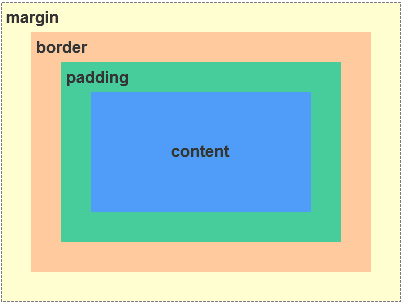
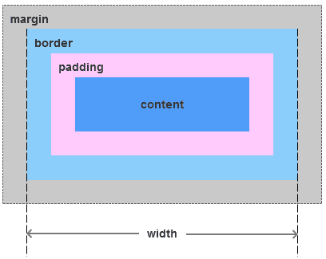
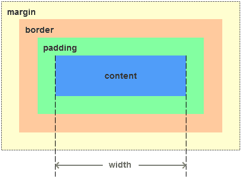
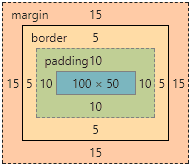
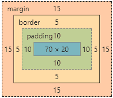
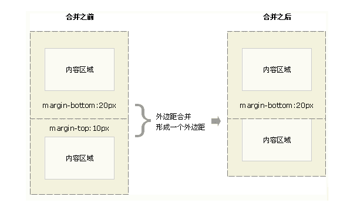

# CSS

## 盒子模型

CSS 中的盒子模型包括 **IE 盒子模型**和**标准的 W3C 盒子模型**

### 盒模型 又称为框模型(Box Model)

包括：

- 元素内容(content)
- 内边距(padding)
- 边框(border)
- 外边距(margin)



### 两种模型的区别(width 的计算范围)

- 标准模型中：盒子 **width = 左右 border + 左右 padding + content**



- IE 模型中：盒子 **width = content**



### 如何获取两种模型的宽和高

**设置盒子为哪一类模型：**

通过 css3 新增的属性 `box-sizing: content-box | border-box`分别设置盒模型为标准模型(content-box)和 IE 模型(border-box)

```
.content-box {
  box-sizing: content-box;
  width: 100px;
  height: 50px;
  padding: 10px;
  border: 5px solid red;
  margin: 15px;
}
```

`·content-box` 设置为标准模型，它的元素宽度 width = 100px



```
.border-box {
  box-sizing: border-box;
  width: 100px;
  height: 50px;
  padding: 10px;
  border: 5px solid red;
  margin: 15px;
}
```

`.border-box` 设置为 IE 模型，它的元素宽度 width = content + 2 padding + 2 border = 70px + 2px + 5px = 100px



**获取宽高的方式：**

- dom.style.width/height 只能获取到*行内样式*的宽和高，style 和 link 的不行

- window.getComputedStyle(dom).width/height 获取最终渲染后的宽和高，IE9 以上支持

- dom.getBoundingClientRect().width/height 获取最终渲染后的宽和高，IE9 以上支持，并且能获取到相对视窗的上下左右距离

### 外边距重叠

场景：两个垂直外边距相遇，将会形成一个外边距，合并后的外边距高度等于`(外边距1,外边距2).max`

注意：只有在普通文档流中**块框**的垂直外边距才会发生合并，行内框、浮动框或绝对定位之间的外边距不会发生合并



### BFC

**BFC**(Block Formatting Context) 块级格式化上下文：

BFC 决定了元素如何对其内容进行定位，以及和其他元素的关系、相互作用；当设计到可视化布局时，BFC 提供了一个环境，HTML 元素在这个环境中按照一定规则进行布局。一个环境中的元素不会影响其他环境中的布局

**BFC 原理(渲染规则)**

1、BFC 元素垂直方向的边距会发生重叠，属于不同 BFC 外边距不会发生重叠

2、BFC 区域不会与浮动元素的布局重叠

3、BFC 元素是一个独立的容器，外面的元素不会影响里面的元素，里面的元素也不会影响外面的元素

4、计算 BFC 高度时，浮动元素也会参与计算(清除浮动)

### 一个元素的高度由哪些属性影响

自身的值
继承的值

### transition

盒子模型需要满足 block 属性才可以生效

```css
.box {
  /* display: block */
  display: inline-block;
}
```

- [“更多|收起”交互中渐进使用 transition 动画](https://www.zhangxinxu.com/wordpress/2012/10/more-display-show-hide-tranisition/) —— 张鑫旭大大的折叠收起

### box-sizing 属性用来定义 user agent 如何计算元素的总宽度和总高度

- content-box，即是默认值。如果你设置一个元素的`width`为 100px，那么这个元素的内容会有 100px 宽，并且任何`border`和`padding`都会被增加到最后绘制出来的元素宽度中。
- border-box：告诉浏览器，你想要设置的`border`和`padding`的值是包含在`width`内。内容区实际的宽度是`content= width -(padding + border)`。

注意的是 `border-box` 是不包括 `margin`的。
一般情况下，我们会在全局设置 `box-sizing` 值为 `border-box`；这样在处理元素大小的时候方便得多，也避免了在布局内容时可能遇到的坑。

### 统一字体

采用 CSS3 的 @font-face 属性解决。
一般情况下电脑系统上的字体能够满足我们的基本需求，但往往还是会出现例外：客户电脑不支持我们整个网页设计的标准字体，这时最好的办法是在线下载，生成支持我们设定的字体。CSS3 的 @font-face 就能帮助我们利用服务器端字体，达到支持设定字体的需求：（此处用区别较大的字体显示是否成功在线加载）

```css
@font-face: {
  font-family: 'custom-font',
  src: local('custom-font') url('xxxx/xxx.tff')
}
body {
  font-family: 'custom-font'
}
```

@font-face 中的 font-family 相当于一个声明的效果，这里指定的字体是将会被用于 font 或 font-family 属性中，也就是说，当我们需要自定义一个字体时，是需要在这里声明一次，才能继续在 body 里的 fong-family 使用， 否则它还是一个系统找不到的字体。

### html css 文字过多用省略号代替，当鼠标 hover 时显示全部的文字

方案一：默认使用省略号，再加上 title 属性显示完全
缺点：反应不够灵敏

```css
.dgp-widget-right-sidebar .project-query-content .result-list .item .header {
  white-space: nowrap;
  text-overflow: ellipsis;
  overflow: hidden;
}
```

方案二：满足要求

```css
.dgp-widget-right-sidebar .project-query-content .result-list .item .header {
  white-space: nowrap;
  text-overflow: ellipsis;
  overflow: hidden;
}
.dgp-widget-right-sidebar
  .project-query-content
  .result-list
  .item
  .header:hover {
  text-overflow: inherit;
  overflow: visible;
  white-space: pre-line;
}
```

### 弹性布局
