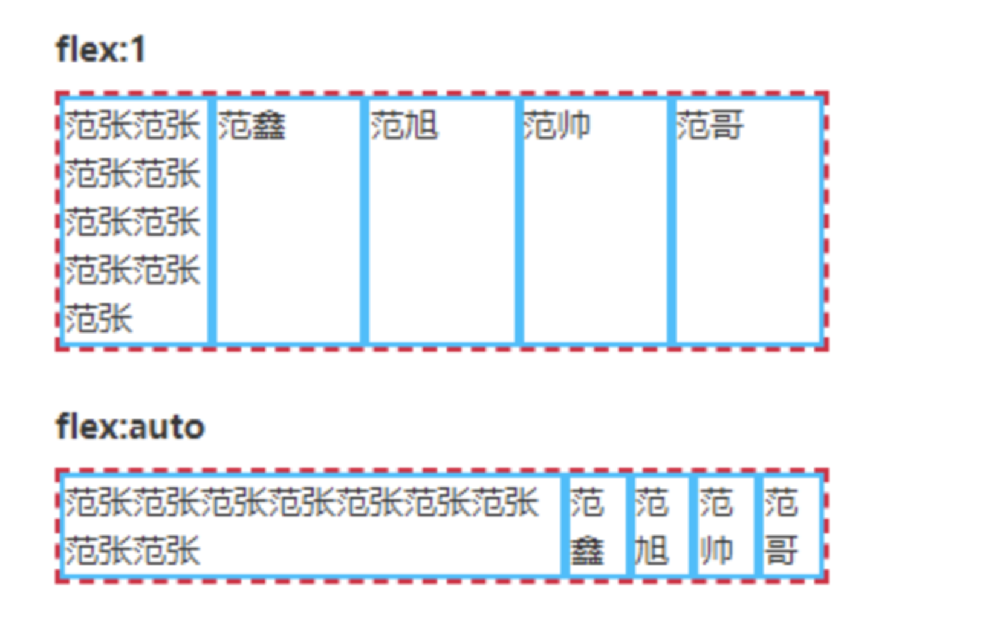

# 常见问题 1

## js

### 说一下 js 的基本数据类型有哪些？

基本类型：Undefined、Null、String、Number、Boolean、BigInt、Symbol (七种原始类型)

引用类型：Object

类型转换：

<!--  -->


### 判断类型的方法有哪些？

typeof()，instanceof，Object.prototype.toString.call()

### 判断是不是字符串数字？

```js
function testStringNum(str) {
  return !Number.isNaN(+str);
}
// 方法
Object.prototype.toString.call();
```

### [1,2,3].map(parseInt) 返回什么？

前提知识：

parseInt(value, radix) 接收两个参数：

- 第一个为数值或数值字符串，可以看作是字符串"abcd"
- 第二个为基数，必须为 2 ～ 36，如果不填或为 0 则默认为 10

如何计算 parseInt("abcd", e) ? **关键是从小于 e 的那一位开始计算**

当 e 属于 2~36 时，比较 abcd 每位与 e 的大小关系：

- a、b、c、d 都小于 e => 如 parseInt("1024", 5) = 4X5^0+2X5^1+0X5^2+1X5^3 = 139
- 其中一个如 c 大于 e => 如 parseInt("1031", 2) = 0X2^0+1X2^1 = 2
- 都大于或等于 e => 如 parseInt("8", 5) = NaN 、parseInt("5", 5) = NaN

回到 [1,2,3].map(parseInt)

[1,2,3].map 实际会传递三个参数：当前 item，当前 index 和当前数组 arr，所以 parseInt 接收 item, index 两个参数即：

```js
[1,2,3].map((item, index, [1,2,3]) => {
  return parseInt(item, index)
})
parseInt(1, 0) => 1   radix = 0 看作 radix = 10
parseInt(2, 1) => NaN
parseInt(3, 2) => NaN
```

### 数组、字符串、对象的基本操作方法？

**对象**：

- Object.keys() 返回对象中可枚举属性的键名数组
- Object.entries() 返回对象中可枚举属性的键值对数组
- Object.assign() 将源对象的可枚举属性分配到目标对象，实现浅拷贝
- Object.create() 创建一个新对象，使用现有对象作为新对象的原型（*proto*指向）

**数组**：

- 添加、删除元素 push()、pop()、shift()、unshift()、splice() 都是修改原数组
- 遍历数组 forEach()、map()
- 查询、过滤 find()、includes()、filter()

- join() 指定字符连接数组元素生成一个字符串

**字符串**：

- 拼接 concat()、截取 slice()、substring() 都是返回新字符串
  - slice()、substring()`提取的新字符串包括`beginIndex`但不包括`endIndex
- 查询 includes()、indexOf()、
- 匹配 match()、替换 replace()
- split() 指定字符分割成一个数组

### 说下对 js 原型和原型链的理解

js 原型是指为其他对象提供共享属性访问的对象。在创建对象时，每个对象都包含一个隐式引用（`__proto__`）指向它的原型对象或者 null（`Object.prototype`）

原型链：原型也是对象，因此它有自己的原型，这样就构成了一个原型链

### 说一个原型里比较少人知道的特性？

在 ES3 时代，只有访问属性的 get 操作能触发对原型链的查找。在 ES5 时代，新增了 accessor property 访问器属性的概念。它可以定义属性的 getter/setter 操作。

具有访问器属性 setter 操作的对象，作为另一个对象的原型的时候，设置属性的 set 操作，也能触发对原型链的查找。

普通对象的 **proto** 属性，其实就是在原型链查找出来的(`get __proto__`)，它定义在 Object.prototype 对象上。

### 原型链有什么作用？

在访问一个对象的属性时，实际上是在查询原型链。这个对象是原型链的第一个元素，先检查它是否包含属性名，如果包含则返回属性值，否则检查原型链上的第二个元素，以此类推。

### 原型继承是什么意思？

JavaScript 通过`[[Prototype]]`实现原型继承，也就是`__proto__`

通过 Object.create 或者 Object.setPrototypeOf 显式继承另一个对象，将它设置为原型

```js
const superObj = { a: 1 };
const subObj = Object.create(superObj);
subObj.__proto__ === superObj; // true;
```

或者通过 constructor 构造函数，在使用 new 关键字实例化时，会自动继承 constructor 的 prototype 对象，作为实例的原型

### 如何实现原型继承？

- 通过 Object.create 或者 Object.setPrototypeOf 显式继承另外一个对象，将它设置为原型
- 通过 constructor 构造函数，在使用 new 关键字实例化时，会自动继承 constructor 的 prototype 对象，作为实例的原型
- 在 ES6 中提供了 class ，背后跟 constructor 工作方式一样，写起来更内聚一些。

### 说一下类继承的原理？

class extends 方式继承，本质上也是基于原型,

- es5 的继承，实质是先创建子类的实例对象 this，然后将父类实例对象的属性和方法，加到 this 上面（Parent.applt(this))
- es6 的继承，实质是先将父类实例对象的属性和方法，加到 this 上面（所以必须先调用 super），然后再用子类构造函数修改 this

实现方式

步骤：

1、原型继承

`subClass.prototype.__proto__ === superClass.prototype`

subClass.prototype = Object.create(superClass.prototype);

`subClass.__proto__ === superClass`

Object.setPrototypeOf(subClass, superClass);

2、调用父类构造函数

\_this = \_possibleConstructorReturn(this, Super.call(this, name));

理解：Class 作为构造函数的语法糖，同时有`prototype`属性和`__proto__`属性，因此同时存在两条继承链：作为一个对象，子类（`B`）的原型（`__proto__`属性）是父类（`A`）；作为一个构造函数，子类（`B`）的原型对象（`prototype`属性）是父类的原型对象（`prototype`属性）的实例。

```javascript
class A {}
class B {}

// B 的实例继承 A 的实例
Object.setPrototypeOf(B.prototype, A.prototype);
// B 继承 A 的静态属性
Object.setPrototypeOf(B, A);
const b = new B();
```

实现 A extends B

es6

```js
class A {
  constructor(opt) {
    this.name = opt.name;
  }
}
class B extends A {
  constructor() {
    // 向父类传参
    super({ name: "B" });
    // this 必须在 super() 下面使用
    console.log(this);
  }
}
```

es5

```js
function _extends(child, parent) {
  child.prototype = Object.create(parent.prototype);
  child.prototype.constructor = child;
  Object.setPrototypeOf(child, parent);
}

function _checkConstructorReturn(self, call) {
  if (call && (typeof call === "object" || typeof call === "function")) {
    return call;
  }
  if (self !== undefined) {
    return self;
  }
}

var A = (function() {
  return function A(opt) {
    this.name = opt.name;
  };
})();

var B = (function(_super) {
  _extends(A, _super);

  function B(opt) {
    let _this;
    _this = _checkConstructorReturn(this, _super.call(this, opt));
    return _this;
  }

  return B;
})(A);
```

### new 操作符做了什么？

当一个函数被使用 `new` 操作符执行时，它按照以下步骤：

1. 生成一个原型为构造函数的 prototype 的对象
2. 绑定 this 为 新对象，执行构造函数
3. 如果构造函数返回的是对象，则返回这个对象，否则返回自己生成的对象

### 如何实现一个`new`函数呢？

A：

```js
function _new(Constructor, ...args) {
  const obj = Object.create(Constructor.prototype); // 链接到原型
  const res = Constructor.apply(obj, args); // 绑定this
  return res instanceof Object ? res : obj; // 生成一个实例对象
}
```

### 如何保证函数必须要用 new 调用？

A：

```js
function User() {
  if (!new.target) { // 如果你没有通过 new 运行我
    throw new TypeError("Cannot call a class as a function");
  }
  ...
}

// 或者用这种方法
function User() {
  if (!(this instanceof User)) {
    throw new TypeError("Cannot call a class as a function");
  }
  ...
}
```

### 什么是闭包？

闭包是指有权访问另一个函数作用域中的变量的函数。

闭包是基于词法作用域书写代码时所产生的自然结果。当函数记住并访问所在的词法作用域(词法环境[[Environment]])，闭包就产生了。

### 为什么说 JS 中函数都是天生闭包的？

JavaScript 中的函数会自动通过隐藏的 `[[Environment]]` 属性记住创建它们的位置，所以它们都可以访问外部变量，能访问外部变量就产生了闭包。

注意：如果我们使用 `new Function` 创建一个函数，那么该函数的 `[[Environment]]` 并不指向当前的词法环境，而是指向全局环境。

因此，此类函数无法访问外部（outer）变量，只能访问全局变量。

应用：缓存一些变量，可以用闭包，不一定非要用类的方式去缓存

### 什么是作用域链？

函数的作用域在函数定义的时候就决定了。

作用域链，是函数执行上下文中的一部分。当查找变量的时候，会先从当前上下文的变量对象中查找，如果没有找到，就会从**父级(词法层面上的父级)执行上下文**的变量对象中查找，一直找到全局上下文的变量对象，也就是全局对象。这样由多个执行上下文的变量对象构成的**链表**就叫做作用域链。

### this 指向有哪几种？

- 函数的执行上下文联系在一起，普通函数执行指向调用函数的对象
- new 调用构造函数，指向实例化的对象
- 箭头函数没有 this，它只会从自己的作用域链的上一层继承 this
- bind，call，apply 指向指定的 this

### call、apply、bind 的区别？

- call、apply 和 bind 都有一个共同点，能都改变 this 的指向，即改变函数执行上下文
- call 和 apply 调用对象必须是一个函数，并且他们是立即执行的，而 bind 是创建一个新的函数，只会在调用这个新函数时执行
- 而 call 和 apply 的区别主要体现在传参方式上，call 从第二个参数开始可以接收任意个参数，apply 的第二个参数必须是数组或类数组

### 执行上下文

执行函数前的准备工作，也就是函数的执行环境

在 ES5 中，我们改进了命名方式，把执行上下文最初的三个部分改为下面这个样子

- lexical environment：词法环境，当获取变量时使用，也叫**作用域链**
- variable environment：变量环境，当声明变量时使用，**变量对象**
- this value：**this 值**

在 ES2018 中，执行上下文又变成了这个样子，this 值被归入 lexical environment，但是增加了不少内容。

- lexical environment：词法环境，当获取变量或者 this 值时使用。
- variable environment：变量环境，当声明变量时使用。
- code evaluation state：用于恢复代码执行位置。
- Function：执行的任务是函数时使用，表示正在被执行的函数。
- ScriptOrModule：执行的任务是脚本或者模块时使用，表示正在被执行的代码。
- Realm：使用的基础库和内置对象实例。
- Generator：仅生成器上下文有这个属性，表示当前生成器。

词法环境

### 深拷贝与浅拷贝的区别？

浅拷贝只是拷贝值的引用，深拷贝会拷贝所有的属性，并拷贝属性指向动态分配的内存地址

- 如果是基本类型，浅拷贝的结果互不影响
- 如果是对象或数组，浅拷贝只是拷贝引用，对原数据或拷贝结果之一做更改，两者都会更新
- 如果是深拷贝，基本类型和复杂类型都是两者分离，互不影响

### 实现深拷贝

- Json.parse(Json.stringify(obj)) 忽略 undefined、symbol、function 等类型
- deepClone(obj, hash = new WeakMap())

```js
function deepClone(obj, hash = new WeakMap()) {
  if (typeof obj !== "object" || obj === null) return obj;
  if (hash.get(obj)) return hash.get(obj);

  let cloneObj = new obj.constructor();
  hash.set(obj, cloneObj);

  for (let key in cloneObj) {
    if (obj.hasOwnProperty(key)) {
      cloneObj[key] = deepClone(value, hash);
    }
  }
  return cloneObj;
}
```

### 实现浅拷贝

- Object.assign({}, obj)
- 展开运算符 [...arr]
- arr.slice(0)、arr.concat()
- shallowClone(obj)

```js
function shalloClone(obj) {
  const cloneObj = new obj.constructor();
  for (let key in cloneObj) {
    if (obj.hasOwnProperty(key)) {
      cloneObj[key] = obj[key];
    }
  }
  return cloneObj;
}
```

### 什么是深度遍历和广度遍历？

- 深度遍历，是指优先遍历每个节点的所有节点，结束后再遍历其余节点
- 广度遍历，是指优先按一层层来遍历，每层搜索完再搜索下一层

写一个深度和广度遍历函数

```js
const listData = [
  {
    name: "root",
    children: [
      {
        name: "1",
        children: [
          {
            name: "1-1",
            children: []
          },
          {
            name: "1-2",
            children: []
          }
        ]
      },
      {
        name: "2",
        children: [
          {
            name: "2-1",
            children: []
          },
          {
            name: "2-2",
            children: [
              {
                name: "2-2-1",
                children: []
              }
            ]
          }
        ]
      },
      {
        name: "3",
        children: [
          {
            name: "3-1",
            children: []
          }
        ]
      }
    ]
  }
];
// 深度遍历
let nodes = [];
function dfs(arr) {
  arr.length &&
    arr.forEach((item) => {
      nodes.push(item.name);
      if (item.children && item.children.length) {
        dfs(item.children);
      }
    });
}
// 广度遍历
function bfs(arr) {
  const stacks = [];
  arr.length &&
    arr.forEach((item) => {
      stacks.push(item);
      while (stacks.length) {
        const node = stacks.shift();
        nodes.push(node.name);
        const { children } = node;
        if (children.length) {
          for (var i = 0; i < children.length; i++) {
            stacks.push(children[i]);
          }
        }
      }
    });
}
```

### 实现一个简单的模版字符串替换

```js
let str = "{{name}}很厉害,才{{age}}岁";
let obj = { name: "yolanda", age: 24 };
const res = str.replace(/{{(.*?)}}/g, (match, key) => obj[key.trim()]);
```

### 数组扁平化去重排序

```js
let arr = [1, 2, 3, [4, 5, 1, [6, 2, 7, 8, 8, [9, 10, 9, 1]]]];
// 扁平化
const res1 = arr.flat(Infinity);
// 去重
const res2 = Array.from(new Set(res1));
// 排序
const res = res2.sort((a, b) => a - b);
```

### 如何实现一个 flat 函数？

```js
let list = [1, 2, 3, [4, 5, 1, [6, 2, 7, 8, 8, [9, 10, 9, 1]]]];
function flatten(arr) {
  while (arr.some((item) => Array.isArray(item))) {
    arr = [].concat(...arr);
  }
  console.log(arr);
}
function flatten2(arr) {
  let res = [];
  arr.forEach((item) => {
    if (Array.isArray(item)) {
      res = res.concat(arguments.callee(item));
    } else {
      res.push(item);
    }
  });
  console.log(res);
  return res;
}
```

### 什么是节流？

（节流是事件触发多次，控制在规定时间内只执行 1 次）
把多个事件控制在 ms 执行分片执行，用加锁的方法来控制节流

比如 300ms 执行一次，那在 1000ms 内，如果你触发了 10 次事件，但也只会执行 3 次

```js
function throttle(fn, ms) {
  let canRun = true;
  return function(...args) {
    if (!canRun) return;
    canRun = false;
    setTimeout(() => {
      fn.apply(this, args);
      canRun = true;
    }, ms);
  };
}
```

### 什么是防抖？

（防抖是事件连续触发多次，控制在触发结束后的规定时间内执行 1 次）
连续事件触发结束后只触发一次，用去除定时器的方法

```js
function debounce(fn, ms) {
  let timeout = null;
  return function(...args) {
    timeout && clearTimeout(timeout);
    timeout = setTimeout(() => {
      fn.apply(this, args);
    }, ms);
  };
}
```

### 垃圾回收机制

1. JavaScript 创建字符串、对象需要**动态分配内存**，如果不对这些内存进行回收就会导致系统奔溃

2. 什么时候回收？一个简单例子：比如有 a、b 两个变量，把 b 赋值给 a，那么 a 原来的值就会被回收掉

3. 常用的垃圾回收方法有两种：引用计数 和 标记计数

   - 引用计数：是指变量被引用时，它的引用次数就不为 0；只有当引用次数变为 0，才能被回收掉，但引用计数无法解决循环依赖的问题
   - 标记计数：是指标记变量是否进入环境，并标记它们的根节点；当变量没有被根引用时（直接或间接引用），就会被回收掉，解决了循环依赖的问题

### 事件循环

JavaScript 代码执行过程中，所有任务都是需要排队的，前一个任务结束，才会执行后一个任务。

而任务有两种：同步任务和异步任务，异步任务是指不进入主线程，而进入**任务队列**的任务，只有**任务队列**通知主线程，某个异步任务可以执行了，该任务才会进入主线程执行。

这样一个执行过程，我们称为**事件循环**，它是一个等待任务、执行任务和进入休眠状态等待更多任务之间转换的无限循环

**任务队列**

任务队列中又分为**宏任务** macro-task 和**微任务** micro-task，在最新标准中它们被称为 task 和 jobs

宏任务一般有：srcipt 脚本、setTimeout、setInternal、UI render

微任务一般有：promise.then、MutationObserver、process.nextTick

执行过程：取一个宏任务执行，结束后执行微任务队列中的所有微任务，如果需要就进行 ui 更新

```js
while (true) {
  for (macroTask of macroTaskQueue) {
    // 1. Handle current MACRO-TASK
    handleMacroTask(macroTask);

    // 2. Handle all MICRO-TASK
    for (microTask of microTaskQueue) {
      handleMicroTask(microTask);
    }

    uiRender();
  }
}
```

所谓**回调函数**，就是被主线程挂起的代码，异步任务必须指定回调函数，当主线程开始执行异步任务，就是在执行对应的回调函数

浏览器中 JavaScript 的执行流程和 Node.js 中的流程都是基于 **事件循环** 的。

引擎的一般算法：

1. 当有任务时，从最先进入的任务开始执行。
2. 休眠直到出现任务，然后转到第 1 步。

设置任务 —— 引擎处理它们 —— 然后等待更多任务（即休眠，几乎不消耗 CPU 资源）

注意：

- 引擎执行任务时永远不会进行渲染（render）。如果任务执行需要很长一段时间也没关系。仅在任务完成后才会绘制对 DOM 的更改。
- 如果一项任务执行花费的时间过长，浏览器将无法执行其他任务，无法处理用户事件，因此，在一定时间后浏览器会在整个页面抛出一个如“页面未响应”之类的警报，建议你终止这个任务。

所以，一般是一个任务结束后，清空微任务队列，然后就进行页面渲染，因为 js 线程和渲染 ui 线程互斥，当 js 线程运行的时候，ui 线程处于冻结状态。

### 宏任务

**任务** 就是由执行诸如从头执行一段程序、执行一个事件回调或一个 interval/timeout 被触发之类的标准机制而被调度的任意 JavaScript 代码。这些都在 **任务队列（task queue）**上被调度。

任务也称为宏任务，一般下面几种都是宏任务

- script 脚本
- click、mousemove 等交互事件
- ajax
- setTimeout
- ...

多个任务组成了一个队列，即所谓的“宏任务队列”，即为**macroTask queue**

### 微任务

每当一个任务存在，事件循环都会检查该任务是否正把控制权交给其他 JavaScript 代码。如若不然，事件循环就会运行微任务队列中的所有微任务。

在任务队列中的一个任务执行完后，就会清空当前微任务队列所有的微任务。

微任务为以下这种

- Promise
- process.nextTick
- queueMicrotask
- ...

注意在 node 中，process.nextTick 队列在 Promise 队列前执行并清空

```js
console.log("script start");
setTimout(() => {
  console.log("setTimeout");
}, 0);
Promise.resolve()
  .then(() => {
    console.log(promise1);
  })
  .then(() => {
    console.log(promise2);
  });
console.log("script end");
```

打印结果：script start => script end => promise1 => promise2

分析：

每个线程都有它自己的 event loop 事件循环，event loop 会一直执行进入宏任务队列的任务，每执行一个宏任务结束后，会取出微任务队列中的所有微任务，执行完后进行页面渲染（task->渲染->task->...）

setTimeout 的作用是等待给定的时间后为它的回调产生一个**新的宏任务**。这就是为什么打印‘setTimeout’在‘script end’之后。因为打印‘script end’是第一个宏任务里面的事情，而‘setTimeout’是另一个独立的任务里面打印的。

写一个 promise 任务调用器

```js
class Scheduler {
  constructor(maxCount) {
    this.maxCount = maxCount;
    this.list = [];
    this.index = 0;
  }

  add(fn) {
    this.list.push(fn);
  }

  start() {
    for (let i = 0; i < this.maxCount; i++) {
      // 并发请求
      this.request();
    }
  }

  request() {
    if (!this.list || !this.list.length || this.index >= this.maxCount) {
      return;
    }

    this.index++;
    const fn = this.list.shift();

    fn().then(() => {
      this.index--;
      this.request();
    });
  }
}
```

### async/await

async/await 是异步编程的终极方案，是结合 promise + generator 的语法糖，允许我们以同步的方式编写异步的代码。

- 通过 async 关键字声明的函数，会把函数返回的值（如果不是 promise）包装在一个 resolved 的 promise 中返回
- 在函数内部可以使用 await 关键字，让 JavaScript 引擎等待 await 表达式执行完毕，再执行 await 后面的代码，相当于 promise.then

---

```
内部是对 Promise 和 Generator 的封装，初始调用 generator.next 启动生成器函数，生成器函数内部调用 yield promise 把控制权交给外部，之后外部又通过 promise.then 获得结果并将结果传给 generator.next 函数，把控制权又交给生成器内部，不断循环以上步骤，直到所有异步函数都执行完毕
```

---

```js
console.log("script start");
async function f1() {
  await f2();
  console.log("async f1 end");
}
async function f2() {
  console.log("async f2 end");
}

f1();

setTimeout(() => {
  console.log("setTimeout");
}, 0);

new Promise((resolve) => {
  console.log("promise");
  resolve();
})
  .then(() => {
    console.log("promise.then1");
  })
  .then(() => {
    console.log("promise.then2");
  });
console.log("script end");
// script start -> async f2 end -> promise -> script end ->
// async f1 end -> promise.then1 -> promise.then2 -> setTimeout
// 如果 f2 返回一个 promise
console.log("script start");
async function f1() {
  await f2();
  console.log("async f1 end");
}
async function f2() {
  console.log("async f2 end");
  return Promise.resolve().then(() => {
    console.log("async f2 then end1");
  });
}
f1();

setTimeout(() => {
  console.log("setTimeout");
}, 0);

new Promise((resolve) => {
  console.log("promise");
  resolve();
})
  .then(() => {
    console.log("promise.then1");
  })
  .then(() => {
    console.log("promise.then2");
  });
console.log("script end");
// script start -> async f2 end -> promise -> script end ->
// async f2 then end1 -> promise.then1 -> promise.then2 -> async f1 end -> setTimeout
```

### Promise

promise 是异步编程的解决方案，能够将**生产者代码**和**消费者代码**连接在一起的一个特殊 JavaScript 对象。

- 当生产者代码成功获取结果，会调用 resolve 将结果传递出去；如果失败则通过 reject 传递 error；

- 消费者通过 promise 实例的 then/catch 方法获取生产者的结果

应用：

promise 解决了回调地狱的问题，在基于回调实现异步编程时，如果想要实现多个生产者代码和消费者代码依次传递结果时，就要进行多层嵌套绑定，导致代码难以阅读和维护。

如果使用 promise 的话，因为生产者代码和消费者代码是分离设计，可以链式调用，解决了深层嵌套的问题

promise 有三个状态：pending 等待、fulfilled 执行、rejected 拒绝；一旦 promise 被 resolve 或者 reject，就不能再改变为其他状态

基本过程：

1. 初始化 promise（pending）
2. 立即执行 promise 中传入的 fn 函数，将 promise 内部的 resolve、reject 函数作为参数传递给 fn
3. 执行 then 方法，注册回调处理数组（同一个 promise 可以调用多次 then）

**Promise.all() **接收一个 Promise 实例的数组，采用计数方式，每当一个 Promise 实例的状态变成 fulfilled 后就保存该实例返回的数据，并 将计数减 1，当计数器变为 0 时，代表数组中所有的 Promise 实例都执行完毕，然后执行 then 方法

Promise 20 行简单手写

```js
function MyPromise(fn) {
  this.cbs = [];
  this.value = null;

  const resolve = (value) => {
    setTimeout(() => {
      this.value = value;
      this.cbs.forEach((cb) => cb(value));
    });
  };

  fn(resolve);
}

MyPromise.prototype.then = function(onResolved) {
  return new MyPromise((resolve) => {
    this.cbs.push(() => {
      const res = onResolved(this.value);
      if (res instanceof MyPromise) {
        res.then(resolve);
      } else {
        resolve(res);
      }
    });
  });
};
```

手写 promiseA+规范

```js
const PENDING = "pending"; // 等待态
const FULFILLED = "fulfilled"; // 执行态
const REJECTED = "rejected"; // 拒绝态

class MyPromise {
  constructor(fn) {
    this.value = null;
    this.error = null;
    this.status = PENDING;
    // 当promise为pending状态时，存储回调函数
    // 用于实现异步串行
    this.onFulfilledCallbacks = [];
    this.onRejectedCallbacks = [];

    const resolve = (value) => {
      if (this.status === PENDING) {
        this.status = FULFILLED;
        this.value = value;
        // callback(this.value);
        this.onFulfilledCallbacks.forEach((callback) => callback(this.value));
      }
    };

    const reject = (error) => {
      if (this.status === PENDING) {
        this.status = REJECTED;
        this.error = error;
        this.onRejectedCallbacks.forEach((callback) => callback(this.error));
      }
    };

    try {
      fn(resolve, reject);
    } catch (error) {
      reject(error);
    }
  }

  // onFulfilled 当 promise 执行结束后其必须被调用，其第一个参数为 promise 的终值
  // onRejected 当 promise 被拒绝执行后其必须被调用，其第一个参数为 promise 的据因
  then(onFulfilled, onRejected) {
    let bridgePromise;
    // 默认给个函数
    onFulfilled =
      typeof onFulfilled === "function" ? onFulfilled : (value) => value;
    onRejected =
      typeof onRejected === "function"
        ? onRejected
        : (error) => {
            throw error;
          };
    if (this.status === FULFILLED) {
      bridgePromise = new MyPromise((resolve, reject) => {
        // A+规范，异步执行
        setTimeout(() => {
          try {
            const x = onFulfilled(this.value);
            resolvePromise(bridgePromise, x, resolve, reject);
          } catch (e) {
            reject(e);
          }
        });
      });

      return bridgePromise;
    }

    if (this.status === REJECTED) {
      bridgePromise = new MyPromise((resolve, reject) => {
        setTimeout(() => {
          try {
            const x = onRejected(this.error);
            resolvePromise(bridgePromise, x, resolve, reject);
          } catch (e) {
            reject(e);
          }
        });
      });

      return bridgePromise;
    }

    if (this.status === PENDING) {
      bridgePromise = new MyPromise((resolve, reject) => {
        // 处理异步resolve
        // 回调函数放入 onFulfilledCallbacks 中
        // 回调函数负责执行 onFulfilled 和 更新 bridgePromise 的状态
        // promise.then().then()
        // 当前 promise 的 onFulfilledCallbacks 里的回调函数
        // 负责执行.then里面的回调函数和更新.then返回的bridgePromise状态
        this.onFulfilledCallbacks.push((value) => {
          setTimeout(() => {
            try {
              // 执行回调
              const x = onFulfilled(value);
              // resolve(x)下去
              resolvePromise(bridgePromise, x, resolve, reject);
            } catch (e) {
              reject(e);
            }
          });
        });

        this.onRejectedCallbacks.push((error) => {
          console.log(error);
          setTimeout(() => {
            try {
              // onRejected如果不抛出异常，则为执行态
              // 比如catch回调中如果不抛出异常，那么这个catch返回的就是执行态
              const x = onRejected(error);
              resolvePromise(bridgePromise, x, resolve, reject);
            } catch (e) {
              console.log(e);
              reject(e);
            }
          });
        });
      });

      return bridgePromise;
    }
  }

  catch(onRejected) {
    return this.then(null, onRejected);
  }
}

function resolvePromise(bridgePromise, x, resolve, reject) {
  // 避免循环引用
  if (bridgePromise === x) {
    return reject(new TypeError("Circular reference"));
  }

  // 避免重复调用
  /* 
    Promise.resolve().then(() => {
      return new Promise((resolve, reject) => {
        resolve();
        reject(); // 这种情况就要用called来避免重复调用
      })
    })

  */
  let called = false;

  if (x !== null && (typeof x === "object" || typeof x === "function")) {
    // 在取 x.then 情况下，有可能出现异常
    // 需要 try catch 包裹
    try {
      // 具有 then 方法的对象或者函数
      // 比如是个Promise实例
      let then = x.then;
      if (typeof then === "function") {
        // 如果 then 是一个函数
        // 以 x 为 this 调用 then 函数
        then.call(
          x,
          (y) => {
            if (called) {
              return;
            }
            called = true;
            resolvePromise(bridgePromise, y, resolve, reject);
          },
          (r) => {
            if (called) {
              return;
            }
            called = true;
            reject(r);
          }
        );
      } else {
        // 如果 then 不是函数，以 x 为参数resolve promise
        // .then(res => 123).then(x => console.log(x)) 透传
        resolve(x);
      }
    } catch (error) {
      // 如果出错了也是不能继续调用resolve和reject函数
      if (called) {
        return;
      }
      called = true;
      reject(error);
    }
  } else {
    // 如果 x 不为对象或者函数，以 x 为参数执行 promise
    // 设置 this.value
    resolve(x);
  }
}

MyPromise.resolve = function(value) {
  if (value instanceof MyPromise) {
    return value;
  }
  return new MyPromise((resolve, reject) => {
    if (value && value.then && typeof value.then === "function") {
      setTimeout(() => {
        value.then(resolve, reject);
      });
    } else {
      resolve(value);
    }
  });
};

MyPromise.reject = function(error) {
  return new MyPromise((resolve, reject) => {
    reject(error);
  });
};

MyPromise.all = function(promises) {
  return new MyPromise((resolve, reject) => {
    let result = [];
    let count = 0; // 做个标记进行统计
    for (let i = 0; i < promises.length; i++) {
      promises[i].then(
        function(data) {
          result[i] = data;
          count++;
          // 在放到count为promises.length的promise的onFulfilled回调中进行resolve
          // 因为count如果为promises.length，则说明所有的promise都fulfilled了
          if (count === promises.length) {
            resolve(result);
          }
        },
        function(error) {
          reject(error);
        }
      );
    }
  });
};

MyPromise.race = function(promises) {
  return new MyPromise((resolve, reject) => {
    for (let i = 0; i < promises.length; i++) {
      promises[i].then(
        // 有个promise执行态了，就直接resolve
        (data) => {
          resolve(data);
        },
        (error) => reject(error)
      );
    }
  });
};

MyPromise.promisify = function(fn) {
  return function(...args) {
    return new MyPromise((resolve, reject) => {
      fn.apply(
        null,
        args.concat((err) => {
          err ? reject(err) : resolve(args[1]);
        })
      );
    });
  };
};

MyPromise.deferred = function() {
  let defer = {};
  defer.promise = new MyPromise((resolve, reject) => {
    defer.resolve = resolve;
    defer.reject = reject;
  });
  return defer;
};

module.exports = MyPromise;
```

### 模块化

IFEE

通过闭包方式私有化变量

```js
var module = (function($) {
 	var a = 123;
  var private = 456;

  var foo - function() {
    console.log(private);
  }

  $.plugins = function() {};

  return {
    a,
  }
})(jQuery)

module.foo(); // 456
module.private; // undefined
```

缺点：模块化难以维护，依赖模糊

Commomjs

使用了一个同步的 require 方法去加载依赖项并且返回一个向外暴露的接口

```js
require("module");
require("../file.js");
exports.doStuff = function() {};
module.exports = someValue;
```

这个模式主要用于 node.js 端，因为同步阻塞调用的问题，以及多个模块之间不能同时并行加载，所以不会用在浏览器端

AMD

异步的 require

```js
require(["module", "../file"], function(module, file) {
  /* ... */
});
define("mymodule", ["dep1", "dep2"], function(d1, d2) {
  return someExportedValue;
});
```

优点：

- 十分适合在现下网络的异步请求
- 支持多个模块的同时并行加载

缺点：

- 写码开销，读写十分的困难

EsModule

es6 模块化方案，浏览器实现的标准

```js
import Vue from "vue";
export function doStuff() {}
export default function doStuff1() {}
```

最大的优点是静态解析，编译时就知道模块之间的依赖关系，可以做 tree-shaking 优化

标准就是最大的优点

UMD

支持 script、commonjs、esm 的模块化方案

```js
(function(global, factory) {
  typeof exports === "object" && typeof module !== "undefined"
    ? (module.exports = factory())
    : typeof define === "function" && define.amd
    ? define(factory)
    : (global.xxx = factory());
})(this, function() {
  "use strict";
  // doSomething......
  var xxx = "xxx";
  return xxx;
});
```

### 拖拽上传

利用 h5 的 drag and drop API，主要有几个核心事件：

有 A，B 两个容器，C 物体在 A 里面，当鼠标拖起 C 时，会触发 drag-start，离开 A 容器会触发 drag-leave，刚进入 B 容器就触发 drag-enter，完全悬浮在 B 里面会触发 drag-over，当鼠标放下 C 物体，就会触发 drop 事件并在结束后触发 drag-end 事件

可以在 drop 事件中通过 e.dataTrandfer.files 获取目标物体的信息

### 大文件分片断点续传

项目中的实现方式：

- 核心是利用 Blob.prototype.slice() 方法对文件进行分片处理
- 通过 a1 接口获取文件的标识 id 和已存在服务器的资源长度 size （初始值为 0），
- 通过轮询调用 a2 接口上传分片，请求体为 分片内容 + 文件标识 id，并且在请求头增加 Content-Range 告知服务器当前分片在文件中的起始位置
- 只有当 a2 接口返回的 complete 字段为 true 才停止调用上传分片的 a2 接口，客户端发送文件合并的 a3 请求或服务端自行合并
- XHR 提供了 abort() 方法暂停切片上传

### esm 与 commonjs 的差异

首先肯定是语法上的差异，一个使用 `import/export` 语法，一个使用 `require/module` 语法。

另一个 ESM 与 CommonJS 显著的差异在于，ESM 导入模块的变量都是强绑定，导出模块的变量一旦发生变化，对应导入模块的变量也会跟随变化，而 CommonJS 中导入的模块都是值传递与引用传递，类似于函数传参。

## css

### 🌟 什么是 grid 布局？

grid 布局是指将一个区域划分为一个个网格，可以任意组合不同的网格，做出各种布局

flex 是轴线布局，可以指定项目针对轴线摆放，是一种一维布局；而 grid 将容器分为**行**和**列**，指定项目所在的单元格，是一种二维布局，提供了几类关键字 fr 片段、auto 自适应宽度、auto-fill 自适应列数或行数、span 横跨；几类方法 repeat()重复、minmax()设置最大最小宽度

**使用**

```html
<div class="container">
  <div class="item item-1">1</div>
  <div class="item item-2">2</div>
  <div class="item item-3">3</div>
</div>
```

container 容器属性：

- display: grid; 设置容器为 grid 布局
- grid-template-columns: 100px 100px 100px; 设置容器有三行
- grid-template-columns: 100px 100px 100px; 设置容器有三列
  - 使用 **repeat()** 等价于 `repeat(3, 100px);`
  - 或者容器宽度不确定，单元格确定，使用关键字 **auto-fill** 自动划分几列，每列 100px `repeat(auto-fill, 100px);`
  - 或者平分三份，使用关键字 **fr**：`repeat(3,fr);`
  - 或者中间自适应，使用关键字 **auto**：`fr auto fr;`
- grid-auto-flow: row; 设置容器先行后列，也可以先列后行 column
- justify-items: center; 设置单元格内容水平位置居中
- align-items: center; 设置单元格内容垂直位置居中

item 元素属性：

- `grid-column: <start-line> / <end-line>;` 设置左右网格线的起始数
  - `grid-column-start: span 2;` 使用关键字 **span**，表示横跨两个网格
  - 等价于 `grid-column-end: span 2;`
- `grid-row: <start-line> / <end-line>;` 设置上下网格线的起始数

### 🌟 什么是 flex 布局？

Flex 是 Flexible Box 的简写，意为弹性布局，能够为特殊布局提供解决方案，常见的应用场景是设置元素水平垂直居中。

Flex 布局主要根据两根轴线：主轴和交叉轴，主轴由 flex-direction 定义，交叉轴会垂直于主轴

常见的容器属性

容器属性：

- display: flex; 设置容器为 flex 布局
- flex-direction: row; 设置主轴为水平方向，item 的布局方向也为水平
- flex-wrap 设置主轴是否换行
- justify-content 设置 item 在主轴方向的对齐方式
- align-items 设置 item 在交叉轴方向的对齐方式

item 属性：

- flex: flex-grow flex-shrink flex-basis;
  - 默认值：flex: 0 1 auto;
    - flex 容器有剩余空间时尺寸不会增长（flex-grow:0）
    - flex 容器尺寸不足时尺寸会收缩变小（flex-shrink:1）
    - 尺寸自适应于内容（flex-basis:auto）

常见的单值语法：基准设为 0%，

- flex: initial; 等价于 flex: 0 1 auto; 🌟 常用

  - item 尺寸不会增长但可以收缩变小 (flex-grow:0) 、(flex-shrink:1)
  - item 尺寸自适应于内容 (flex-basis:auto)

* flex: 0; 等价于 flex: 0 0 0%；❌ 较少使用

  （场景：表现为 item 内容宽度, 而不是设置的 width）

  - item 尺寸不会增长也不收缩变小 (flex-grow:0) 、(flex-shrink:0)
  - item 尺寸为最小内容宽度(flex-basis: 0%)

* flex: none; 等价于 flex 0 0 auto；🌟 常用

  （场景：当 item 的宽度就是 width 大小，且内容永远不会换行，则适合使用`flex:none`）

  - item 尺寸不会增长也不会收缩变小 (flex-grow:0) 、(flex-shrink:0)
  - item 尺寸自适应于内容 (flex-basis:auto) 不会换行

- flex: 1; 等价于 flex: 1 1 0%；🌟 常用

  （场景：当希望 item 充分利用剩余空间，同时不会侵占其他元素应有的宽度的时候）

  - item 尺寸可以放大也可以缩小 (flex-grow:1) 、(flex-shrink:1)
  - item 尺寸以最小内容宽度为基础放大或缩小(flex-basis: 0%)

- flex: auto; 等价于 flex 1 1 auto；❌ 较少使用

  （场景：当希望元素充分利用剩余空间，但是各自的尺寸按照各自内容进行分配的时候）

  - item 尺寸可以放大也可以缩小 (flex-grow:1) 、(flex-shrink:1)
  - item 尺寸自适应于内容 (flex-basis:auto)




**flex 单值语法**：

- flex number: flex number 1 0
- flex: initial: flex 0 1 auto
- flex: auto: flex 1 1 auto
- flex: none: flex 0 0 auto

**flex 双值语法**:

第一个值为一个无单位数，并且它会被当作 `<flex-grow>` 的值。第二个值为以下之一：

- 一个无单位数：它会被当作 `<flex-shrink>` 的值。
- 一个有效的宽度值: 它会被当作 `<flex-basis>` 的值。

**flex 三值语法**:

- 第一个值必须为一个无单位数，并且它会被当作 `<flex-grow>` 的值。
- 第二个值必须为一个无单位数，并且它会被当作 `<flex-shrink>` 的值。
- 第三个值必须为一个有效的宽度值， 并且它会被当作 `<flex-basis>` 的值。

### 🌟 使用 css 隐藏元素有哪些？

- display: none 引起重绘回流，因此在元素上绑定的事件不会生效
- opacity: 0 引起重绘但不会回流，元素会触发绑定的事件
- visibility: hidden 引起重绘但不会回流 ，元素不会触发绑定的事件
- overflow: hidden

### 🌟 以上隐藏元素的方式的区别？

- display: none 该元素以及它的所有后代元素都会隐藏，不会占用空间，元素上绑定的事件失效，会引起重绘、回流
- visibility: hidden 隐藏元素，保留原来的位置，元素上绑定的事件失效，如果有子元素，会自动继承 visibility: hidden，修改 visible 后可显示子元素，并可在冒泡阶段响应事件（子元素 visible 的情况下），会引起重绘，但不会回流
- opacity: 0 设置透明度为 0 隐藏元素，保留原来的位置，元素上绑定的事件仍然有效，引起重绘，但不会回流
- 补充：Transition 对`visibility`的变化有效，对 display: none 无效

### 🌟 position 有哪些属性？

- static，静态定位，元素出现在正常的流中

- absolute 绝对定位，相对于 static 以外的第一个父元素定位，脱离文档流

- relative 相对定位

- fixed 固定定位，相对于浏览器窗口定位，脱离文档流

- inherit 从父元素继承 position 属性

  （在文档流中，元素按照其在 HTML 中的先后位置至上而下布局）

### 🌟 display 有哪些属性？

- none 元素不会显示
- block 设置为块级元素，前后带有换行符（常见有 div p h 标题 ol ul 可以设置宽高）
- inline 设置为内联元素，前后没有换行符（常见有 span label img label，不能设置宽高）
- inline-block 行内块元素（可以设置宽高）
- flex 设为弹性布局
- inherit 从父元素中继承 display 属性

### 什么是 BFC？

BFC：块级格式化上下文，<u>是一个独立的渲染区域，子元素不会影响到外面</u>。
出现场景：

- float 属性不为 none
- position 为 absolute 或 fixed
- display 为 inline-block, table-cell, table-caption, flex, inline-flex
- overflow 不为 visible。

应用：

- 清除元素内部浮动
- 解决外边距合并(塌陷)问题
- 实现右侧自适应的盒子

### 什么是 css 盒模型？

- 所有 HTML 元素可以看作盒子，CSS 盒模型本质上是一个盒子，封装周围的 HTML 元素，它包括：边距，边框，填充，和实际内容。

盒模型分为 2 种：

- IE 盒模型 ：盒子的 width = border + padding + content 三个部分

- w3c 盒模型：盒子的 width = content

（但是 w3c 盒模型的 offsetWidth 是包含 border 和 padding 的）

可以通过 box-sizing 设置应用哪种盒模型，border-box 表示 IE 盒模型，content-box 表示 W3C 盒模型

### 如何获取元素的宽高属性？

- vue 中通过 ref 获取 dom 元素
- 原生 js 获取 dom 元素
- window.getComputedStyle(dom)

### 🌟 如何实现垂直居中布局？

- flex 布局，设置容器 display： flex、align-items：center、justify-content：center
- 绝对定位， display：absolute，margin： auto，top、bottom、left、right 都设为 0
- 绝对定位，display：absolute，top：50%，left：50%，transform：translate(-50%, -50%)

-

### CSS 中有哪些选择器？优先级怎么处理？

- 选择器类型：

  - 普通选择器：id 选择器、class 选择器、标签选择器、伪类选择器、伪元素选择器等等

  - 组合器：包括后代选择器、子选择器、相邻兄弟选择器、通用兄弟选择器

- 优先级：每个选择器、每条规则都包含一个权重级别，构成优先级

  - 权重：important > 行内样式 > id > class/伪类/属性选择器 > 标签/伪元素选择器

### 伪类和伪元素有什么区别？

- 书写上，规定要求伪类选择器使用一个冒号，伪元素选择器使用两个冒号
- 表现上，伪类选择器应用的元素是真实存在文档树中，只是需要符合触发条件的元素；而伪元素选择器是生成一个虚拟元素，并不存在于文档树中
- 使用上，同一个选择器，伪类可以使用多个，而伪元素只能使用一个

### 你说一下 CSS3 的新特性有哪些？

过渡 transition、动画 animation、形状转换 transform、阴影 box-shadow、渐变 gradient、背景相关 background-origin、background-size

- 过渡：**transition**：width, 0.5s, ease, 0.3s （变化的 css 属性，过度时间，效果曲线，延迟时间）
- 动画：**animation**：动画名称、周期时间、效果曲线、延迟时间、播放次数、是否反向播放、是否暂停动画（通过 @keyframes 方式创建动画）
- 形状转换：**transform**：对元素进行 rotate 旋转、sacle 缩放、translate 移动、skew 倾斜操作
- 阴影：**box-shadow**：水平位置 垂直位置 模糊距离 阴影大小 阴影颜色 开始方向
- 渐变：**linear-gradient **线性渐变、**radial-gradient\*** 径向渐变
- 背景属性：**background-origin**、**background-size**等等

### Sass 和 Less 的区别？

- 两者都是 css 的预处理器，预处理器定义了一种专门的编程语言，提供使用变量、函数、混入、嵌套、运算等语法
- 环境上：Sass 的安装需要安装 Ruby 环境，Less 基于 JavaScript，Sass 是通过服务端处理，Less 是通过客户端处理的，解析上 Less 会慢一些
- 变量使用的符号不同：sass 使用 \$、less 使用 @

### CSS 性能优化？

- 内联首屏关键 css ：外部 css 文件需要等 html 下载完后加载，但缺点是内联后的 CSS 不会进行缓存
- 异步加载 css：将 link 元素的 ref = “preload”，使得浏览器异步加载 CSS 文件但不解析，直到加载完成并将修改还原，然后开始解析。
- 文件压缩：文件的大小会直接影响浏览器的加载速度
- 去除无用的 css
- 有选择的使用选择器（css 选择器的匹配规则是从 右到左）
- 减少回流与重绘
- 不要使用 @import，使用@import 引入 CSS 会影响浏览器的并行下载，尽量使用 link

### 重绘与回流

**重绘**是指当前 DOM 需要更改外观而不影响布局，比如改变 color 就为重绘

**回流**是指布局或几何属性需要改变

**回流必定发生重绘**

### 如何避免发生重绘和回流？

CSS 方面：

- 避免使用 table 布局（为什么）
- 尽可能在 DOM 树的最末端改变 class
- 避免设置多层内联样式
- 将动画效果应用到 position 属性为 absolute 或 fixed 的元素上（因为脱离文档流）

JavaScript 方面：

- 避免频繁操作样式，最好一次性重写 style 属性
- 避免频繁读取会引发回流/重绘的属性，如果需要多次使用，用一个变量缓存起来
- 可以先将元素设为 display:none 操作结束后再显示出来，因为在 none 的元素上进行 DOM 操作不会引起回流和重绘
- 避免频繁操作 DOM，可以创建一个 DocumentFragment，在它上面应用 DOM 操作，最后再将它添加到文档中（**DocumentFragment 不是真实 DOM 树的一部分，它的变化不会引起 DOM 树的重新渲染的操作(reflow)**）

### 为什么 CSS 选择器的匹配规则是从右到左？

因为从右向左的匹配在第一步就筛选掉了大量的不符合条件的右侧节点；而从左向右的匹配规则的性能都浪费在了失败的查找上面。

### 层叠上下文？

当容器的 z-index 不为 auto 且包含 position 为 relative/absolute/fixed 的定位元素时，会创建层叠上下文

### BFC

BFC：块级格式化上下文

- float 属性不为 none
- position 为 absolute 或 fixed
- display 为 inline-block, table-cell, table-caption, flex, inline-flex
- overflow 不为 visible。

用途

- 清除元素内部浮动
- 解决外边距合并(塌陷)问题
- 制作右侧自适应的盒子问题

### css 盒模型

所有 HTML 元素可以看作盒子，在 CSS 中，"box model"这一术语是用来设计和布局时使用。

CSS 盒模型本质上是一个盒子，封装周围的 HTML 元素，它包括：边距，边框，填充，和实际内容。

盒模型允许我们在其它元素和周围元素边框之间的空间放置元素。

<!--  -->

盒模型又分 2 种

w3c 盒模型 content-box

属性 width、height 只包含内容 content，不包含 border 和 padding，但是用 offsetWidth 取是包含 border 和 padding 的

IE 盒模型 border-box

属性 width、height 包含 border 和 padding

### flex

flex 简写属性包括

- flex-grow 初始值为 0
- flex-shrink 初始值为 1
- flex-basis 初始值 auto

单值语法：

- flex number: flex number 1 0

- flex: initial: flex 0 1 auto
- flex: auto: flex 1 1 auto
- flex: none: flex 0 0 auto

双值语法:

第一个值必须为一个无单位数，并且它会被当作 `<flex-grow>` 的值。第二个值必须为以下之一：

- 一个无单位数：它会被当作 `<flex-shrink>` 的值。
- 一个有效的宽度值: 它会被当作 `<flex-basis>` 的值。

三值语法:

- 第一个值必须为一个无单位数，并且它会被当作 `<flex-grow>` 的值。
- 第二个值必须为一个无单位数，并且它会被当作 `<flex-shrink>` 的值。
- 第三个值必须为一个有效的宽度值， 并且它会被当作 `<flex-basis>` 的值。

## Node

特点

- 异步 IO
- 事件驱动
- 单线程
- 跨平台

单线程的缺点

- 无法利用多核 cpu
- 错误会引起整个应用的退出
- 大量计算占用 cpu 会导致无法继续调用异步 IO

可以做什么？

服务器、命令行工具、客户端

前端工程化

### koa

洋葱模型源码实现

```js
function compose(middleware, ctx) {
  function dispatch(index) {
    if (index === middleware.length) {
      // 最后一个中间件返回resolve的promise
      return Promise.resolve();
    }

    const fn = middleware[index];
    return Promise.resolve(fn(ctx, () => dispatch(index + 1)));
  }

  return dispatch(0);
}

async function async1(ctx, next) {
  console.log(1);
  // 调用next才会触发async2
  await next();
  console.log(4);
}

async function async2(ctx, next) {
  console.log(2);
  await next();
  console.log(3);
}

easyCompose([async1, async2]); // 1,2,3,4

// 实际上，就用compose函数转成
Promise.resolve(
  (function fn() {
    console.log(1);
    return Promise.resolve(
      (function() {
        console.log(2);
        return Promise.resolve().then(() => {
          console.log(3);
        });
      })()
      // 这个.then是上面那个Promise.resolve().then返回来的promise
      // 如果上面那个reject了，里面回调不会执行
    ).then(() => {
      console.log(4);
    });
  })()
);
```

如果看`.then`不是很好理解，看`await`版

```js
Promise.resolve(
  (async function fn() {
    console.log(1);
    await Promise.resolve(
      (async function() {
        console.log(2);
        await Promise.resolve();
        console.log(3);
      })()
    );
    console.log(4);
  })()
);
```

这样就能理解所谓的洋葱模型了

## 算法

### 树相关

### 深度优先遍历

```js
const data = [
  {
    title: "1",
    children: [
      {
        title: "1-1",
        children: [
          {
            title: "1-1-1"
          },
          {
            title: "1-1-2"
          }
        ]
      },
      {
        title: "1-2",
        children: [
          {
            title: "1-2-1"
          }
        ]
      }
    ]
  },
  {
    title: "2",
    children: [
      {
        title: "2-1"
      }
    ]
  }
];

// 递归版本
function deepFirstSearch1(data) {
  const list = [];

  (function _search(data) {
    Array.isArray(data) &&
      data.forEach((node) => {
        list.push(node);
        const { children } = node;
        if (children && children.length !== 0) {
          _search(children);
        }
      });
  })(data);

  return list;
}
```

### 广度优先遍历

```js
const data = [
  {
    title: "1",
    children: [
      {
        title: "1-1",
        children: [
          {
            title: "1-1-1"
          },
          {
            title: "1-1-2"
          }
        ]
      },
      {
        title: "1-2",
        children: [
          {
            title: "1-2-1"
          }
        ]
      }
    ]
  },
  {
    title: "2",
    children: [
      {
        title: "2-1"
      }
    ]
  }
];

// 广度优先是按一层层来遍历，每层搜索完再搜索下一层
function BreadthFirst(data) {
  const list = [];
  let queue = []; // 用队列解决，先进先出

  Array.isArray(data) &&
    data.forEach((node) => {
      queue.push(node);
    });

  while (queue.length) {
    const item = queue.shift();
    list.push(item);

    const { children } = item;

    if (children && children.length) {
      queue = [...queue, ...children];
    }
  }

  return list;
}
```

### 排序

冒泡

```js
// 默认升序
function bubblesort(data, type = "up") {
  // 不改变原数组
  if (!Array.isArray(data)) {
    throw new Error("数据源必须为数组!");
  }
  const arr = data.slice();
  const len = arr.length;
  for (let i = 0; i < len; i++) {
    for (let j = 0; j < len - i - 1; j++) {
      if (type === "up") {
        if (arr[j] > arr[j + 1]) {
          [arr[j], arr[j + 1]] = [arr[j + 1], arr[j]];
        }
      } else {
        if (arr[j] < arr[j + 1]) {
          [arr[j + 1], arr[j]] = [arr[j], arr[j + 1]];
        }
      }
    }
  }

  return arr;
}
```

快排

```js
function quickSort(arr) {
  if (arr.length === 1 || arr.length === 0) {
    return arr;
  }

  let left = [];
  let right = [];
  let pivot = arr[0]; // 基数
  // 数组长度大于1才遍历
  for (let i = 1; i < arr.length; i++) {
    if (arr[i] < pivot) {
      left.push(arr[i]); // 小的放左边
    } else {
      right.push(arr[i]); // 大的放右边
    }
  }

  return [...quickSort(left), pivot, ...quickSort(right)];
}
```

### 链表

单向链表

```js
/**
 * 链表中的节点
 */
function Node(element) {
  // 节点中的数据
  this.element = element;
  // 指向下一个节点的指针
  this.next = null;
}

function LinkedList() {
  var length = 0;
  var head = null; // 当前的节点

  this.size = function() {
    return length;
  };

  this.head = function() {
    return head;
  };

  this.add = function(element) {
    var node = new Node(element);
    if (head == null) {
      head = node;
    } else {
      var currentNode = head;

      while (currentNode.next) {
        currentNode = currentNode.next;
      }

      currentNode.next = node;
    }
    length++;
  };

  this.remove = function(element) {
    var currentNode = head;
    var previousNode;
    if (currentNode.element === element) {
      head = currentNode.next;
    } else {
      while (currentNode.element !== element) {
        previousNode = currentNode;
        currentNode = currentNode.next;
      }
      previousNode.next = currentNode.next;
    }
    length--;
  };

  this.isEmpty = function() {
    return length === 0;
  };

  this.indexOf = function(element) {
    var currentNode = head;
    var index = -1;
    while (currentNode) {
      index++;
      if (currentNode.element === element) {
        return index;
      }
      currentNode = currentNode.next;
    }

    return -1;
  };

  this.elementAt = function(index) {
    var currentNode = head;
    var count = 0;
    while (count < index) {
      count++;
      currentNode = currentNode.next;
    }
    return currentNode.element;
  };

  this.addAt = function(index, element) {
    var node = new Node(element);
    var currentNode = head;
    var previousNode;
    var currentIndex = 0;

    if (index > length) {
      return false;
    }

    if (index === 0) {
      node.next = currentNode;
      head = node;
    } else {
      while (currentIndex < index) {
        currentIndex++;
        previousNode = currentNode;
        currentNode = currentNode.next;
      }
      node.next = currentNode;
      previousNode.next = node;
    }
    length++;
  };

  this.removeAt = function(index) {
    var currentNode = head;
    var previousNode;
    var currentIndex = 0;
    if (index < 0 || index >= length) {
      return null;
    }
    if (index === 0) {
      head = currentIndex.next;
    } else {
      while (currentIndex < index) {
        currentIndex++;
        previousNode = currentNode;
        currentNode = currentNode.next;
      }
      previousNode.next = currentNode.next;
    }
    length--;
    return currentNode.element;
  };
}
```

## 正则

正则表达式的() [] {}有不同的意思。

() 是为了提取匹配的字符串。表达式中有几个()就有几个相应的匹配字符串。

(\s\*)表示连续空格的字符串。

[]是定义匹配的字符范围。比如 [a-zA-Z0-9] 表示相应位置的字符要匹配英文字符和数字。[\s*]表示空格或者\*号。

{}一般用来表示匹配的长度，比如 \s{3} 表示匹配三个空格，\s{1,3}表示匹配一到三个空格。

(0-9) 匹配 '0-9′ 本身。 [0-9]_ 匹配数字（注意后面有 _，可以为空）[0-9]+ 匹配数字（注意后面有 +，不可以为空）{1-9} 写法错误。

[0-9]{0,9} 表示长度为 0 到 9 的数字字符串。

## 项目经验

### 内存泄漏相关

- 模型系统使用了 iview 3.4.2 版本的 Split 组件，源码中进行了 resize 函数的监听，但没有在组件的 beforeDestroy 钩子函数中解绑。所以自己封装了一个 split-pane 组件，并优化了 trigger 宽度过大时引起的抖动问题（如果 trigger 宽度很大，在计算左侧 box 宽度时需要考虑鼠标点下的瞬间 x 点离 trigger box 的宽度 triggerOffset ）
- 临沧系统上需要用到多种 echarts 图表展示，在切换图表类型时直接更新 option 的值会有历史数据的影响，所以需要调用 clear 方法清除实例上的组件和图表，页面跳转前，需要调用 dispose 将实例销毁

### 项目构建相关

- 使用 **webpack-bundle-analyzer** 打包文件分析工具，对输出文件进行分析，哪些模块的占用体积较大，定向优化
- 使用 **DllPlugin 和 DllReferencePlugin** 进行资源分包，比如 vue、vuex、vuerouter、pdfmake、jsencrypt
- 使用 **speed-measure-webpack-plugin** 输出各 loader、plugin 的耗时信息，定位所需有优化的地方，比如代码、loader 配置
  - 使用 include/exclude 优化 loader 命中，排除与当前 loader 无关的文件
  - 使用 extensions 优化文件命中，或者引入文件时主动添加文件后缀
  - 使用 modules 优化模块命中，moudules 的默认值是当前路径下的 [node_modules]，找不到时会逐层往上寻找，所以可以通过绝对路径制定 modules 的路径，减少寻找时间
- 使用 **css-loader** 缓存 loader 解析过的文件
- 使用**terser-webpack-plugin** 开启多线程压缩 js 代码
- 使用 webpack 的 **copy** 插件实现不同环境的配置文件替换，减少手动替换的操作

### 首屏优化相关

- 路由**懒加载**，使用 import 方式加载路由组件，并配置 webpackChunkName 指定模块输出的 chunk 名称
- 配合后端开启**gzip 压缩**，压缩前后大小为 5Mb、1.6Mb（详细看请求 JS 文件的 network 记录，响应头没有 `Content-Encoding:gzip`，证明后台没有开启 gzip）
- UI 库、工具库**按需加载**
- **异步加载** hjson 文件，不直接引入
- 通过打包文件分析工具发现 jspdf、pdfmake、moment 的占用体积较大，jspdf 和 pdfmake 的功能重复，取一即可。针对 iview 中国际化语言使用的 moment.js 体积过大，可以将该模块下的语言全部忽略打包，改为手动引入中文包

### 系统亮点

- 大文件从普通方式上传升级为 **断点续传**，可以控制上传进度，中途暂停

- **优化 json 数据格式化展示**，支持自定义图标、并检查文件大小控制展开的层级

- 实现流程图的**撤销恢复**功能，技术主要是 vuex，通过 store 存储流程图的 flowdata 对象，每次操作（移动或编辑节点），都将新的 flowdata push 进一个 allStep 数组，撤销则用 allStep.pop 推出最新的操作，flowdata 对象再根据是哪种操作进行赋值。撤销是先推出再赋值、恢复是先赋值后推出

- swagger 版本升级后，url 出现 **零宽度空格**，前端 copy 链接会把这串**&#8203**也复制过去造成资源 404，解决办法是前端统一在请求拦截的地方，对 url 先进行 encodeURI 然后替换零宽度空格，然后再 decodeURI

- 用 hjson 替代 json 配置，项目中大部分业务数据需要在前端写死配置，数量多了，json 配置的话不能用注释，那么维护起来就很麻烦，改用 hjson 后可以对每一条配置都标注信息，这样就容易很多

- 优化 iview tree 渲染 500 节点时，会出现明显的卡顿，排查后发现，

  - 每次节点的展开收起都是一次销毁重新渲染的过程 => 优化 增加一个状态记录当前节点是否已渲染，已渲染后改用 v-show 指令决定元素显隐，不再销毁重新渲染（子节点通过两个条件判断 v-show：childExpand，v-if：expand || childExpand）
  - 展开节点时过渡动画是作用在每一个子节点上的（动画效果包裹着每一个 tree-node） => 优化 动画只作用在需要过渡动画的元素上，也就是只作用在有子节点的 node 上，减少回流次数
