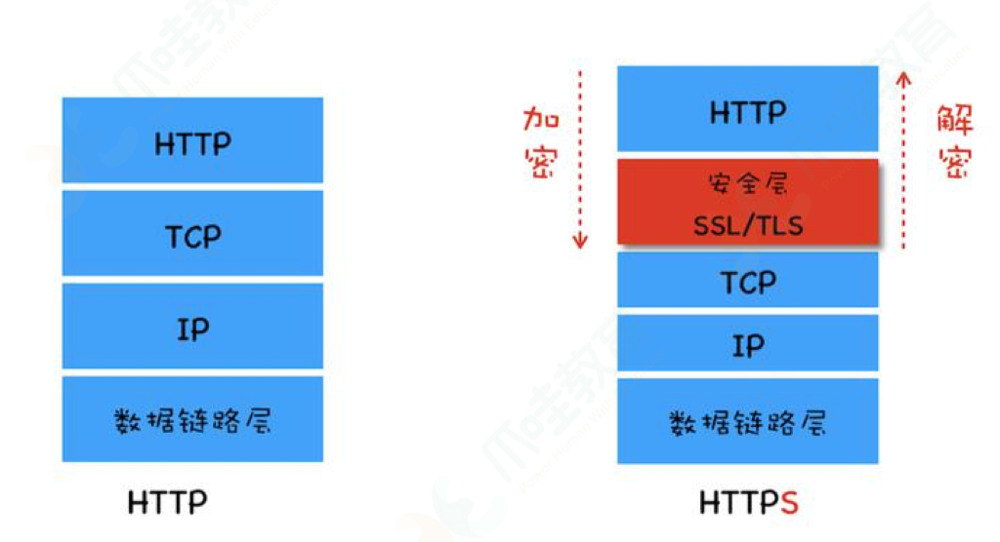
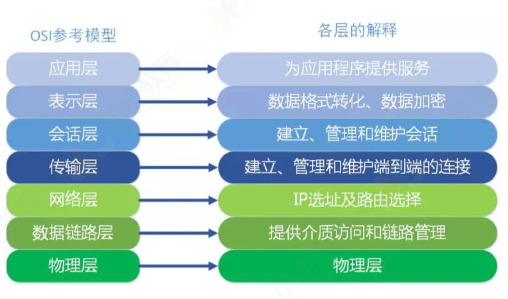
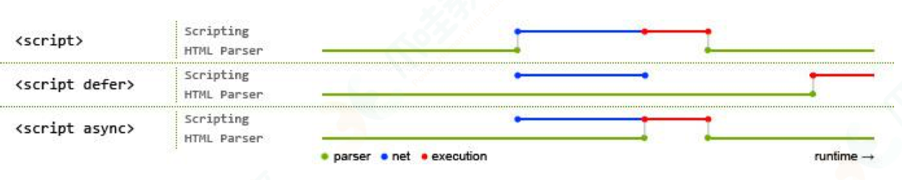

# 常见问题 2

## vue

### 简单说下 Vue 的模版编译原理

Vue 中的 template 无法被浏览器解析和渲染，所以需要将 template 转换成 render 函数，这个过程就是模版编译

**模版编译过程**：
1. **解析模版 parse**：将模版字符串解析成抽象语法树（AST）
2. **优化 optimize**：对 AST 进行静态节点标记，优化静态树(方便在页面重渲染的时候进行 diff 比较时，直接跳过这一些静态节点，优化 runtime 的性能)
3. **生成 generate**：将 AST 转换成 render 函数

### Vue中的父组件怎么监听子组件的生命周期？

**Vue2**
1. 使用 ref：
  ```
  // 父组件
  this.$refs.child.$on('hook:mounted', this.handleChildMounted);
  // 子组件
  mounted() {console.log('子组件已挂载');}
  ```
2. 子组件在生命周期钩子中触发自定义事件，父组件监听这些事件：
  ```<child @custom-event="handleEvent"/>```
3. 通过 provide 和 inject 实现跨层级组件通信

**Vue3**

### 什么是 MVVM ？

MVVM 是指 Model-View-ViewModel

- Model 是指数据层，负责管理应用数据和业务逻辑
- View 是指视图层，负责管理用户界面和各类 ui 组件，
- ViewModel 是指业务逻辑层，负责管理 Model 和 View 之间的通信，作为桥梁连接

MVVM 模式 是指 在 ViewModel 中有一个 Binder 或 Data-bingding 引擎的东西，处理 View 和 Model 之间的数据同步

- 我们只需要在 View 的模版上，**指令式**声明 View 上的哪部分需要和 Model 的哪一块数据绑定。
- 当 Model 变化了（比如使用 js 改变数据），Binder 会自动把数据更新到 View
- 当 View 变化了（比如用户操作界面改变数据），Binder 也会自动把数据更新到 Model

ViewModel 有两个主要部分：

- 监听器：**Observer** 对所有数据的属性进行监听
- 解析器：**Compiler** 对每个元素节点的指令进行解析，根据指令模版替换数据，绑定相应的更新函数

### SPA 应用 的首屏优化手段？

排查方向：

- 网络延时问题
- 资源文件体积过大
- 资源是否重复请求加载
- 加载脚本时渲染内容堵塞

解决：

- 减小入口文件体积
  - 路由懒加载
  - TerserPlugin 代码压缩
  - 开启 gzip 文件压缩 compression-webpack-plugin
- 采用 http 缓存策略，设置 cache-control，配合 last-modified 或 etag 响应头
- UI 框架按需加载

### Vue 在实例挂载过程做了什么？

vue 的\_init 函数分析 vue 初始化的时序，在`new Vue()`中，会执行`this._init()`

- **beforeCreate** 前，完成 初始化生命周期、事件系统、 render 方法

- **created** 前，初始化 inject、props、data、methods 和 provide

- **beforeMount** 前，完成模板编译，生成 render 函数

- **mounted** 前，生成 vnode，更新 dom 完成挂载

---

- initLifecycle(vm) 初始化生命周期

- initEvents(vm) 初始化事件系统

- initRender(vm) 初始化 render 方法，例如\$createElement

--- callHook(vm, 'beforeCreate') ---

- initInjections(vm) 初始化 inject

- initState(vm) 初始化 props、data、methods
- initProvide(vm) 初始化 provide

--- callHook(vm, 'created') ---

- 完成模板编译，生成 render 函数

--- callHook(vm, 'beforeMount') ---

- 生成 vnode

- 更新 dom 完成挂载

--- callHook(vm, 'mounted') ---

### Vue 实例挂载过程发生了什么？（或 Vue.\_init）【第 1 遍】

60 秒

1. 在 Vue 的构造函数中，会执行`this._init(options)` 函数，依次经历以下过程：

   init 初始化处理 `options` 的值 --> 调用 `$mount(vm.$options.el)` 挂载页面 --> 然后 compile 编译 template ->得到 render 函数 -> 再次调用 `mount` 方法，执行 `mountComponent` ，实例化`render Watcher`，调用 `updateComponent`以及 render 函数生成 vnode -> 然后 `_update` 更新 vnode 到 -> 真正的 dom 上。

2. 具体来说，通过生命周期分段：

- **beforeCreate** 前，完成 初始化生命周期、事件系统、 render 方法

  - initLifecycle(vm) 初始化生命周期
  - initEvents(vm) 初始化事件系统
  - initRender(vm) 初始化 render 方法，例如 \$createElement

- **created**前，初始化 inject、props、data、methods 和 provide

  - initInjections(vm) 初始化 inject
  - initState(vm) 初始化 props、data、methods

  - initProvide(vm) 初始化 provide

- **beforeMount**前，完成模板编译，生成 render 函数

- **mounted**前，生成 vnode，通过 patch 更新 dom 完成渲染

### 为什么 Vue 组件中的 data 必须是个函数？

- 在组件注册的时候，vue 会把这个组件传入的配置存下来，多次生成同一个组件的时候都会从存下来的配置中取值，然后通过 new 创建新的组件实例。
- 如果这时候 data 为对象 （引用类型的内存地址是一样的） ，那每次生成新的组件实例的 data 都指向了同一个内存区域，这时候其中一个同类型组件值更新了。其余的都会跟着一起更新
- 解决这个问题需要用函数的形式，这样每次实例化组件都通过 function 创建它们的独立作用域，返回一个新的对象

```
注册组件的本质实际上是建立一个组件构造器的引用，在使用时才会去实例化。也就是生成一个function。

实际上每个组件实例的data都会指向同个引用，所以需要用函数创建它们的独立作用域
```

### 说一下对 Vue 的生命周期的理解？

Vue 实例从创建到销毁的过程就是生命周期。就像一条流水线：从创建实例、初始化数据、编译模版、挂载 Dom、渲染、更新、卸载等一系列过程

**Vue2 生命周期钩子函数**：

beforeCreate > created > beforeMount > mounted > beforeDestory > destroyed

- beforeCreate：组件实例被创建，但还未初始化数据、属性、方法
- created：组件初始化完毕，各种数据可以使用，常用于异步数据获取
- beforeMount：未执行渲染、更新，dom 未创建
- mounted：初始化结束，dom 已创建，可用于获取访问数据和 dom 元素
- beforeUpdate：更新前，可用于获取更新前各种状态
- updated：更新后，所有状态已是最新
- beforeDestroy：销毁前，可用于一些定时器或订阅的取消
- destroyed：组件已销毁，作用同上

**Vue3 生命周期钩子函数**：

1. **setup()**：Composition API 的入口函数
2. **onBeforeMount()**：在组件挂载之前调用
3. **onMounted()**：在组件挂载完成后调用
4. **onBeforeUpdate()**：在组件更新之前调用
5. **onUpdated()**：在组件更新完成后调用
6. **onBeforeUnmount()**：在组件卸载之前调用
7. **onUnmounted()**：在组件卸载完成后调用
8. **onActivated()**：对于被 Keep-Alive 的组件，当组件被激活时调用
9. **onDeactivated()**：对于被 Keep-Alive 的组件，当组件被停用时调用

### 父子组件生命周期的执行顺序？

父子组件的生命周期执行顺序为：

1、父 beforeCreate => 父 created => 父 beforeMount

2、=> 子 beforeCreate => 子 created => 子 beforeMount => 子 mounted => 父 mounted

3、=> 父 beforeDestroy => 子 beforeDestroy => 子 destroyed => 父 destroyed

### 数据请求在 created 和 mouted 的区别?

created 和 mounted 都能拿到实例对象的属性和方法，区别在于 created 是在实例创建完成就调用，此时还没有渲染页面 dom 节点，而 mounted 是在页面 dom 节点渲染完成之后调用，如果把数据放进 mounted 请求 可能会出现页面闪动的情况，建议放在 created 中实现

### 🌟 Vue 组件之间的通信方式？

- 一般的父子组件可以用 props 和 emit 通信
- 层级比较深或者兄弟组件可以考虑用 eventBus 或者 vuex
- 当出现子组件以 slot 方式应用在父组件，或层级很深，可以用 provide/inject

### 🌟 如果不用 new Vue 的方式如何实现 eventBus？

通过 new class 创建一个 EventBus 类，里面用一个变量存储订阅的事件名和方法，实现 vue 里面的 $on 和 $emit 方法，相当于手动实现一个发布订阅的模式

````js
function EventBus(){
	this.msgQueues = []
}
EventBus.prototype = {
  on: function(msg, fn) {
    this.msgQueues[msg] = fn
  },
  emit: function(msg, data) {
    this.msgQueues[msg](data)
  },
  off: function(msg) {
    delete this.msgQueues[msg]
  }
}
​```
````

### Vue 组件和插件有什么区别？

- 组件就是将图形和逻辑组合成一个功能的概念。在 Vue 中一个 .vue 文件就可以看作是一个组件

- 插件通常用来为 `Vue` 添加全局功能，比如我们用到的 VueX、VueRouter

区别：

- 编写上，组件通常使用 .vue 单文件格式，而 插件通常是一个 js 文件并暴露 install 方法
- 注册方式上，组件使用 Vue.component 的方式注册，而插件使用 Vue.use() 的方式
- 使用场景，组件主要是构成业务模块，而插件主要是对 Vue 功能的扩展

### 讲一下 VueX

Vuex 是一个专为 Vue 应用程序开发的**状态管理模式**。它采用集中式存储管理应用的所有组件的状态，保证状态以一种可预测的方式发生变化

VueX 实现了一个单向数据流，

- 全局拥有一个 state 存放数据，并通过命名空间 Module 管理，通过 getters 访问（当访问多个 state 可以用 ...mapState）

- 更改状态的唯一方法是提交 mutation

  - 同步操作：通过 commit mutation 修改数据
  - 异步操作：通过 dispatch Action 再 commit mutation 修改数据

### computed 和 watch 的区别？

- computed 的本质是 computed watcher
- watch 的本质是 user watcher
- computed 适用于在模版渲染中，某个值是依赖了其他响应式对象或者是计算属性计算而来的；
- watch 适用于观测某个值的变化去实现一段复杂的业务逻辑

### 🌟 Keep-alive 组件的使用与普通组件有什么不同？

keep-alive 的应用场景：当我们不希望组件被重新渲染，并且能够缓存操作页面的时候，可以用 keep-alive 包裹住动态组件

与普通组件的区别：

- 是一个抽象组件，本身不会渲染 dom，也不会出现在父组件中
- 当组件在内被切换时，能缓存住不活动的组件实例，而不是销毁它们，当再次回到相同组件时，直接调用 activated 钩子函数而不是 created 函数，也就是说 被 keep-alive 包裹的组件，会多出两个生命周期钩子函数：activated、deactivated
- keep-alive 有两个特殊属性：
  - include：指示哪些组件需要被缓存，根据 name 匹配
  - exclude：指示哪些组件不需要被缓存，优先级高于 include

### 🌟 vue 的动态组件如何使用？

使用 vue 内置的 component 组件，根据 is 属性值决定哪个组件被渲染

### 🌟 VueRouter 路由原理？

VueRouter 是什么？

VueRouter 是一个**路由管理器**，而 Vue 的单页面应用是基于路由和组件的。

路由描述了 ：

- URL 与 UI 之间的映射关系，
- 前端通过手动改变 URL，监听 URL 的变化来实现 UI 更新，但不会向后端发起请求

**Vue-Router**提供了两种模式：

- hash 模式，地址栏中带有 # 号，使用 `window.location.hash` 改变 hash 值， 通过 `window.onhashchange` 事件监听 hash 值的变化，重新渲染 routerView，
- history 模式，地址栏中没有 # 号，使用 history api，通过监听`window.onpopstate` 事件来实现页面组件渲染，`history.pushState` 和 `history.replaceState` 不会触发 `window.onpopState` 事件（只有浏览器的前进后退才会触发 popstate 事件，pushState、replaceState 时需要手动更新 UI）
- history 模式的 url 是真实 url，服务器会对 url 文件路径进行资源查找，找不到资源就会返回 404

VueRouter 提供的路由守卫主要是用来通过跳转或取消的方式守卫导航。路由守卫有三种：全局的、单个路由的、组件的

### 🌟 全局路由守卫使用

Vuerouter 提供的路由守卫主要是用来通过跳转或取消的方式守卫导航。路由守卫有三种：全局的、单个路由的、组件的

使用 router.beforeEach 注册

```js
const router = new VueRouter({...})
router.beforeEach((to, from, next) => {
  if (to.name !== "Login" && !isLogin) {
    next({name: "Login"})
  } else {
    next()
  }
})
```

全局守卫接收三个参数：

- to：即将要进入的目标 路由对象
- from： 当前导航正要离开的 路由对象
- next：必须调用来 resolve 钩子

**组件内的守卫**：

- beforeRouteEnter(to, from, next)：当守卫执行前，组件实例还没被创建，不能获取 this
- beforeRouteUpdate(to, from, next)：组件复用时执行，能访问 this
- beforeRouteLeave(to, from, next)：离开该组件时执行，能访问 this

### 导航解析流程（Router）？

1. 导航被触发
2. 在失活的组件里面调用 beforeRouteLeave 守卫
3. 调用*全局的 beforeEach 守卫*
4. 在复用的组件里面调用 beforeRouteUpdate 守卫
5. 在路由配置里面调用 beforeEnter
6. 解析异步路由组件
7. 在被激活的组件里面调用 beforeRouteEnter 守卫
8. 调用*全局的 beforeResolve 守卫*
9. 导航被确认
10. 调用*全局的 afterEach 守卫*
11. 触发 DOM 更新
12. 调用 beforeRouteEnter 守卫中传给 next 的回调函数，创建好的组件实例会作为回调函数的参数传入

### 什么是 nextTick ？

将回调推迟到下一个 DOM 更新周期之后执行。在修改数据之后立即使用这个方法，获取更新后的 DOM。

可以理解成：Vue 在更新 DOM 时是异步执行的，当数据发生变化，Vue 将开启一个异步更新队列，视图需要等待队列中所有的数据变化完成后，再进行统一更新

```
// html
<div id="app">{{ message }}</div>
// vue
const vm = new Vue({
	el: "#app",
	data: {
	message: "原始值"
	}
})
// js 修改 message
this.message = "修改后的值1"
this.message = "修改后的值2"
this.message = "修改后的值3"
console.log(vm.$el.textContent) // 原始值

```

源于 Vue 文档上的解释：Vue 异步执行 DOM 更新。只要观察到数据变化，Vue 将开启一个队列，并缓冲在同一个事件循环中发生的所有数据改变。如果同一个 watcher 被多次触发，只会被推入到队列中一次。这种在缓冲时去除重复数据对于避免不必要的计算和 DOM 操作非常重要，然后在下一个事件循环 “tick” 中，Vue 刷新队列并执行实际的工作

为什么需要 异步更新？

假如是同步更新，会有以下的情况：

```js
this.message = "更新一次"; // DOM 更新一次
this.message = "更新一次"; // DOM 更新两次
this.message = "更新一次"; // DOM 更新三次
```

但事实上，我们只需要最后一次更新，而前两次 DOM 更新是可以省略的，我们只需要等待状态都修改好了之后再进行渲染就可以减少一些无用功

在 Vue2 中组件内部使用了 VirtualDOM 进行渲染，也就是说，组件内部实际是不关心哪个状态发生了变化，它只需要计算一次就可以得知哪些节点需要更新，如果改变了 N 个状态，其实只需要发送一个信号就可以将 DOM 更新到最新，比如：

```js
this.message = "更新";
this.age = 23;
this.name = "Yolanda";
```

这里我们分三次改变了三种状态，但实际上 Vue 只会更新渲染一次，因为 VirtualDOM 只需要一次就可以将整个组件的 DOM 更新到最新，它不关心更新信号到底是哪个具体状态发出

如何才能将渲染操作推迟到所有状态都修改完毕呢？很简单，**只需要将渲染操作推迟到本轮事件循环的最后或者下一轮事件循环**

也就是说，只需要在本轮事件循环的最后，等待前面更新状态语句都执行完之后，执行一次渲染操作，就可以无视前面各种更新状态的语法，只在最后渲染一次就可以了

Vue 在内部尝试对异步队列使用原生的 `Promise.then` 和 `MessageChannel`，将渲染操作推迟到本轮事件循环的最后，如果执行环境不支持，会采用 `setTimeout(fn, 0)` 代替，降级到下一轮。当同一轮事件循环中反复修改状态时，并不会反复向队列中添加相同的渲染操作

源码：

```js
export function nextTick(cb?: Function, ctx?: Object) {
  let _resolve;
  // 加入到队列中，前面都是执行更新 dom 的函数
  // 所以执行完更新 dom 的函数，这个 cb 就能拿到最新的 dom 值
  callbacks.push(() => {
    if (cb) {
      try {
        cb.call(ctx);
      } catch (e) {
        handleError(e, ctx, "nextTick");
      }
    } else if (_resolve) {
      _resolve(ctx); // 执行 then 函数
    }
  });
  // 上锁 多次使用 nextTick 只需要把 cb 放进队列中
  if (!pending) {
    pending = true;
    timerFunc(); // 异步执行
  }
  if (!cb && typeof Promise !== "undefined") {
    return new Promise((resolve) => {
      _resolve = resolve;
    });
  }
}
```

写一个简单的 nextTick 函数

```js
let pending = false;
let callbacks = [];
function flushCallbacks() {
  pending = false;
  callbacks.forEach((cb) => cb());
  callbacks = [];
}
function nextTick(cb) {
  callbacks.push(cb);
  if (!pending) {
    pending = true;
    Promise.resolve().then(flushCallbacks);
    // 如果不支持 Promise
    // setTimeout(flushCallbacks, 0)
  }
}
console.log("start");
Promise.resolve().then(() => {
  console.log("promise.then1");
});
nextTick(() => {
  console.log("nextTick");
});
Promise.resolve().then(() => {
  console.log("promise.then2");
});
console.log("end");
// 结果为：
// start end promise1 nextTick promise2
// 如果将 nextTick 改成使用 setTimeout 则新结果为
// start end promise1 promise2 nextTick
```


### Vue data 中某一个属性的值发生改变后，视图会立即同步执行重新渲染吗？

**不会**

**原因**：Vue 在更新 DOM 时是异步执行的

1. **异步更新队列**：当数据发生变化时，Vue 会将更新操作放入一个异步队列中，而不是立即执行
2. **批量更新**：Vue 会等待同一事件循环中所有的数据变化完成，然后统一进行视图更新，这样可以避免不必要的 dom 操作
3. **使用$nextTick**：如果需要在数据变化后进行某些 DOM 操作，可以使用 $nextTick 确保在 DOM 更新完成后执行回调函数
4. **响应性原则**：Vue 通过其响应式系统追踪依赖，当依赖的响应式数据发生变化时，相关的组件和指令会收到通知并进行更新


### 为什么`vm.data = 'new value'`之后，不能拿到最新的值？

如果这么写，是不能拿到值的

```js
vm.data = "new value";
console.log(dom.data); // 旧值，dom异步更新
```

更新 dom 是异步的，所以上面写法不能拿到最新的值，所以必须使用 nextTick 来把`console.log(dom.data)`放到回调队列中后面，也就是 dom 更新函数的后面。

```js
div.innerHTML = "123";
console.log(div.innerHTML); // '123'
```

vue 为什么要使用异步更新队列？

避免频繁操作 dom，更新 dom

源于 vue 文档上的解释：Vue **异步**执行 DOM 更新。只要观察到数据变化，Vue 将开启一个队列，并缓冲在同一事件循环中发生的所有数据改变。如果同一个 watcher 被多次触发，只会被推入到队列中一次。这种在缓冲时去除重复数据对于避免不必要的计算和 DOM 操作上非常重要。然后，在下一个的事件循环“tick”中(也不一定是下一个事件循环，用了 promise 就是同个循环)，Vue 刷新队列并执行实际 (已去重的) 工作。

当状态发生改变的时候，vue 采用异步执行 dom 更新

有篇文章写得很好，https://github.com/berwin/Blog/issues/22

主要是为了性能优化，减少无用的 dom 更新，例如

```js
vm.a = 1;
vm.a = 2;
vm.a = 3;
```

如果是每次数据改变，都要去更新 dom 的话，成本太高，其实用户要的只是最后一次更新，所以在同步任务中去用缓冲队列处理，然后通过异步来更新 dom。

Vue 优先将渲染操作推迟到本轮事件循环的最后，如果执行环境不支持会降级到下一轮

当同一轮事件循环中反复修改状态时，并不会反复向队列中添加相同的渲染操作，也就是 render watcher

### v-if 和 v-show 的区别

这两者的区别主要是：

- 控制手段：v-show 隐藏是通过为元素添加 css 属性 display:none ，dom 元素依然存在；v-if 隐藏则是将 元素整个删除
- 编译过程：v-if 切换会有一个局部编译或卸载的过程，即销毁或重建内部的事件监听和子组件；v-show 切换只是简单的 css 属性变化；v-if 由 false 变 true 会触发组件的生命周期钩子 而 v-show 不会
- 性能消耗：v-if 有更高的切换消耗，v-show 有更高的初始渲染消耗
- 如果需要频繁地切换，建议使用 v-show；如果运行时条件很少变化，建议使用 v-if

再深入点说的话：

- v-if 会调用 addIfCondition 方法，生成 vnode 的时候会忽略对应节点，render 的时候就不会渲染
- v-show 会生成 vnode，render 的时候会渲染成真实节点，只是 render 过程中会在节点的属性中修改 style 值

### v-if 和 v-for 的优先级是什么？为什么不建议在 v-for 中使用 v-if ？

- v-if 指令是指条件的渲染内容
- v-for 指令是指基于一个数组渲染一个列表

在 vue 模版编译时，会将指令系统转化成可执行的 render 函数

从 vue 源码的 genElement 函数可以知道 v-for 的优先级比 v-if 高（vue2中）

vue3中， v-if 的优先级被提高，高于 v-for

至于为什么不建议把 v-if 和 v-for 一起使用，

是因为会带来性能浪费==>每次渲染前都会先循环再进行条件判断

### 说一下编译、渲染和更新过程

首先使用 parse 函数 将模版抽象为 AST 语法树，然后使用 optimize 函数遍历语法树，做静态标记目的是优化响应式性能，然后通过 generate 函数将语法树转换成 render function string

首先谈下编译：

模板解析为 AST，优化 AST，将 AST 转化成 render function string，也就对应着 parse、optimize、generate 函数

```js
export const createCompiler = createCompilerCreator(function baseCompile(
  template: string,
  options: CompilerOptions
): CompiledResult {
  const ast = parse(template.trim(), options);
  if (options.optimize !== false) {
    optimize(ast, options);
  }
  const code = generate(ast, options);
  return {
    ast,
    render: code.render,
    staticRenderFns: code.staticRenderFns
  };
});
```

**parse**

生成 ast

```js
{
    // 类型
    type: 1,
    // 标签
    tag,
    // 属性列表
    attrsList: attrs,
    // 属性映射
    attrsMap: makeAttrsMap(attrs),
    // 父节点
    parent,
    // 子节点
    children: []
}
```

**optimize**

遍历递归每个 ast 节点，标记静态的节点，这些节点是不需要 diff 的

**generate**

接收 ast，把 ast 转换成 render 字符串函数，比如`_c('div', [_c('span')])`

执行 render 函数，生成 vnode，挂载到 dom 上

```js
const vnode = vm._render();
updateComponent = () => {
  vm._update(vnode, hydrating);
};

vm._update = function() {
  vm.$el = vm.__patch__(prevVnode, vnode); // 挂载dom
};
```

顺便看看\$forceUpdate

原来\$forceUpdate 只会让当前组件的 render watcher 更新，仅仅影响实例本身和插入插槽内容的子组件，而不是所有子组件。

```js
Vue.prototype.$forceUpdate = function() {
  const vm: Component = this;
  if (vm._watcher) {
    vm._watcher.update();
  }
};
```

更新过程

数据改变，`watcher.run` -> `updateComponent` -> `vm._update(_vm.render())` -> `vm.__patch__` -> diff vnode -> 更新视图

### Vue 的双向绑定原理？

**1、什么是双向绑定？**

- Vue 的双向绑定是指 数据和视图 之间的实时同步：数据变化自动更新视图、用户在视图操作会自动更新数据
- 核心是通过 v-model 指令实现，常用于表单控件

**2、原理？**

1. 数据劫持
  - Vue 通过 **响应式数据** 实现双向绑定
  - Vue2 使用 Object.defineProperty，Vue3 使用更高效的 Proxy
    - Vue2 会在初始化时劫持每个对象的每个属性，通过 getter 和 setter 监听数据变化；当数据发生变化时触发依赖收集，通知视图更新
    - Vue3 使用 Proxy 包装整个对象，可以监听动态添加的属性以及更深层次的嵌套

2. 数据到视图的更新
  - Vue 会为每个响应式属性创建 **依赖收集** （Dep）
  - 数据发生变化时，会通知依赖收集里面所有的 **Watcher**，执行更新函数，最终触发 DOM 更新渲染

3. 视图到数据的更新
  - 通过 v-model 指令监听表单控件的事件（比如 input、change）
  - 用户操作会触发事件处理器，修改绑定的数据


vue 的双向绑定是通过**数据劫持**和**观察者模式**来实现的，Vue 提供了一个 Observer 类，这个类的目的是将数据变成响应式对象，利用了 Object.defineProperty() 方法遍历递归对象的属性，对每个属性的 getter、setter 方法进行改写。在数据读取，也就是 getter 阶段，会进行**依赖收集**，在数据改写，也就是 setter 阶段，会进行**依赖更新**

- 依赖收集就是订阅数据变化的 watcher 的收集，当这些响应式数据发生变化，触发了它们的 setter 时，应该通知哪些订阅者去做相应的逻辑处理
- 派发更新是当数据发生改变后，通知所有的订阅这个数据变化的 watcher 执行 update，会把所有要执行的 update 的 watcher 推入到队列中，在 nextTick 后执行 flush


```
双向绑定由三个部分构成：

- Mode 数据层
- View 视图层
- ViewModel 业务逻辑层

专业名称为 MVVM 框架，核心功能是“数据双向绑定”，意思就是数据更新后更新视图，视图变化后更新数据
```

### 如何实现双向绑定？

1. new Vue() 初始化时，会对 data 执行响应式处理，这个过程发生在 Observe
2. 同时，对模版进行编译，找到其中动态绑定的数据，从 data 中获取并初始化视图，这个过程发生在 Compile
3. 定义一个更新函数和 Watcher，将来数据变化时，Watcher 会调用更新函数
4. 因为 data 中的 key 可以在视图中出现多次，所以每个 key 都需要一个管家 Dep 管理多个 Watcher
5. 以后，data 中的数据一旦发生变化，会先找到对应的 Dep，通知所有的 Watcher 执行更新函数

### vue3的响应式原理？

1. 依赖收集
2. 依赖更新

**如何实现自动操作track和trigger？**

**vue2**使用 es5 的 Object.defineProperty() 实现
**vue3**使用 es6 的 Proxy 和 Reflect 实现

```javascript
// 1 初始化 targetMap 保存多个观察对象，每个对象作为单独的key
const targetMap = new WeakMap()
let activeEffect = null
const effect = eff => {
  activeEffect = eff
  activeEffect()
  activeEffect = null
}
// 2 收集依赖
const track = (target, key) => {
  if (!activeEffect) return
  let depsMap = targetMap.get(target)
  if (!depsMap) {
    // 如果未保存过当前对象key，则添加观察对象作为key，值为待补充的map
    targetMap.set(target, (depsMap = new Map()))
  }
  let dep = depsMap.get(key)
  if (!dep) {
    // 如果该map无该属性的key键（值为副作用）
    depsMap.set(key, (dep = new Set()))
  }
  dep.add(activeEffect)
}
// 3 执行指定对象的指定属性的所有副作用
const trigger = (target, key) => {
  const depsMap = targetMap.get(target)
  if (!depsMap) return
  const dep = depsMap.get(key)
  if (!dep) return
  dep.forEach(effect => effect())
}

// 4 响应式处理
const reactive = (target) => {
  // 1 封装统一处理函数
  const handler = {
    get(target, key, receiver) {
      console.log('正在读取的数据：',key);
      const result = Reflect.get(target, key, receiver);
      track(target, key);  // 自动调用 track 方法收集依赖
      return result
    },
    set(target, key, value, receiver) {
      console.log('正在修改的数据：', key, ',值为：', value);
      const oldValue = target[key];
      const result = Reflect.set(target, key, value, receiver);
      if(oldValue !== result){
        trigger(target, key);  // 自动调用 trigger 方法执行依赖
      }
      return result
    }
  }
  // 2 统一调用 proxy 函数
  return new Proxy(target, handler)
}
const product = reactive({ price: 10, quantity: 2 })
let total = 0
// const effect = () => { total  = product.price * product.quantity }
console.log(`total: ${total}`); // total: 0
effect(() => {total = product.price * product.quantity})
console.log(`total: ${total}`); // total: 20
product.price = 20
console.log(`total: ${total}`); // total: 40
```

### 实现 vue3 的 ref 函数
```js
// 方式1 实现一个 ref
const ref = initialValue => reactive({value:initialValue})
const testRef = ref({a: 2})
console.log(testRef.value)

// 方式2
const ref2 = raw => {
  const r = {
    get value() {
      track(r, 'value')
      return raw
    },
    set value(newValue) {
      raw = newValue
      trigger(r, 'value')
    }
  }
  return r
}
const testRef2 = ref2(0)
console.log(testRef2.value)
```

### 实现 vue3 的 computed
```js

```

### 实现一个简单的响应式系统

步骤：

- 引入一个 Observer 类，将数据变成响应式，利用 Object.defineProperty() 对属性的 getter、setter 改写
- 在数据读取 getter 阶段进行依赖收集、在数据改写 setter 阶段进行依赖更新

```js
class MyVue {
  inieData(options) {
    if (!options.data) return;
    this.data = options.data;
    // 将数据重置 getter、setter
    new Observer(options.data);
  }
}
class Observer {
  constructor(data) {
    // 实例化时，执行 walk 对每个属性改写 getter、setter
    this.walk(data);
  }
  walk(obj) {
    const keys = Object.keys(obj);
    for (let i = 0; i < keys.length; i++) {
      // Object.defineProperty 处理
      defineReactive(obj, keys[i]);
    }
  }
}
```

**依赖本身 Watcher**

**依赖管理 Dep**

**依赖管理过程 defineReactive**

### 说一下 Object.defineProperty 的缺陷

- 无法监听通过下标方式修改数组和对象新增属性

- 数组是通过改变数组的原型链，然后重写'push', 'pop', 'shift', 'unshift', 'splice', 'sort', 'reverse'这几个方法实现派发更新

- 可以使用 this.\$set 来解决这类问题

### vue 3 为什么用 proxy API 代替 vue2 的 defineProperty API？

响应式优化

- defineProperty API 的局限性是它只能针对单个属性做监听，无法监听通过下标方式修改数组和对象新增属性，我们在 vue2 中监听整个对象，实际上是 defineProperty 对属性做了遍历递归，重新定义了每个属性的 getter 和 setter 方法
- Proxy API 的监听是针对一个对象的，那么对这个对象的所有操作会直接进入监听操作
- Proxy API 实现的响应式是惰性的，它的处理是在 getter 中递归响应式，所以只有对象在访问到才会变成响应式；而 defineProperty 劫持对象内部深层次的变化，需要递归遍历整个对象，将每一层的数据都变成响应式，会有很大的性能消耗

监测数组的时候可能触发多次 get/set，如何防止触发多次呢？

答：可以判断 key 是否为当前被代理对象 target 的自身属性，也可以判断旧值和新值是否相等，只有满足以上两个条件之一，才有可能执行 trigger

### vue3的diff算法过程

vue 里面 diff 算法主要用来比较虚拟 DOM 的新旧节点数，找到需要更新的部分，然后高效的更新真实 DOM

过程：

1. 头部对比（从头到尾）：依次比较新旧节点的头部，直到遇到不匹配的节点
2. 尾部对比（从尾到头）：依次比较新旧节点的尾部，直到遇到不匹配的节点
3. 头部交叉对比（头对尾，尾对头）：如果经过1、2无法完全匹配，会尝试节点的头尾交叉对比
4. 中间区域的最小编辑距离：找到中需要移动或替换的节点，使用最长递增子序列算法来减少 DOM 的操作次数

核心优化点：
1. 静态标记优化：vue3会在编译阶段标记静态节点，diff时跳过不需要比较的部分
2. 最长递增子序列算法结合：在处理中间未匹配节点时，Vue 会通过 LIS 算法来减少节点的移动
3. 双端比较策略：通过双端比较快速定位需要更新的区域

举例：

旧节点：[A, B, C, D]
新节点：[B, A, E, D]

1. 头部对比：A != B 停止头部比较
2. 尾部对比：D = D，尾部索引往前移动
3. 中间区域比较：剩余部分 [B, C] 和 [B, A, E]，计算最小更新路径==> 标记需要移动的 A 和 新增的 E，B保持不动
4. DOM 操作：移动节点 A，插入新节点 E

### diff 算法

diff 算法 是一种通过同层树节点进行比较的高效算法，特点是：

- 比较只会在同层级比较，不会跨层级比较
- 在 diff 比较过程中，循环从两边向中间比较

应用：在 Vue 中，作用于 虚拟 DOM 渲染成真实 DOM 的新旧 VNode 节点比较

### 为什么要使用 diff 算法？

减少 dom 的更新量，找到最小差异部分的 dom，就是尽可能的复用旧节点，最后只更新新的部分即可，减少节点 dom 的新增和删除等操作

**diff 比较过程**

在 diff 过程中，首先需要判断两个节点是否是相同类型的节点，用 **sameVnode** 方法：

```js
function sameVnode(a, b) {
  return (
    a.key === b.key && // key 值
    ((a.tag === b.tag && // 标签类型
    a.isComment === b.isComment && // 是否为注释节点
    isDef(a.data) === isDef(b.data) && // 是否都定义了 data
      sameInputType(a, b)) || // 当标签类型为 input 时，type 必须相同
      (isTrue(a.isAsyncPlaceholder) &&
        a.asyncFactory === b.asyncFactory &&
        isUndef(b.asyncFactory.error)))
  );
}
```

看看 patch 函数，也就是`Vue.prototype.__patch__`，源码`core/vdom/patch.js`

源码太长，精简一下

```js
function patch(oldVnode, vnode) {
  if (!oldVnode) {
    createElm(vnode);
  } else if (sameVnode(oldVnode, vnode)) {
    patchVnode(oldVnode, vnode);
  } else {
    createElm(vnode);
    removeVnodes(oldVnode);
  }

  return vnode.elm;
}
```

**patch** 函数 分为三个流程：

1. 没有旧节点，直接全部新建
2. 旧节点和新节点自身一样，则比较它们的的子节点
3. 旧节点和新节点不一样，则创建新节点，删除旧节点

当我们确定两个节点值得比较后(sameVnode)，会对两个节点执行 patchVnode 方法

```js
patchVnode (oldVnode, vnode) {
    const el = vnode.el = oldVnode.el
    let i, oldCh = oldVnode.children, ch = vnode.children
    if (oldVnode === vnode) return
    if (oldVnode.text !== null && vnode.text !== null && oldVnode.text !== vnode.text) {
        api.setTextContent(el, vnode.text)
    }else {
        updateEle(el, vnode, oldVnode)
        if (oldCh && ch && oldCh !== ch) {
            updateChildren(el, oldCh, ch)
        }else if (ch){
            createEle(vnode) //create el's children dom
        }else if (oldCh){
            api.removeChildren(el)
        }
    }
}
```

**patchVnode** 函数做了以下工作：

- 找到对应的真实 dom，称为 el
- 判断 Vnode 和 oldVnode 是否指向同一个对象，如果是直接 return
- 如果它们都有文本节点且不相等，则将 el 的文本节点设为 Vnode 的文本节点
- 如果 oldVnode 有子节点 而 Vnode 没有，则删除 el 子节点
- 如果 oldVnode 没有子节点 而 Vnode 有，则将 Vnode 的子节点真实化后添加到 el
- 如果两者都有子节点，则执行 updateChildren 函数 比较子节点

**updateChildren** 函数，循环对比：

简单概况就是：

1. 先找不需要移动的相同节点，比如新头旧头、新尾旧尾，消耗最小
2. 再找节点相同但需要移动的节点，比如新头旧尾、新尾旧头、单个查找，消耗第二小
3. 最后找不到，新建删除节点，保底处理

再细说下：

1. 新头旧头比较、新尾旧尾比较，如果一样则不移动
2. 旧头和新尾比较，一样则操作 dom，把旧头移动尾部
3. 旧尾和新头比较，一样则操作 dom，把旧尾移动头部
4. 拿新节点到旧节点数组中遍历，存在 sameVnode 为 true 就移动旧节点，不存在就新建节点
5. 如果新旧节点都有 key，那么会根据旧节点的 key 生成一个 hash 表，用新节点的 key 与 hash 表做匹配，匹配成功则判断是否为 sameVnode，满足 true 则进行 patchVnode，不满足则新建节点
6. 如果新节点遍历完了，旧节点还有剩余，就让 dom 逐个删除旧节点
7. 如果旧节点遍历完了，新节点还有剩余，全部新建节点

这样 diff 的原因，是为更高效找到和新节点一样的旧节点，然后只需要移动位置，避免了大量的创建或删除 dom

参考文章

[https://zhuanlan.zhihu.com/p/81752104](https://zhuanlan.zhihu.com/p/81752104)

[https://ustbhuangyi.github.io/vue-analysis/v2/reactive/component-update.html](https://ustbhuangyi.github.io/vue-analysis/v2/reactive/component-update.html)

### 为什么需要用 key？

key 的主要作用是为了高效的更新虚拟 DOM，原理是 Vue 在 patch 过程中，sameNode 函数有一项是通过 key 判断两个节点是否是同一个，从而避免频繁地更新不同的元素。如果没有 key 相当于全部组件节点都要重新创建和销毁，有了 key 如果新旧节点一样，最多只是移动位置，可以让整个 patch 过程更加高效，减少 dom 操作，提高性能

### 为什么不要用索引 index、随机数当 key？

答：对性能上的优化有影响，需要分情况讨论：

1. 如果渲染数组的顺序颠倒(reverse 方法)，index 值虽然不会改变，但节点内容变化了，如果是纯标签 li 这种，vue 就会直接改变元素内容，但如果是组件，有 props 的情况下，diff 过程会发现 props 的改变，然后触发组件视图的重新渲染，必然会导致 dom 的操作

2. 如果是数组[1,2,3] 中插入一个值，变成[1,4,2,3]，那么之前的 2，3 索引 key 值就会从 1，2 变成 2，3，key 变化了，sameVnode 肯定为 false，本来只需要新建一个组件，现在变成新建三个，更新成本增加了

3. 如果是数组[1,2,3] 使用 slice(0,1) 删除了第一个节点，那么之前的索引 key 从 0，1，2 变成 0，1，经过 vue 的比较，因为 key 都有 0，1 会认为前面两个节点都没有变，变的是少了 key 为 2 的节点，也就是最后一个，所以前面两个节点直接复用，把最后一个节点删了（如果是单纯的文本节点，patchVnode 会直接更新 dom，察觉不到 页面是删除最后一个节点，如果不是文本节点，就会有明显问题）

   ```vue
   // 非文本节点
   <li v-for="(val, idx) in arr" :key="idx">
      <comp :val="idx"/>
    </li>
   // 单纯文本节点
   <li v-for="(val, idx) in arr" :key="idx">{{idx}}</li>
   ```

随机数的情况

用随机数的话，这样新旧 vnode 的 key 全都不一样，很尴尬，vue 直接判断全都不是 sameVnode，全部重头再来~

### 虚拟 DOM 是什么？

虚拟 dom 本质上就是用 js 对象描述 dom 节点，在 vue 中就是用 vnode 来描述

比如一个 vnode 实例

```js
{
  tag: 'div',
  data: {},
  children: [],
  parent: vnode,
  text: '',
  key: '',
}
```

**虚拟 dom 有什么优点？**

1、可以用 vnode 进行 diff，实现旧节点复用，减少 dom 的创建开销，并且无须手动操作 dom

2、和 dom 操作比起来，js 计算极其便宜

3、跨平台，服务端渲染，weex

**缺点？**

渲染大量的 dom 时，多了一层虚拟 dom 的计算，会比 innerHTML 慢

"Virtual DOM 真正的价值从来都不是性能，而是它

1. 为函数式的 UI 编程方式打开了大门；

2. 可以渲染到 DOM 以外的 backend，比如 ReactNative。"

### 🌟 vue 3 与 vue 2 的区别？

- Composion API
- 响应式优化 使用 Proxy 代理对象
- 引入 Tree-Shaking 清除无用代码，减小程序体积
- Vue 3 是基于 TS 编写的，提供了更好的类型检查，能支持复杂的类型推导
- 编译优化，添加属性标记，生成 block tree 静态树
  - 如果我们有许多的静态节点，只有一个动态节点，我们希望 text 变化时只更新动态节点的 diff ，这样可以避免很多不必要 diff 。然而，这点在 vue2 中是做不到的。因此，vue3 中重写了 diff 算法，添加了属性标记，通过编译阶段对静态模板的分析，编译生成了 block tree 。
  - block tree 是一个将模板基于动态节点指令切割的嵌套区块，每个区块内部的节点结构是固定的，而且每个区块只需要以一个 Array 来追踪自身包含的动态节点

### vue 3 新特性

- ref() 函数接受参数并返回它包装在具有 value 属性 的对象中，适用于基本类型，创建了响应式数据
- reactive() 函数也是创建了响应式数据，但它只适用于对象或数组
- toRefs() 函数将 reactive 创建的响应式数据转换为普通对象，但这个对象的每个属性，都是 ref() 类型的响应式数据

## webpack

### webpack 和 vite 的区别？

**共同点**：
1. **模块处理**：都能处理 JavaScript、CSS、图片等多文件类型的模块
2. **开发和生产环境支持**：都能支持开发和生产环境的构建配置，支持开发服务器和生产环境的优化打包
3. **热模块更新 HMR**：都支持热模块更新，可以只更新变化的部分，无需刷新整个页面
4. **社区和插件生态**：都拥有活跃的社区和丰富的插件生态，允许开发者扩展功能
5. **Tree-Shaking**：webpack5 在 Tree-Shaking 算法进行了优化；vite 也支持 Tree-Shaking 功能

**差异点**：
1. **构建速度**：vite 在开发环境下利用原生 ES 模块和高效的 HMR 实现快速的冷启动和热更新，通常会比 webpack 快，因为 webpack 需要进行大量的模块分析和优化
2. **打包方式**：vite 使用 Rollup 作为打包工具，保留原生 ES 模块导入方式；而 webpack 使用的是 webpack 本身，构建生成一个或多个优化后的静态资源文件
3. **配置复杂度**：vite 配置更简单，webpack 的配置相对复杂，需要配置各种 loader 和插件，需要了解 webpack 的各种配置项和插件的使用方法
4. **开发体验**：vite 在开发环境下提供了更好的开发体验，例如快速的冷启动和热更新；而 webpack 在开发环境下需要等待打包完成才能看到效果
5. **浏览器支持**：vite 主要支持现代浏览器，需要兼容旧版本的浏览器；webpack 有更好的兼容性


vite 是基于 ES Module 的打包工具；

webpack 是模块打包工具，通过一个配置文件，找到入口文件，从这个入口文件开始，找到所以的依赖，构建依赖图，然后进行打包、编译、压缩、优化，最终生成一个浏览器可以直接运行的 js 文件

### 🌟 webpack 5 的新特性

- tree-shaking 的对比，打包体积更小

- 内置了 Prepack 能力，是 FaceBook 开源的一个代码优化工具，生成优化后的代码，能在编译时对代码进行预计算

- `sideEffects` 标识代码是否有副作用，例如 css 文件有副作用，不做 tree shaking，可以在 packjson 中设置

- splitChunk 可以指定不同类型的大小，分割 chunk 可以更加精确

- 内置 web worker 能力，借助 worker-loader ，Web Worker 为 Web 内容在后台线程中运行脚本提供了一种简单的方法。线程可以执行任务而不干扰用户界面。通常，我们可以将一些加解密或者图片处理等一些比较复杂的算法置于子线程中，当子线程执行完毕之后，再向主线程通信

- 丢弃 cacher-loader，采用自带缓存（对 module 和 chunk 进行缓存）

  ```js
  // webpack.config.js
  module.exports = {
      ...,
      cache: {
          type: 'filesystem',
          // 可选配置
          buildDependencies: {
              config: [__filename],  // 当构建依赖的config文件（通过 require 依赖）内容发生变化时，缓存失效
          },
          name: '',  // 配置以name为隔离，创建不同的缓存文件，如生成PC或mobile不同的配置缓存
          ...,
      },
  }
  ```

* webpack 5 前，对 img、svg 资源打包需要额外配置 loader，比如 raw-loader、file-loader、url-loader

  - webpack5 内置了静态资源构建，实现打包和分目录存放（assets），设置对应的 type

    - asset/source ——功能相当于 raw-loader。
    - asset/inline——功能相当于 url-loader，若想要设置编码规则，可以在 generator 中设置 dataUrl。
    - asset/resource——功能相当于 file-loader。项目中的资源打包统一采用这种方式，得益于团队项目已经完全铺开使用了 HTTP2 多路复用的相关特性，我们可以将资源统一处理成文件的形式，在获取时让它们能够并行传输，避免在通过编码的形式内置到 js 文件中，而造成资源体积的增大进而影响资源的加载。
    - asset—— 默认会根据文件大小来选择使用哪种类型，当文件小于 8 KB 的时候会使用 asset/inline，否则会使用 asset/resource。也可手动进行阈值的设定

    ```js
    // webpack.config.js
    module.exports = {
        ...,
        module: {
          rules: [
              {
                test: /\.(png|jpg|svg|gif)$/,
                type: 'asset/resource',
                generator: {
                    // [ext]前面自带"."
                    filename: 'assets/[hash:8].[name][ext]',
                },
            },
          ],
        },
    }
    ```

### 说一下你对 Webpack 的理解，做了什么优化？

Webpack（https://webpack.js.org）是一个模块打包工具，在 Webpack 里一切文件皆模块，通过配置，找到入口文件，然后从这个入口文件开始，找到所以的依赖，构建依赖图，然后进行打包、编译、压缩、优化，最终生成一个浏览器可以直接运行的 js 文件。

现代前端开发已经变得十分复杂，我们开发过程过程中会遇到如下的问题：

- JavaScript 需要 <u>模块化</u>，HTML 和 CSS 这些资源文件也会面临需要被模块化的问题。
- 使用一些 <u>高级的特性</u> 来加快我们的开发效率或安全性，比如通过 ES6+、TypeScript 开发脚本逻辑，使用 Sass、Less 等预处理器编写 css 样式代码
- <u>监听文件的变化</u> 并且反映到浏览器上，提高开发的效率。
- <u>开发完成后</u> 我们还需要将代码进行压缩、合并以及其他相关的优化。

Webpack 可以自动化地解决这一系列复杂的问题，解放我们的生产力。

### 🌟 简单说一下 Webpack 的构建流程？

三大步骤：

1. **初始化流程**：从配置文件和 shell 语句中读取与合并参数，使用参数初始化 Compiler 对象，加载所有配置的**插件**，执行对象的 run 方法 开始编译
2. **编译构建流程**：根据配置确定 entry 文件，从入口文件出发，调用所有配置的 Loader 对 Module 进行翻译，再找到该 Module 依赖的 Module，递归地进行编译处理
3. **输出流程**：对编译后的 Module 组装成包含多个模块的 Chunk，再把每个 Chunk 转换成一个单独的文件加入到输出列表

### module 循环依赖如何解决？

- Common 因为会对已加载的模块会进行缓存，不会重复加载，所以出现循环依赖时才不会出现无限循环调用的情况。
  **解决方法**：先将本模块的值 module.exports 出去，再 require 其他模块

- ES6 的 import 是在编译阶段执行的，这样就使得程序在编译时就能确定模块的依赖关系，一旦发现循环依赖，ES6 本身就不会再去执行依赖的那个模块了，所以 ES6 本身就支持循环依赖，保证程序不会因为循环依赖陷入无限调用，
  **解决方法**：推荐使用 webpack 插件 circular-dependency-plugin 来帮助你检测项目中存在的所有循环依赖

### 🌟 说说 webpack 中常见的 Loader？解决了什么问题？

常见的 loader：

- **处理 css**：style-loader、css-loader、sass-loader
- **处理 js、vue**：babel-loader、vue-loader
- **处理图片、文件**：file-loader、url-loader

webpack 只支持对 js 文件打包，遇到 css、sass、img 等文件时，需要根据配置对应的 loader 进行文件内容的解析。所以 loader 负责模块的转义工作，遵循单一原则，支持链式调用，每个 loader 拿到源文件内容，处理完成后返回给 webpack，可以把 loader 看作是一个处理函数

补充：
- **babel-loader**：使用 Babel 转译 ES6 代码，使其兼容更多浏览器
- **style-loader、css-loader**：将 css 文件转换成 js 文件，css-loader 负责解析 css 文件，style-loader 负责将 css 代码插入到 html 中
- **less-loader**：加载 Less 文件并将其编译成 css，搭配 css-loader 使用
- **file-loader**：用于处理图片、字体等资源，并将它们作为模块返回，通常返回一个 url
- **url-loader**：将文件转换为 base64 编码，作为 Data URLs 内联到文件中


### 🌟 说说 webpack 中常见的 Plugin？解决了什么问题？

plugin 本质是一个具有 apply 方法 javascript 类，apply 方法会被 webpack compiler 调用，并且在整个编译生命周期都可以访问 compiler 对象，plugin 拓展了 webpack 的一些功能，webpack 在运行时会广播出许多事件，在 plugin 中订阅这些事件，然后在合适的时机通过 webpack 提供的 api 改变输出的结果。比如打包优化、资源管理、环境变量注入等等，plugin 会运行在 webpack 的不同阶段，贯穿了 webpack 整个编译周期，目的是解决 `loader` 无法实现的事情。

常见的 plugin：

- **打包优化类型**：
  - terser-webpack-plugin：用于压缩 js 代码，减小最终输出的文件大小，改善加载性能
  - compression-webpack-plugin：开启 gzip，预先准备的资源压缩版本
  - mini-css-extract-plugin：将 css 代码抽离到单独的文件中
  - add-asset-html-webpack-plugin：资源注入

- **文件处理类型**：
  - html-webpack-plugin：打包结束后生成一个 html，并引入打包后的 js 模块
  - clean-webpack-plugin：确保每次构建前清理构建目录

### Loader 和 Plugin 的区别？编写 Loader，Plugin 的思路？

两者有明显的区别：

- **作用**：loader 用于将不同类型的文件转换成 webpack 能够处理的有效模块，plugin 用于扩展 webpack 的功能和解决 loader 无法实现的问题
- **作用对象**：loader 主要作用于单个文件，而 plugin 作用于整个构建过程
- **执行时机**：loader 在 webpack 的 compilation 阶段执行，主要在处理模块时运行；plugin 在 webpack 整个生命周期都能执行，包括 compilation、watchRun、emit 等等

**编写 loader 的思路**：

根据 loader 职责单一的特性，我们只需要关注输入和输出，webpack 是运行在 node 环境的，所以一个 loader 实际就是一个 common 模块，这个模块导出一个函数，函数的工作就是对原内容做一定处理，返回处理后的内容

```js
module.exports = function(source) {
  let content;
  content = doSomeChange2JsString(source);
  // 因为 loader 可以被链式调用，所以输出可以为 String 或 Buffer 类型
  return content;
};
```

**编写 plugin 的思路**：

首先，webpack 编译会创建两个核心对象：

- compiler：包含 webpack 环境的所有配置信息，比如 options、loader、plugin 等等
- compilation：包含当前的模块资源、编译生成资源、变化的文件以及被跟踪依赖的状态信息等等

所以根据 plugin 特性，它能够贯穿整个编译周期，自定义的 plugin 必须是一个函数或者一个包含 aplly 方法的对象，这样才能访问到 webpack 的 compiler ,当检测到一个文件变化，就会有一个新的 compilation 被创建

```js
class MyPlugin = {
  // webpack 会调用 MyPlugin 实例的 apply 方法，给插件实例传入 compiler 对象
  apply(compiler) {
    compiler.hooks.emit.tap("MyPlugin", compilation => {
      // compilation 当前打包构建流程的上下文
      console.log(compilation)
      // doSomeThing
    })
  }
}
```

### Babel是什么，原理是？

**定义**：Babel 是一个 JavaScript 编译器，可以将 ES6+ 代码转换为向后兼容的 JavaScript 代码，以便可以在不同的环境中运行。Babel 主要是通过插件 Plugins 和 预设 Presets 提供了转换 ES6+ 新特性的能力，同时也支持通过 polyfill 添加目标环境中缺失的功能

**工作原理**：分为三个主要阶段 解析 Parsing、转换 Transformation 和 生成 Generation

1. **解析 Parsing**：Babel 使用 Babylon 解析器将源代码转换为抽象语法树（AST），AST 是 JavaScript 代码的抽象语法结构的树状表现形式，它由一系列的节点组成，每个节点代表着源代码中的一个部分，如变量、函数、表达式等（词法分析与语法分析过程）
2. **转换 Transformation**：Babel 使用 babel-traverse 遍历 AST 节点，并允许插件进行节点的添加、更新和删除操作
3. **生成 Generation**：Babel 使用 babel-generator 将转换后的 AST 转换为 JavaScript 代码，并输出到文件中

补充：Babel 的 polyfill 功能主要通过第三方 polyfill（例如 core-js）来实现，它可以自动检测代码中使用的 ES6+ 特性，并按需加载相应的 polyfill，避免了加载整个 polyfill 库，从而减小了最终打包文件的大小

### webpack 的热更新是如何做到的？原理是什么？

HMR 全称 Hot Module Replacement，可以理解为**模块热替换**，是指在应用程序运行中，替换、添加、删除模块无需重新刷新整个应用

在 webpack 中开启热更新非常简单，只需要在配置文件中添加：我们也可以指定哪些模块发生更新时进行 HMR

```js
const webpack = require("webpack");
module.exports = {
  devServer: {
    hot: true
  }
};
```

热更新的实现主要依赖两个插件

- webpack-dev-server 提供 Bundle Server 能力，它是一个静态资源服务器
- hot-module-replacement-plugin 提供了 HMR Runtime，是一个 socket 服务器，会被注入到浏览器中

热更新主要有两个阶段：

- **在启动阶段**：webpack compile 将源码与 HMR Runtime 一起编译成 bundle.js 文件，传输给 Bundle Server 后注入到浏览器
- **在更新阶段**：
  - webpack compile 监听到模块变化后重新编译打包，生成唯一的 hash 值，作为下一次热更新的标识，利用 websocket 链接发送给浏览器
  - HMR Runtime 根据最新的 hash 值，调用 hotDownloadManifest 发起模块变化内容的 hash.hot-update.json 请求，再调用 hotDownloadUpdateChunk 获取最新模块代码的 hash.hot-update.js 请求
  - 最后，浏览器通过 HMR Runtime 加载 manifest 和 update 两个文件对修改的模块进行更新

### webpack proxy 工作原理，为什么能解决跨域？

webpack proxy 是 webpack 提供的代理服务，在开发阶段，接受客户端发送的请求，然后转发到目标服务器，主要是解决在开发模式下的跨域问题

实现代理服务，可以在 webpack config 的配置文件中增加 devServer.proxy 配置，值为要被代理的目标地址，前端根据 devServer.port 修改资源请求的地址为对应的 localhost + port 的形式

**工作原理**：webpack proxy 实质是利用了 http-proxy-middleware 这个 http 的代理中间件，实现了请求转发给其他服务器的功能 ，

至于**为什么能解决跨域问题**，是因为：

设置 webpack proxy 后，目标服务器返回数据的传递方式是 目标服务器---代理服务器---浏览器，而代理服务器与本地浏览器是属于同源，不存在跨域问题，而服务器与服务器之间传递数据并不会存在跨域行为，所以浏览器就能正常接受数据了

### 如何借助 webpack 来优化前端性能？

- 代码压缩，比如 js、css、图片资源等等
  - js 压缩 TerserPlugin
  - css 压缩 css-minimizer-webpack-plugin
  - 图片 压缩 image-webpack-loader
- 代码分离，资源分包 --> DllPlugin 与 DllReferencePlugin
- Tree Shaking，依赖 ES Module 的静态语法分析 配置 usedExports，通过标记某些函数是否被使用，之后通过 Terser 来进行优化的

### `import moduleName from 'xxModule'`

import 经过 webpack 打包以后变成一些`Map`对象，`key`为模块 id，`value`为模块的可执行函数；

例如 index.js 文件

```js
import m1 from "./m1";

m1();
```

会被打包成

```js
{
	"./src/index.js":

(function(module, __webpack_exports__, __webpack_require__) {

"use strict";
__webpack_require__.r(__webpack_exports__);
var _m1__WEBPACK_IMPORTED_MODULE_0__ = __webpack_require__(/*! ./m1 */ "./src/m1.js");

function init() {
  // 拿到default执行
  Object(_m1__WEBPACK_IMPORTED_MODULE_0__["default"])();
}

init();


/***/ }),
```

接下来就由`__webpack_require__`函数进行模块加载，拿到并保存模块导出的值，最后执行

### 异步模块打包执行流程

当一个文件被异步加载，在`index.js`中这么写

```js
import(/*webpackChunkName: "async"*/ "./async").then((res) => {
  res.default();
});
```

被 webpack 处理过后 index.js 的样子，剔除引导模板 runtime

```js
(window["webpackJsonp"] = window["webpackJsonp"] || []).push([
  ["app"],
  {
    /***/ "./src/index.js":
      /*!**********************!*\
  !*** ./src/index.js ***!
  \**********************/
      /*! no static exports found */
      /***/ function(module, exports, __webpack_require__) {
        __webpack_require__
          .e(/*! import() | async */ "async")
          // 需要被__webpack_require__加载
          // __webpack_require__ 返回 module.exports
          .then(__webpack_require__.bind(null, /*! ./async */ "./src/async.js"))
          .then((res) => {
            res.default();
          });

        /***/
      }
  },
  [["./src/index.js", "runtime"]]
]);
```

出现 2 个关键字，一个`webpackJsonp`，一个`__webpack_require__.e`

`webpackJson.push`其实已经被重写了，并不是`Array.prototype.push`，而是一个函数，叫`webpackJsonpCallback`，为什么叫`jsonpCallbak`?其实很好理解，异步的 chunk 是通过 script 标签加载的，跟 jsonp 原理一样。当异步 chunk 下载完后，首先就是执行这个`webpackJsonpCallback`函数，看看这个函数

```js
/******/ function webpackJsonpCallback(data) {
  // 异步加载的文件中存放的需要安装的模块对应的 Chunk ID
  /******/ var chunkIds = data[0];
  // 异步加载的文件中存放的需要安装的模块列表
  /******/ var moreModules = data[1];
  // 在异步加载的文件中存放的需要安装的模块都安装成功后，需要执行的模块对应的 index
  // 比如 app.js 就是需要最开始执行的
  /******/ var executeModules = data[2]; // add "moreModules" to the modules object, // then flag all "chunkIds" as loaded and fire callback
  /******/
  /******/ /******/ /******/ var moduleId,
    chunkId,
    i = 0,
    resolves = [];
  /******/ for (; i < chunkIds.length; i++) {
    /******/ chunkId = chunkIds[i];
    /******/ if (
      Object.prototype.hasOwnProperty.call(installedChunks, chunkId) &&
      installedChunks[chunkId]
    ) {
      // installedChunks[chunkId][0] 就是 promise resolve 函数
      /******/ resolves.push(installedChunks[chunkId][0]);
      /******/
    }
    // 标记该chunk已经加载完成，0即完成
    /******/ installedChunks[chunkId] = 0;
    /******/
  }
  // 把所有的模块加入 modules 的对象中, 就是 __webpack_require__.m 对应的那个属性
  /******/ for (moduleId in moreModules) {
    /******/ if (Object.prototype.hasOwnProperty.call(moreModules, moduleId)) {
      /******/ modules[moduleId] = moreModules[moduleId];
      /******/
    }
    /******/
  }
  /******/ if (parentJsonpFunction) parentJsonpFunction(data);
  /******/

  /******/ while (resolves.length) {
    /******/ resolves.shift()();
    /******/
  } // add entry modules from loaded chunk to deferred list
  /******/
  /******/ /******/ deferredModules.push.apply(
    deferredModules,
    executeModules || []
  ); // run deferred modules when all chunks ready // 这个函数也很重要，主要是就是执行入口文件，比如app.js
  /******/
  /******/ /******/ return checkDeferredModules();
  /******/
}
```

这个函数，接受一个数组参数，包括 chunkid，moreModules 模块列表，executeModules 需要先执行的模块

具体作用

1、是用来标识该 chunk 加载完成，因为只有下载完才会执行这个 callback 函数

2、把 moreModules，也就是把第二个参数模块 Map 对象放到 runtime 最外层作用域的 modules 数组中，不然`__webpack_require__`拿不到模块

3、resolve`__webpack_require__.e`函数加载 chunk 返回的 promise，通知`__webpack_require__`函数加载和执行模块

4、链式调用 promise，把 module 当参数，执行用户定义的 then 回调

5、带有入口文件的话，就先执行入口文件

`__webpack_require__.e`简化代码，分析如下

```js
// 记录chunk状态
// key: id, value: 状态
// undefined: 未加载
// 数组: 加载中
// 0：已加载
var installedChunks = {};

__webpack.require__.e = function requireEnsure(chunkId) {
  var promises = [];

  if (installedChunks[chunkId] !== 0) {
    var promise = new new Promise(function(resolve, reject) {
      installedChunks[chunkId] = [resolve, reject];
    })();

    promises.push(promise);

    var script = document.createElement("script");
    script.charset = "utf-8";
    script.timeout = 120; // 120s 过后就中断

    script.src = jsonpScriptSrc(chunkId); // src加载

    onScriptComplete = function(event) {
      clearTimeout(timeout);
    };

    var timeout = setTimeout(function() {
      console.error("timeout");
    }, 120000);

    script.onerror = script.onload = onScriptComplete;
    document.head.appendChild(script);
  }

  return Promise.all(promises);
};
```

可以看到，这个函数主要作用是加载 chunk，还有个 chunk 添加 loading 状态

这边还漏了个地方没讲，就是打包后的`async.js`文件分析，以及加载`async.js`过程

`async.js`文件

```js
function asyncModule() {
  console.log("async module");
}

export default asyncModule;
```

打包之后

```js
(window["webpackJsonp"] = window["webpackJsonp"] || []).push([
  ["async"],
  {
    /***/ "./src/async.js":
      /*!**********************!*\
  !*** ./src/async.js ***!
  \**********************/
      /*! exports provided: default */
      /***/ function(module, __webpack_exports__, __webpack_require__) {
        "use strict";
        __webpack_require__.r(__webpack_exports__);
        function asyncModule() {
          console.log("async module");
        }

        /* harmony default export */ __webpack_exports__[
          "default"
        ] = asyncModule;

        /***/
      }
  }
]);
```

可以看到，webpack 也是把`async.js`函数包装了一层，先用`webpackJsonpCallback`函数标识该 chunk 加载完成，再把`async.js`内容放到模块数组中，然后在`index.js`的打包文件中加载再执行

执行`async.js`里的`asyncModule`函数是在`index.js`文件里面的，往上看打包后的`index.js`文件，有个逻辑，也就是 then 回调里面的

```js
__webpack_require__.bind(null, /*! ./async */ "./src/async.js");
```

其中，`async.js`模块内容是用`__webpack_require__`同步加载执行的，`__webpack_require__`函数是 webpack 加载模块的核心，先来看看这个函数源码

```js
function __webpack_require__(moduleId) {
  // Check if module is in cache
  if (installedModules[moduleId]) {
    return installedModules[moduleId].exports;
  }
  // Create a new module (and put it into the cache)
  var module = (installedModules[moduleId] = {
    i: moduleId,
    l: false,
    exports: {}
  });

  // Execute the module function
  // 执行模块的函数体，也就是async打包后的包装函数
  // modules就是存放所有webpack模块的地方
  modules[moduleId].call(
    module.exports,
    module,
    module.exports,
    __webpack_require__
  );
  // Flag the module as loaded
  module.l = true;
  // Return the exports of the module
  return module.exports;
}
```

加载的原理也很简单了，就是一行代码，从`modules`里面取模块加载

```js
modules[moduleId].call(
  module.exports,
  module,
  module.exports,
  __webpack_require__
);
```

对应着`async.js`包装函数

```js
(function(module, __webpack_exports__, __webpack_require__) {}
```

所以，在异步模块加载之前，一定要把模块放到`modules`变量里面，然后在用`__webpack_require__`执行即可

附上流程图

<!--  -->

所有，完全可以让异步 chunk 在浏览器空闲的时候下载，因为这些 chunk 下载不需要先后固定顺序，可以用 prefetch 对某些异步路由进行提前下载，提供加载速度。

看完源码不得不惊叹，这些加载过程不需要很多代码，就能把 chunk 之前完全解耦开，闭包玩得太妙了。

### webpack 模块在运行时是怎么存的？

每个模块都存在 webpack 函数中的`modules`数组变量里面，比如一个 id 为 1 的模块

```js
const modules = [];

modules[1] = {
  i: 1, // 模块id
  l: false, // 是否已经加载
  exports: {} // 导出的值
};
```

其中，通过一个表来进行存储，键为模块 id，值为一个对象，里面包含了模块属性。

### module、chunk、bundle、moduleId、chunkId 的区别

**module 模块**
1. **定义**：模块是前端构建中最小的单元，通常是一个 vue、js、css、image 等文件；模块可以被看作代码的封装，包含了特定的功能或特性
2. **作用**：模块化允许开发者将复杂的应用程序分解成易于管理和复用的小块，每个模块都可以独立开发、测试和维护

**chunk 代码块**：
1. **定义**：代码块 chunk 是模块的集合，是 webpack 打包过程根据**依赖关系**和**配置项**生成的，每个 chunk 都有一个唯一的 id，一个 chunk 可以包含多个模块，以便于按需加载或优化性能
2. **作用**：chunk 的主要目的是实现代码分割（Code Spliting），将代码分割成更小的块，以便于按需加载，从而提高加载速度和性能

**bundle 包**
1. **定义**：bundle 是最终输出的、浏览器可执行的 JS 或 CSS 文件，它是通过将多个模块和代码块按照依赖关系和构建配置打包在一起形成的
2. **作用**：bundle 是构建工具的最终产物，它将应用程序的所有资源整合在一起，可以理解为一个完整的应用程序，可以被浏览器直接运行

**moduleId**：就是每个模块的 id，可以是路径、数字或者 hash 值，模块加载器通过这些 id 进行加载

**chunkId**：就是打包出来每个 chunk 的 id，比如`app.xxx.js`，这个文件的 chunkId 就是 app

**关系**
- **模块是构建的基础**：每个模块都是独立的文件，包含了应用程序的一部分功能
- **代码块是由多个模块组成的**：它们基于应用程序的路由、组件或逻辑分割生成，用于实现按需加载
- **包是最终产物**：它将一个或多个代码块整合在一起，形成了浏览器可以直接加载和执行的文件


### 持久化缓存方案

js、css 文件不能使用 hash，图片、字体、svg 文件可以使用 hash

css 使用 contentHash，使用 chunkHash 会使得跟其有 css 文件关联的 js 文件 hash 值都改变

js 现在也可以使用 contentHash 了，但是有些旧版本 webpack 是不支持的

如果 js 用 chunkHash 的话，采用以下方案

1、需要用 HashedModuleIdsPlugin 固定住 moduleId(如果不使用，webpack 则会使用自增的 id，当增加或者删除 module 的时候，id 就会发生变化，没有改过的文件的 id 也变了，缓存失效)，HashedModuleIdsPlugin 是把路径 hash 化当成模块 id

2、使用 NamedChunkPlugin+魔法注释来固定住 chunkId

到了 webpack5.0，moduleId 和 chunkId 问题都可以不用插件解决，直接使用

```js
module.exports = {
 optimization:{
  chunkIds: "deterministic”, // 在不同的编译中不变的短数字 id
	moduleIds: "deterministic"
 }
}
```

还有一个很重要，但是 vuecli 却没内置的方案，也就是要把引导模板给提取出来

为什么要提取？这边简单说下

比如在 vuecli 创建的工程项目中，有一个懒加载路由`About.vue`，打包出来会有`app.contenthash.js`和`about.contenthash.js`，如果我修改了`About.vue`内容，打包出来的`about.contenthash.js`文件 hash 必然会变，但是你会发现，`app.contentHash.js`也跟着变了，如果在大型项目中这样搞，改了一个路由页面，导致`app.js`也变，这样就使得`app.js`缓存失效了，这文件还不小。

为什么`app.js`会变，怎么解决？

这里有个引导模板的概念，也就是 webpack 加载 bundle 的一些前置函数，例如 webpackJsonpCallback、webpack-require、还是 script src 加载这些，这些函数是不会变的，但是里面的 chunk 文件映射关系会变，所谓的映射关系，可以看这个函数

```js
function jsonpScriptSrc(chunkId) {
  return (
    __webpack_require__.p +
    "" +
    ({}[chunkId] || chunkId) +
    "." +
    { about: "c19c62a2" }[chunkId] +
    ".js"
  );
}
```

可以看到，chunk 文件 id 和 hash 值的映射都在这个函数里面，比如一个 chunk 叫`about.c19c62a2.js`，在引导模板中就为`{ about: "c19c62a2" }`，所以每个 chunk 文件的 id 变动都会改变这个映射关系，`About.vue`的 id 变了，当然这个引导模板文件也会变，引导模板又默认放到`app.js`里面，所以需要把这个引导模板抽取出来，独立加载，不要影响`app.js`的 hash 值

解决方法，webpack 添加以下配置

```js
{
  optimization: {
    runtimeChunk: "single"; // true 也可以，不过每个entry chunk就有一个runtime
  }
}
```

这样就可以把 runtimeChunk 打包出来，`app.js`不会因为`about.js`变化而改变

但是还有个问题，这个 chunk 很小，没必要消耗一次 http 请求，不然请求时间会大于加载时间，所以直接内联到 html 模板里面就可以了

可以用`script-ext-html-webpack-plugin`插件实现

```js
const ScriptExtHtmlWebpackPlugin = require("script-ext-html-webpack-plugin");

module.exports = {
  productionSourceMap: false,
  configureWebpack: {
    optimization: {
      runtimeChunk: "single"
    },
    plugins: [
      new ScriptExtHtmlWebpackPlugin({
        inline: /runtime.+\.js$/
      })
    ]
  },
  chainWebpack: (config) => {
    config.plugin("preload").tap((args) => {
      args[0].fileBlacklist.push(/runtime.+\.js$/);
      return args;
    });
  }
};
```

### filename 和 chunkFilename 的区别

filename 即为打包出来的文件名，比如

```js
{
  entry: {
    index: './src/index.js'
  },
  output: {
    filename: '[name].min.js'
  }
}
```

打包出来的即为`index.min.js`

chunkFilename 一般为懒加载的代码块

```js
import("src/xxx").then((module) => {});
```

打包出来的有可能就是`0.min.js`，默认使用`[id].js`，或者读取`filename`值，替换`[name]`，即为`[id].min.js`

当然可以使用 webpack 魔法注释

```js
import(/* webpackChunkName: "xxx" */ "src/xxx");
```

出来的文件就是`xxx.js`

### 项目优化

- 开发环境剔除第三方包，用 cdn 加载
- thread-loader 多线程构建优化，通过 SMP 分析打包过程中 loader 和 plugin 的耗时
- 缩小打包作用域：尽可能使用 alias、exclude/include 确定 loader 规则范围
- 合理配置 chunk 缓存化

## 网络

20240726

### 🌟 输入 URL 到页面展示过程

整体流程：
1. DNS 解析（获得 IP 端口）
2. TCP 连接
3. HTTP 请求
4. 服务器处理请求并返回HTTP报文
5. 浏览器解析渲染页面 DOM -> CSSOM -> render -> layout -> painting

具体来说，分为两个过程

- 请求响应：

  1. 浏览器进行 URL 解析，再通过 DNS 查询，获取服务器的 IP 地址和端口号
  2. 浏览器与服务器通过 TCP 三次握手建立连接
  3. 浏览器向服务器发送 HTTP 请求，请求包含了请求的方法、资源路径、HTTP版本、请求头等信息
  4. 服务器收到报文后处理请求，同样拼好报文再发给浏览器
  5. 浏览器对响应体中的HTML内容进行解析

- 页面渲染：

  1. 解析 HTML，生成 DOM 树
  2. 解析 CSS，生成 CSSOM 规则树
  3. 合并 DOM 树和 CSSOM 树，生成 render 树
  4. 布局 render 树（Layout/Reflow），负责各元素尺寸、位置的计算
  5. 绘制 render 树（paint），绘制页面像素信息
  6. 浏览器将各层信息发送给 GPU，GPU 会将各层合成显示在屏幕上
  7. 如果遇到 script 标签，会执行并阻塞渲染

详细补充：

- 构建 DOM 树（DOM tree）：从上到下解析 HTML 文档生成 DOM 节点树，也叫内容树（content tree）

- 构建 CSSOM 树（CSS Object Model）：加载解析样式生成 CSSOM 树

<!-- - 执行 JavaScript：加载并执行 JS 代码（包括内联代码或外联 JS 文件） -->

- 构建渲染树 （render tree）：根据 DOM 树和 CSSOM 树生成渲染树（render tree）

<!-- - 渲染树：按顺序展示在屏幕上的一系列矩形，这些矩形带有字体、颜色和尺寸等视觉属性 -->

- 布局（layout）：根据渲染树将节点树的每一个节点布局在屏幕的正确位置

- 绘制（painting）：遍历渲染树绘制所有节点，为每一个节点使用对应的样式

之后每当一个新元素加入到这个 DOM 树当中，浏览器便会通过 CSS 引擎查遍 CSS 样式表，找到符合该元素的样式规则应用到这个元素上，然后再重新去绘制它。


### 三次握手过程？（Three Way HandShake）

是指建立一个 TCP 连接时，需要客户端和服务器总共发三个包

- **第一次握手（SYN = 1， seq = x）客户端 SYN_SEND 状态**

  客户端发送一个 SYN = 1， seq = x 的 TCP 包给服务器，要求建立数据连接（当 SYN=1，ACK=0 时，表示当前报文段是一个连接请求报文。当 SYN=1，ACK=1 时，表示当前报文段是一个同意建立连接的应答报文）

- **第二次握手（SYN = 1，ACK = 1，seq = y，ACKnum = x + 1）服务端 SYN_REVD 状态**

  服务器如果同意连接，向客户端发送 SYN = 1、ACK = 1 和 ACKnum = x + 1 的 TCP 包，（服务器选择自己的 ISN 序号为 seq = y）

- **第三次握手（SYN = 0，ACK = 1，ACKnum = y + 1）客户端和服务端都 ESTABLISHED 状态**

  客户端再次发送 SYN = 0、ACK = 1 和 ACKnum = y + 1 的确认包给向服务器，服务器判断确认号没有问题，则建立连接


**为什么要三次握手？**

三次握手的目的是确保双方都准备好进行数据传输，并且能够同步双方的序列号和确认号

1. 因为两次握手，服务器无法确认客户端是否收到确认请求，此时如果服务器以为以建立好连接并开始发送数据，客户端可能一直没有收到数据
2. **防止已失效的连接请求报文段突然又传送到了服务端，因而产生错误**
3. **确保双方都有收发报文的能力**

补充：

**什么是 SYN 攻击？**

黑客向服务器不断发送 SYN 包请求建立连接，服务器回复确认包并等待客户端的确认。由于源地址是不存在的，服务器会不断重发直至超时，这些伪造的 SYN 包将长时间占用未连接队列，正常的 SYN 请求被丢弃，导致目标系统运行缓慢，引起网络堵塞甚至系统瘫痪

**防御 SYN 攻击**

- 缩短超时时间（SYN Timeout）
- 增加最大半连接数
- 过滤网管防护
- SYN cookies 技术

### 四次挥手过程？

假设客户端主动关闭：

- **第一次挥手（FIN = 1，seq = x）客户端 FIN_WAIT 状态**

  客户端发送 FIN 报文给服务端，通知服务器数据已经传输完毕

- **第二次挥手（ACK = 1，ACKnum = x + 1） 服务端 CLOSE_WAIT 状态**

  服务器接收到之后，发送 ACK 给客户端，数据还没传输完成

- **第三次挥手（FIN = 1，seq = y）服务端 LAST_ACK 状态**

  服务器已经传输完毕，再次发送 FIN 通知客户端，数据已经传输完毕

- **第四次挥手（ACK = 1，ACKnum = y + 1）客户端 TIME_WAIT 状态，待服务端确认后，都 CLOSED 状态**

  客户端再次发送 ACK，进入 TIME_WAIT 状态，服务端关闭连接，客户端等待 2MSL 后也关闭连接

  （两个最大段生命周期，2MSL，2 Maximum Segment Lifetime）


**为什么客户端要等到 2MSL 后再关闭？**

等待 2MSL 时间主要目的是怕最后一个 ACK 包对方没收到，那么对方在超时后将重发第三次握手的 FIN 包，主动关闭端接到重发的 FIN 包后可以再发一个 ACK 应答包。

**为什么要四次挥手？**

四次挥手的目的是确保双方都能独立地关闭连接，并且能够完成所有未完成的数据传输。

因为 tcp 是全双工模式，服务端和客服端都能发送和接收数据，tcp 在断开连接时，需要服务端和客服端都确定对方将不再发送数据。

当客户端发送 FIN 报文段时，只是表示客户端已经没有数据要发送了，但是客户端还可以接收服务端的数据

当服务端发送 ACK 报文段时，表示它已经知道客户端没有数据发送了，但是服务端还是可以发数据到客户端

当服务端也发送 FIN 报文段时，表示服务端没有数据发送了，告诉客户端

客户端收到 FIN 报文段，发送 ACK 表示已经知道服务端没有数据发送了

简单来说，就是双方都需要发送 FIN 和 ACK 报文段才能断开 TCP 连接

20240729

### 🌟 说一下有什么缓存策略？

浏览器每次发起请求时，先在本地缓存中查找结果以及缓存标识，根据缓存标识判断是否使用本地缓存。如果缓存有效，则使用本地缓存；否则，则向服务器发起请求并携带缓存标识。

HTTP缓存分为两类，强缓存优先于协商缓存

**HTTP缓存都是从第二次请求开始的**：
- 第一次请求资源时，服务器返回资源并在**响应头**中回传资源的缓存策略，浏览器会根据服务端的响应头做缓存处理；
- 第二次请求资源时，浏览器判断这些请求参数，命中**强缓存**就直接200；否则就把这些请求参数加到**请求头**中传给服务器，看是否命中**协商缓存**，命中则返回304；否则服务器会返回新的资源

**案例**：
- 第一次请求的响应头中的 cache-control 设为 max-age = 100，那么在 100s 内客户端再次发送请求资源，浏览器会自动读取缓存数据；
- 如果在 101s 发起请求，浏览器会在请求头中携带 if-none-match，值为第一次响应头中的 Etag，服务端通过 Etag 判断资源是否被修改，没有修改则返回 304，浏览器复用缓存数据；有修改则返回 200 和新资源

**用户交互**：
  - 普通刷新 -> 走强缓存+协商缓存
  - 强制刷新 -> 协商缓存（因为请求头都携带 cache-control: no-chahe）
  - 清缓存后刷新 -> 没有缓存文件，相当于第一次加载

补充：命中了强缓存，但是想要获取更新后的静态资源可以怎么做？
  - 在文件名、引用路径添加 hash 或版本号的动态字段（webpack 打包已做了处理）

### 什么是强缓存和协商缓存？

**强缓存**：根据响应头的 **Cache-Control** 相对时间 (http/1.1)或**Expires** 绝对时间 (http/1.0)控制；Cache-Control 优先级高于 Expires
  |  Cache-Control 常用值   |        |
  | :------: | :---: |
  |  max-age |  最大有效时间 |
  | must-revalidate | 如果超过了 max-age 的时间，浏览器必须向服务器发送请求，验证资源是否还有效|
  | no-cache |  不使用强缓存，使用协商缓存，浏览器向服务器发送请求，验证资源是否还有效 |
  | no-store |  所有内容都不走缓存，包括强缓存和协商 |
  | public |  所有内容都可以缓存，包括客户端和代理服务器如CDN |
  | private |  只有客户端可以缓存，代理服务器不能 |


**协商缓存**：ETag/If-None-Match、Last-Modified/If-Modified-Since；ETag优先级高于Last-Modified

**Last-Modified 和 If-Modified-Since**
1. 服务器通过 **Last-Modified** 告知客户端资源的最后一次修改时间，浏览器将这个值和内容一起记录在缓存数据库中
2. 第二次请求相同的资源时，浏览器从自己的缓存找出“不确定是否过期”的缓存；因此在请求头中将上次的 **Last-Modified** 值写入请求头的 **If-Modified-Since** 中
3. 服务器会将 **If-Modified-Since** 与 **Last-Modified** 比较，如果相等则未修改返回304；否则表示已修改返回200和新资源

- 优点：不存在版本问题，每次请求都会去服务器进行校验
- 缺点：
  - 只要资源修改，无论内容是否发生实质性变化都会返回新的资源
  - 无法识别一秒内进行的多次修改情况，因为时间单位最低是秒
  - 某些服务器不能精确得到文件的最后修改时间

**ETag 和 If-None-Match**
1. ETag 存储的是文件特殊标识(一般是hash生成的)，流程和 Last-Modified 基本一致
2. 第二次请求相同的资源时，浏览器会将上次的 **ETag** 值写入请求头的 **If-None-Match** 中
3. 服务器会讲 **If-None-Match** 与本地资源的 **ETag** 进行比较，如果相等则未修改返回304；否则表示已修改返回200和新资源

- 优点：不存在版本问题，每次请求都会去服务器进行校验，精确的判断资源是否被修改，可以识别一秒内多次修改的情况
- 缺点：
  - 计算 ETag 存在性能损耗
  - **ETag** 是服务器生成的，**Last-Modified** 是客户端生成的，不同服务器可能计算 ETag 的算法不一样存在不匹配情况

**强缓存和协商缓存区别**：

1. **缓存验证方式**
   - **强缓存**：不需要与服务器通信来验证缓存是否过期，浏览器根据缓存控制头 **Cache-Control** 来决定是否使用缓存中的资源
   - **协商缓存**：需要向服务器发送请求来验证缓存是否过期，使用 **HTTP头如 If-Modified-Since 或 If-None-Match**与服务器进行通信
2. **HTTP头**：
   - **强缓存**：主要使用 **Cache-Control**，可能包括 **max-age、public、private**等等
   - **协商缓存**：使用 **Last-Modified和If-Modified-Since**或 **ETag和If-None-Match**进行交互
3. **过期判断**：
   - **强缓存**：基于时间的过期机制，浏览器根据 **Cache-Control** 中的指令确定资源是否过期
   - **协商缓存**：基于资源版本的过期机制，即使资源没有在指定的时间内过期，服务器也可能返回新的版本
4. **响应代码**：
   - **强缓存**：如果资源未过期，浏览器自动使用缓存，**不会产生HTTP请求**
   - **协商缓存**：如果资源未被修改，**服务器返回304 Not Modified响应**，告知浏览器使用本地缓存资源
5. **用户体验**：
   - **强缓存**：可以显著提高页面加载速度，因为不需要等待服务器响应
   - **协商缓存**：稍微增加加载时间，因为需要等待服务器验证缓存，但如果资源未改变，仍然可以减少数据传输
6. **服务器负担**：
   - **强缓存**：减少了服务器的负担，因为浏览器不会对未过期的资源发送请求
   - **协商缓存**：即使资源未改变，服务器也需要处理请求并返回304 Not Modified响应，增加了服务器的负担
7. **适用场景**：
   - **强缓存**：适用于不经常变化的资源如静态文件、图片、样式表和脚本等等
   - **协商缓存**：适用于可能更新但频率不高的资源，或者需要确保用户总是获取最新版本的资源

### 有了【`Last-Modified，If-Modified-Since`】为何还要有【`ETag、If-None-Match`】？

Etag 的优先级比 Last-Modified 更高

Last-Modified 是服务器响应请求时，返回该资源文件在服务器最后被修改的时间，只能精确到秒级

ETag 是服务器响应请求时，返回当前资源文件的一个唯一标识（由服务器生成）

ETag 比 Last-Modified 更加严谨，如果资源发生变化，ETag、Last-Modified 都会发生变化，就会把最新的资源返回给客户端；但 Last-Modified 不能识别 **秒** 单位内的修改，即如果资源在秒单位内发生了变化，Last-Modified 是不会有变化的，如果此时的缓存策略使用的是 Last-Modified ，客户端得到的资源就不是最新的。


### from disk cache 和 from memory cache 区别？

内存缓存（from memory cache）和硬盘缓存（from disk cache）都使用了**强缓存**，

|  类型  | from memory cache | from disk cache|
| :----: | :--------------: | :------------: |
| 存储位置 |  浏览器内存 | 硬盘 |
| 访问速度 |  更快 | 较慢 |
| 适用场景 |  最近访问的页面或资源 | 不经常变动的资源，如静态文件、图片、css和js |

### 只设置 Etag，那么为什么在 Chrome 下会有非验证性缓存呢？

没有设置 Cache-Control 这个头，其默认值是 Private ，在标准中明确说了：

> Unless specifically constrained by a cache-control
> directive, a caching system MAY always store a successful response

如果没有 Cache-Control 进行限制，缓存系统**可以**对一个成功的响应进行存储

很显然， Chrome 是遵守标准的，它在没有检查到 Cache-Control 的时候对响应做了非验证性缓存，所以你看到了 200 from memory cache
同时 Safari 也是遵守标准的，因为标准只说了**可以**进行存储，而非**应当**或者**必须**，所以 Safari 不进行缓存也是合理的

我们可以理解为，没有 Cache-Control 的情况下，缓存不缓存就看浏览器高兴，你也没什么好说的。那么你如今的需求是“明确不要非验证性缓存”，则从标准的角度来说，你**必须**指定相应的 Cache-Control 头

### 什么是启发式缓存，什么条件下触发？

如果响应中未显示 Expires、Cache-Control：max-age 或 Cache-Control：s-maxage，并且响应中不包含其他有关缓存的限制，缓存可以使用**启发式方法**计算新鲜度寿命。通常会根据响应头中的 2 个时间字段 Date 减去 Last-Modified 值的 10% 作为缓存时间

### 常见 Cache-Control 的 max-age 有效值设置

365 天：`Cache-Control：max-age = 315360000`

30 天：`Cache-Control：max-age = 25920000`

### 浏览器如何对 HTML5 的离线存储资源进行管理和加载？

1. **在线状态下的资源加载**：
   - 当浏览器访问一个带有 **manifest** 属性的 HTML 页面时，浏览器会请求 manifest 文件
   - 如果是首次访问，浏览器会根据 manifest 的内容下载响应的资源，并将资源存储在本地的缓存中
   - 如果非首次访问，浏览器会直接从缓存中加载资源，无需再次请求

2. **资源更新检查**：
   - 浏览器会对比新的 manifest 文件和旧的 manifest 文件
   - 没变化，浏览器不会做任何操作
   - 有变化，浏览器会重新下载资源并更新缓存

3. **离线状态下的资源使用**：
   - 离线情况下，浏览器会直接使用本地的离线资源来加载页面


### Response Header 中 Age 与 Date

**Age**：
  - Age 响应头用于指示资源自从被生成后所经过的秒数，通常用于代理服务器，传达资源在代理缓存中存在的时间
  - Age 是一个相对时间，单位为秒，不可信，因为依赖于缓存的准确性

**Date**:
  - Date 响应头用于表示消息(请求或响应)生成的日期和时间，这个字段是一个绝对时间戳，通常用于确定资源的新鲜度
  - Date 是构建 HTTOP 消息的标准组成部分，它提供了一个固定参考点，用于确定其他与时间相关的字段，如 Expires 等等

举例：

假设一个资源在服务器上生成的时间为2023-07-01 12:00:00，
- 并带有Date头：`Date: Wed, 01 Jul 2023 12:00:00 GMT`

如果该资源被缓存并在10秒后通过缓存提供给客户端，那么
- 响应头可能包含Age头：`Age: 10`

表示客户端接收到的资源是10秒前从缓存中生成的，但原始资源的生成时间由Date头提供

20240730

### 🌟HTTPS 是什么？

**HTTPS**（安全超文本传输协议）是一种用于在互联网上安全传输数据的协议。他是 HTTP（超文本传输协议）的安全版本，通过在 HTTP 中加入**安全层SSL/TLS**协议来加密数据包，确保数据传输的安全性和完整性。

HTTPS = HTTP + 加密 + 认证 + 完整性保护

**特点**

- 数据加密：HTTPS 使用 SSL/TLS 协议对数据进行加密，使得传输的数据不易被截获和篡改
- 身份验证：通过 SSL/TLS 证书，HTTPS 可以验证服务器身份，确保用户与真正的服务器通信，而不是一个伪装的服务器
- 数据完整性：HTTPS 确保数据在传输过程没被篡改，维护数据完整性
- 证书管理：HTTPS 需要到证书颁发机构 CA 申请获取 SSL/TLS 证书，证书需要定期更新维护

补充：加密方式
- 对称加密：双方均有相同的秘钥，两边都知道如何将密文加密和解密。
- 非对称加密：有公钥和私钥之分，公钥加密，私钥解密。

### HTTP 和 HTTPS 的区别？

| 类型 | HTTPS | HTTP |
| :--: | :---: |:---: |
| 安全性 | 加入了 SSL/TLS 协议进行数据加密和完整性、身份校验 | 明文传输，可能被篡改和截获 |
| 传输方式 | 在 SSL/TLS 安全层上，SSL/TLS 运行在 TCP 之上 | 直接与 TCP 进行数据传输 |
| 端口 | 默认 443 | 默认 80 |
| URL格式 | https开头 | http开头 |
| 证书 | 需要到 CA 获取 SSL 证书 | 不需要 |



### HTTPS的通信（握手）过程

1. 客户端向服务器发起 HTTPS 请求，请求中包含客户端支持的加密算法和协议版本
   
2. 服务器收到请求后，返回服务器证书，证书中包含服务器公钥、证书颁发机构、证书有效期等信息

3. 客户端验证服务器证书，验证通过后，生成随机数，并使用证书中的公钥加密随机数，发送给服务器

4. 服务器使用私钥解密，得到客户端生成的随机数，随机数再通过某种加密算法生成密钥，用于后续数据的加密和解密

5. 客户端使用之前生成的随机数解密服务器发来的加密信息，如果解密成功，就验证了服务器拥有匹配的私钥

6. 至此，客户端和服务器都拥有了相同的加密密钥，客户端使用这个密钥加密请求数据，服务器使用相同的密钥解密请求并处理

### GET 和 POST 的区别

get 和 post 是 http 协议中的两种，无论是 get 还是 post，用的都是一种传输协议，在传输上，get 和 post 没有本质上的区别，只有报文的形式不同，get 请求也可以传输 body，只不过被浏览器禁止了。

**区别**：

1. **数据传输方式**：
   - GET：通过 URL 传递参数，参数附加在URL上
   - POST：通过请求体 Body 传递数据，数据不会展示在URL上
2. **数据大小限制**：
   - GET：因为参数拼接在URL上，有长度限制，不适合传输大量数据
   - POST：理论上没有大小限制，适合传输大量数据
3. **安全性**：
   - GET：因为参数暴露在URL上，可以被浏览器保存在历史记录、收藏夹或服务器日志中，不适合传输敏感数据
   - POST：数据在请求体中，不会显示在URL或浏览器的历史记录中，相对更安全
4. **应用场景**：
   - GET：通常用于请求数据，如获取网页或查询信息
   - POST：通常用于提交数据，如表单提交、创建或更新
5. **缓存**：
   - GET：可以被缓存，浏览器或代理服务器缓存结果以提高性能
   - POST：不会被缓存，除非手动设置
6. **跨站点请求伪造CSRF**：
   - GET：更容易受到 CSRF 攻击，因为攻击者可以通过构造 URL 诱导用户点击或访问
   - POST：相对安全，因为需要用户主动提交数据

### HTTP的长连接和短连接分别是什么？keep-alive是干什么的？

HTTP 协议中的长连接和短连接实际上是 **TCP** 的长连接和短连接

**短连接**：
   - **定义**：在 HTTP 1.0 默认情况下，每个 TCP 连接只发送一个请求和响应，任务结束就会中断这个连接。
   - **适用场景**：短连接适用于请求和响应之间没有依赖关系且不频繁交互的场景
   - **缺点**：会导致额外的连接建立和关闭开销

**长连接**：
   - **定义**：在 HTTP 1.1 中引入了长连接，也称为 HTTP 持久连接，使用长连接时，TCP 连接在发送完一个响应后不会关闭而是保持打开状态，以便后续请求可以复用同一个 TCP 连接（不发 RST 包、不用四次挥手）
   - **适用场景**：适用于频繁交互或需要传输大量数据的场景
   - **优点**：可以减少因频繁建立和关闭 TCP 连接而产生的开销，提高传输效率，利用长连接可以**主动推送**消息到客户端
   - HTTP2 中默认使用长连接

**keep-alive**：
  - **定义**：是一个 HTTP 头字段 `Connection: Keep-Alive`，代表客户端期望这次请求是长连接，但需要服务端支持；也可以指定一个时间值，用于告知服务器保持连接的持续时间
  - **优点**：
     - 减少连接建立和关闭的开销，提高连接的复用率
     - 减少 TCP 三次握手和四次挥手的延迟
     - 减少因频繁建立连接而产生的网络拥堵（TCP连接少了）

### 什么是 HTTP 的持久连接？

HTTP 协议采用“请求-应答”模式，当使用普通模式，即非 Keep-Alive 模式时，每个请求和响应，客户端和服务器都要新建一个 TCP 连接，完成后立即断开连接（HTTP 协议为无连接协议）

HTTP 的持久连接，也称为 HTTP 长连接，允许多个 HTTP 请求和响应在同一个 TCP 连接上进行传输（复用同一个 TCP 连接）

### 一个 TCP 连接能发几个 http 请求

http1.0：一个 tcp 连接只能发一个 http 请求

http1.1：默认开启 Connection:keep-alive，一个 tcp 连接可以发多个 http 请求，但是多个请求是串行执行

http2.0：引入了多路复用和二进制分帧，同域下一个 tcp 连接可以并发多个 http 请求，请求和响应是并行执行

### HTTP 的请求头和响应头中分别有哪些重要的字段？

**HTTP Request Headers 请求头**：

|   类型   |   含义  |
| :-----: | :-----: |
|   Host  | 指定目标服务器的域名或IP地址  |
|   Cache-Control | 指定资源的缓存方式 |
|   Connection  | 指定连接的特定选项，如长连接 |
|   Date  | 指定请求发送的日期和时间 |
|   Content-Type | 指定请求发送的数据的类型，如 application/json |
|   Content-Length | 指定请求中发送的数据的长度，单位为字节 |
|   Cookie | 包含由服务器设置的 cookie 信息，后续请求会自动携带 |
|   Authorization | 用于向服务器提供身份验证信息 |
|   Origin | 指定请求的源 |
|   Referer | 指定原始 URL，即从哪个 URL 跳转到了当前页面 |
|   Accept-Encoding | 指定浏览器可以支持的服务器返回内容压缩编码类型，服务端根据该字段判断是否压缩、什么压缩方式，如 gzip |
|   Accept-Language | 指定浏览器可支持的自然语言类型，如 zh-CN,zh; |
|   User-Agent | 浏览器标识  |

**HTTP Response  Headers 响应头**：

|   类型   |   含义  |
| :-----: | :-----: |
|   Accept-Control-Allow-Origin | 指定允许跨域请求的来源 CORS |
|   Age |  响应生成后经过的时间 |
|   Date | 响应生成的日期和时间 |
|   Content-Type | 指定响应数据的媒体类型，如 text/html 表示 HTML 文档 |
|   Content-Length | 指定响应体的长度，单位为字节 |
|   Cache-Control | 指定缓存策略 |
|   Expires | 指定缓存过期时间 |
|   ETag | 资源的标识，如 key，用于校验资源是否被修改过 |
|   Content-Encoding| 指定响应数据的编码方式，如 gzip |
|   Set-Cookie | 用于在客户端设置 cookie |
|   Location | 指定重定向的 URL |

### 如何前后端配合自定义请求响应头字段？

前端如果要获取`response header`里面的值，

- 通过`XMLHttpRequest`实例的`getResponseHeader()`方法进行获取
- 和后端配合`Access-Control-Expose-Headers`来实现

但是根据[w3c-cors 标准](https://www.w3.org/TR/2014/REC-cors-20140116/)，只有`simple-response-header`和设置了`Access-Control-Expose-Headers`指定字段才可以被`getResponseHeader()`获取到，

关于`simple-response-header`有以下这几种：

- Cache-Control
- Content-Language
- Content-Type
- Expires
- Last-Modified
- Pragma

这几种都可以获取到。

但是，如果我想自定义一个字段，就需要和后端配合`Access-Control-Expose-Headers`来实现

比如在`koa`中，设置对应的字段即可：

```js
router.get("/get", async (ctx, next) => {
  ctx.set("Access-Control-Expose-Headers", "token");
  ctx.set("token", "123456");
  ctx.body = "success";
  await next();
});
```

使用`axios`请求就能在返回的对象`headers`字段中获取：

```js
axios.get("/get").then((res) => {
  console.log(res.headers.token); // '123456'
});
```

### 常见的 HTTP 请求方法有哪些？

1. **GET**：最常用的请求方法，通常用于获取 HTML 资源、页面展示数据，请求参数拼接在 URL 后，通过符号 ? 分割 URL 和参数
2. **POST**：通常用于提交、修改数据的请求，请求参数设在请求体中，适合发送大量数据
3. **PUT**：通常用于更新资源的请求
4. **DELETE**：通常用于删除资源的请求
5. **OPTIONS**：通常用于请求查询服务器支持哪些 HTTP 方法，用于跨域请求时的预检请求（preflight request）
6. **PATCH**：与 PUT 不同，PATCH 用于对资源局部更新，而不是替换整个资源
7. **CONNECT**：请求使用服务器作为代理，建立到指定目的地的 TCP 连接

### OPTIONS 预请求

OPTIONS 是除了 GET 和 POST 外的一种 HTTP 请求方法。

**主要用途**：
1. 获取服务器支持的 HTTP 请求方法
2. 获取访问权限，如进行 CORS 跨域资源共享时，通过预检请求判断是否有对指定资源的访问权限

**出现场景**：

1. 非简单请求：
  - 使用了这些请求方法：PUT/DELETE/CONNECT/OPTIONS/TRACE/PATCH

2. 人为设置了以下集合之外的请求头
   - Accept
   - Accept-Language
   - Content-Language
   - Content-Type
   - DPR
   - Downlink
   - Save-Data
   - Viewport-Width
   - Width

3. Content-Type 不属于以下这几种
   - application/x-www-form-urlencoded
   - multipart/form-data
   - text/plain

补充：

跨源资源共享标准新增了一组 HTTP 首部字段，允许服务器声明哪些源站通过浏览器有权限访问哪些资源。

非简单请求的 CORS 请求，比如像 POST、PUT、DELETE 或者 Content-Type 类型为 application/json 的请求，会在正式通信前，增加一次 HTTP 查询请求，也就是预检请求。浏览器会先询问服务器，当前网页所在的域名是否在服务器的许可名单之中，以及可以使用哪些 HTTP 头信息字段。只有得到肯定答复后，浏览器才会发出正式的 HTTP 请求，否者就报错

20240731

### HTTP 1.0 特性

- **无状态**：服务器不跟踪不记录请求过的状态
- **无连接**：每个请求/响应都需要建立一个新的连接，不支持持久连接

**缺点**：

- **无法复用连接**：每次发送请求，都需要进行一次 tcp 连接（即 3 次握手 4 次挥手），使得网络的利用率非常低
- **队头阻塞**：http1.0 规定在前一个请求响应到达之后下一个请求才能发送，如果前一个阻塞，后面的请求也给阻塞的

### HTTP 1.1 特性

- **长连接**：新增 Connection 字段，设置 keep-alive 值保持连接不断开，复用 TCP 连接 (这就是所谓的 HTTP 长连接或 HTTP 持久连接)
- **管道化**：基于长连接的基础，管道化可以不等第一个请求响应继续发送后面的请求，但响应的顺序还是按照请求的顺序返回
- **缓存处理**：引入了更多缓存机制，如 Etag、If-Match 等等
- **断点传输**：增加 range 头域，允许只请求资源的某个部分，返回码是 206

普通的持久连接：```请求1 > 响应1 --> 请求2 > 响应2 --> 请求3 > 响应3```

管道化的持久连接：```请求1 --> 请求2 --> 请求3 > 响应1 --> 响应2 --> 响应3```

**缺点**：

- **仍然存在队头阻塞**：虽然管道化，可以一次发送多个请求，但是响应仍是顺序返回（通常一次最多处理 6 个请求，但因浏览器而异）

### 🌟HTTP 2.0 新特性

- **二进制分帧**：采用二进制格式传输数据，将请求和响应数据分割为更小的帧，提高了解析效率
- **多路复用**： 允许一个 TCP 连接可以并发处理多个请求和响应，彻底**解决了队头阻塞**
- **头部压缩**：使用了 HPACK算法对 HTTP 请求和响应的首部进行压缩
- **服务器推送**：服务器可以主动向客户端推送资源，而无需客户端明确的请求

补充：多路复用采用二进制分帧，http 消息被分解为独立的帧，乱序发送，服务端根据标识符和首部将消息重新组装起来（ 多路复用是指复用一个 tcp 链接，多路是指二进制的帧数据可以并行传输，不需要顺序传输）

### 🌟 HTTP2 的头部压缩原理

为什么需要**头部压缩**？

因为在 HTTP/1.1 中，HTTP 请求和响应头都是纯文本格式，每次请求都会重复发送头部信息，存在头部信息冗余和性能浪费，对于同一个 TCP 连接的多个请求，重复发送相同的头部信息增加了传输开销

**解决方案** HTTP/2 中引入了头部压缩，使用 HPACK 算法高效压缩头部信息，它的核心实现点：
1. **静态表和动态表**
2. **增量更新和编码**

什么是**静态表**？
- 定义：HTTP/2 定义的一张固定表，包含常用的头部字段和常见值，比如 :method GET 的索引号是 2
- 优点：头部字段固定不变，客户端和服务端都能使用

什么是**动态表**？
- 定义：动态表是客户端和服务端**共享的一个可变的头部字段和值的集合**；用于存储最近传输的头部信息，并为其分配索引号
- 优点：支持动态更新，头部信息传输后可缓存，用于后续请求复用

什么是**增量编码**？
- 定义：只传输新增或修改的头部字段，未改变的头部，直接使用静态表或动态表的索引

**示例流程**

1. **头部字段查表**
   - 查找该字段是否存在静态表或动态表中
   - 如果存在，直接使用索引号代替字段名和字段值
2. **动态表更新**
   - 如果头部字段不在表中，传输完整的字段和值，并将其加入动态表
3. **传输压缩数据**
   - 将索引号或新增的字段值通过二进制编码发送给
4. **解码并更新动态表**
   - 接收端解码索引号或新增字段，更新自己的动态表

### 简单讲下 HTTP2 的多路复用原理

多路复用是指 允许在单个TCP连接上并行传输多个请求和响应

基于以下功能：

1. 并行传输：HTTP/2 允许客户端和服务器在同一个TCP连接上并行发送多个请求和响应
2. 二进制分帧：HTTP/2 使用了基于帧的二进制协议，将请求和响应分解为多个较小的消息帧

### HTTP 1.0 和 HTTP 1.1 和 HTTP 2.0 区别？

1. http1.0 到 http1.1 的主要区别，就是从无连接到长连接
2. http2.0 对比 1.X 版本主要区别就是多路复用、头部压缩、服务器推送

### 多路复用和长连接复用有什么区别？

1. **长连接复用（HTTP/1.1 Pipelining）**

- 长连接复用是 HTTP/1.1 引入的新特性，允许单个 TCP 连接上发送多个请求，而不需要等待响应
- 客户端可以在收到上一个响应之前再发送下一个请求，减少了连接建立和关闭的开销
- 存在**队头阻塞**的问题，即一个响应被阻塞，后面的响应也会被阻塞

2. **多路复用（HTTP/2.0 Multiplexing）**

- 多路复用是 HTTP/2.0 引入的新特性，允许通信都在单个 TCP 连接上完成
- 与长连接复用不同，多路复用将请求和响应分割成较小的帧，这些帧可以乱序发送（**并发执行**），并在客户端或服务端重新组装
- 解决了**队头阻塞**的问题，即使某个响应被延迟，也不会影响到其他请求的处理

### HTTP 协议的优点和缺点？

HTTP 是超文本传输协议，定义了客户端和服务端之间**交换报文的格式和方式**，默认使用80端口，使用 TCP 作为传输层协议，保证了数据传输的可靠性。

**优点**：

- 支持客户端/服务器模式
- **简单快速**：发送请求只需要传送请求方法和路径
- **无连接**：限制每次连接只处理一个请求
- **无状态**：不需要处理通信过程的上下文信息

**缺点**：
- **明文传输**：协议中的报文使用的是文本格式，直接暴露到外部，不安全，可能会被篡改


### HTTP 常见状态码和区别？

1. **2XX（SUccess 成功状态码）**
2. **3XX（Redirection 重定向状态码）**
3. **4XX（Client Error 客户端错误码）**
4. **5XX（Sercer Error 服务端错误码）**

| 类型 |  定义                  | 解释  |
| :-- |:--------------------- |:------|
| 200 |  OK                   | 客户端请求成功  |
| 206 | Partial Content       | 客户端发送了带有 Range 头的 GET 请求，服务端执行并返回了响应头带有 Content-Range 的内容 |
| 301 | Moved Permanently     | **永久重定向** 所请求的页面已经永久转移致新的 url，如更换域名 |
| 302 | Found                 | **临时重定向** 所请求的页面已经临时转移至新的 url，如未登录重定向到登录页 |
| 303 | See Other             | 表示所请求的资源存在另一个 url，应使用 GET 请求获取  |
| 304 | Not Modified          | 客户端有缓存的内容并发出了一个条件性的请求，服务端告诉客户，原来缓存的内容还可以继续使用  |
| 400 | Bad Request           | 客户端请求有语法错误，不能被服务端所解析（前端提交数据的字段名称和类型与后台的实体没有保持一致）|
| 401 | Unauthriozed          | 请求未经授权，这个状态码必须和 WWW-Authenticate 报头一起用  |
| 403 | Forbidden             | 服务端禁止访问请求的资源  |
| 404 | Not Found             | 请求资源不存在  |
| 500 | Internal Server Error | 服务端执行请求时发生了错误  |
| 503 | Server Unavailable    | 请求未完成，服务器临时过载或宕机，一段时间后可能恢复正常 |
| 504 | Gateway Timeout       | 网关或代理服务器超时  |

### 什么是 DNS？

**DNS** 是域名系统 Domain Name System 的缩写，提供了将**主机名到IP地址转换的服务**，这个过程叫做**域名解析**。

它是一个由分层的 DNS 服务器组成的分布式数据库，定义了主机如何查询这个分布式数据库的应用层协议

**应用**：将域名解析为 IP 地址，客户端向 DNS 服务器（DNS 服务器有自己的IP地址）发送域名查询请求，DNS 服务器告知客户机 Web 服务器的 IP 地址

**DNS 同时使用 TCP 和 UDP 协议**：

1. **在区域传输时使用 TCP 协议**：因为数据同步传送的数据量比一个请求应答的数据量要大得多
2. **在域名解析时使用 UDP 协议**：因为返回内容不超过512字节，一般使用 UDP 传输即可，这样负载更低，响应更快

### 为什么需要 DNS 解析域名为 IP 地址？

网络通讯大部分是基于 TCP/IP 的，而 TCP/IP 是基于 IP 地址的，所有计算机在网络上进行通讯时只能识别如“202.96.134.133” 之类的 IP 地址，而不能识别域名”www.baidu.com“。但实际应用时，我们无法记住多个 IP 地址的网站，访问网站时，更多是通过在地址栏中输入域名。

为什么输入域名后就能访问成功呢？这是因为有一个叫”DNS 服务器“的计算机自动帮我们把域名”翻译“成 IP 地址，然后调出 IP 地址对应的网页

### 域名的层级关系

1. **顶级域名（Top-Level Domain，TLD）**：如 .com、.org、.net、.cn、.us、.uk 等等
2. **二级域名（Second-Level Domain，SLD）**：如 example.com 中的 example，一般由组织或公司名称组成
3. **三级域名（Third-Level Domain，3LD）**：如 subdomain.example.com 中的 subdomain
4. **主机名或子域名**：如 www.example.com 中的 www，是三级域名之前的部分，可以是任何组织选择的名称

**举例**：以 www.kimi.moonshot.cn 为例

- 顶级域名：.cn 这是国家特定的顶级域名，代表中国
- 二级域名：moonshot 通常是公司或组织的名称
- 三级域名：kimi 可以是组织特定服务的名称
- 主机名或子域名：www 通常代表网站的主服务器

### DNS 解析过程

1. 首先查找在**浏览器的缓存**中是否有对应的 IP 地址，如果有直接返回，否则继续下一步
2. 将请求发送给**本地 DNS 服务器**，在本地 DNS 服务器缓存中查询，如果有直接返回，否则继续下一步
3. 本地 DNS 服务器向**根域名服务器**发送请求，根域名服务器会返回一个所查询 域的顶级服务器地址
4. 本地 DNS 服务器向**顶级域名服务器**发送请求，接受请求的服务器查询自己的缓存，如果有缓存直接返回，否则就返回相关的下一级的权威域名服务器地址
5. 本地 DNS 服务器向**权威域名服务器**发送请求，域名服务器返回对应结果
6. 本地 DNS 服务器将返回的结果保存在缓存中，便于下次使用
7. 本地 DNS 服务器将返回结果返回给浏览器

总结：查询缓存-->根域名服务器-->顶级域名服务器-->主域名服务器-->下一级域名服务器或直接返回结果

**举例**：

如果想要查询 www.baidu.com 的 IP 地址，我们首先会在浏览器的缓存中查找是否有该域名的缓存，如果不存在就将请求发送到本地的 DNS 服务器中，本地DNS服务器会判断是否存在该域名的缓存；如果不存在，则向根域名服务器发送一个请求，根域名服务器返回负责 .com 的顶级域名服务器的 IP 地址的列表；然后本地 DNS 服务器再向其中一个负责 .com 的顶级域名服务器发送一个请求，负责 .com 的顶级域名服务器返回负责 .baidu 的权威域名服务器的 IP 地址列表；然后本地 DNS 服务器再向其中一个权威域名服务器发送一个请求，最后权威域名服务器返回一个对应的主机名的 IP 地址列表。

**详细过程**：

- 客户端输入域名，如"www.163.com"，会先检查本地的 hosts 文件是否有该网址的映射关系，如果 host 文件没有该地址映射，再查找路由器缓存，如果还没则查找本地 DNS 解析器缓存，有就直接返回，否则电脑就会发出一个 DNS 请求到**本地 DNS 服务器**（本地 DNS 服务器一般是网络接入服务器商提供的，如中国电信、中国移动）(浏览器缓存-系统缓存-路由器缓存-ISP DNS 缓存)

- 根据本地 DNS 服务器的设置（是否设置转发器）进行查询，如果未用转发器，本地 DNS 服务器还要向 **根 DNS 服务器**查询；如果是转发模式，本地 DNS 服务器会向**上一级 DNS 服务**查询，如果还不能解析，或找 根 DNS 服务器或把转发请求转至上上级，以此循环

- 根 DNS 服务器没有记录具体域名和 IP 地址的对应关系，而是告诉本地 DNS 服务器，可以到**域服务器**上继续查询，并给出负责该顶级域名服务器的 IP 地址

- 本地 DNS 服务器继续向域服务器发出请求，上图例子中，请求对象是 .com 域服务器，.com 域服务器收到请求后，也不会直接返回域名和 IP 地址的对应关系，而是告诉本地 DNS 服务器，你的**域名的解析服务器**地址

- 本地 DNS 服务器向域名的解析服务器发出请求，这时就能收到一个域名和 IP 地址对应关系，本地 DNS 服务器不仅将 IP 地址返回给用户电脑，还会把该对应关系保存在本地服务器的缓存中，以备下次查询，可以直接返回结果，加快网络访问（获取 IP 地址后，就可以向该 IP 地址定位的 HTTP 服务器发起 TCP 连接）

**关于 DNS 解析的 TTL 参数：**

配置 DNS 解析时，需要注意 TTL 参数。 **TTL**，Time to Live，用于告诉本地 DNS 服务器，域名缓存的最长时间。

比如，阿里云解析默认的 TTL 是 10 分钟，含义是本地 DNS 服务器对于域名的缓存时间是 10 分钟，10 分钟后本地 DNS 服务器就会删除这条记录；删除之后，如果用户再次访问这个域名，就会重复 DNS 解析过程

### DNS 劫持有什么解决方案？（星巴克科技）

1. 使用 HTTPS 和 HSTS：强制使用 HTTPS，因为 SSL/TLS 安全协议的证书验证可以防止攻击者伪造
2. 使用 DNS over HTTPS（DoH）协议：DoH 是指将 DNS 请求和响应加密并通过 HTTPS 传输
3. 使用 DNSSEC：配置支持 DNSSEC 的域名，为 DNS 响应提供数字签名，确保解析结果的真实性和完整性，从而防止攻击者篡改 DNS 数据
4. 最佳方案是 DoH 结合 DNSSEC：DNSSEC防止解析数据被篡改，DoH保护查询数据在传输中不被劫持和窃听，结合使用能提供更全面的保护

DNSSEC 防止 DNS劫持的流程：
- 客户端向DNS服务器请求域名解析时，DNS服务器会返回解析结果以及对应的数字签名
- 客户端使用公钥验证签名，确保
  - DNS数据确实来自权威DNS服务器（真实性）
  - DNS数据在传输过程中没有被修改（完整性）

### DNS 优化有什么手段？

1. **预解析 DNS**：使用的 HTML 加入标签 
   - `<meta http-equiv="x-dns-prefetch-control" content="on" />` 用meta信息来告知浏览器, 当前页面要做DNS预解析
   - `<link rel="dns-prefetch"  />` 在页面header中使用link标签来强制对DNS预解析

2. **使用 HTTP/2**：HTTP/2支持多路复用，允许单个 TCP 连接上并行传输多个请求和响应，减少了 DNS 查询和 TCP 握手的需求
3. **利用DNS缓存**：确保客户端、本地DNS服务器和递归DNS服务器的缓存策略配置得当，以利用缓存减少DNS查询
4. **配置合理的TTL**：设置合适的TTL值，以便DNS记录在DNS服务器上被缓存合适的时间。太短可能导致频繁的DNS查询，太长可能导致更新不及时

### DNS 查询规则是什么 ？

- 查找缓存：浏览器缓存、本地 hosts 文件缓存、路由缓存和本地 DNS 缓存
- 请求 根服务器，获取 域服务器地址
- 请求 域服务器，获取 域名的解析服务器地址
- 请求 域名的解析服务器地址，获取域名和 ip 的对应关系

接着：获取 IP 地址后，就可以向该 IP 地址定位的 HTTP 服务器发起 TCP 请求，三次握手后建立完连接，开始请求 HTML 文件，如果 HTML 文件在缓存里浏览器就直接返回，没有就去后台拿

来源：[阿里面试官的”说一下从 url 输入到返回请求的过程“](https://juejin.cn/post/6928677404332425223)

### TCP 和 UDP 

**TCP**：传输控制协议，是一种面向连接的、可靠的、基于字节流的传输层协议。

**UDP**：用户数据报协议，协议是面向无连接的，也就是说不需要在正式传递数据之前先连接起双方。

**两者区别**

- TCP 需要建立连接，UDP 不需要
- TCP 提供可靠的数据传输，UDP 不保证
- TCP 适用于需要可靠传输的应用，如网页浏览、文件传输等；UDP 适用于对实时性要求高的应用，如在线游戏、实时视频会议等

### OSI 七层模型


### WebSocket

**定义**：WebSocket，是一个持久化的网络通信协议，可以在单个 TCP 连接上进行**全双工通讯**，客户端和服务端之间可以进行双向数据传输

**原理**：客户端向 WebSocket 服务器通知（notify）一个带有所有接收者 ID （recipients IDs）的事件（event），服务器接收后立即通知所有活跃的（active）客户端，只有 ID 在接收者 ID 序列中的客户端才会处理

**特点**：服务器也可以向客户端主动推送消息，客户端也可以主动向服务端推送消息
- 支持双向通信，实时性更强
- 可以发送文本或二进制数据
- 建立在 TCP 协议之上，服务端的实现比较容易
- 数据格式比较轻重，性能开销小，通信高效
- 没有同源限制，客户端可以与任意服务器通信
- 协议标识符为 ws（如果加密，则为 wss）

补充：WebSocket 是 HTML5 提供的一种浏览器与服务器进行**全双工通讯**的网络技术，属于应用层协议。它基于 TCP 传输协议，并复用 HTTP 的握手通道，浏览器和服务器只需要完成**一次握手**，两者之间就直接可以创建持久性的连接，并进行双向数据传输。

**websocket 握手**：客户端建立连接时，通过 HTTP 发起请求报文，借用`101 switch protocol`进行协议转换

```
GET /chat HTTP/1.1
Host: server.example.com
Upgrade: websocket
Connection: Upgrade
Sec-WebSocket-Key: x3JJHMbDL1EzLkh9GBhXDw==
Sec-WebSocket-Protocol: chat, superchat
Sec-WebSocket-Version: 13
```

与 HTTP 不一样的地方在于如下这些协议头，表示发起 websocket 协议

```
Upgrade: websocket
Connection: Upgrade
```

`Sec-WebSocket-Key`为客户端随机生成的 Base64 编码的字符串，服务端接收后将其与字符串`258EAFA5-E914-47DA-95CA-C5AB0DC85B11`相连，然后通过`sha1`安全散列算法计算结果后，再进行 Base64 编码，返回给客户端建立连接，过程如下

```js
const hashWebSocketKey = function(key) {
  const sha1 = crypto.createHash("sha1");
  sha1.update(key + KEY_SUFFIX, "ascii");
  return sha1.digest("base64");
};

const key = hashWebSocketKey(req.headers["sec-websocket-key"]);

const headers = [
  "HTTP/1.1 101 Web Socket Protocol Handshake",
  "Upgrade: WebSocket",
  "Connection : Upgrade",
  "Sec-WebSocket-Accept: " + key
];

// 建立连接
this.socket.write(headers.concat("", "").join("\r\n"));
```

**数据帧**：websocket 是通过帧进行传输，下面是 websocket 数据帧的定义

```
 |  fin   |   masked     |  masking key |          |
 |  rsv1  |   payload    |              |          |
 |  rsv2  |   length     |              | payload  |
 |  rsv3  |   7+16 bit   |   4byte      |   data   |
 | opcode |    7+16      |              |          |
 |        |    7+64      |              |          |
 |        |              |              |          |
 |        |              |              |          |
```

fin: 如果数据帧是最后一帧，则为 1，其余情况为 0

rsv1、rsv2、rsv3 ：1bit，用于扩展协议

opcode：长为 4 位的操作码，0 表示附加数据帧、1 表示文本数据帧、2 表示二进制数据帧、3-7 为非控制帧而预留、8 表示发送一个连接关闭的数据帧、9 为 ping 数据帧、10 表示 pong 数据帧

masked：表示是否进行掩码处理，长度为 1bit，客户端发送给服务器端时为 1，服务器端发送给客户端时为 0

payload length：一个 7、7+16、7+64 位长的数据位，标识数据的长度，如果值在 0-125 之间，那么该值就是数据的真实长度；如果值是 126，则后面 16 位的值是数据的真实长度；如果值是 127，则后面 64 位的值是数据的真实长度

masking key：当 masked 为 1bit 时，是一个 32 位长的数据位，也就是 4 个字节，用于解码数据

payload data：目标数据，位数为 8 的倍数

### url 为什么要解析？

​ 因为网络标准规定了 url 只能是英文字母、阿拉伯数字和一些特殊符号，常见的有(= + & ?()!~)等等（不包括双引号），如果不转义就可能出现歧义，比如：`http:www.baidu.com?key=value`这个 url，如果 key 本身就包含 = 符号，像 ke=y=value，就会出现歧义，无法知道 = 是连接 key 还是 value 的符号

### url 的编码规则是什么？

- 如果网络路径包含汉字，输入网址"http://zh.wikipedia.org/wiki/春节"，会用到 utf-8 编码

- 如果查询字符串包含汉字，输入网址"http://www.baidu.com/s?wd=春节"，会采用 gb2312 编码，查询字符串的编码，用的是操作系统的默认编码

- 如果在已打开的网页上，直接用 Get 或 Post 方法发出 HTTP 请求，编码规则由网页的编码决定，也就是由 html 源码中的字符集的设定决定：

  `<meta http-equiv="Content-Type" content="text/html;charset=xxxx">`

  - 百度搜索，采用 gb2312 编码

  - 谷歌搜索，采用 utf-8 编码

### 如何保证都是 utf-8 的编码？

使用 JavaScript 先对 url 编码，再提交给服务器

- **encodeURI()** 函数，适用于对整个 url 编码，除了常见符号以外，其他一些在网址中有特殊含义的符号如(" ; / : @ & = \$ , #)不会进行编码；输出符号的 utf-8 形式，并在每个字节前加上 %（注意：不对 ' 单引号编码）

- **encodeURIComponent()** 函数，用于对 url 的组成部分进行个别编码，不用对整个 url 编码，因此符号如(" ; / : @ & = \$ , #)在 encodeURI() 中不被编码的符号，在 encodeURIComponent() 中统统会被编码

- **escape()** 函数，除了 ASCII 字母、数字、标点符号(@ \* \_ + - . /)以外，对其他所有字符进行编码(注意：不对 + 号编码，实际上不用该函数进行 url 编码，作用是返回一个字符的 Unicode 编码值)

**举例**：
1. `encodeURI('http://example.com/q?name=张三&age=30')`
   - 输出 http://example.com/q?name=%E5%BC%A0%E4%B8%89&age=30
2. `encodeURIComponent('http://example.com/q?name=张三&age=30')`
   - 输出 http%3A%2F%2Fexample.com%2Fq%3Fname%3D%E5%BC%A0%E4%B8%89%26age%3D30

### 从网卡把数据包传输出去到服务器发生了什么？

流程：**应用层处理**-->**传输层封装**-->**网络层封装**-->**链路层封装**-->**ARP解析**-->**数据发送**-->**路由器转发**-->**服务器接收**-->**服务器处理**-->**应用层接收**-->**业务逻辑处理**-->**响应发送**-->**客户端接收**

1、先从局域网把数据发送到 交换机（如果交换机没有缓存本地 MAC 地址和 IP 地址的映射，要通过 ARP 协议获取）

2、交换机将数据发送到 路由器，路由器具有转发和分组数据包的功能，算是经过了物理层、数据链路层（以太网），开始到网络层进行数据转发

3、路由器转发 IP 数据包，通过分组转发，所有数据到达服务器

4、服务器的上层协议传输层协议开始发挥作用，根据 TCP 包的端口号，让服务器特定的服务来处理到来的数据包，并且 TCP 是面向字节流的（四大特性：可靠传输、流量控制、拥塞控制和连接管理），所以 node 环境的 request 对象，它的监听事件 data 事件要用字符串一起拼接起来，是因为 TCP 本身就是字节流，request 对象使用 data（http 层面）是 TCP 传来的数据块

5、最后数据由传输层转交到应用层，也就是 HTTP 服务（或者 HTTPS），后端经过一系列逻辑处理后返回给前端数据

### CORS

**CORS（Cross-Origin Resource Sharing）跨源资源共享**是一种安全协议，它允许或限制 Web 网页对于不同源（域名、协议、端口）的资源请求。CORS 是浏览器实现的一种安全机制，用于解决因同源策略导致的一系列问题

**同源策略**是浏览器的一个安全特性，它限制了来自不同源的文档或脚本对当前资源的读取和操作，以防恶意窃取数据

**CORS 的工作原理**

1. **简单请求**：如果一个请求是简单请求（如GET、POST且 HTTP 头部满足一定条件）浏览器会直接发送 CORS 请求，包括一个 Origin 头部，表示请求来源
2. **非简单请求**：如果是非简单请求（如使用了某些 HTTP 头部、PUT、DELETE等），浏览器会先发送一个预检请求（OPTIONS）询问服务器是否允许实际的请求
3. **服务器响应**：服务器收到请求后，会根据请求头的 Origin 决定是否允许跨源请求。如果允许，服务器会在响应头中包含 Access-Control-Allow-Origin 等 CORS 相关的头部
4. **浏览器处理响应**：浏览器检查服务器的响应头部，如果满足 CORS 要求，则允许页面访问响应数据；否则就阻止访问

**CORS 相关的 HTTP 头部**
- **Origin**：请求来源，由浏览器天际
- **Access-Control-Allow-Origin**：服务器响应头，指定允许访问资源的源有哪些
- **Access-Control-Allow-Methods**：服务器响应头，指定允许的 HTTP 方法
- **Access-Control-Allow-Headers**：服务器响应头，指定允许的 HTTP 请求头
- **Access-Control-Allow-Credentials**：服务器响应头，指示是否允许发送 cookies
- **Access-Control-Allow-Max-Age**：服务器响应头，预检请求的有效时间


什么情况需要 cors？

- 由 [`XMLHttpRequest`](https://developer.mozilla.org/zh-CN/docs/Web/API/XMLHttpRequest) 或 [Fetch](https://developer.mozilla.org/en-US/docs/Web/API/Fetch_API) 发起的跨源 HTTP 请求
- Web 字体 (CSS 中通过`@font-face`使用跨源字体资源)
- 使用 `drawImage` 将 Images/video 画面绘制到 canvas

服务端如何开启？

设置 `Access-Control-Allow-Origin`

下面 2 个是 options 请求检测

- Access-Control-Allow-Methods
- Access-Control-Allow-Headers

HTTP 请求首部字段

- Origin

- Access-Control-Request-Method

- Access-Control-Request-Headers

HTTP 响应首部字段

- Access-Control-Allow-Origin
- Access-Control-Allow-Methods
- Access-Control-Allow-Headers
- Access-Control-Allow-Credentials (配合 XMLHttpRequest.withCredentials 使用)
- Access-Control-Expose-Headers
- Access-Control-Max-Age

### 即时通讯的实现：短轮询、长轮询、SSE和 WebSocket 的区别？

**短轮询**：浏览器主动每隔一段时间向服务器发送 HTTP 请求，服务器收到请求后，无论数据是否有更新都会响应。特点是比较简单但需要不断建立 HTTP 连接，浪费资源，服务器压力大

**长轮询**：浏览器首次向服务器发送 HTTP 请求，服务器收到请求后，不会直接响应而是挂起，判断服务器有更新数据后再响应；如果一直没有数据更新，则到达一定时间限制后才返回。优点是减少了不必要的 HTTP 请求，缺点是挂起也会浪费资源

**长连接 SSE**：服务器使用**流信息**向服务器推送信息。严格情况下，HTTP 协议无法做到服务器主动推送信息。但服务器向客户端表明这是一种流信息，会连续不断的发送，这样客户端就不会关闭连接一直等待服务器发送新的数据流，**视频播放**就是这样的例子。优点是基于 HTTP 协议，相对节省资源，缺点是 除了 IE/Edge 浏览器其他浏览器都能兼容（SSE 是单向通信）

**WebSocket**：是 HTML5 的新协议，允许服务器主动向客户端推送消息。优点是 WebSocket 是全双工协议，可以相互发送信息，缺点是服务端配置相对复杂

**总结**

1. **前三种方式都是基于 HTTP 协议**
2. **性能排名**：WebSocket > SEE > 长轮询 > 短轮询
3. **兼容性排名**：短轮询 > 长轮询 > SEE > WebSocket

### cookie 和 session 的区别？

Cookie 和 Session 都是用来在**无状态的 HTTP 协议**下保持用户状态的技术，用于**识别和追踪用户的会话状态**

**区别**：

1. **存储位置**：
   - Cookie：存储在客户端，由浏览器管理
   - Session：存储在服务端，服务端通过 Session ID 来识别很管理不同用户的 Session
2. **存储大小**：
   - Cookie：单个 Cookie 大小限制4KB
   - Session：理论上没有大小限制，但过多的 Session 会增加服务器压力
3. **生命周期**：
   - Cookie：可以设置过期时间，即使关闭浏览器也依旧存在，直到过期或者被清除
   - Session：依赖浏览器的会话，当关闭浏览器时，Session 就结束了，也可以通过设置保持一段时间活跃
4. **跨域限制**：
   - Cookie：遵循同源策略
   - Session：通常与特定的域和端口绑定，不会跨域共享
5. **用途**：
   - Cookie：一般用于保存用户的信息、会话标识
   - Session：一般用于需要服务器确认用户状态的场景，如登录态
6. **使用方式**：
   - Cookie：一般由客户端携带发送给服务器
   - Session：一般由服务端通过 Session ID 识别和管理
7. **性能考虑**：
   - Cookie：每次 HTTP 请求都会携带 Cookie，如果数据过多可能影响性能
   - Session：不会随请求发送，但需要服务端存储跟多信息，如果数据过多可能影响性能


## 安全

### 常见的 Web 攻击有哪些？如何防御？

### 描述一下 XSS 和 CSRF 攻击？防御方法？

**XSS跨站脚本攻击**

1. **是什么？**

   - XSS 跨站脚本攻击 ，就是攻击者想办法将一段可以执行的代码注入到网页中，比如在输入框中，输入`<script>console.log('xxx')</script>`。

2. **攻击方式**：反射型、存储型和基于 DOM

3. **防御手段**：

   - 对输入进行过滤，对输出进行转义，前端可以使用 js-xss 这个库

   - 资源保护：

     - 将重要的 cookie 标记 httponly true, 避免黑客利用脚本获取 cookie

     - 开启 CSP 网页安全政策，建立白名单，告诉浏览器哪些资源可以加载
       - Content-Security-Policy: default-src 'self'; 代表 只允许加载来自同一来源（即网站自身）的资源。如果其他指令没有指定其他源，浏览器将只加载来自当前网站（'self'）的脚本、图片、样式表等资源

**CSRF 跨站请求伪造攻击**

1. **是什么？**

   - CSRF 跨站请求伪造攻击，是指黑客引诱用户打开黑客的网站，在黑客的网站中，利用用户的登录状态发起的跨站请求。

2. **攻击要点**：

   - 黑客网站利用浏览器在某些情况下允许跨域携带 cookie的特点，发送请求时携带了用户信息的 cookie
   - 目标站点无法鉴别请求的来源，默认会认可这个请求的合法性

**攻击流程**：
- 受害者登录 a.com 网站，并保留了登录凭证
- 攻击者诱导受害者访问 b.com 网站
- b.com 网站向 a.com 网站发送了一个请求：a.com/action=xxx 浏览器会默认携带 a.com 的 Cookie
- a.com 网站收到请求后，对请求进行验证，确认是受害者的凭证（Cookie），误以为是受害者自己发送的请求
- a.com 网站根据请求执行了 action=xxx
- 攻击完成，攻击者在受害者不知情的情况下，冒充受害者，让 a.com 执行了自己定义的操作

3. **攻击方式**：

   - GET 请求：利用可以跨域的 html 标签发起跨域 GET 请求`<a> <script>  <link>`
     -访问这个页面：  会自动发起HTTP请求

   - POST 请求：隐藏表单发起 POST 请求

   - 如果后台允许跨域 CORS，也可以用 ajax 发请求

**为什么能被攻击？**
假设用户访问 A 网站（www.exampleA.com），并设置了一个 Cookie，如下：
```Set-Cookie: user_session=abc123; Domain=.exampleA.com; Path=/; Secure; HttpOnly```
表示：这个 Cookie 被设置为仅在 .exampleA.com 域下有效（Domain），并只能通过 HTTPS 发送（Secure），且不能通过 JS 访问（HttpOnly）

此时，用户在没有登出 A 网站的情况下，被诱导访问了第三方网站 B（www.exampleB.com），B 网站有一个隐藏的 iframe 或者 img：
``````

那么，这时浏览器会自动检查是否存在有效 Cookie，并且满足了上述条件（Domain、Path、Secure），浏览器会自动将 Cookie 附加到请求中，网站 A 根据凭证 Cookie 误以为是用户操作，执行了对应行为

4. **防御手段**：

根据攻击要点和攻击方式，CSRF 有两个特点：
1. **攻击发生在第三方域名**；
2. **攻击并不能获取到 Cookie，只是使用**

针对这两点制定防护策略：

1. 限制不明外域的访问：

   - **同源检测**：验证 HTTP Referer、Origin 字段；（这两个字段不能由前端自定义）
   
   - **浏览器开启 SameSite**：跨域不能传 cookie，服务端也可以设置

2. 提交时要求附加本域才能获取的信息：
   
   - **使用 CSRF Token**：请求时附带验证信息 token，服务端需要验证 token 的有效性

   - **双重 Cookie 验证**

   （如果攻击者有权限在本域发布评论（含链接、图片等，统称 UGC），那么它可以直接在本域发起攻击，这种情况下同源策略无法达到防护的作用。**防止同源 CSRF 就必须使用 token 验证的方式**）

**使用 Origin Header 确定源域名**

大部分与 CSRF 相关的请求，请求头会携带 Origin 字段，字段值是请求方的域名（不包含 path 和 query）；如果 Origin 存在，直接校验 Origin 是否安全；

特殊情况下，请求头不携带 Origin：
- IE 11 同源策略：IE 11 不会在跨站的 CORS 请求中添加 Origin，只能通过 Referer 作为标识，因为 IE 11对同源的定义与其他浏览器有差别
- 302 重定向：302 重定向之后 Origin 不会出现在重定向的请求中，因为 302 都是定向到新的URL，浏览器会认为是敏感信息，不想暴露到新的服务器上

**使用 Referer Header 确定源域名**

Referer 字段用于记录该 HTTP 请求的来源地址，对于 Ajax 请求，Referer 为发起请求的页面地址；对于页面跳转，Referer 为跳转前一个页面的地址

但根据浏览器的 Referer 策略，攻击者可以隐藏请求的 Referer，此时请求就不会携带 Referer

特殊情况下，也会不携带 referer 或者 referer 不可信：
- IE6、7 使用 window.location.href 进行页面跳转会丢失 referer
- HTTPS 页面跳转到 HTTP 页面，所有浏览器的 referer 都会丢失
- 点击Flash上到达另外一个网站的时候，Referer的情况就比较杂乱，不太可信

当一个请求是页面请求（比如网站的主页），而来源是搜索引擎的链接（例如百度的搜索结果），也会被当成疑似CSRF攻击。所以在判断的时候需要过滤掉页面请求情况，通常Header符合以下情况，但相应的 这类页面请求就会暴露在 CSRF 的攻击范围之内
```
Accept: text/html
Method: GET
```

综上所述，同源检查是一个简单的防范方法，能够防止大部分的 CSRF 攻击，但对于本域攻击（如UGC场景：发布评论等）就需要做额外防护

**CSRF Token**

CSRF 攻击的其中一个特点，就是攻击者只是使用 Cookie 信息，而无法获取，服务器误认为攻击者发送的请求是正规请求；因此可以要求用户请求都携带一个攻击者违法获取到的Token，服务器校验请求Token，区分开正常请求和攻击请求

**原理**

1. **将CSRF Token 输出到页面中**
2. **页面请求都携带这个 Token**
3. **服务器校验Token是否正确**

示例：
1. 用户访问网站 A（https://exampleA.com），服务端生成一个 CSRF Token，通过 Cookie 返回（或者单独接口返回）
2. 前端获取 Token 并将其添加到请求头：
   ```
   fetch('https://exampleA.com/submit', {
    method: 'POST',
    headers: {
        'Content-Type': 'application/json',
        'X-CSRF-Token': 'abc123', // 从 Cookie 或 接口 中提取的 Token
    },
    body: JSON.stringify({ data: 'test' }),
  });

   ```javascript
3. 攻击者尝试诱导用户点击 ``````
4. 因为 CSRF Token只有网站 A能读取，因此从攻击者网站发起的跨域请求无法读取附加到请求上（第三方网站无法通过 JavaScript 获取用户的 Cookie 或 HTML 中的 CSRF Token）
5. 服务器验证 CSRF Token，空或不匹配就会拒绝请求，防御成功

**双重 Cookie**
其实就是上述利用 csrf token 的一种

**原理**
1. 后端生成 CSRF Token，通过 Set-Cookie 发送到客户端
2. 前端读取并添加到请求头，后续请求都携带该信息
3. 后端验证双 cookie，确保请求头和cookie中的token 一致
（通过特定接口获取 CSRF Token，可以避免 Cookie 方式的不足）

### 网络劫持有几种？如何防范

**定义**：网络劫持是一种网络攻击手段，攻击者通过非法手段劫持网络通信，导致合法用户的数据流被拦截、篡改或重定向

**网络劫持类型**：

1. **DNS劫持**：
   - 定义：攻击者通过篡改 DNS 服务器的记录，将用户的域名解析道错误的 IP 上，从而导致用户无法访问目标网站；
   - 防范措施：使用可信的 DNS 服务、启用 DNSSEC、定期检查 DNS 记录
  
2. **会话劫持**：
   - 定义：攻击者窃取用户的会话信息如令牌或cookie，冒充用户在目标系统中进行操作
   - 防范措施：使用 HTTPS、启用 HSTS、安全会话管理和多因素认证
  
3. **IP劫持**：
   - 定义：攻击者通过伪造 IP 地址或篡改路由信息，将用户的流量重定向到攻击者的服务器上
   - 防范措施：使用网络监控、防火墙和加密通信
  
4. **点击劫持**：
   - 定义：攻击者利用透明或不可见的 iframe嵌套目标网站，诱导用户在不知情的情况下点击恶意链接
   - 防范措施：设置 X-Frame-Options 和 Content-Security-Policy 头
  
5. **HTTP劫持**：
   - 定义：攻击者在用户与服务器之间的通信过程拦截、篡改或监控数据流量
   - 防范措施：使用 HTTPS、验证 TLS/SSL证书、监控日志

## react

useHook

## 前端框架通识

### Vue 和 React 的区别

从 vue 的角度出发

更容易上手，可以 script 标签方式引入，虽然 react 也支持 script 引入，但是 react 不支持 template 写法

vue 支持 template，也支持 jsx

jsx 都需要 babel 插件

vue 逻辑复用方式使用 mixin，react 现在不支持了

function based API，react 为 usehooks

**Vue 跟 React 的最大区别在于数据的 reactivity，就是响应式系统上。**Vue 提供响应式的数据，当数据改动时，界面就会自动更新，而 React 里面需要调用方法 setState

Vue 进行数据拦截/代理，它对侦测数据的变化更敏感、更精确，组件更新粒度更细，React 则并不知道什么时候“应该去刷新”，触发局部重新变化是由开发者手动调用 setState 完成，但是 react 是全部一起更新的。

为了达到更好的性能，React 暴漏给开发者 shouldComponentUpdate 这个生命周期 hook，来避免不需要的重新渲染（**相比之下，Vue 由于采用依赖追踪，默认就是优化状态：你动了多少数据，就触发多少更新，不多也不少，而 React 对数据变化毫无感知，它就提供 React.createElement 调用生成 virtual dom**）

react

函数式，不可变数据，all in js

事件系统使用合成事件，都代理在 document 上

React 中事件处理函数中的 this 默认不指向组件实例

## 浏览器

### 🌟 使用加载带有 defer 与 async 属性的脚本的区别

同步脚本的执行过程：基于脚本出现在文档头部及中间位置时

1. 文档停止解析（与渲染）
2. 请求脚本资源
3. 资源下载后立即解析脚本并执行
4. 脚本解析完后恢复文档的解析



（绿色-HTML解析、蓝色-JS脚本加载、红色-JS脚本执行）

**defer**
- defer 属性指示浏览器**在HTML文档解析完成后，再执行脚本**。也就是说，脚本的执行不会阻塞文档的解析
- 使用 defer 加载的脚本按照它们在文档中出现的顺序执行。
- defer 适用于那些不依赖于 DOM 元素的 JS 脚本，这些脚本可以等到整个页面解析完成后再运行

**async**
- async 属性指示浏览器**在脚本加载完成后，尽快执行脚本，无论HTML文档是否已经解析完成**
- 使用 async 加载的脚本不保证按照它们在文档中的顺序执行，它们的执行时间取决于下载完成的时间。
- async 的目的是 脚本尽快执行，并减少对文档解析的阻塞
- async 适用于不操作 DOM 元素且需要尽快执行的 JS 脚本

**共同点**：都利用了浏览器的并行处理能力，允许在不阻塞主线程的情况下进行脚本的加载，通过异步加载脚本提高页面加载速度

**区别**：

1. **加载时机**：
   - defer：文档解析完成后，在 `DOMContentLoaded` 事件响应前**按文档顺序执行脚本**
   - async：脚本下载完成后，尽快执行，不保证顺序

2. **执行顺序**：
   - defer：脚本按照在文档中出现的顺序执行
   - async：脚本的执行顺序不确定，依赖于下载完成的时间

3. **对文档解析的影响**
   - defer：不会阻塞文档解析，脚本将在文档解析完成后执行
   - async：可能会阻塞文档解析，尤其是在脚本较大或网络较慢的情况下

4. **优先级**：如果`script`标签同时添加`async`和`defer`，浏览器优先执行`async`，不支持则执行`defer`

5. **应用场景**：
   - defer：用于需要操作整个 DOM 的脚本，或者脚本的相对执行顺序很重要的时候。
   - async：用于独立脚本，例如计数器或广告，这些脚本的相对执行顺序无关紧要。

20240801

### 🌟 什么是 preload？和 prefetch 的区别？

preload 和 prefetch 都是 HTML 的属性，用于控制资源的加载时机，以提高页面加载性能

**preload**（预加载）

- **定义**：preload 用于告知浏览器某个资源**在当前页面立即需要，因此应该尽早加载**
- **适用场景**：通常用于加载当前页面渲染或执行脚本所必需的资源，如当前视图中的图片、样式表、JavaScript脚本等
- **加载时机**：preload 的资源会在页面渲染之前加载，且通常在解析 HTML 时就开始加载

**prefetch**（预获取）

- **定义**：prefetch 用于告知浏览器某个资源**在未来某个页面可能需要，应在当前页面加载完成后预先加载**
- **适用场景**：通常用于加载预计用户接下来可能访问的页面所需的资源，如导航链接所指向页面的资源
- **加载时机**：prefetch 的资源加载时机比 preload 晚，一般在页面的主要资源加载完成后且空闲时进行加载

|   区别   |    preload   |   prefetch    | 
|   :--:  |     :--:      |   :--:        |
|   目的   |   为当前页面加载资源  |  为将来某个页面加载资源  |
|   加载时机 |  更早，是当前页面必需的 | 较晚，是未来页面用到的 |
|   优先级    |   更高    |   较低    |
|   使用场景  |   加载当前页面的关键资源    |   预先加载用户可能访问的页面的资源 |
|   浏览器行为 |   根据网络和页面加载情况调整 prefetch 资源的加载行为，preload 资源更可能被立即加载 |


**Prefetch 预加载**可以强制浏览器在不阻塞 document 的 [onload](https://developer.mozilla.org/en-US/docs/Web/API/GlobalEventHandlers/onload) 事件的情况下请求资源，告诉浏览器这个资源将来可能需要，但是什么时间加载这个资源是由浏览器来决定的。

**preload 是告诉浏览器页面必定需要的资源，浏览器一定会加载这些资源，而 prefetch 是告诉浏览器页面可能需要的资源**，浏览器不一定会加载这些资源，也就是，prefetch 是加速下一页的访问，而不是当前页面的访问。建议：**对于当前页面很有必要的资源使用 preload，对于可能在将来的页面中使用的资源使用 prefetch，比如懒加载的资源适合用 prefetch，像 nodemodules 里面的库适合用 preload**

### 前端存储数据的方式有哪些？

1. **Cookies**:
   - 特点：可由服务器设置并随着 HTTP 请求自动发送到服务器
   - 大小：适合存储较小的数据量，限制4kb
   - 生命周期：可由浏览器设置过期时间
   - 数据访问范围：支持跨域访问
  
2. **sessionStorage**:
   - 特点：仅在当前浏览器标签页（会话）有效，无法跨标签或跨浏览器访问
   - 大小：适合存储 5MB 左右的数据量
   - 生命周期：关闭页面会被清除
   - 数据访问范围：无法跨域访问
  
3. **localStorage**:
   - 特点：持久化性存储
   - 大小：适合存储 5MB 左右的数据量
   - 生命周期：没有过期时间直到被显式删除
   - 数据访问范围：无法跨域访问，在同一浏览器的同源下所有标签页和窗口共享
  
4. **IndexedDB**:
   - 特点：大数据结构化存储，支持异步
   - 大小：理论上没有限制
   - 生命周期：没有过期时间直到被显式删除
   - 数据访问范围：无法跨域访问


### 浏览器的渲染进程的线程有几种？

1. **GUI 渲染线程**：主要负责解析 HTML、CSS，进行 DOM、CSSOM 树构建和渲染（与 JS 线程互斥，当执行 JS 线程时，GUI 渲染线程会被挂起，GUI 更新会被保存在一个队列中等待 JS 线程空闲时执行）

2. **JS 引擎线程**：负责 JS 脚本解析和执行（等待 JS 引擎线程的任务执行完毕后，才会从任务队列中读取任务并执行）

3. **事件触发线程**：当JS 引擎执行到如 setTimeout 时，会将任务推入到事件触发线程中，当对应的事件符合条件被触发时，该线程会把事件添加道待处理的队列尾部，等待 JS 引擎线程空闲时执行

4. **定时器触发线程**：即 setTimeout 和 setInterval 所在线程，定时器计时完毕后，定时器触发线程会将定时器任务推入到待处理的队列中，等待 JS 引擎线程空闲时执行

5. **异步 HTTP 请求线程**：XHR 连接后会通过浏览器新开一个线程请求，检测到状态变更时，如果设有回调函数，异步线程就产生状态变更事件，将回调函数推入事件队列中，等待 JS 引擎线程空闲时执行

### 浏览器渲染

1. 静态资源并不是同时请求的，也不是解析到指定标签的时候才去请求的，浏览器会自行判断；
2. JS 会阻塞页面的解析和渲染，同时浏览器也存在预解析，遇到阻塞可以继续解析下面的元素；
3. CSS 不阻塞 dom 树的构建解析，只会阻塞其后面元素的渲染，不会阻塞其前面元素的渲染；
4. 图片既不阻塞解析，也不阻塞渲染。

### 图片在浏览器展示的过程 （星巴克科技）

- 加载阶段：发现图片资源，检查缓存或者通过 HTTP 请求加载图片文件
- 解码阶段：根据不同的图片格式使用相应的解码器，将图片数据解码成位图，位图是像素点的集合，经过光栈化转换成像素数据
- 渲染阶段：图片与网页内容一起进过布局计算、绘制、图层合并之后由 GPU 呈现在屏幕上

### 什么情况阻塞页面渲染

浏览器在解析`script`标签，会暂停 dom 的构建，所以 script 标签要放到 body 标签底部

js 下载和执行都会阻塞页面的渲染，DOM 树解析到非异步的外联 js 时会阻塞住，在它加载并且执行完之前，不会往下解析 DOM 树

当`script`有`defer`或者`async`标签时，则会异步下载

defer：异步并行下载，不影响 dom 的解析，dom 解析完后，在`DOMContentLoaded`事件响应前按顺序执行，有 `defer` 属性的脚本会阻止 `DOMContentLoaded` 事件，直到脚本被加载并且解析完成。

async：同样是并行下载，不会影响 dom 的解析，不同的是，脚本下载完后就直接执行了，而且是无序执行，跟`DOMContentLoaded`事件无关，比较适合加载无 dom 操作的脚本代码。

如果`script`标签同时添加`async`和`defer`，浏览器优先执行`async`，不支持则执行`defer`

### 重绘和回流

重绘是当节点需要更改外观而不影响布局，改变 color 就为重绘

回流是布局或者几何属性需要改变

回流必定发生重绘

#### 如何避免触发回流和重绘

CSS：

- 避免使用 table 布局。
- 尽可能在 DOM 树的最末端改变 class。
- 避免设置多层内联样式。
- 将动画效果应用到`position`属性为`absolute`或`fixed`的元素上
- 避免使用 CSS 表达式（例如：`calc()`）
- CSS3 硬件加速（GPU 加速）

JavaScript：

- 避免频繁操作样式，最好一次性重写 style 属性，或者将样式列表定义为 class 并一次性更改 class 属性
- 避免频繁操作 DOM，创建一个`documentFragment`，在它上面应用所有 DOM 操作，最后再把它添加到文档中
- 也可以先为元素设置`display: none`，操作结束后再把它显示出来。因为在 display 属性为 none 的元素上进行的 DOM 操作不会引发回流和重绘
- 避免频繁读取会引发回流/重绘的属性，如果确实需要多次使用，就用一个变量缓存起来
- 对具有复杂动画的元素使用绝对定位，使它脱离文档流，否则会引起父元素及后续元素频繁回流

### 输入 URL 到页面展示

1、浏览器进行 URL 解析，再通过 DNS 查询，获得服务器的 IP 地址和端口号

2、浏览器用 TCP 的三次握手与服务器建立连接

3、浏览器向服务器发送 HTTP 请求

4、服务器收到报文后处理请求，同样拼好报文再发给浏览器

5、浏览器解析报文，渲染输出页面

渲染过程 **DOM -> CSSOM -> render -> layout -> painting**

1、根据 HTML 结构生成 DOM 树

2、根据 CSS 生成 CSSOM

3、将 DOM 和 CSSOM 整合形成 RenderTree

4、根据 RenderTree 开始渲染

5、遇到`script`标签，会执行并阻塞渲染

详细补充：

- 构建 DOM 树（DOM tree）：从上到下解析 HTML 文档生成 DOM 节点树，也叫内容树（content tree）

- 构建 CSSOM 树（CSS Object Model）：加载解析样式生成 CSSOM 树

<!-- - 执行 JavaScript：加载并执行 JS 代码（包括内联代码或外联 JS 文件） -->

- 构建渲染树 （render tree）：根据 DOM 树和 CSSOM 树生成渲染树（render tree）

<!-- - 渲染树：按顺序展示在屏幕上的一系列矩形，这些矩形带有字体、颜色和尺寸等视觉属性 -->

- 布局（layout）：根据渲染树将节点树的每一个节点布局在屏幕的正确位置

- 绘制（painting）：遍历渲染树绘制所有节点，为每一个节点使用对应的样式

之后每当一个新元素加入到这个 DOM 树当中，浏览器便会通过 CSS 引擎查遍 CSS 样式表，找到符合该元素的样式规则应用到这个元素上，然后再重新去绘制它。

**补充：**

Q：_从浏览器地址栏输入 url 到请求返回发生了什么？_

A：首先会进行 url 解析， 根据 dns 系统进行 ip 查询

Q：_url 为什么要解析？_

A：因为网络标准规定了 url 只能是英文字母、阿拉伯数字和一些特殊符号，常见的有(= + & ?()!~)等等（不包括双引号），如果不转义就可能出现歧义，比如：`http:www.baidu.com?key=value`这个 url，如果 key 本身就包含 = 符号，像 ke=y=value，就会出现歧义，无法知道 = 是连接 key 还是 value 的符号

Q：_url 的编码规则是什么？_

A：

- 如果网络路径包含汉字，输入网址"http://zh.wikipedia.org/wiki/春节"，会用到 utf-8 编码
- 如果查询字符串包含汉字，输入网址"http://www.baidu.com/s?wd=春节"，会采用 gb2312 编码，查询字符串的编码，用的是操作系统的默认编码
- 如果在已打开的网页上，直接用 Get 或 Post 方法发出 HTTP 请求，编码规则由网页的编码决定，也就是由 html 源码中的字符集的设定决定：
  <meta http-equiv="Content-Type" content="text/html;charset=xxxx">

百度搜索，采用 gb2312 编码


谷歌搜索，采用 utf-8 编码


Q：_如何保证都是 utf-8 的编码？_

A：使用 JavaScript 先对 url 编码，再提交给服务器
方式：

- **encodeURI()** 函数，适用于对整个 url 编码，除了常见符号以外，其他一些在网址中有特殊含义的符号如(" ; / : @ & = \$ , #)也不进行编码；输出符号的 utf-8 形式，并在每个字节前加上 %（注意：不对 ' 单引号编码）

- **encodeURIComponent()** 函数，用于对 url 的组成部分进行个别编码，不用对整个 url 编码，因此符号如(" ; / : @ & = \$ , #)在 encodeURI() 中不被编码的符号，在 encodeURIComponent() 中统统会被编码

- **escape()** 函数，除了 ASCII 字母、数字、标点符号(@ \* \_ + - . /)以外，对其他所有字符进行编码(注意：不对 + 号编码，实际上不用该函数进行 url 编码，作用是返回一个字符的 Unicode 编码值)


Q：_dns 查询规则是什么 ？_

A：主要是几个步骤：

- 查找缓存：浏览器缓存、本地 hosts 文件缓存、路由缓存和本地 DNS 缓存
- 请求 根服务器，获取 域服务器地址
- 请求 域服务器，获取 域名的解析服务器地址
- 请求 域名的解析服务器地址，获取域名和 ip 的对应关系

接着：获取 IP 地址后，就可以向该 IP 地址定位的 HTTP 服务器发起 TCP 请求，三次握手后建立完连接，开始请求 HTML 文件，如果 HTML 文件在缓存里浏览器就直接返回，没有就去后台拿

Q：_缓存解释一下_
A：

- 浏览器首次加载资源成功时，服务器返回 200，此时浏览器不仅下载了资源，也把 response 的 header（里面的 date 属性用来计算第二次资源向同时当前时间和 date 的时间差） 一并缓存

- 下一次加载资源时，首先要经过 强缓存 的处理，cache-control 优先级最高，如 cache-control: no-cache，就直接进入到 协商缓存 的步骤了，如果 cache-control: max-age=xxx，就会先比较当前时间和上一次返回 200 时的时间差，如果没有超过 max-age，命中强缓存，不发请求直接从本地缓存中读取该文件（如果没有 cache-control，就取 expires 的值比较是否过期），过期就会进入下一阶段，协商缓存

- 协商缓存阶段，则向服务器发送 header 带有 if-None-Match 和 if-Modified-Since 的请求，服务器比较 Etag，如果相同，命中协商缓存，返回 304；如果不同则有改动，直接返回新的资源文件，带上新的 Etag 值并返回 200

- 协商缓存中第二重要的字段是 if-Modified-Since，如果客户端发送的 if-Modified-Since 值与服务端获取的文件最近改动时间一致，则命中协商缓存，返回 304，不一致则返回新的 last-modified 和文件并返回 200

来源：[阿里面试官的”说一下从 url 输入到返回请求的过程“](https://juejin.cn/post/6928677404332425223)

### 跨域

浏览器出于安全考虑，有同源策略，也就是协议+域名+端口号要相同。

1、jsonp

用`script`加载 get 请求地址，把回调函数名告诉后端，让后端返回`callback(data)`，这样就可以执行这个回调函数了，不过这个函数名是全局变量的

2、CORS

服务端设置 `Access-Control-Allow-Origin` 就可以开启 CORS

3、postMessage

### 如何实现浏览器内多个标签页之间的通信？
 **跨标签实现通信**：

 1. **postMessage**：允许跨源通信
 2. **localStorage + 事件监听**：存储数据后触发事件监听，更新数据实现通信
 3. **ShareWorker**：通过 ShareWorker 多个标签页可以共享一个线程，实现数据共享和通信
 4. **WebSocket**：Websocket 提供全双工通信渠道，实现不同标签页之间建立持久连接，可通过消息发送进行通信

## 性能优化

- 减少 DOM 的访问次数，可以将 DOM 缓存到变量中
- 减少**重绘**和**回流**，任何会导致**重绘**和**回流**的操作都应减少执行，可将**多次操作合并为一次**
- 尽量采用**事件委托**的方式进行事件绑定，避免大量绑定导致内存占用过多
- CSS 层尽量扁平化，避免过多的层级嵌套，尽量使用**特定的选择器**来区分
- 动画尽量使用 CSS3 **动画属性**来实现，开启 **GPU** 硬件加速
- 图片在加载前提前**指定宽高**或**脱离文档流**，可避免加载后的重新计算导致的页面回流
- CSS 文件在 `<head>` 标签中引入，JS 文件在 `<body>` 标签中引入，优化**关键渲染路径**
- 加速或减少 HTTP 请求，使用 **CDN 加载静态资源**，合理使用浏览器**强缓存**和**协商缓存**，小图片可以使用**Base 64** 来代替，合理使用浏览器的**预指令 prefetch** 和**预加载指令 preload**
- 压缩**混淆代码**，**删除无用代码**，**代码拆分**减少文件体积
- 小图片使用**雪碧图**，图片选择合适的**质量、尺寸和格式**，避免流量浪费
- 减少关键资源的个数和大小（webpack 拆/合包，懒加载）
- 图片懒加载

## 项目代码、样式规范管理

- 跟 UI 对接，开发相应的全局组件，在业务模块中统一使用，不得重复造轮子
- 全局 scss 变量、scss 函数管理样式
- eslint、prettier、precommit
- 任何人如果修改了全局 scss 变量、scss 函数，都需要在文档上声明
- 制定编码规范，命名规范，并提供相关文档
- 统一 vscode 插件，统一 vscode 插件配置 json
- 定期 code review，记录不合理地方和表扬优雅的代码
- 提供项目基线版本，项目目录结构一致

### Code Review

- 命名混乱
- div 节点冗余
- css 冗余
- 过多的 if else
- 全局组件带有子模块业务代码
- 注释太少，data 变量注释要带上

## 工程架构能力

### 脚手架

开发了一款公司内部使用的脚手架

1、创建项目

2、快速启动 cz-customizable

3、初始化开发环境

4、执行脚本

5、版本升级

### 框架搭建

搭建项目基础框架

1、符合规范的组织结构

2、提供常用工具的配置 prettier、eslint、husky

3、集成内部组件库

4、配置文件读取写入

5、自动加载全局组件&vuex modules

6、eventBus 解决方案

7、svg 图标

8、hjson

10、ie 11

11、bable 可选链

12、gzip

13、dart-sass

14、jest

### 微前端系统设计

初衷

1、子系统增量更新

2、子系统可独立部署

3、子系统交给不同团队开发

4、不用 iframe

考虑点

1、single-spa，systemjs 接入，single-spa 应用管理，systemjs 加载 umd 文件

2、api 设计，命名？兼容旧版本都需要考虑

3、设计系统初始化的整个链路，各个模块间的联系(在子系统加载前要拿到一些信息)

#### 状态管理

主应用和子应用如何共享状态？

自研了一个状态管理器，叫 mircoStore，类似 vuex 的使用方式，存储全局状态

#### 样式管理

为了避免样式冲突，每个子应用都有一个 css 命名空间，就是 id，在 singeSpaVue 的选项中传入，在调用的时候添加上

#### 注册应用

模块注册使用 systemjs，因为模块加载是用了 systemjs

single-spa 注册应用，在回调函数中让 systemjs 加载子应用

#### 全局组件复用

全局组件统一在 main-app 上注册，也是主应用

一定要加载完主应用再去加载子应用

#### 抽离共同依赖

webpack externals 依赖，比如 vue 这些

这些都是用 script 标签进行加载，所以这些都是全局的

还有一些工具库也是通过这种方式加载，用 rollup 打包成 umd 方式

#### 权限控制

权限控制是主要是采用动态 addRoutes 的方式，跟单体应用略有不同

在 main-app 加载之前，也就是在 single-spa 生命周期 bootstrap 中，进行资源加载

资源包括了地图资源、路由资源这些，获取到这些资源之后，都放到 microStore 中

在子应用的挂载前，同样也是 bootstrap 中，读取对应子应用的路由权限，动态 addRoutes

## Git

### Git 常用命令

1. git init：初始化一个新的 Git 仓库
2. git clone：克隆一个远程仓库到本地
3. git add：将更改的文件添加到暂存区，准备提交
4. git commit：将暂存区的文件提交到本地仓库
5. git push：将本地的提交推送到远程仓库
6. git pull：从远程仓库拉取最新代码**并合并到当前分支**
7. git fetch：从远程仓库拉取最新代码，**但不会自动合并到当前分支**
8. git merge：将两个分支合并在一起，**并创建新的 commit**
9. git rebase：将当前分支的提交重新应用到另一个分支上，呈线性记录，**不会产生新的合并提交**
10. git checkout：切换到指定分支
11. git stash：暂存当前工作区中的更改，以便在其他分支上工作