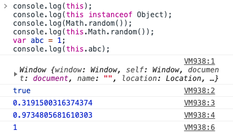
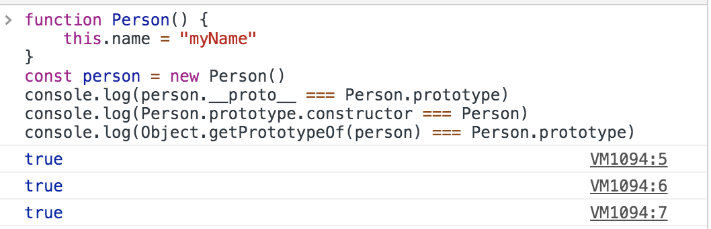
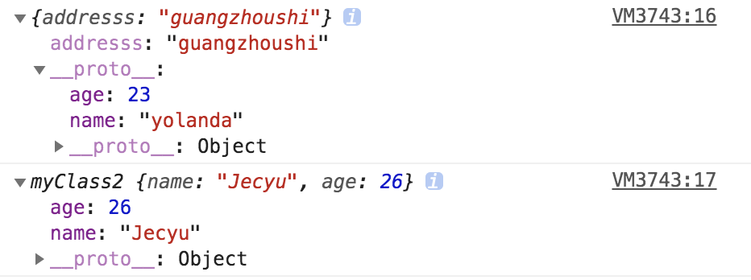
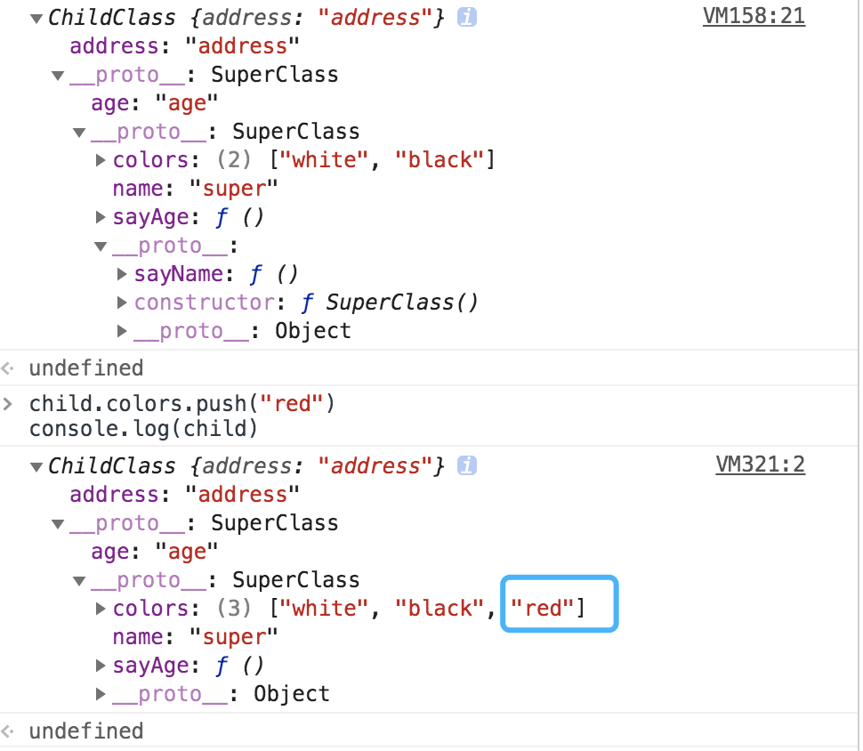

# JavaScript

## 作用域

作用域是指程序源代码中定义变量的区域；JavaScript 采用 **词法作用域**(lexical scoping)，也就是静态作用域

词法作用域的表现为：函数的作用域在函数**定义**的时候就决定了的；与词法作用域相对的是动态作用域，函数的作用域是在函数调用时才决定

```js
var value = 1;
function foo() {
  console.log(value);
}
function bar() {
  var value = 2;
  foo();
  function barChild() {
    console.log(value);
  }
  barChild();
}

// 结果输出为
// 1 执行 foo()
// 2 执行 barChild()
```

分析：
_静态作用域_
执行 foo 函数，先从 foo 函数内部查找是否由局部变量 value，如果没有就根据 foo 函数书写的位置查找上一层的代码，也就是全局变量，所以打印 value = 1

_动态作用域_
执行 foo 函数，先从 foo 函数内部查找是否由局部变量 value，如果没有就从调用函数的作用域，也就是 bar 函数内部查找 value 变量，所以打印 value = 2

## 执行上下文

当 JavaScript 执行一段可执行代码(executable code)时，会创建对应的执行上下文(execution context)

**执行上下文** 包含三个重要属性：

- 变量对象(Variable object, VO)
- 作用域链(Scope chain)
- this

举个例子，当执行到一个函数时，就会进行准备工作，这里的准备工作，专业术语就是“执行上下文”；问题是，函数这么多，如果去管理这么多的执行上下文？所以 JavaScript 创建了 _执行上下文栈(Execution context stack, ECS)_ 来管理执行上下文

模拟 ECStack 是一个数组，当 JavaScript 开始要解析执行代码时，首先遇到的是全局代码，所以初始化的时候，首先会向 ECStack 压入一个 全局执行上下文(用 globalContext 表示)；只有当整个应用程序结束时，ECStack 才会被清空：

```js
ECStack = [globalContext];
```

当 JavaScript 遇到以下代码：

```js
function func3() {
  console.log("func3");
}
function func2() {
  func3();
}
function func1() {
  func2();
}
func1();
```

当执行到一个函数时，就会创建一个执行上下文，并压入 ECStack；当函数执行完后，就会将函数的执行上下文从栈中弹出；表现为：

```js
// 伪代码
// 遇到 func1（）
ECStack.push(<func1> functionContext)
// func1 中调用了 func2
ECStack.push(<func2> functionContext)
// func2 中调用了 func3
ECStack.push(<func3> functionContext)

// func3 执行完毕
ECStack.pop()
// func2 执行完毕
ECStack.pop()
// func1 执行完毕
ECStack.pop()

// javascript接着执行下面的代码，但是ECStacktack底层永远有个globalContext
```

### 变量对象 VO

变量对象是与执行上下文相关的数据作用域，存储了 _在上下文中定义的变量和函数声明_

不同执行上下文的变量对象稍有不同，常见的有全局上下文的变量对象、函数上下文的变量对象

**全局上下文** 全局上下文中的变量对象就是全局对象：

**全局对象** 可以访问所有其他预定义的对象、函数和属性，比如：

```js
// 在客户端 JavaScript 中，全局对象就是 Window 对象
console.log(this);
// 全局对象是由 Object 构造函数实例化的一个对象
console.log(this instanceof Object);
// 预定义了很多函数、属性
console.log(Math.random());
console.log(this.Math.random());
// 作为全局变量的宿主
var abc = 1;
console.log(this.abc);
```



**函数上下文**

在函数上下文中，用活动对象(activation object, AO)表示变量对象

活动对象和变量对象其实是一个东西，只是变量对象是规范上的或者说是引擎实现上的，不可在 JavaScript 环境中访问，只有当进入一个 执行上下文 中，这个执行上下文的 变量对象 才会被激活（所以才叫做 activation object），只有被激活的变量对象，也就是 活动对象 上的各种属性才能被访问

活动对象是在进入函数上下文时被创建的，它通过函数的 arguments 属性初始化，arguments 属性值是 Argumens 对象

**执行过程**

执行上下文的代码分成两个阶段处理：分析和执行
1、进入执行上下文
2、代码执行

_进入执行上下文_

进入执行上下文时，还没有执行代码，变量对象会包括：

1、 函数的所有形参 - 由名称和对应值组成的一个变量对象的属性被创建 - 没有实参，属性值设为 undefined

2、 函数声明 - 由名称和对应值(函数对象 function-object )组成一个变量对象的属性被创建 - 如果变量对象已经存在相同名称的属性，则完全替换这个属性

3、 变量声明 - 由名称和对应值(undefined)组成一个变量对象的属性被创建 - 如果变量名称跟已经声明的形参或函数相同，则变量声明不会干扰已经存在的这类属性

```js
// 遇到代码
function foo(a) {
  var b = 2
  function c() {}
  var d = function() {}
  b = 3
}
foo(1)

// 伪代码 进入执行上下文后
AO = {
  arguments: {
    0: 1,
    length: 1
  },
  a: 1,
  b: undefined,
  c: reference to function c() {},
  d: undefined
}
```

_代码执行_

在代码执行阶段，会按顺序执行代码，根据代码，修改变量对象的值

```js
// 伪代码 代码执行后
AO = {
  arguments: {
    0: 1,
    length: 1
  },
  a: 1,
  b: 3,
  c: reference to function c() {},
  d: reference to FunctionExpression "d"
}
```

**总结**

1、 全局上下文的变量对象初始化是全局对象
2、 函数上下文的变量对象初始化只包括 Arguments 对象
3、 在进入执行上下文时，会给变量对象添加 形参、函数声明、变量声明等初始的属性值
4、 在代码执行阶段，会再次修改变量对象的属性值
5、 进入执行上下文时，会首先处理 函数声明，其次处理 变量声明；如果变量名称与已经声明的形参或函数声明相同，则变量声明不会干扰已经存在的这类属性

### 作用域链

函数的作用域在函数定义时就决定了。函数有一个内部属性 [[scope]]，**当函数创建时，就会保存所有父变量对象到其中**：

**函数创建**

```js
function foo() {
  function bar() {
    ...
  }
}
// 伪代码
// 函数创建时，各自的 [[scope]]
foo.[[scope]] = [
  globalContext.VO
]
bar.[[scope]] = [
  fooContext.AO,
  globalContext.VO
]
```

**函数激活**

当函数激活时，进入函数执行上下文，创建 VO/AO 后，就会将活动对象添加到作用域链的前端，用 Scope 表示作用域链

```js
Scope = [AO].contact([[Scope]]);
```

完整例子

```js
var scope = "global scope"
function checkscope() {
  var scope2 = "local scope"
  return scope2
}
checkscope()

// 伪代码
// 1. checkscope 函数被创建，保存作用域链到 内部属性 [[scope]]
checkscope.[[scope]] = [
  globalContext.VO
]
// 2. 执行 checkscope 函数，创建 checkscope 函数执行上下文 checkscopeContext，并压入执行上下文栈
ECStack = [
  checkscopeContext,
  globalContext
]
// 3. checkscope 函数没有立即执行，开始准备工作，第一步：复制函数 [[scope]] 属性创建作用域链
checkscopeContext = {
  Scope: checkscope.[[scope]]
}
// 4. 第二步：用 arguments 对象创建活动对象，初始化活动对象，加入形参、函数声明和变量声明
checkscopeContext = {
  AO: {
    arguments: {
      length: 0
    },
    scope2: undefined
  },
  Scope: checkscope.[[scope]]
}
// 5. 第三步：将活动对象压入 checkscope 作用域链顶端
checkscopeContext = {
  AO: {
    arguments: {
      length: 0
    },
    scope2: undefined
  },
  Scope: [AO, [[Scope]]]
}
// 6. 准备工作做完，开始执行函数，随着函数的执行，修改 AO 的属性值
checkscopeContext = {
  AO: {
    arguments: {
      length: 0
    },
    scope2: "local scope"
  },
  Scope: [AO, [[Scope]]]
}
// 7. 找到 scope2 的值，返回后函数执行完毕，函数执行上下文从执行上下文栈中弹出
ECStack = [
  globalContext
]
```

## 闭包

闭包就是能够读取其他函数内部变量的函数，或者子函数在外调用，子函数所在的父函数的作用域不会被释放

简单例子：来自《JavaScript 权威指南》

```js
var scope = "global scope";
function checkscope() {
  var scope = "local scope";
  function f() {
    return scope;
  }
  return f;
}

var foo = checkscope();
foo();
```

分析这段代码中执行上下文栈和执行上下文的变化情况：

```js
1、进入全局代码，创建全局执行上下文，全局执行上下文压入执行上下文栈 ECS
// 伪代码
ECS = [
  globalContext
]
2、全局执行上下文初始化
// 伪代码
globalContext = {
  VO: [global],
  Scope: [globalContext.VO],
  this: globalContext.VO
}
3、初始化的同时 checkscope 函数被创建，保存作用域链到函数的内部属性 [[scope]]
// 伪代码
checkContext.[[scope]] = [
  globalContext.VO
]
4、执行 checkscope 函数，创建 checkscope 函数执行上下文，checkscope 执行上下文被压入 ECS
// 伪代码
ECS = [
  checkContext,
  globalContext
]
5、checkscope 执行上下文初始化，创建变量对象、作用域链、this
// 伪代码
checkContext = {
  AO: {
    arguments: {
      length: 0
    },
    scope: undefined
  }
  Scope: checkscope.[[scope]]
}
// 将活动对象压入 checkscope 作用域链顶端
checkContext = {
  AO: {
    arguments: {
      length: 0
    },
    scope: undefined
  }
  Scope: [AO, globalContext.VO]
}
// 准备工作结束，开始执行函数，修改 AO 的属性值
checkContext = {
  AO: {
    arguments: {
      length: 0
    },
    scope: 'local scope',
    f: reference to function f(){}
  }
  Scope: [AO, globalContext.VO]
}
6、checkscope 执行的同时，f 函数被创建，保存作用域链到 f 函数的内部属性 [[scope]]
// 伪代码
fContext.[[scope]] = [
  checkscopeContext.AO,
  globalContext.VO
]
7、checkscope 函数执行完毕，checkscope 执行上下文从 ECS 中弹出
8、执行 f 函数，创建 f 函数执行上下文，f 函数执行上下文压入 ECS
9、f 函数 执行上下文初始化，创建变量对象、作用域链、this
// 伪代码
fContext = {
  AO: {
    arguments: {
      length: 0
    }
  }
  Scope: [AO, checkscopeContext.AO, globalContext.VO]
}
10、f 函数执行完毕，f 函数上下文从 ECS 中弹出
```

从 **7** 看出 执行 f 函数时，checkscope 函数上下文已经销毁，但因为 f 函数执行上下文维护了一个作用域链：

```js
fContext = {
  Scope: [AO, checkscopeContext.AO, globalContext.VO]
};
```

所以 f 函数依然能读到 checkscopeContext.AO 的值，说明当 f 函数引用了 checkscopeContext.AO 中的值时，即使 checkscopeContext 被销毁了，但是 JavaScript 会让 checkscopeContext.AO 活在内存中，f 函数依然能通过作用域链找到它，因此实现了闭包

常见题目：
第一种：

```js
var data = [];
for (var i = 0; i < 3; i++) {
  data[i] = function() {
    console.log(i);
  };
}
data[0]();
data[1]();
data[2]();
// 打印结果为？
```

分析：
当执行到 data[0] 函数前，此时的全局执行上下文：

```js
globalContext = {
  VO: {
    data: [...],
    i: 3
  }
}
```

所以，当执行到 data[0] 函数时，data[0] 函数的作用域链为：

```js
data[0]Context = {
  Scope: [AO, globalContext.VO]
}
```

而 data[0]Context.AO 并没有 i 值，所以从 globalContext.VO 中查找，i 为 3，所以打印结果为 3；data[1] 和 data[2] 结果也是 3

第二种：

```js
var data = [];
for (var i = 0; i < 3; i++) {
  data[i] = (function(i) {
    return function() {
      console.log(i);
    };
  })(i);
}
data[0]();
data[1]();
data[2]();
// 打印结果为？
```

分析：
当执行到 data[0] 函数前，此时的全局执行上下文：

```js
globalContext = {
  VO: {
    data: [...],
    i: 3
  }
}
```

但当执行到 data[0] 函数时，data[0] 函数的作用域链发生了变化：

```js
data[0]Context = {
  Scope: [AO, 匿名函数Context.AO, globalContext.VO]
}

匿名函数Context = {
  AO: {
    arguments: {
      0: 0,
      length: 1
    },
    i: 0
  }
}
```

data[0]Context.AO 没有 i 值，所以会从作用域链查找，查到 匿名函数 Context.AO 中的 i，结果为 0，找到之后就不会继续往上查找 globalContext.VO，即使它也有 i（值为 3），所以打印结果为 0

## 自执行函数

```js
// 一个函数声明
function foo() {
  console.log(1);
}
// 等号后面 一个函数表达式
var bar = function() {
  console.log(2);
};
foo();
bar();
```

当圆括号遇到 function 关键字时，默认的会将前面的表达式或声明当作**函数声明**
eg:

```js
function() {
  console.log(1)
}()
// Uncaught SyntaxError: Function statements require a function name
// 报错，函数声明必须要有名称
function foo() {
  console.log(2)
}()
// Uncaught SyntaxError: Unexpected token ')'
// 报错 当圆括号放在函数声明后面，相当于与前面的函数声明分开了 等价于以下代码
function foo() {}
()
// 但是圆括号内必须有表达式，所以报错了
function foo() {
  console.log(2)
}(1)
// 等价于
function foo() {
  console.log(2)
}
(1)

```

解决：**将函数声明包裹在圆括号里来告诉语法分析器去执行一个函数表达式**

```js
// 括号内的表达式代表函数立即调用表达式
(function() {
  /* code */
})();

// 括号内的表达式代表函数表达式
(function() {
  /* code */
})();
```

## instanceof 与 typeof

**typeof** 一般用于判断一个变量的类型，可以判断 `number`,`string`,`object`,`boolean`,`function`,`undefined`,`symbol`, 这七种类型；在判断不是 `object` 类型时，**typeof** 能告诉我们具体是哪一类的类型；但如果要具体知道是哪一种 `object`，需要利用 **instanceof**

**instanceof** 实现原理：右边变量的 `prototype` 在左边变量的原型链上即 `__proto__`

还有一个方法：**Object.prototype.toString.call()**

```js
Object.prototype.toString.call(1); // "[object Number]"

Object.prototype.toString.call("hi"); // "[object String]"

Object.prototype.toString.call({ a: "hi" }); // "[object Object]"

Object.prototype.toString.call([1, "a"]); // "[object Array]"

Object.prototype.toString.call(true); // "[object Boolean]"

Object.prototype.toString.call(() => {}); // "[object Function]"

Object.prototype.toString.call(null); // "[object Null]"

Object.prototype.toString.call(undefined); // "[object Undefined]"

Object.prototype.toString.call(Symbol(1)); // "[object Symbol]"

Object.prototype.toString.call(null); // "[object Null]"
```

特殊例子：

tips：Object 本身是一个函数，由 Function 创建，所以 `Object.__proto__ = Function.prototype`

1、 Object instanceof Object 为 **true**

    - 左边 Object.__proto__ 为 Function.prototype（可自行验证）
    - Function.prototype.__proto__ 为 Object.prototype（可自行验证）
    - 右边 Object.prototype 在 左边的原型链上
    - 注意 Object.prototype.__proto__ 为 null

2、 Function instanceof Function 为 **true**

    - 左边 Function.__proto__ 为 Function.prototype（可自行验证）
    - 右边 Function.prototype 在 左边的原型链上

3、 Function instanceof Object 为 **true**

    - 左边 Function.__proto__ 为 Function.prototype（可自行验证）
    - Function.prototype.__proto__ 为 Object.prototype（可自行验证）
    - 右边 Object.prototype 在 左边的原型链上

4、 Person instanceof Person 为 **false**

    - 左边 Person.__proto__ 为 Function.prototype （构造函数由 Function 实例化）
    - Function.prototype.__proto__ 为 Object.prototype
    - Object.prototype.__proto__ 为 null
    - 右边 Person.prototype 不在 左边的原型链上

5、 Person instanceof Function 为 **true**

6、 Person instanceof Object 为 **true**

## call 、apply 和 bind

### call() 与 apply() 的共同点：

- **改变 this 的指向，即改变函数执行上下文**，也就是将一个对象的方法，交给另外一个对象去执行，并且是**立即执行**

- 调用 call 和 apply 的对象，**必须是一个 Function**

- Function.call(obj, param1) Function 的调用者指向 obj

### call() 与 apply() 的区别：主要体现在参数的写法

- call 的写法 `Function.call(obj, param1, param2, param3,...)` 第二个参数开始可以接收**任意个参数**

  ```js
  function func(a, b, c) {}
  func.call(obj, 1, 2, 3);
  // func 接收到的参数是 1、2、3
  func.call(obj, [1, 2, 3]);
  // func 接收到的参数是 [1, 2, 3]、undefined、undefined
  ```

- apply 的写法 `Function.apply(obj, [param1, param2, param3,...])` 第二个参数**必须是数组或者类数组**

  ```js
  function func(a, b, c) {}
  func.apply(obj, [1, 2, 3]);
  // func 接收到的参数是 1、2、3
  ```

### 使用场景

1、对象的**继承**

```js
function SuperClass(name, price) {
  this.name = name;
  this.price = price;
}
function SubClass(name, price) {
  // 修改了 SuperClass this 的指向 SubClass，并执行了一次 SuperClass()
  SuperClass.call(this, name, price);
  this.catalogy = "food";
}
const test = new SubClass("cheese", 5);
console.log(test);
// { name: 'cheese', price: 5, catalogy: 'food' }
```

2、**借用**方法

```js
// 实现将类数组转换成真正数组，获获取一个新的数组
let domNodes = document.getElementsByTagName("*");
let nodes = Array.prototype.slice.call(domNodes);

// 覆盖方法
Object.prototype.toString.call(1);
// 输出 [Object number]
```

3、**扩展数组**

```js
// 原生取最值 Math.max(1,2,4)
// 获取数组中的最大值
let max = Math.max.apply(null, [1, 2, 4]);
// 获取数组中的最小值
let min = Math.min.apply(null, [1, 2, 4]);

// 实现数组合并（es6 的扩展运算符也可实现）
let arr1 = [1, 2, 3];
let arr2 = [4, 5, 6];
Array.prototype.push.apply(arr1, arr2);
console.log(arr1); // [1,2,3,4,5,6]
// 等价于
arr1.push(...arr2);
```

### bind()

**bind()** 方法是创建一个新的函数，当这个新的函数被调用时，bind() 的第一个参数将作为它运行时的 this，之后的一序列参数将会在传递的实参前传入作为它的参数

与 apply()、call() **区别**：bind() 返回值是函数，并且是需要稍后调用才会执行，而 apply()、call() 是立即调用

```js
const obj = {
  local: 8
};
function test() {
  console.log(this.local);
}
const bindtest = test.bind(obj);
bindtest();
// 8
```

### 模拟实现 bind

```js
var value = 2;

var obj = {
  value: 1
};

function func(name, age) {
  this.habit = "shopping";
  console.log(this.value);
  console.log(name);
  console.log(age);
}

func.prototype.friend = "kevin";

Function.prototype.newBind = function(context) {
  var self = this;
  var args = Array.prototype.slice.call(arguments, 1);
  var fBind = function() {
    var bindArgs = Array.prototype.slice.call(arguments);
    // this instanceof fBind ? this : context 普通调用时为 false，作为构造函数为 true
    // 解决新函数作为构造函数时，让实例 ins 获得来自绑定函数的值 habit
    return self.apply(
      this instanceof fBind ? this : context,
      args.concat(bindArgs)
    );
  };
  // 解决新函数作为构造函数时，让实例 ins 获得来自绑定函数的原型中的值 friend
  // fBind.prototype  = this.prototype
  // 解决如果修改 fBind.prototype 对 this.prototype 也就是 func.prototype 的影响
  var f = function() {};
  f.prototype = this.prototype;
  fBind.prototype = new f();
  return fBind;
};
console.log("-----------------------------------");
const bindFunc = func.newBind(obj, "yolanda");
const ins = new bindFunc(18);
console.log(ins);
console.log("-----------------------------------");
```

## new 实现

```js
function objectFactory() {
  var obj = new Object();
  Constructor = [].shift.call(arguments);
  obj.__proto__ = Constructor.prototype;
  var ret = Constructor.apply(obj, arguments);
  return typeof ret === "object" ? ret : obj;
}
function Otaku(name, age) {
  this.name = name;
  this.age = age;

  this.habit = "Games";
}

Otaku.prototype.strength = 60;

Otaku.prototype.sayYourName = function() {
  console.log("I am " + this.name);
};
var person = objectFactory(Otaku, "yolanda", 24);
var person2 = new Otaku("kevin", 24);
```

## 事件循环

```js
setTimeout(function() {
  console.log(1);
  setTimeout(function() {
    console.log(2);
    new Promise(function(resolve, reject) {
      console.log(3);
      resolve(4);
    }).then(function(val) {
      console.log(val);
    });
  });
  new Promise(function(resolve, reject) {
    console.log(5);
    resolve(6);
  }).then(function(val) {
    console.log(val);
  });
});
setTimeout(function() {
  console.log(7);
});
new Promise(function(resolve, reject) {
  console.log(8);
  resolve(9);
}).then(function(val) {
  console.log(val);
});
setTimeout(function() {
  console.log(10);
});
```

## 拷贝 clone

Q：为什么要拷贝？如何拷贝？

A：拷贝对象是前端很常见的操作，用作备用或对比等场景。拷贝对象有两种：浅拷贝和深拷贝，什么时候用浅拷贝？什么时候用深拷贝呢？

- 浅拷贝 shallowClone
- 深拷贝 deepClone

### 浅拷贝 shallowClone

浅拷贝表现为：自己创建一个新的对象，如果源数据属性是*基本类型*，复制直接将基本类型的值给新对象；如果源数据属性是*引用类型*，复制的是内存的地址，如果其中一个对象修改了属性值，另一个对象的属性也会跟着变化

常见的几种浅拷贝方法：

- Object.assign
- 扩展运算符
- 自定义实现

#### 浅拷贝 —— Object.assign()

Object.assign() 是 ES6 中新增的一个方法，除了用于对象合并，还可以用于浅拷贝，将源对象（source）的所有可枚举属性，复制到目标对象（target）

```js
const target = {
  name: "Tom",
  age: 24,
  family: {
    father: "papa",
    mother: "mama"
  }
};
const source1 = { family: { sister: "sis" } };
const source2 = { age: 22 };
Object.assign(target, source1, source2);
console.log(target);
// {
//   name: "Tom",
//   age: 22,
//   family: {
//     father: "papa",
//     mother: "mama",
//     sister: "sis"
//   }
// }
```

_不可枚举属性、继承属性不能通过 Object.asign 拷贝_

```js
let targetObj = { a: "hahah" };
let sourceObj = Object.defineProperty({}, "invisible", {
  enumerable: false,
  value: "hello"
});
Object.assign(targetObj, sourceObj);
console.log(targetObj); // {a: "hahah"}
```

### 深拷贝 deepClone

## 原型链、实现继承

### 原型、构造函数、实例关系


构造函数会创建一个 `prototype` 属性，这个属性实际上就是构造函数创建实例时的*原型对象*，包含实例共享的属性和方法；实例的 `__proto__` 就是指向构造函数的 `prototype`
原型对象上的属性、方法，需要通过 .prototype.key 添加




- 通过 Object.create()
- 通过 constructor 构造函数

```js
const myClass1 = {
  name: "yolanda",
  age: 23
};
const properties = {
  addresss: {
    value: "guangzhoushi"
  }
};
function myClass2() {
  this.name = "Jecyu";
  this.age = 26;
}
const p1 = Object.create(myClass1, properties);
const p2 = new myClass2();
console.log(p1);
console.log(p2);

// Object.create(proto，[propertiesObject]) 使用现有的对象来提供新创建的对象的__proto__

// propertiesObject该传入对象的自有可枚举属性(即其自身定义的属性，而不是其原型链上的枚举属性)将为新创建的对象添加指定的属性值和对应的属性描述符
```



### 继承

- 原型链继承

SubClass 的原型是 SuperClass 的实例，而 ChildClass 的原型是 SubClass 的实例

```js
function SuperClass() {
  this.name = "super";
  this.colors = ["white", "black"];
  SuperClass.prototype.sayName = function() {
    console.log(this.name);
  };
}
function SubClass() {
  this.age = "age";
  SubClass.prototype.sayAge = function() {
    console.log(this.age);
  };
}
function ChildClass() {
  this.address = "address";
}
SubClass.prototype = new SuperClass(); // SubClass 的原型上 有一个 colors 属性
ChildClass.prototype = new SubClass();
const child = new ChildClass();
console.log(child);
```



**特点**：原型链继承可以同时继承原型的属性和方法，也能继承实例的属性和方法；

**缺点**：遇到原型上包含引用类型值时，修改单一实例会影响原型上的值：无法做到实例私有


- 盗用构造函数继承(经典继承)

关键代码：利用 call() 和 apply(), 以新创建的对象为上下文执行构造函数

```js
function SuperClass(name) {
  this.name = name;
  this.colors = ["white", "black"];
  SuperClass.prototype.syaName = function() {
    console.log(this.name);
  };
}
function SubClass(name) {
  SuperClass.call(this, name);
}
let ins1 = new SubClass("Yolanda");
ins1.colors.push("red");
console.log(ins1);
let ins2 = new SubClass("Jecyu");
console.log(ins2);
```

**特点**：每个实例都有自己的属性，避免了引用类型的混用，可以在子类构造函数向父类构造函数传值

**缺点**：无法访问父类原型上定义的方法


- 组合继承(伪经典继承)

综合参考原型链继承和盗用构造函数

```js
function SuperClass(name) {
  this.name = name;
  this.colors = ["white", "black"];
  SuperClass.prototype.sayName = function() {
    console.log(this.name);
  };
  console.log("调用SuperClass");
}
function SubClass(name, age) {
  SuperClass.call(this, name);
  this.age = age;
  SubClass.prototype.sayAge = function() {
    console.log(this.age);
  };
}
SubClass.prototype = new SuperClass();
let ins1 = new SubClass("Yolanda", 23);
ins1.colors.push("red");
let ins2 = new SubClass("Jecyu", 26);
console.log(ins1);
console.log(ins2);
```


**特点**：实现了访问原型上定义的方法，又能让每个实例拥有自己的属性

**缺点**：存在效率问题，父类构造函数需要调用两次：一次在创建子类原型、一次在子类构造函数内

- 原型式继承

用一个函数去包装一个对象，函数对传入的对象做了一次 浅拷贝(类似 ES6 的 Object.create())

```js
function object(obj) {
  function F() {}
  F.prototype = obj;
  return new F();
}
const obj1 = {
  name: "Yolanda",
  colors: ["white", "black"]
};
const obj2 = object(obj1);
obj2.name = "Jecyu";
obj2.colors.push("red");
console.log(obj2);
```


**特点**：不需要端单独创建构造函数

**缺点**：属性中包含引用值类型会在相关对象间共存

- 寄生式继承

创建一个实现继承的函数，以某种方式增强对象，最后返回这个对象

```js
const obj1 = {
  name: "Yolanda",
  colors: ["white", "black"]
};

function object(obj) {
  function F() {}
  F.prototype = obj;

  return new F();
}

function createAnother(original) {
  let clone = object(original);
  clone.sayHi = function() {
    console.log("hi");
  };
}
const another1 = createAnother(obj1);
console.log(another1);
```

- 寄生组合式继承

```js
function inheritPrototype(subType, superType) {
  // 实现获取原型上的属性和方法的同时 不需要调用两次父类构造函数
  let prototype = Object.create(superType.prototype); // prototype 的原型是 superType.prototype
  prototype.constructor = subType;
  console.log(prototype);
  subType.prototype = prototype; // 给 subType 的 prototype 赋值 为 prototype
}
function SuperType(name) {
  this.name = name;
  this.address = "aaa";
  this.colors = ["white", "black"];
  SuperType.prototype.sayHi = function() {
    console.log("hi");
  };
}
function SubType(name, age) {
  SuperType.call(this, name); // 调用一次父类构造函数 实现子类所创建的实例能够拥有自己的属性，避免引用类型混用
  this.age = age;
  SubType.prototype.sayAge = function() {
    console.log(this.age);
  };
}

inheritPrototype(SubType, SuperType);
SubType.prototype.sayHello = function() {
  console.log("hello");
};
var ex1 = new SubType("abc", 21);
var ex2 = new SubType("def", 22);
ex1.colors.push("pink");
console.log(ex1);
console.log(ex2);
```

**特点**：

1、实现实例属性私有化，关键：`SuperType.call(this)`

2、实现访问父类原型上定义的属性和方法

关键：`subType.prototype = Object.create(superType.prototype)`

3、 减少调用父类函数的次数，避免了在 SuperType.prototype 上重复创建不必要的属性


**比较**：

方式一：`SubType.prototype = Object.create(SuperType.prototype);`

方式二：`SubType.prototype = new SuperType();`

原型链关系：
方式一：SubType.prototype => F 对象实例；F 对象实例.**proto** => SuperType.prototype

方式二：SubType.prototype => SuperType 对象实例；SuperType 对象实例.**proto** => SuperType.prototype

后者会继承 SuperType 构造函数中多余的属性和方法，最终两种方法 SubType.prototype 的原型都是指向 SuperType.prototyp

**对象的原型，同时也是另一个对象的实例**

**注意**：父类上的静态方法不会被子类的实例继承

```js
function SuperType(name) {
  this.name = name;
  this.address = "aaa";
  this.colors = ["white", "black"];
  SuperType.prototype.sayHi = function() {
    // 父类原型上的方法
    console.log("hi");
  };
  SuperType.sayMorning = function() {
    // 父类上的静态方法
    console.log("morning");
  };
}
function SubType(name, age) {
  SuperType.call(this, name);
  this.age = age;
  SubType.prototype.sayAge = function() {
    console.log(this.age);
  };
}

inheritPrototype(SubType, SuperType);
SubType.prototype.sayHello = function() {
  console.log("hello");
};
var ex1 = new SubType("abc", 21);
console.log(ex1);
```


## 作用域

## Promise
