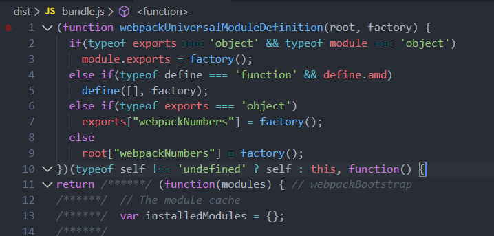
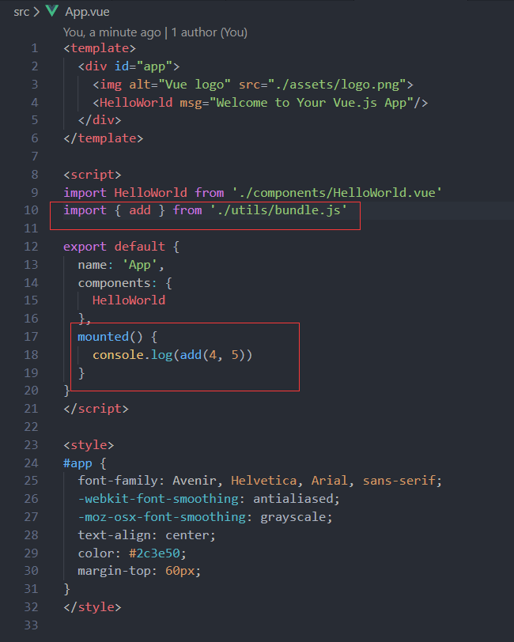

# 模块化
## 什么是模块化？

- 将一个复杂的程序依据一定的规则(规范)封装成几个块(文件), 并进行组合在一起
- 块的内部数据与实现是私有的, 只是向外部暴露一些接口(方法)与外部其它模块通信

不仅前端有模块化，后端也有模块化

在开发中较为流行的JavaScript模块规范有：CommonJS、AMD、CMD、UMD和ES6

**为什么服务端需要模块化？**

因为服务端需要与操作系统的其他应用程序互动，如果没有模块化是很难编程的

**为什么客户端需要模块化？**

在 JavaScript 发展初期，前端的大部分工作只是实现简单的交互逻辑，随着前端技术的发展，很多只在服务端实现的功能迁移到客户端实现，而嵌入网页的JS代码越来越庞大、复杂，模块化编程成为了一个迫切的需求

（在没有模块化编程时，我们会遇到以下几点问题：)
### 没有模块化的编程
  - 程序的变量和方法不容易维护，容易污染全局变量
  - 加载资源的方式主要是通过 **script** 标签从上到下，页面白屏时间过长，客户体验感较差
  - 依赖的环境主观逻辑偏重，代码一旦多了就比较复杂
  - 大型项目资源难以维护，在多人合作的情况下，资源的引入容易让人奔溃

刚开始时，我们是这样为页面引入资源：
```js
<script src="../js/lib/lodash.min.js"></script>
<script src="../js/lib/jquery.min.js">
<script src="https://cdn.jsdelivr.net/npm/vue"></script>
<script src="https://unpkg.com/axios/dist/axios.min.js"></script>
```
script 标签**从上到下**引入了我们想要的资源，这其中的顺序是非常重要的，资源的加载先后决定了我们的代码是否能够跑下去。当然在前面我们了解到 script 新增有 defer 和 async 属性，但这里暂时不讨论这两者的作用。可以看出，当我们项目越大，依赖越多时，就会有更多的 script 标签，相应也有越多的资源请求。这时全局污染的可能性会更大，如何能避免上述的几个问题，形成独立的作用域，各程序间互不干扰呢？

### 模块化的进展

**直接定义依赖 模式:** 直接将变量定义在全局

```js
// greeting.js
var helloInLang = {
  en: "Hello World!",
  es: "Hola mundo!",
  cn: "你好 世界!"
}

function writeHello(lang) {
  dounment.write(helloInLang[lang])
}

// other.js
function writeHello() {
  dounment.write("another same function broken")
}

// index.html
<!DOCTYPE html>
<html>
  <head>
    <script src="./greeting.hjs"></script>
    <script src="./other.js"></script>
  </head>
  <body onLoad="writeHello('cn')">
  </body>
</html>
```
（这种就是典型的全局变量被污染的现象，于是有人提出*命名空间模式*，用于解决遍地全局变量）

**命名空间 模式:** 将需要定义的部分归属到一个对象的属性上

```js
// greeting.js
var app = {}
app.helloInLang = {
  en: "Hello World!",
  es: "Hola mundo!",
  cn: "你好 世界!"
}
app.writeHello = function(lang) {
  dounment.write(helloInLang[lang])
}

// other.js
function writeHello() {
  dounment.write("another same function broken")
}
```
(实际上，这种模式本质还是操作全局对象，在其他模块上也能被修改，安全性很低。所以出现了*闭包模块化模式*，解决私有变量的问题)

**IIFE 模式**

  立即执行函数(immediately-invoked function expression),简称 IIFE，它是一个 JavaScript 函数，可以在函数内部定义方法及私有属性，相当于一个封闭的作用域

```js
// greeting.js
var greeting = (function() {
  var module = {};
  var helloInLang = {
    en: "Hello World!",
    es: "Hola mundo!",
    cn: "你好 世界!"
  }
  module.getHello = function(lang) {
    return helloInLang(lang)
  }
  module.writeHello = function(lang) {
    alert(module.getHello(lang))
  }
  return module
})()
```

IIFE 可以形成一个独立的作用域，其中声明的变量只在该作用域下，从而达到实现私有变量的目的，如上述例子中的 `helloInLang` 在该 IIFE 外是不能直接访问和操作的，但可以通过暴露一些方法来访问或操作，如 `getHello`和`writeHello`。虽然 IIFE 解决了依赖关系的问题，但是在使用上还是比较混乱，没有解决模块管理的问题，随着页面中使用的模块数量越来越多，开发者很难维护好他们之间的依赖关系。
以上几种方式都是通过约定实现模块化，在不同的开发者中还会有差别，为了统一开发过程和不同项目之间的差异，我们需要一个标准去规范模块化的实现

## 模块化规范有哪几种？

### CommonJS

**概述** 是一种为JS表现指定的规范，更适用于服务端模块规范，我们熟悉的 Node.js 就是采用了这个规范。核心思想是：每个文件就是一个模块，有自己的作用域。在一个文件里面定义的变量、函数、类都是私有的，对其他文件不可见。通过exports或module.exports来导出暴露接口，通过reuqire 同步加载要依赖的模块

**基本语法**
- 定义模块 
  ```
  module.exports = value 
  或 exports.xxx = value
  ```
- 引入模块
  ```
  require(xxx) 
  // 如果是第三方模块，xxx为模块名
  // 如果是自定义模块，xxx为模块文件路径
  ```

*require命令*加载模块文件，基本功能是读入并执行一个JavaScript文件，返回该模块的exports对象，如果没有找到指定模块会报错

**特点**
- 适用于服务端编程,如Node.js
- 所有代码都运行在模块作用域，不会污染全局作用域
- 模块可以多次加载，但只会在第一次加载时运行一次，然后运行结果就被缓存了，以后再加载就直接读取缓存结果；要想让模块再次运行，必须清除缓存
- 模块加载的顺序，按照其在代码中出现的顺序
- 模块输出的是一个*值的拷贝*

**实现**：

eg:

```js
// math.js
const counter = 0;
const obj = {
  name: 'Yolanda',
  age: 22
}
const add = function (num) {
  obj.age += num
}
module.exports = {
  counter,
  obj,
  add
}

// main.js
const counter = require('./math').counter
const obj = require('./math').obj
console.log(obj) // name: Yolanda,age: 22
console.log(counter) // 0
add(2) // add
console.log(counter) // 0
console.log(obj) // name: Yolanda,age: 24

```

虽然以上代码实现了模块化，但应用于浏览器环境，是有局限性的：代码`console.log(obj)`必须在第十四行代码`const obj = require('./math').obj`加载完成后才能执行，如果加载时间很长，就会导致浏览器处于'假死'状态.因此浏览器环境不适用于以上的'同步加载'方式，只能采用'异步加载'模块，这就是AMD规范诞生的背景

### AMD

**概述**: AMD(Asynchromous Module Definition),意思是异步模块定义，它采用异步方式加载模块，模块的加载不影响后面的语句执行，所有依赖这个模块的语句，都定义在一个回调函数中，等加载完成后这个回调函数才调用


**基本语法**
- 定义模块
  ```
  define(['m1', 'm2'], function(m1, m2) { return 模块})
  ```
- 加载模块
  ```
  require(['m1', 'm2'], function(m1, m2) { // 使用m1、m2})
  ```

**特点**
- 适用于浏览器环境
- 定义清晰，不会污染全局变量，能清楚地显式依赖关系
- 允许异步加载模块，也可以根据需要动态加载模块
- 提前加载,推崇依赖前置

**实现**：
eg: 目前有一个流行库 [require.js](https://requirejs.org/) 主要用于客户端的模块管理

文件结构目录：
```
|-src
  |-libs
    |-require.js
  |-demo
    |-demo
      |-demo3
        |-add.js
        |-alter.js
        |-sub.js
        |-thirdModule.js
  |-main.js
  |-index.html
```

*依赖模块*
```js
// add.js
define(function() {
  console.log('加载了add模块')
  const add = (a, b) => {
    return a + b
  }
  return add
})

// alter.js文件
define(['thirdModule'], function(thirdModule) {
  console.log('加载了alter模块')
  let name = 'alter模块中引入了thirdModule'
  const alter = {}
  alter.showMsg = () => {
    alert(`${thirdModule.getMsg()},${name}`)
  }
  return alter
})

// thirdModule.js
define(function() {
  let msg = "AMD模式加载['add', 'alter', 'sub']"
  console.log('加载了third模块')
  const getMsg = () => {
    return msg
  }
  return { getMsg }
})

// sub.js
define(function() {
  console.log('加载了sub模块')
  const sub = (a, b) => {
    return a - b
  }
  return sub
})
```
*主模块*
```js
// index.js文件
require.config({
    // baseUrl: 'js',
    paths: {
      add: "add",
      alter: "alter",
      sub: "sub"
    }
  })
  require(['add', 'alter', 'sub'], function(add, alter, sub) {
    console.log(add(4, 5))
    alter.showMsg()
    console.log(sub(10, 4));
  })
// 打印结果
// 加载了add模块
// 加载了sub模块
// 加载了third模块
// 加载了alter模块
// 9
// 6
```

```html
// index.html文件
<!DOCTYPE html>
<html>
  <head>
    <title>Modular Demo</title>
  </head>
  <body>
    <!-- 引入require.js并指定js主文件的入口 -->
    <script data-main="./js/index.js" src="./libs/require.js"></script>
    <!-- data-main指定主模块文件 -->
  </body>
</html>
```

**小结**：说明了AMD一个特性是提前加载,推崇依赖前置

**补充：** `require.config()`方法可以自定义模块加载行为，就写在主模块index.js的头部
```js
   //  假设这些文件都与index.js不在同一个目录
  require.config({
    baseUrl: 'js/lib',
    paths: {
      'jQuery': 'jquery.min', // 或者改成 'lib/jquery.min' 去掉baseUrl
      'underscore': 'underscore.min',
      'backbone': 'backbone.min'
    }
  })

  require.config({
    paths: { // 指定各个模块的加载路径 假设这些文件都与index.js在同一个目录(js子目录)
      'jQuery': 'jquery.min',
      'underscore': 'underscore.min',
      'backbone': 'backbone.min'
    }
  })


```

**注意**：如果需要加载不符合规范的模块，可以采用`require.config()`进行改造，利用`require.config()`中的`shim`属性定义一些特征：
eg:
```js
  require.config({
    shim: {
      'underscore': {
        export: '_'
      },
      'backbone': {
        deps: ['underscore', 'jquery'],   // 表明这个模块的依赖性
        export: 'Backbone'                // 定义这个模块外部调用时的名称
      }
    }
  })
```

### CMD

**概述**: CMD规范专门用于浏览器，模块是异步加载，推崇就近依赖，也就是在使用时再引入模块。**CMD** 整合了 ConmmonJS 和 AMD 规范的特点。[SeaJS](https://github.com/seajs/seajs/edit/master/dist/sea.js) 是一个适用于 Web 浏览器端的模块加载器，使用 SeaJS，所有的模块都遵循 CMD 规范，可以更好地组织 JavaScript 代码

**基本语法**
- 定义暴露模块
  ```js
  define(function(require, exports, module) {
      // 有依赖时 同步引入
      var module2 = require('./module2')
      // 有依赖时 异步引入
      reuqire.async('./module3', function(m3) {
        // ...
      })
      exports.xxx = value // 用于在模块内部对外提供接口
    })
  ```
- 引入模块
  ```js
  define(function(require) {
      var m1 = require('./module1')
      m1.show()
      var m4 = require('./module4')
      m4.show()
    })
  ```

**实现**
  eg: 以Sea.js为例

  文件结构目录：
  ```
|-src
  |-libs
    |-require.js
  |-demo
    |-demo
      |-demo3
        |-add.js
        |-alter.js
        |-sub.js
        |-thirdModule.js
  |-main.js
  |-index.html
  ```

*依赖模块*

  ```js
  // module1.js
  define((require, exports, module) => {
    console.log('加载了module1')
    const data = 'hello this is modulue1'
    const show = () => {
      console.log(`module1 show() ${data}`)
    }
    exports.show = show
  })

  // module2.js
  define((require, exports, module) => {
    console.log('加载了module2')
    module.exports = {
      msg: 'I will back'
    }
  })

  // module3.js
  define((require, exports, module) => {
    console.log('加载了module3')
    const API_KEY = 'abc123'
    exports.API_KEY = API_KEY
  })

  // module4.js
  define((require, exports, module) => {
    console.log('加载了module4')
    // 同步引入依赖
    const module2 = require('./module2')
    const show = () => {
      console.log(`module4 show()${module2.msg}`)
    }
    exports.show = show
    // 或者 module.exports = { show }
    require.async('./module3', (m3) => {
      console.log(`异步引入依赖${m3.API_KEY}`)
    })
  })
  ```

*主模块*

```js
  // main.js 
  define((require, exports, module) => {
    const m1 = require('./module1')
    m1.show()
    const m4 = require('./module4')
    m4.show()
  })
  // 打印结果
  // 加载了module1
  // module1 show() hello this is module1
  // 加载了module4
  // 加载了module2
  // module4 show() hello this is module2
  // 加载了module3
  // 异步引入依赖 hello this is module3
```
```html
  // index.html文件
  <!DOCTYPE html>
  <html>
    <head>
      <title>Modular Demo</title>
    </head>
    <body>
      <script type="text/javascript" src="./libs/sea.js"></script>
      <script type="text/javascript">
        seajs.use('./main.js')
      </script> 
    </body>
  </html>
```

**require.async(id, callback)** 方法用于模块内部异步加载模块，并在加载完成后执行指定回调，callback参数可选.一般用来加载可延迟异步加载的模块
### UMD

**概述** UMD(Universal Module Definition) 通用模块规范，是整和了AMD和CommonJS的规范，通过判断是支持node.js的模块关键字**exports** 还是支持AMD的模块的关键字**define**是否存在来判断使用何种规范(注意，不支持 CMD 规范)

**基础语法**
  ```js
(function(root, factory) {
    if (typeof module === 'object' && typeof module.exports === 'object') {
        console.log('是commonjs模块规范，nodejs环境')
        module.exports = factory();
    } else if (typeof define === 'function' && define.amd) {
        console.log('是AMD模块规范，如require.js')
        define(factory())
    // } else if (typeof define === 'function' && define.cmd) {
    //     console.log('是CMD模块规范，如sea.js')
    //     define(function(require, exports, module) {
    //         module.exports = factory()
    //     })
    } else {
        console.log('没有模块环境，直接挂载在全局对象上')
        root.umdModule = factory();
    }
}(this, function(a, b) {
    const add = (a, b) => {
        console.log(a + b)
        return a + b
    }
    return {
        add
    }
}))
  ```

**实现**
eg: 通过webpack打包一个自定义模块


**打包后的文件**


如何使用这个打包后的bundle.js文件呢？很明显，UMD支持AMD和CommonJS规范，以下几种方式都可引用 bundle.js

**umd-use-by-global** 没有模块环境，直接挂载在全局对象上
```html
<!DOCTYPE html>
<html lang="en">
  <script type="text/javascript" src="../../../dist/bundle.js"></script>
  <script>
    add(4, 9)
  </script>
</html>
```
**umd-use-by-require** RequireJS 加载 UMD 模块
入口文件 index.js
```js
// 使用 requirejs 加载 bundle.js
require.config({
    baseUrl: '../../../dist',
    paths: {
      add: "bundle"
    }
  })
  require(['add'], function(add) {
    add(1, 4)
  })
```
```html
<!DOCTYPE html>
<html lang="en">
  <script data-main="./js/use-by-require.js" src="../../libs/require.js"></script>
</html>
```
**umd-use-in-node** node 环境加载 UMD
```js
const add = require('../../../dist/bundle.js')
add(1, 4)

// 命令行敲 node ./src/main.js
```
**注意**需要在webpack.config.js中配置：
```js
output: {
  globalObject: 'typeof self !== \'undefined\' ? self : this'
}
```

**umd-use-by-sea**
如果想要 umd 模块被 SeaJS 加载，需要在 bundle.js 做以下处理：
```js
// (function(root, factory) {
//     if (typeof module === 'object' && typeof module.exports === 'object') {
//         console.log('是commonjs模块规范，nodejs环境')
//         module.exports = factory();
//     } else if (typeof define === 'function' && define.amd) {
//         console.log('是AMD模块规范，如require.js')
//         define(factory())
    } else if (typeof define === 'function' && define.cmd) {
        console.log('是CMD模块规范，如sea.js')
        define(function(require, exports, module) {
            module.exports = factory()
        })
//     } else {
//         console.log('没有模块环境，直接挂载在全局对象上')
//         root.umdModule = factory();
//     }
// }(this, function(a, b) {
//     const add = (a, b) => {
//         console.log(a + b)
//         return a + b
//     }
//     return {
//         add
//     }
// }))
```
入口文件：index.js
```js
const bundle = require('../../../../dist/bundle')
bundle(1, 4)
// 使用 seajs 加载 bundle-umd.js
define((require, exports, module) => {
  const bundle = require('../../../../dist/bundle')
  // const bundle = require('./factory')
  console.log(bundle);
  document.querySelector('#content').innerText = '使用 seajs 加载 bundle.js'
  document.querySelector('#add').innerText = `add 1 to 4, sum is ${bundle(1, 4)}`
})
```
```html
<!DOCTYPE html>
<html lang="en">
<script type="text/javascript" src="../../libs/sea.js"></script>
<script type="text/javascript">
    seajs.use('./js/use-by-sea.js')
</script>
</html>
```

不建议在 html 中使用`import` 引入umd 模块。即便 es6 提供了`script`标签属性`type="module"`支持es6语法引入模块的API

```html
// index.html文件
<script type="module">
  import { add } from '../dist/bundle.js'
  console.log(add(4,5)) // 报错
</script>
```
**报错**目标文件找不到提供的add


**原因** 打包后的 bundle 文件只支持 AMD 或 CommonJS 规范,所以并没有提供 ES6 规范对应所需的**import/exports**语法,如果在一个 vue-cli 搭建的项目中引入这个 bundle 文件,是可以正常使用里面的方法,因为项目经过了**babel**处理, import 编译成 require ,就能识别bundle.js提供的 exports



总结：对于我们自己封装的库，使用 umd 规范是比较通用的，eye-map 组件库就是利用 rollup 构建成 umd 模块提供使用。（rollup是另一种常用的构建工具）

### ES6Module

**概述** ES6在语言标准层面上实现了模块功能,方式简单明了,依赖在编译时完成加载,取代了 CommonJS 和 AMD  规范,成为浏览器和服务端通用的模块解决方案

**基础语法**
  - 定义模块
  ```js
    // add-es6.js
    const add = (a, b) => {
      return a + b
    }
    export { basicNum, add }
  ```
  - 引入模块
  ```js
    import { basicNum, add } from './main'
    const test = ele => {
      ele.textContent = add(99 + basicMum)
      console.log(ele.textContent)
    }
    test()
  ```
  **或者：**
  ```html
<!DOCTYPE html>
<html lang="en">
<script type="module">
import add from './js/add-es6.js'
add(1, 3)
document.querySelector('#content').innerText = '在 html 中引用 ES6 模块'
document.querySelector('#add').innerText = `add 1 to 3, sum is ${add(1, 3)}`
</script>
  ```
  注意：当模块默认输出时，即采用 `export default`时，引入模块的名称可以为任意,且不需要花括号

  eg:
  ```js
  // export-default.js
  export default const A = () => {
    console.log('foo')
  }
  // other.js
  import B from './export-defaule'
  B()
  ```

**ES6规范**与**CommonJS规范**比较：
- reuqire 使用于CommonJS规范, import 使用于ES6规范
- **CommonJS**
  - CommonJS输出的是**值的拷贝**
  - 对于基本数据类型,调用模块内部方法对值进行修改,不会影响已导出模块的值,原模块的值也不会修改
  - 对于复杂数据类型,因为浅拷贝,两个对象指向同一个引用,如果对值进行修改,已导出,原模块的值都会修改
  - CommonJS 模块是运行时加载
  - 当使用require命令加载某个模块时就会运行整个模块的代码,当重复执行加载相同模块时,不会再执行加载模块而是取缓存中的值,即只会在第一次加载运行一次,以后都会返回第一次加载的结果,除非手动清除缓存
  - 可以在任何位置，甚至条件的引入模块
- **ES6**
  - ES6输出的是**值的动态引用**
  - 对于基本数据类型,调用模块内部方法对值进行修改,会影响模块已导出的值,原模块的值也会修改
  - 对于复杂数据类型,如果对模块的值进行更改,模块已输出,原模块的值都会更改
  - ES6模块是编译时输出接口
  - 由于ES模块是静态的，因此import语句只能位于模块的顶端，且不能条件的引入，为什么强制要求在模块顶部声明引入模块呢？因为这样webpack等工具可以快速获取代码的依赖关系树，可以查看未使用的代码并将其从打包工具中删除。

  ```js
  // lib.js
  export let counter = 0
  export let obj = {
    name: 'Yolanda',
    age: 22
  }
  export const incCounter = (n) => {
    counter++
    obj.age += n
  }
  // main.js
  import { counter, incCounter, obj } from './lib'
  console.log(counter) // 0
  console.log(obj) // name: 'Yolanda', age: 22
  incCounter(2)
  console.log(counter) // 1 如果是CommonJS这里还是0
  console.log(obj) // name: 'Yolanda', age: 24
  ```

## 模块化是如何实现的？

<!-- 大家都知道，当项目需要第三方库支撑时，我们会用`yarn add somemodule` 或 `npm install somemodule` 这些命令在我们的项目中安装好所需的依赖。前端目前采用的模块化规范是**ESModule**，也就是 `import module` 和 `export module` 这种方式使用我们的项目依赖，那么大家清楚为什么能用`import`去获取`node_modules`中的依赖呢？很明显，`node_modules`中的模块遵循的是**CommonJS** 规范，需要通过 **Babel** 做转码处理:
- `import` 对应  `__webpack_require__`
- `export` 对应 `__webpack_exports__['default']` 直接赋值和 `__webpack_require_.d` 输出
(这里不做详细介绍，有兴趣的可以去看看 [Babel](https://babeljs.io/)) -->

<!-- 我们看看 Node 是如何加载 common 模块？ -->
我们主要学习 Node 是如何实现模块化的。大家都知道，**模块系统**是 **nodejs** 的基础，在我们使用过 node 过程，会有以下几个常见的问题？

  - 为什么模块中有全局的 require、module.exports、exports、__dirname、__filename  等变量，它们是从哪里来的？
  - 为什么一定要使用 module.exports 或 exports 导出模块？
  - module.exports 和 exports 的区别是什么？它们有什么关系？

我们通过分析 node 中关于模块源码 `lib/module.js` 来解决上面的困惑。经过第二部分模块化规范的介绍，我们知道 nodejs 是基于 CommonJS 规范，而 CommonJS 规范的两大特点是：
- 每个文件都是单独的一个模块，有自己的作用域，里面定义的变量、函数或类都是私有的，对其他文件不可见
- 每个模块内部，module 变量代表着当前模块，它是一个对象，它的 exports 属性(即 module.exports)是对外的接口，require 加载模块实际是加载这个模块的 module.exports 属性

那么 **require** 是如何导入模块的？我们分析 `lib/module.js` 源码，模块导入流程如下：


接下来具体看一下源码：源码中的 require 方法是挂载在 Module 原型链上

### Module.prototype.require

```js
// 每个模块都对应一个 Module 实例，实例上主要有以下属性
function Module(moduleId) {
  this.id = id; // 模块的识别符，通常是带有绝对路径的模块文件名
  this.exports = {}; // 模块对外输出的值
  this.parent = parent; // 返回一个对象，表示调用该模块的模块
  this.filename = null; // 模块的文件名，带有绝对路径
  this.loaded = false; // 是否已加载模块标记
  this.children = []; // 返回一个数组，表示该模块要用到的其他模块
}

module.exports = Module // node 内部源码使用的也是模块系统

Module.prototype.require = function(id) {
  return Module._load(id, this, /* isMain */ false);
};
```
所以，require 并不是全局命令，而是每个模块提供的一个**内部**方法，只有在模块内部才能调用 require 命令，而 require 方法中调用了 `Module._load` 方法

### Module._load

下面来看 Module._load 的源码

```js
Module._load = function(request) {
  // 第一步：计算绝对路径
  var filename =  Module._resolveFilename(request)
  // 第二步：缓存判断
  if (Module._cache[filename]) {
    // 直接从缓存中读取
    return Module._cache[filename].exports
  }
  // 第三步：实例化一个空的 module
  var module = new Module(filename)
  // 存入缓存
  Module._cache = module
  // 第四步：加载 module
  module.load(filename)
  // 第五步：输出 module.exports （问题2: 导出的是 exports 内容）
  return module.exports
}
```

通过上面一部分源码可以看到，Module._load 的关键两个步骤是 获取模块的绝对路径和加载模块 module.load()，虽然每个模块都可以拿到自己的当前实例 module，但 module.load 是如何将空的实例注入到模块中呢？它的核心原理是利用**沙箱环境，以闭包函数的方式传入当前module**

### Module.prototype.load

在 `Module.prototype.load`方法中，根据接受到的模块绝对路径加载模块

```js
Module.prototype.load = function(filename) {
  // module实例上可以拿到filename、paths属性
  this.filename = filename;
  this.paths = Module._nodeModulePaths(path.dirname(filename));

  // node引用模块可以默认不写后缀，顺序规则：.js、.json .node
  var extension = findLongestRegisteredExtension(filename);
  // 不同后缀的文件模块，使用不同的加载策略。
  Module._extensions[extension](this, filename);

  this.loaded = true; // 标记成模块已加载
}

// js 文件的加载策略
Module._extensions['.js'] = function(module, filename) {
  var content = fs.readFileSync(filename, 'utf8');
  // 获得模块代码纯字符串，然后编译compile字符串代码
  // stripBOM方法作用是剥离 utf8 编码特有的BOM文件头
  module._compile(stripBOM(content), filename);
};

```

可以看出，`Module.prototype.load` 方法主要做了两个处理：拿到 module 实例的 filename、path 属性和根据不同文件后缀进行模块加载，我们主要分析 js 文件的加载策略，首先它将文件读取成字符串代码，然后通过 `module._compile` 方法编译模块代码
 
### Module.prototype._compile

```js
// 给 Module 添加一个 wrap 属性，返回一个包装好的函数字符串
// 最新版node使用Proxy，使得Module.wrap代理wrap对象
Object.defineProperty(Module, 'wrap', {
  get() {
    return wrap;
  },
  set(value) {
    wrap = value;
  }
});

let wrap = function(script) {
  return Module.wrapper[0] + script + Module.wrapper[1];
};
const wrapper = [
  '(function (exports, require, module, __filename, __dirname) { ',
  '\n});'
];

Module.prototype._compile = function(content, filename) {
  // 将模块内容使用function包装起来
  const wrapper = Module.wrap(content);
  // 关键：通过内部vm模块方法，把string字符串代码，变成真正的可执行代码
  const compiledWrapper = vm.runInThisContext(wrapper, {...})

  var dirname = path.dirname(filename);
  var require = makeRequireFunction(this); // 对外暴露的require api
  // 问题3：exports和module.exports的关系
  // 即exports = module.exports = {}

  // 问题1：在模块内部，拥有require、module、exports等全局变量
  // 原理: 通过compiledWrapper.call执行函数，把这些内容传入到模块内部
  var result = compiledWrapper.call(exports, exports, require, this, filename, dirname);
  return result
}
```

`Module.prototype._compile` 是模块加载的核心内容，它的本质是**将读取到的模块字符串源码拼接成闭包函数(通过 vm 模块的 runInThisContext 方法)，注入 exports、require、module 等全局变量，再执行模块源码，将 module.exports 值输出**：

等同于调用这样一个函数：
```js
(function (exports, require, module, __filename, __dirname) {
  // 模块内部定义代码
  const otherModule = require('./other') // 内部可以使用require、module等全局变量
  module.exports = function() {...} // 必须使用module.exports以导出本模块内容
})(this.exports, this.require, this, filename, dirname)
```

### 模块实现总结

1. 模块的加载，是通过**沙箱**方式，把字符串拼接成闭包函数的形式，把新建实例module、exports、require、filename、dirname 以参数的形式注入到环境变量中
2. 模块的导出，必须使用 module.exports ，exports 是 module.exports 的别名，它们指向同一块内存
3. exports = module.exports, 但 exports 被覆盖时，即赋值操作 `exports = ...` 后，不再指向 module.exports
4. 使用 node 的 vm 模块，能创建独立的沙箱环境，并将字符串代码转换成可执行代码，实现一些非常规需求


<!-- **require** 方法处理模块的**步骤**：

- 每一个模块都会带有一个 require 方法
- 动态加载（v8执行到这一步才去加载此模块）
- 不同模块的类别，对应不同的加载方式，一般有三种常用后缀
  - 后缀为 .js 的 JavaScript 脚本文件，需要先读入内存再运行 (前端学习)
  - 后缀为 .json 的 Json 文件，通过 fs 读入内存后转化成 JSON 对象
  - 后缀为 .node  的经过编译后的二进制 C/C++ 扩展模块文件，可以直接使用
- 查找第三方模块
  - 如果 require 函数只指定名称则视为从 node_modules下面加载文件，即便移动了模块的位置也不需要再次修改引用的模块路径 -->


## 总结
- CommonJS规范主要用于*服务端*编程，加载模块是*同步*的，这并不适合在浏览器环境，因为同步意味着阻塞加载，浏览器资源是异步的，因此有了AMD、CMD
- AMD规范在*浏览器环境*中*异步*加载模块，推崇依赖前置，而且可以并行加载多个模块。但是AMD规范开发成本较高，代码阅读和书写比较困难，模块定义方式语义不顺畅
- CMD规范与AMD规范很相似，都用于*浏览器*编程，依赖就近，延迟执行，可以很容易在*Node.js*中运行，不过它依赖SPM打包，模块加载逻辑偏重
- ES6在语言标准层面上，实现了模块功能，代码简单清晰，成为浏览器和服务端通用的模块解决方案
- UMD通过判断支持node.js的模块exports、支持AMD的模块define是否存在来判断使用何种规范,是目前比较通用的规范之一

<!-- ### 补充
|   包管理工具  |    模块化构建工具                      |    模块化规范    |
|   ---------   |   -------------                       |   ----------    |
|     npm       |       webpack                         |     ES6         |
|     bower     |   requireJS/seaJS/browserity(正在衰落)| AMD/CMD/CommonJS|

- **包管理工具**:安装,卸载,更新,查看,搜索,发布包等功能如npm
- **模块化构建工具**:用来组织前端模块的构建工具(加载器)如webpack,requireJS,seaJS等,通过使用模块化规范(AMD/CMD/CommonJS/ES6)的语法实现按需加载
- **模块化规范**:AMD/CMD/CommonJS/ES6等,规范了如何组织代码,经过构建工具打包后编译成浏览器能识别的文件 -->


<!-- 理解ES6模块的含义:

模块提供了更好的方式来组织变量和函数,与函数作用域不同的是,模块内部的变量实现了在其他模块内共享,可以指定哪些变量,类或函数可以共享.在其他模块中共享,被称为 export.这就出现了模块间的依赖,当移除一个模块时可以准确知道哪些模块会报错.一旦有了模块间导出和引用变量的能力,就能够利用包管理工具,将代码打成小包,再组合应用

ES模块化的工作机制:

模块化开发会将依赖构建为树形结构.通过import语句通知浏览器或者Node去加载相关的代码.这些依赖树会有一个根节点作为入口文件,从入口文件可以找到依赖的其他代码 -->

## 参考资料

[fs.readFileSync](https://nodejs.org/api/fs.html#fs_fs_readfilesync_path_options)
[vm.runInThisContext](https://nodejs.org/api/vm.html)
[https://tylermcginnis.com/javascript-modules-iifes-commonjs-esmodules/](https://tylermcginnis.com/javascript-modules-iifes-commonjs-esmodules/)


## 手写req 方法（补充）

我们模仿源码去写一个简单的 req 函数：

基本思路：


根据思路，我们一步步将目标原理实现：
```js
// req.js
let fs = require("fs"); //node原生的模块，用来读写文件(fileSystem)
let path = require("path"); //node原生的模块，用来解析文件路径
let vm = require("vm"); //提供了一系列 API 用于在 V8 虚拟机环境中编译和运行代码。

//Module类，就相当于我们的模块(因为node环境不支持es6的class，这里用function)
function Module(p) {
  this.id = p
  this.exports = {}
  this.load = function(filepath) {
    const ext = path.extname(filepath);
    return Module._extensions[ext](this);
  }
}

//所有的加载策略
Module._extensions = { 
  ".js": function(moudle) {
    // 如何加载？
  },
  ".json": function(module) {},
  ".node": "XXX"
}
//以绝对路径为key存储一个module
Module._cacheModule = {};
// 获取绝对路径方法
Module._resolveFileName = function(filename) {
  const p = path.resolve(__dirname, filename)
  return p
}

function req(moduleId) {
  // 获取所需模块的绝对路径
  const p = Module._resolveFileName(moduleId);
  // 根据绝对路径，查找是否有模块缓存
  if (Module._cacheModule[p]) {
    return Module._cacheModule[p].exports
  }
  // 没有缓存即生成一个实例
  const module = new Module(p);
  // 加载模块
  module.exports = module.load(p)
  return module.exports
}

const mod = req('a')
console.log(mod)
```

**.js文件**的加载策略又是什么, 先了解一下 NodeJS 的 VM 模块：

**VM** 是 NodeJS 里的核心模块，支撑了 require 方法和 NodeJS 的运行机制。通过 VM 模块， JS 可以被编译后立即执行或者编译后保存下来稍后执行，VM 中常见的一个方法是创建独立运行的沙箱机制 `vm.runInThisContext()`

通过 **runInThisContext()** 创建一个独立的沙箱运行空间，code 内的代码可以访问外部的 **global** 对象，且 code 内部的 global 与外部共享

```js
const vm = require('vm')
const a = 5
global.a = 11

vm.runInThisContext('console.log('ok', a)') // 显示 global 的 11
vm.runInThisContext('console.log(global)') // 显示 global

console.log(a) // 显示 5
```

**针对 `.js` 文件的加载策略**

它主要是通过 compile 这个方法去编译执行我们的模块文件。那么 compile 方法做了哪些处理呢？我们清楚知道，目的是通过读取模块文件来获取模块的输出，但是 node中并没有这样一种方法，所以就需要以下几个步骤进行转换：

- 首先，读取我们的模块文件，通过fs.readFileSync方法，指定输出格式为 utf-8，也就是字符串形式

- 其次，怎么让外部的module.exports取得字符串内的内容？需要用到一个 Module._wrapper 包装类，将输出的模块字符串拼接成一个自执行函数字符串

- 最后，通过vm.runINThisContext方法执行这个函数字符串并注入参数，使得module实例中的exports成功赋值为模块的输出


```js
Module._extensions['.js'] = function(module, filename) {
  const content = fs.readFileSync(filename, 'utf-8')
  // 经过 compile, 将 js 文件内容包裹成一个函数， 注入 exports、require、module、_dirname、_filename 变量
  module._compile(content, filename)
  // 最终
  return module.exports
}
```

**Module._compile** 编译执行js文件
```js
//js文件加载的包装类
Module._wrapper = [
  "(function(exports,require,module,__dirname,__filename){",
  "\n})",
]
Module._compile = function(content, filename) {
  // 取包装后的函数体
  const wrapper = Module._wrapper[0] + content + Module._wrapper[1]
  const dirname = path.dirname(filename)
  // vm 是 nodejs 的虚拟机沙盒模块，runInThisContext 方法接受一个字符串并将字符串转换成可执行的js代码
  vm.runInThisContext(wrapper).call(this.exports, this.exports, this.require, this, dirname, filename)
  // 此后 共享 module.exports
}
```
