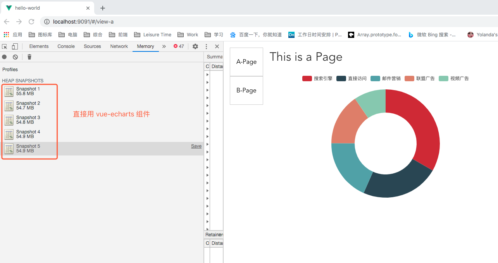

# 性能优化

## 加载篇

### 请求与响应

### 接口慢

## 执行篇

### 大量数据性能优化

- 表格渲染
- 树渲染

### 动画性能优化

- 操作与交互
- 函数防抖&节流

### 参考资料

- [8 个提高 JS 性能的方法](https://mp.weixin.qq.com/s/wG08-mhjqgLToOKvQNvOgg)
- [vue能否做到支持3W条数据复选、全选、行点击不卡顿？
](https://www.zhihu.com/question/323476114/answer/682723821?utm_source=wechat_session&utm_medium=social&utm_oi=710800537397764096&hb_wx_block=1)
- [如何快速提升 JSON.stringify() 的性能？](https://mp.weixin.qq.com/s/zg_AMRqDO5w-M1RePlDZRQ)——保存表单条件就是用的JSON.stringify()，另外后端抱怨存的东西太大了。还有在使用 `get` 请求接口时，参数是对象时，也需要做`stringify()`的处理。
- [「中高级前端」高性能渲染十万条数据（时间分片）](https://juejin.im/post/5d76f469f265da039a28aff7?utm_source=gold_browser_extension) —— 看到这篇文章后，至少可以明白什么是闪屏现象，以及 EventLoop 的原理了。


### Echarts

#### 不使用 this 接收 echarts 实例
```js
  async mounted() {
    await echarts.init(this.$refs.chartNode)
    this.renderPie()
    window.addEventListener('resize', this.reRenderPie)
  },
  beforeDestroy() {
    const dcharts = echarts.getInstanceByDom(this.$refs.chartNode)
    if (dcharts) {
      // dcharts.clear()
      // dcharts.dispose()
    }
    window.removeEventListener('resize', this.reRenderPie)
    console.log('destroyed')
  },
  methods: {
    renderPie() {
      const echartsIns = echarts.getInstanceByDom(this.$refs.chartNode)
      const option = {
        tooltip: {
            trigger: 'item'
        },
        legend: {
          top: '5%',
          left: 'center'
        },
        series: [...] // 省略具体数据
      };
      echartsIns.setOption(option)
      console.log("render");
    },
    reRenderPie() {
      const echartsIns = echarts.getInstanceByDom(this.$refs.chartNode)
      echartsIns.resize()
    }
  }
```


### 使用 vue-echarts 组件
测试发现，vue-echarts 组件没有上述的内存泄漏问题, 源码内组件销毁调用了 dispose 方法

源码：


使用简单：
```js
// html
<echarts
  style="width: 600px;height:400px;"
  :option="options"
></echarts>

// js
import echarts from "vue-echarts-v3/src/full.js";
Vue.component("echarts", echarts);
```
