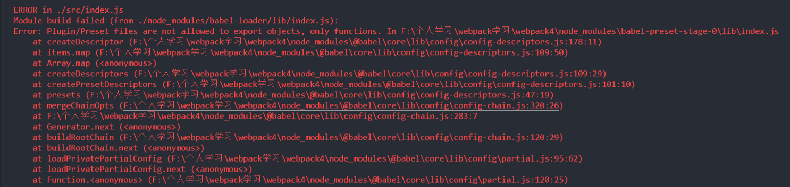

# webpack

webpack作为一个模块打包机,能做什么?

- 代码转换: TypeScript编译成JavaScript、SCSS,LESS编译成CSS
- 文件优化: 压缩JS、CSS、HTML代码,压缩合并图片
- 代码分割: 提取多个页面的公共代码、提取首屏不需要执行部分的代码使其异步加载
- 模块合并: 在采用模块化的项目里会有很多个模块和文件,需要构建功能把模块分类合并成一个文件
- 自动刷新: 监听本地源代码的变化,自动重新构建、刷新浏览器

## 基础

使用 webpack4，因为抽离了webpack-cli, 所以需要安装 webpack 和 webpack-cli。

webpack 支持 `es6`，`CommonJS`，`AMD`

### 打包 JS

**如何运行 webpack ？**

**首先**需要创建一个<webpack.config.js>文件,添加基础配置:

```js
// webpack.config.js
  const path = require('path')
  module.exports = {
    mode: 'development',
    entry: './src/index.js', // 以当前目录为根目录
    output: {
      path: path.join(__dirname, './dist'),
      filename: 'bundle.js'
    },
    module: {
      rules: [
        {
          test: 正则表达式,
          use: [对应的loader]
        }
      ]
    },
    plugin: {}
  }
```
(这个其实就是一个模块包,很明显符合CommonJS规范)

**配置说明**
- `entry`: 代表入口文件, webpack会找到该文件进行解析
- `output`: 代表输出文件配置
- `module`: 打包规则,不同后缀的文件用不同的包来处理
- `plugins`: 实现一些功能用到的插件

**其次**
```
// 安装 webpack 后，找到 package.json 文件，增加 "scripts":{ "build": "webpack ./webpack.config.js"}
webpack 4版本以上 直接运行 `npx webpack` 命令就能打包文件
// 命令行敲 yarn build 就能打包我们需要的 bundle.js 文件
```

**npm包版本**
```js
  "devDependencies": {
    "@babel/core": "^7.8.6",
    "autoprefixer": "^9.7.4",
    "babel-core": "^6.26.3",
    "babel-loader": "7",
    "babel-preset-env": "^1.7.0",
    "babel-preset-stage-0": "^6.24.1",
    "clean-webpack-plugin": "^3.0.0",
    "core-js": "3",
    "css-loader": "^3.4.2",
    "extract-text-webpack-plugin": "^4.0.0-beta.0",
    "html-webpack-plugin": "^3.2.0",
    "postcss-loader": "^3.0.0",
    "style-loader": "^1.1.3",
    "url-loader": "^3.0.0",
    "webpack": "^4.41.6",
    "webpack-cli": "^3.3.11",
    "webpack-dev-server": "^3.10.3"
  },
  "dependencies": {
    "jquery": "^3.4.1",
    "lodash": "^4.17.15"
  }
```

**可能遇到的报错**

1. babel-loader 与 babel-core 版本兼容性问题:

babel-loader 版本8.x

babel-core 版本6.x

报错:


将babel-loader卸载再安装`yarn add babel-loader@7 --dev`就正常了

### 多页面解决方案——提取公共代码

**结构目录**
```
  |-src
    |-index.js
    |-login.js
    |-utils.js
```

**js文件**
```js
// index.js
import * as _ from 'lodash'
import {sum} from './utils'

const value = sum (1 , 2)
console.log(_)
console.log("At page Index:", _)

export default {
  value
}

// login.js
import * as _ from 'lodash'
import {sum} from './utils'

sum(1,2)
console.log(sum(1,2))
console.log("At page Login:", _)
```

**webpack.config.js文件**
```js
const path = require('path') 
const {CleanWebpackPlugin} = require('clean-webpack-plugin') // 打包前清空 dist文件夹 注意新用法 https://github.com/johnagan/clean-webpack-plugin#options-and-defaults-optional

module.exports = {
  mode: 'development',
  devtool: 'source-map', // 默认为 eval,为了调试时能回到源代码而不是编译或压缩后的代码,source-map提供了将压缩文件中的代码映射回源文件的原始位置的方法
  // entry: ['./src/index.js', './src/login.js'] // 多入口文件合并打包
  entry: { // 多入口文件 如果要分开输出则以对象形式,如要合并打包则以数组形式
    index: './src/index.js',
    login: './src/login.js'
  },
  output: {
    filename: '[name].js', // 多文件分开打包后将出口文件和入口文件名一一对应
    path: path.resolve('dist')
  }, // 出口文件
  module: {
    rules: [
      { // 编译ES6
        test: /\.js$/,
        use: 'babel-loader',
        include: /src/, // 只转化src目录下的js文件
        exclude: /node_modules/ //排除node_modules, 优化打包速度
      }
    ]
  }, // 处理对应模块
  plugins: [ // 对应的插件
    new CleanWebpackPlugin()
  ],
  optimization: {
    splitChunks: {
      cacheGroups: {
        vendor: { // 抽离第三方插件
          test: /node_modules/, // 指定是node_modules下的第三方包
          chunks: 'initial',
          name: 'vendor', //打包后的文件名 可任意
          priority: 10 // 设置优先级 防止和自定义的公共代码提取时被覆盖,不进行打包
        },
        utils: { // 抽离自己写的公共代码
          chunks: 'initial',
          name: 'utils',
          minSize: 0 // 只要超出0字节就生成一个新包
        }
      }
    }
  }
}
```


### webpack 其他配置

```js
const path = require('path')
const HtmlWebpackPlugin = require('html-webpack-plugin') // 使打包后的bundle文件自动插入指定的html 
const ExtractTextWebpackPlugin = require('extract-text-webpack-plugin')  // 将css以link方式插入html
const {CleanWebpackPlugin} = require('clean-webpack-plugin') // 打包前清空 dist文件夹 注意新用法 https://github.com/johnagan/clean-webpack-plugin#options-and-defaults-optional
const webpack = require('webpack')

module.exports = {
  mode: 'development',
  devtool: 'source-map', // 默认情况为 eval ,为了调试时能回到源代码调试而不是编译或压缩后的代码,source-map提供了将压缩文件中的代码映射回源文件的原始位置的方法
  entry: './src/index.js', // 单入口文件
  // entry: ['./src/index.js', './src/login.js'] // 多入口文件合并打包
  // entry: { // 多入口文件 如果要分开输出则以对象形式,如要合并打包则以数组形式
  //   index: './src/index.js',
  //   login: './src/login.js'
  // },
  output: {
    filename: 'bundle.[hash:4].js', // 添加[hash:4]可以防止文件缓存,每次都会生成4位hash串
    // filename: '[name].js', // 多文件分开打包后将出口文件和入口文件名一一对应
    path: path.resolve('dist')
  }, // 出口文件
  module: {
    rules: [
      { // 解析css
        test: /\.css$/,
        use: [
          {
            loader: 'style-loader'
          },
          {
            loader: 'css-loader'
          },
          {
            loader: 'postcss-loader' // 添加CSS3前缀,即一些需要兼容写法的属性添加响应前缀
          }
        ],
        use: ExtractTextWebpackPlugin.extract({
          use: 'css-loader'
        }),
        // publicPath: '../' // 如果是在css文件里引入背景图 则需要指定相对路径
      },
      {
        test: /\.(jpe?g|png|gif)$/,
        use: [
          {
            loader: 'url-loader',
            options: {
              limit: 8192, // 小于8k的图片自动转成base64格式,并且不会存在实体图片
              outputPath: 'images/' //图片打包后存放的路径
            }
          }
        ]
      },
      { // 编译ES6
        test: /\.js$/,
        use: 'babel-loader',
        include: /src/, // 只转化src目录下的js文件
        exclude: /node_modules/ //排除node_modules, 优化打包速度
      }
    ]
  }, // 处理对应模块
  plugins: [ // 对应的插件
    new HtmlWebpackPlugin({
      template: './src/index.html',
      filename: 'index.html',
      chunks: ['vendor','index']
      // hash: true
    }),
    new ExtractTextWebpackPlugin('css/style.css'),
    new CleanWebpackPlugin(),
    new webpack.HotModuleReplacementPlugin(), // 配置自动更新 需要在index.js文件也做相关处理
    // new HtmlWebpackPlugin({
    //   template: './src/login.html',
    //   filename: 'login.html',
    //   chunks: ['vendor','login']
    //   // hash: true
    // })
  ],
  // optimization: { // 提取公共模块需要配置
  //   splitChunks: {
  //     cacheGroups: {
  //       vendor: { // 抽离第三方插件
  //         test: /node_modules/, // 指定是node_modules下的第三方包
  //         chunks: 'initial',
  //         name: 'vendor', //打包后的文件名 可任意
  //         priority: 10 // 设置优先级 防止和自定义的公共代码提取时被覆盖,不进行打包
  //       },
  //       utils: { // 抽离自己写的公共代码
  //         chunks: 'initial',
  //         name: 'utils',
  //         minSize: 0 // 只要超出0字节就生成一个新包
  //       }
  //     }
  //   }
  // },
  devServer: { // 开发服务器配置
    contentBase: './dist',
    host: 'localhost', // 默认使localhost
    port: 3000, // 端口
    open: true, // 自动打开浏览器
    hot: true // 开启热更新
  }
}
```

## 进阶

### 编译 ES6

安装所需包：
1. `babel-loader`: 负责`es6`语法转化
2. `babel-preset-env`: 包含`es6`、`es7`等版本的语法转化规则
3. `babel-polyfill`: `es6`内置方法和函数转化垫片
4. `babel-plugin-transform-runtime`: 避免`polyfill`污染全局变量


为什么需要这些依赖呢？

因为在我们的项目中，不可避免地使用到`es6`的语法和API，我们需要对这些代码进行转化保证能在低版本的浏览器上运行，而`babel`就是这个作用，帮助我们将`es6`的语法转化

**`babel-loader`和`babel-polyfill`的区别：**

`babel-loader`和`babel-polyfill`的区别是，前者负责语法转化，如箭头函数；后者负责内置方法和函数，如 `new Set()`而单独使用一个`babel-loader`是不够的，需要配合`babel-polyfill`、`babel-preset-env`、`babel-runtime`使用

`babel-polyfill`会模拟一个`es2015+`环境，用于应用程序的开发而不是库文件，可以使用`Promise`之类的新的内置组件、`Array.from`和`Object.assigh`等静态方法，以及一些`Array.prototype.includes`实例方法、`polyfill`将添加到全局范围和本地原型中，导致污染全局变量

**引入`babel-polyfill`的四种方式：**
1. 直接在`main.js`顶部使用: ```import "@babel/polyfill"```

2. 设置`.babelrc`: 
```js
{
  "presets": [
      [
        "@babel/preset-env",
        {
          "useBuiltIns": "entry",
          "corejs": 2
        }
      ]
    ]
}
```
并在`main.js`顶部使用```import "@babel/polyfill"```

3. 设置`.babelrc`:
```js
{
  "preset": [
    [
      "@babel/preset-env",
      {
        "useBuiltIns": false
      }
    ]
  ]
}
```
然后在`webpack.config.js`中入口配置：
```js
entry: {
  app: [
    "@babel/polyfill",
    "./main.hs:
  ]
}
```

4. 设置`.babelrc`，无需再引用`@babel/polyfill`(按需引入，前三种是全部引入)
```js
{
  "preset": [
    [
      "@babel/preset-env",
      {
        "useBuiltIns": "usage",
        "corejs": 2
      }
    ]
  ]
}
```
该配置会自动加载项目中需要的`polifill`，而不是全部引入

**`babel-runtime`和`babel-plugin-transform-runtime`**

`babel-runtime`为生产依赖而`babel-plugin-transform-runtime`为开发依赖，`babel-runtime`包含了所有的核心帮助函数，举个栗子，当我们需要使用`Promise`时，就需要在项目文件中引入所需要的帮助函数：
```js
import Promise from "babel-runtime/core.js/promise"
let promise = new Promise(function(resolve, reject) {
  console.log('Promise)
  resolve() 
})
promise.then(function() {
  console.log('resolved')
})
```
但手动引入是比较繁琐的，就需要`babel-transform-runtime`插件，帮助我们分析项目代码，自动引入所需的垫片API，使用方式：在`.babelrc`设置：
```
  {
    "plugins: [
      [
        "@babel/plugin-transform-runtime",
        {
          "corejs": 2 // 默认值为 false，为达到自动引入的效果需要改成 2
        }
      ]
    ]
  }
```
并安装依赖`npm install --save @babel/runtime-corejs2`
需要注意的是，`babel-runtime`不能模拟实例方法，即内置对象原型上的方法，如`Array.prototype.concat`，如果`babel`版本 >= 7.4.0，设置`"corejs": 3`，同样需要安装依赖`npm install --save @babel/runtime-corejs3`就能正常使用实例方法了


### 分析打包结果

**源文件**


**结果文件**

```js
/******/ (function(modules) { // webpackBootstrap
/******/ 	// The module cache // 模块缓存
/******/ 	var installedModules = {};
/******/
/******/ 	// The require function // 请求函数
/******/ 	function __webpack_require__(moduleId) {
/******/
/******/ 		// Check if module is in cache  // 检查模块是否在缓存
/******/ 		if(installedModules[moduleId]) {
/******/ 			return installedModules[moduleId].exports;
/******/ 		}
/******/ 		// Create a new module (and put it into the cache) // 创建新的模块并放进缓存
/******/ 		var module = installedModules[moduleId] = {
/******/ 			i: moduleId,
/******/ 			l: false,
/******/ 			exports: {}
/******/ 		};
/******/
/******/ 		// Execute the module function // 执行模块函数 this 模块对象本身 模块对象的exports属性 请求函数最终返回
/******/ 		modules[moduleId].call(module.exports, module, module.exports, __webpack_require__);
/******/
/******/ 		// Flag the module as loaded // 标志模块已经加载完
/******/ 		module.l = true;
/******/
/******/ 		// Return the exports of the module // 返回模块输出
/******/ 		return module.exports;
/******/ 	}
/******/
/******/
/******/ 	// expose the modules object (__webpack_modules__)  // 暴露所有模块对象
/******/ 	__webpack_require__.m = modules;
/******/
/******/ 	// expose the module cache // 暴露模块缓存
/******/ 	__webpack_require__.c = installedModules;
/******/
/******/ 	// define getter function for harmony exports // 为ES6 export定义 getter函数
/******/ 	__webpack_require__.d = function(exports, name, getter) {
/******/ 		if(!__webpack_require__.o(exports, name)) {
/******/ 			Object.defineProperty(exports, name, { enumerable: true, get: getter });
/******/ 		}
/******/ 	};
/******/
/******/ 	// define __esModule on exports // 在exports定义_esModule
/******/ 	__webpack_require__.r = function(exports) {
/******/ 		if(typeof Symbol !== 'undefined' && Symbol.toStringTag) {
/******/ 			Object.defineProperty(exports, Symbol.toStringTag, { value: 'Module' });
/******/ 		}
/******/ 		Object.defineProperty(exports, '__esModule', { value: true });
/******/ 	};
/******/
/******/ 	// create a fake namespace object // 创建代用命名空间对象
/******/ 	// mode & 1: value is a module id, require it // value是一个模块Id,必须使用
/******/ 	// mode & 2: merge all properties of value into the ns // 合并value属性到ns
/******/ 	// mode & 4: return value when already ns object // ns已经是对象时返回value
/******/ 	// mode & 8|1: behave like require // 表现如require
/******/ 	__webpack_require__.t = function(value, mode) {
/******/ 		if(mode & 1) value = __webpack_require__(value);
/******/ 		if(mode & 8) return value;
/******/ 		if((mode & 4) && typeof value === 'object' && value && value.__esModule) return value;
/******/ 		var ns = Object.create(null);
/******/ 		__webpack_require__.r(ns);
/******/ 		Object.defineProperty(ns, 'default', { enumerable: true, value: value });
/******/ 		if(mode & 2 && typeof value != 'string') for(var key in value) __webpack_require__.d(ns, key, function(key) { return value[key]; }.bind(null, key));
/******/ 		return ns;
/******/ 	};
/******/
/******/ 	// getDefaultExport function for compatibility with non-harmony modules // 用于兼容非ES6模块的 getModuleExports函数
/******/ 	__webpack_require__.n = function(module) {
/******/ 		var getter = module && module.__esModule ?
/******/ 			function getDefault() { return module['default']; } :
/******/ 			function getModuleExports() { return module; };
/******/ 		__webpack_require__.d(getter, 'a', getter);
/******/ 		return getter;
/******/ 	};
/******/
/******/ 	// Object.prototype.hasOwnProperty.call
/******/ 	__webpack_require__.o = function(object, property) { return Object.prototype.hasOwnProperty.call(object, property); };
/******/
/******/ 	// __webpack_public_path__
/******/ 	__webpack_require__.p = "";
/******/
/******/
/******/ 	// Load entry module and return exports // 加载入口文件并返回 exports
/******/ 	return __webpack_require__(__webpack_require__.s = "./src/index.js");
/******/ })
/************************************************************************/
/******/ ({

/***/ "./src/index.js":
/*!**********************!*\
  !*** ./src/index.js ***!
  \**********************/
/*! no static exports found */
/***/ (function(module, exports, __webpack_require__) {

"use strict";


Object.defineProperty(exports, "__esModule", {
  value: true
});

var _utils = __webpack_require__(/*! ./utils */ "./src/utils.js");

var value = (0, _utils.sum)(1, 2);

exports.default = {
  value: value
};

/***/ }),

/***/ "./src/utils.js":
/*!**********************!*\
  !*** ./src/utils.js ***!
  \**********************/
/*! no static exports found */
/***/ (function(module, exports, __webpack_require__) {

"use strict";


Object.defineProperty(exports, "__esModule", {
  value: true
});
var sum = exports.sum = function sum(a, b) {
  return a + b;
};

/***/ })

/******/ });
//# sourceMappingURL=bundle.6777.js.map
```

**需要设置 `devtool` 属性为 `source-map`**
源文件中的所有`import`和`export`都会转换为对应的辅助函数:
- `import` 对应 `__webpack_require__`
- `export` 对应 `__webpack_exports__['default']`直接赋值 和 `__webpack_require__.d`输出

整个流程:
1. 定义`__webpack_require__`及其辅助函数
2. 使用`__webpack_require__`引入入口文件
3. `__webpack_require__`函数载入模块,将模块放到模块缓存
4. 调用模块:
  - 同样使用`__webpack_require__`读取依赖(回到第3步)
  - 运行模块内部功能
  - 使用`__webpack_exports__['default']`直接赋值和`__webpack_require__.d`输出
5. 运行结束

**打包结果**


参考:

- [四大维度解锁Webpack3.0前端工程化](https://coding.imooc.com/class/chapter/171.html#Anchor) -- 由浅入深 webpack。
- [webpack 最简打包结果分析](https://segmentfault.com/a/1190000018205656) -- 清晰明了，说明 webapck 的打包文件流程。

### 优化打包速度

### 长缓存优化

### 优化

## 原理


