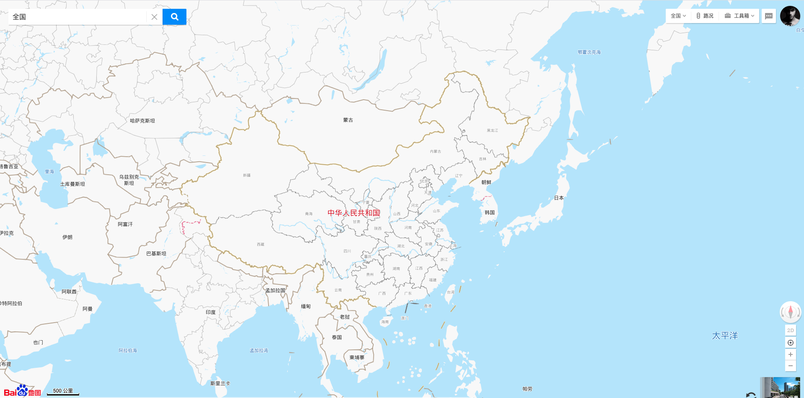
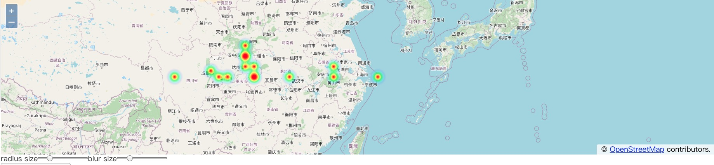

# OpenLayers

## Map(地图)

```import Map from 'ol/Map'```

**地图** 是 OpenLayers 的核心组件，要渲染地图，就需要一个视图，一个或多个图层以及一个目标容器，所以一个 Map 的基础配置(部分)有如下：

|     参数名称  |           类型            |        描述        |
|   ---------  |    --------------------  |   ------------    |
|     layers   |       ol/layer(Array)    | **地图的图层**：如果未定义，则将渲染没有图层的地图。请注意，图层是按提供的顺序渲染的，如果要使矢量层出现在图层的顶部，则它必须位于图块层之后 |
|     target   |   HTMLElement 或者 String | **地图的容器**：DOM 元素本身或 DOM 元素的 id 。如果在构造时未指定，则必须调用setTarget 函数才能渲染地图 |
|     view     |       ol/view            | **地图的视图**：可以通过调用 setView 设置 |

简单例子：
```js
import 'ol/ol.css'
import { Map, View } from 'ol'
import TileLayer from 'ol/layer/Tile'
import OSM from 'ol/source/OSM'

/**
 * 初始化一个 openlayers 地图
 */
init() {
  const target = 'map'
  const tileLayer = [
    new TileLayer({
      source: new OSM() // 创建图层后里面必须有数据，new OSM() 提供了一个切片数据
    })
  ]
  const view = new View({
    projection: 'EPSG:4326', // 使用这个坐标系
    center: [113.336555, 23.101258], // 地图中心坐标 广州
    zoom: 15 // 缩放级别
  })
  
  this.map = new Map({
    target, // 绑定 dom 元素进行渲染
    layers: tileLayer, // 配置地图数据源
    view // 设置地图显示的相关配置(坐标系、中心、缩放等等)
  })
}
```

有关 Map 的完整配置👉 [ol/Map](https://openlayers.org/en/latest/apidoc/module-ol_Map-Map.html)

## View(视图)

```import View from 'ol/View'```

**View** 对象代表了地图的简单2D视图，是能够更改地图的中心、分辨率和旋转的对象，主要用于控制与用户的交互

|     参数名称  |           类型            |        描述        |
|   ---------  |    --------------------  |   ------------    |
|   projection |   ol/proj〜ProjectionLike | **投影**：确定中心的坐标系，其单位确定分辨率的单位(每像素的投影单位)。默认是球形墨卡托，值为'EPSG：3857' |
|     center   |     ol/coordinate〜Coordinate | **视图的初始中心**：如果未设置投影，则使用 projection 选项指定中心的坐标系。如果未设置 center，则不会获取图层源，但是稍后可以使用 setCenter 设置中心|
|   resolution |         number            | **视图的初始分辨率**：单位是 projection 每像素的单位(如：米/像素)，如果既未定义 zoom 也未定义图层源，则可以使用 setZoom 或 setResolution 设置 |
|   rotation   |         number(默认0)      | **视图的初始旋转(弧度)**：顺时针正旋转，0表示北 |
|     zoom     |         number            | **视图的缩放级别**：用于计算视图的初始分辨率(仅在 resolution 未定义的情况下使用) |

**View 方法**：主要是针对 view 的属性的 **get** 和 **set** 方法，基本方法有很多，可以归类为以下：

**get类**：

- `getCenter` 获取视图中心，返回一个地图中心的坐标
- `getZoom` 获取当前的缩放级别，如果视图不限制分辨率，或者正在进行交互或动画，则此方法可能返回非整数缩放级别
- `getMaxZoom` 获取视图的最大缩放级别
- `getMinZoom` 获取视图的最小缩放级别
- `getProjection` 获取地图使用的“投影坐标系统”，如 EPSG：4326

**set类**：

- `setCenter` 设置当前视图的中心，任何范围限制都将适用
- `setZoom` 缩放到特定的缩放级别，任何分辨率限制都将适用
- `setMaxZoom` 为视图设置新的最大缩放级别
- `setMinZoom` 为视图设置新的最小缩放级别

**其他**：

- `fitExtent(extent, size)` 接受两个参数：extent 和 size，extent 类型是 ol/Extent，size 由 map.getSize()获取；该功能类似于 ArcGIS 的缩放到图层功能，将地图的视图缩放到 extent 区域可见的合适尺度
- `fitGeometry(geometry, size, opt_options)` 参数是地理要素、地图尺寸和可选参数；根据给定的地理要素，将 view 缩放到适合地理要素显示的尺寸


有关 View 的完整配置👉 [ol/View](https://openlayers.org/en/latest/apidoc/module-ol_View-View.html)

## Layers(图层)

### 什么是图层？

1. **线状图层**：道路、河流、线路、运行轨迹等等（如搜索一段行车路线）


2. **点状图层**：建筑、店铺、学校、红绿灯等等（如搜索某个连锁店铺名）


3. **面状图层**：诸如行政区域等有一定范围的地物



### 图层的常见属性

- **source** 指定图层的数据来源，图层作用是以一定的样式渲染数据，数据来自于 source 参数指定的地址
- **className** 图层各个元素的样式
- **zIndex** 图层的叠加次序，默认是0为最底层，如果使用 setMap 方法添加的图层，zIndex 的值是 Infinity，在最上层
- **extent** 图层渲染的区域，即浏览器窗口中可见的地图区域。extent 是一个矩形范围，格式是 [number, number, number, number]，分别代表 [left, bottom, right, top]。为了提升渲染效率和加载速度，extent 范围之外的瓦片是不会请求的，当然也不会渲染
- opacity 透明度(0, 1)，默认为1，即完全透明
- visible 能见度，默认为 true
- render 渲染功能，将框架状态作为输入，并期望返回 HTML 元素，将覆盖该图层的默认渲染
- map 地图
- minResolution 图层可见的最小分辨率
- maxResolution 图层可见的最大分辨率
- minZoom 最小视图的缩放级别(不包括该级别)，在该级别之上，该层将可见
- maxZoom 最大视图缩放级别(包括该级别)，该图层可见的。即可见范围为：(minZoom, maxZoom]

### 图层类型

OpenLayers 的图层主要分为两类：**Vector(矢量)** 和 **Raster(栅格)**，矢量图层是指在渲染发生在客户端的图层，source 返回的数据类型是矢量，如 geojson 的坐标串；栅格图层则是由服务端渲染，返回到浏览器的数据是一张张的瓦片图片，栅格图层主要是用于展示

**矢量图层**：
- Graticule，地图上覆盖的网格标尺图层
- HeatMap，热力图
- Vector，矢量图
- VectorImage，单张的矢量图层
- VectorTile，矢量瓦片图层
- WebGLPoints，WebGL渲染的海量点图层

**栅格图层**：
- Tile

#### Graticule 网格标尺图层

在地图上渲染一层类似于经纬线的网格层，更有利于准确的确定区域，在 WGS84 坐标系下，以度、分、秒为单位，称之为“经纬网”，其网格是以经纬线来划分的。在 OpenLayers 中，渲染网格的类是 `import Graticule from 'ol/layer/Graticule'`

例子：
```js
import 'ol/ol.css'
import { Map, View } from 'ol'
import TileLayer from 'ol/layer/Tile'
import Graticule from 'ol/layer/Graticule'
import Stroke from 'ol/style/Stroke'
import Fill from 'ol/style/Fill'
import Text from 'ol/style/Text'
import OSM from 'ol/source/OSM'

/**
 * 初始化一个 openlayers 地图
 */
init() {
  const target = 'map'
  const tileLayer = [
    new TileLayer({
      source: new OSM({
        wrapX: false
      })      
    }),
    new Graticule({
      strokeStyle: new Stroke({// 用于绘制刻度线的笔触样式。如果未提供，将使用不完全不透明的黑色
        color: '#333',
        width: 2,
        lineDash: [0.5, 4]
      }),
      wrapX: false, // 是否水平重复刻度
      showLabels: true, // 展示经纬度
      lonLabelStyle: new Text({ // 经度标签样式
        font: '16px Calibri,sans-serif',
        textBaseline: 'bottom',
        fill: new Fill({
          color: 'red'
        }),
        stroke: new Stroke({
          color: 'blue',
          width: 3
        })
      }),
      latLabelStyle: new Text({ // 纬度标签样式
      })
    })
  ]
  const view = new View({
    projection: 'EPSG:4326', // 使用这个坐标系
    center: [113.336555, 23.101258], // 地图中心坐标 广州
    zoom: 15 // 缩放级别
  })

  this.map = new Map({
    target, // 绑定 dom 元素进行渲染
    layers: tileLayer, // 配置地图数据源
    view // 设置地图显示的相关配置(坐标系、中心、缩放等等)
  })
    }
```

结果如图：


#### HeatMap 热力图层

`import Heatmap from 'ol/layer/Heatmap'` 用于将矢量数据呈现为热图的图层

例子：

```html
<div id="map" class="map"></div>
    <form>
      <label>radius size</label>
      <input id="radius" type="range" min="1" max="50" step="1" value="5"/>
      <label>blur size</label>
      <input id="blur" type="range" min="1" max="50" step="1" value="15"/>
    </form>
</div>
```

```js
import 'ol/ol.css'
import Map from 'ol/Map'
import View from 'ol/View'
import OSM from 'ol/source/OSM'
import { Heatmap as HeatmapLayer, Tile as TileLayer } from 'ol/layer'
import VectorSource from 'ol/source/Vector'
import { transform } from 'ol/proj'
import GeoJSON from 'ol/format/GeoJSON'

  const center = [121.05212688446045, 30.600614547729492]
  const heatData = {
        type: 'FeatureCollection',
        features: [
          { type: 'Point', coordinates: [104.40, 31.19], count: 100 },
          { type: 'Point', coordinates: [113.30, 30.60], count: 19 },
          { type: 'Point', coordinates: [123.30, 30.60], count: 419 },
          { type: 'Point', coordinates: [105.30, 30.60], count: 319 },
          { type: 'Point', coordinates: [106.30, 30.60], count: 719 },
          { type: 'Point', coordinates: [109.30, 31.60], count: 519 },
          { type: 'Point', coordinates: [109.30, 30.60], count: 319 },
          { type: 'Point', coordinates: [108.30, 32.60], count: 139 },
          { type: 'Point', coordinates: [118.30, 31.60], count: 129 },
          { type: 'Point', coordinates: [108.30, 33.60], count: 190 },
          { type: 'Point', coordinates: [108.30, 32.60], count: 189 },
          { type: 'Point', coordinates: [100.30, 30.60], count: 1 },
          { type: 'Point', coordinates: [109.30, 30.60], count: 119 },
          { type: 'Point', coordinates: [108.30, 31.60], count: 200 },
          { type: 'Point', coordinates: [118.30, 30.60], count: 300 }
        ]
      }
  const blur = document.getElementById('blur')
  const radius = document.getElementById('radius')

  const tile = new TileLayer({
    source: new OSM({
      wrapX: false
    })
  })
  const vector = new HeatmapLayer({
    // 矢量数据源
    source: new VectorSource({
      features: (new GeoJSON()).readFeatures(this.heatData, {
        dataProjection: 'EPSG:4326',
        featureProjection: 'EPSG:3857'
      })
    }),
    blur: 8, // 模糊尺寸
    radius: 10 // 热点半径
  })

  const target = 'map'
  const view = new View({
    center: transform(this.center, 'EPSG:4326', 'EPSG:3857'),
    zoom: 5
  })

  this.map = new Map({
    target, // 绑定 dom 元素进行渲染
    layers: [tile, vector],
    view // 设置地图显示的相关配置(坐标系、中心、缩放等等)
  })

  const blurHandler = () => {
    vector.setBlur(parseInt(blur.value, 10))
  }
  blur.addEventListener('input', blurHandler)
  blur.addEventListener('change', blurHandler)

  const radiusHandler = () => {
    vector.setRadius(parseInt(radius.value, 10))
  }
  radius.addEventListener('input', radiusHandler)
  radius.addEventListener('change', radiusHandler)
```

效果如图：


#### VectorImage 矢量图片图层

矢量图片图层：主要指服务端渲染好的图像，可能是已经渲染好的图像或者是每一次请求，都根据请求内容定制化地生成一张图片，该图层类型支持任意的范围和分辨率


#### Vector 矢量图层

矢量图层：用于渲染矢量数据的图层类型，在 OpenLayers 里，它是可以定制的，用户能够控制它的透明度、颜色以及加载在上面的要素形状等等。常见的功能有：从数据库中请求数据，接受数据，并将接收的数据解析成图层上的信息，如将鼠标移至广东省，广东省区域高亮红色，高亮便是矢量图层的行为


```js
import 'ol/ol.css'
import Map from 'ol/Map'
import View from 'ol/View'
import VectorSource from 'ol/source/Vector'
import GeoJSON from 'ol/format/GeoJSON'
import VectorImageLayer from 'ol/layer/VectorImage'
import VectorLayer from 'ol/layer/Vector'
import {
  Fill, Stroke, Style, Text
} from 'ol/style'
import countriesJson from './json/countries.json'

initVectorImageLayer() {
  const style = new Style({
    fill: new Fill({
      color: 'rgba(255, 255, 255, 0.6)'
    }),
    stroke: new Stroke({
      color: '#319FD3',
      width: 1
    }),
    text: new Text()
  })

  this.map = new Map({
    layers: [
      // 矢量切片图层
      new VectorImageLayer({
        imageRatio: 2,
        source: new VectorSource({
          features: (new GeoJSON()).readFeatures(countriesJson, {
            dataProjection: 'EPSG:4326',
            featureProjection: 'EPSG:3857'
          })
        }),
        style(feature) {
          style.getText().setText(feature.get('name'))
            return style
        }
      })
    ],
    target: 'map',
    view: new View({
      center: [0, 0],
      zoom: 1
    })
  })
  // 矢量图层
  const featureOverlay = new VectorLayer({
    source: new VectorSource(),
    map: this.map,
    style: new Style({
      stroke: new Stroke({
        color: '#f00',
        width: 1
      }),
      fill: new Fill({
        color: 'rgba(255,0,0,0.1)'
      })
    })
  })
  let highlight
  const displayFeatureInfo = pixel => {
    this.map.getLayers().item(0).getFeatures(pixel).then(features => {
      const feature = features.length > 0 ? features[0] : undefined

      const info = document.getElementById('info')
      if (feature) {
        info.innerHTML = `${feature.getId()}: ${feature.get('name')}`
      } else {
        info.innerHTML = '&nbsp;'
      }

      if (feature !== highlight) {
        if (highlight) {
          featureOverlay.getSource().removeFeature(highlight)
        }
        if (feature) {
          featureOverlay.getSource().addFeature(feature)
        }
      highlight = feature
      }
    })
  }

  this.map.on('pointermove', evt => {
    if (!evt.dragging) {
      displayFeatureInfo(evt.pixel)
    }
  })

  this.map.on('click', evt => {
    displayFeatureInfo(evt.pixel)
  })
}
```

效果：


#### VectorTile 矢量瓦片图层

切片图层是比较常用的图层类型，切片的概念，就是利用网格将一幅地图切成大小相等的小正方形：